# Design a Basic Chat Application

What does a basic chat application do?
There are two client systems that can share information via messaging. The system can be extended to support files, multimedia, canvas, and other features.

Basic functionalities:

- One-to-one chat
- Typing indicators
- File uploads
- Read receipts
- Unread message count
- Ability to delete messages

Basic architecture:

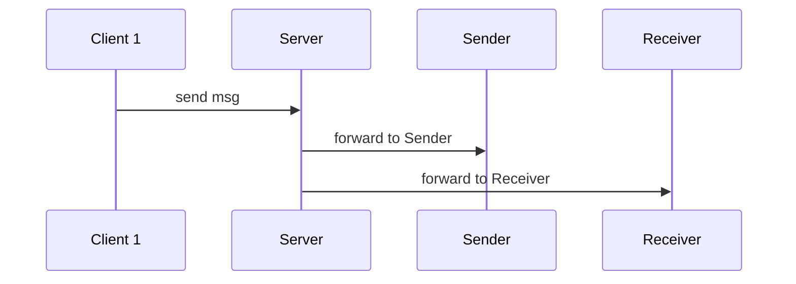
```mermaid
sequenceDiagram
    participant C1 as Client 1
    participant S as Server
    participant SN as Sender
    participant R as Receiver

    C1 ->> S: send msg
    S ->> SN: forward to Sender
    S ->> R: forward to Receiver

```

Three main components

- Client
- Server
- REST API
- WebSocket server
- Media storage

## Features:

- Authentication (`/signup`, `/signin` endpoints)
- Peer-to-peer and group chat (similar to WhatsApp)
- Push notifications (deliver notifications when a user receives a message)
- Multimedia file sharing

Technologies: your choice

Protocols: WebSocket and WebRTC

- Group member limit (max 100)

- Online/offline indicator

- Chat history (persisted in DB)

### High Level Design

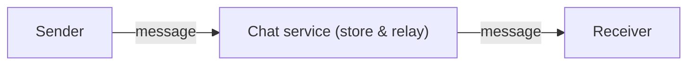
```mermaid
flowchart LR
    S[Sender] -- message --> CS["Chat service (store & relay)"]
    CS -- message --> R["Receiver"]
```

- Receive messages from other clients.

- Find the right recipients for each message and relay the message to the recipients.

- If a recipient is not online, hold the messages for that recipient on the server until she is online.

## Polling

polling is a technique where the client repeatedly asks the server:
"Do you have any new messages for me?"

2 types

- short
- long

1. Short Polling

- Client sends frequent requests (e.g., every 1–2 seconds).
- Simple but inefficient → wastes bandwidth and server resources when there’s no new data.

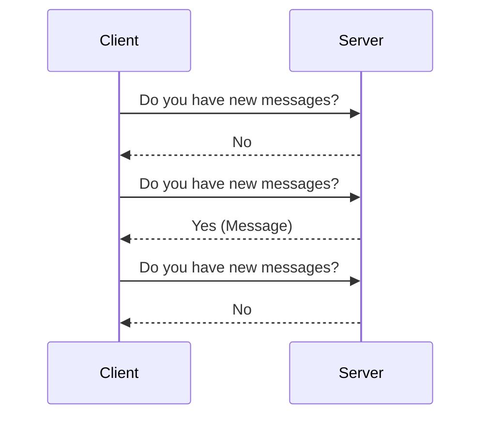
```mermaid
sequenceDiagram
    participant C as Client
    participant S as Server

    C->>S: Do you have new messages?
    S-->>C: No
    C->>S: Do you have new messages?
    S-->>C: Yes (Message)
    C->>S: Do you have new messages?
    S-->>C: No
```

2. Long Polling

- Client sends a request and the server keeps the connection open until a new message arrives (or a timeout).
- When the server replies, the client immediately opens another request.
- More efficient than short polling, but still heavier than WebSockets.

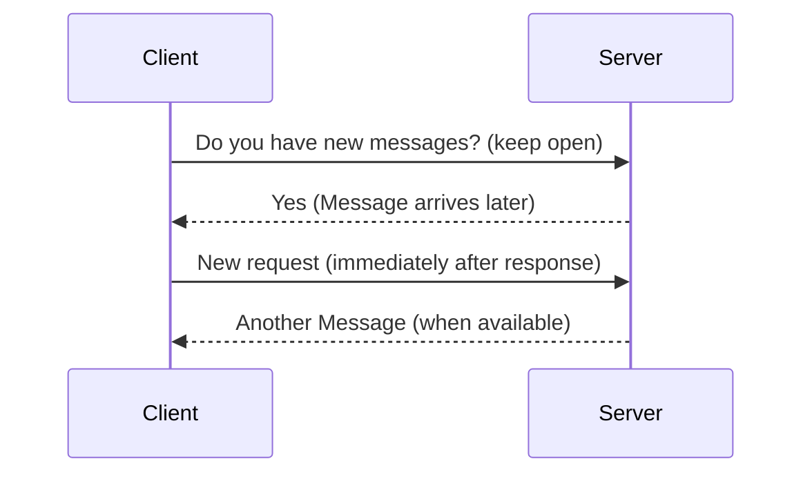
```mermaid
sequenceDiagram
    participant C as Client
    participant S as Server

    C->>S: Do you have new messages? (keep open)
    S-->>C: Yes (Message arrives later)
    C->>S: New request (immediately after response)
    S-->>C: Another Message (when available)
```

3. WebSockets

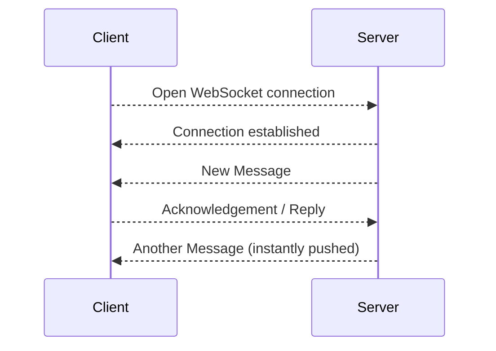
```mermaid
sequenceDiagram
    participant C as Client
    participant S as Server

    C-->>S: Open WebSocket connection
    S-->>C: Connection established
    S-->>C: New Message
    C-->>S: Acknowledgement / Reply
    S-->>C: Another Message (instantly pushed)
```

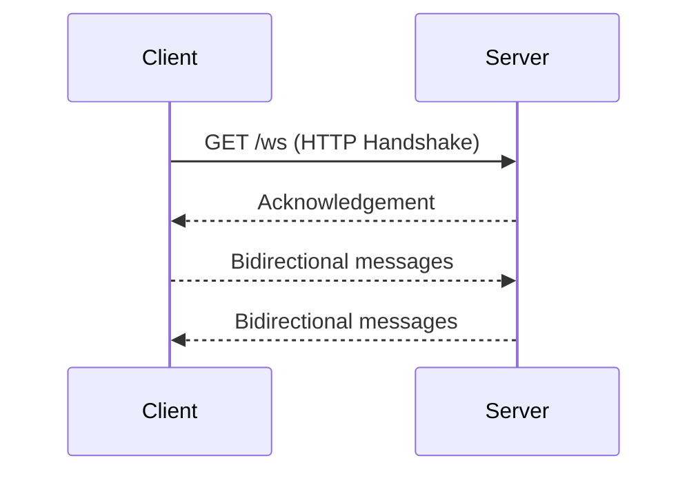
```mermaid
sequenceDiagram
    participant C as Client
    participant S as Server

    C->>S: GET /ws (HTTP Handshake)
    S-->>C: Acknowledgement
    C-->>S: Bidirectional messages
    S-->>C: Bidirectional messages
```

## High Level Design / Architecture Overview

WebSockets are responsible for the main communication protocol between the client and server for bidirectional communication.
There are three major categories:

- stateless services,
- stateful services, and
- third-party integration.{leave for some other time}

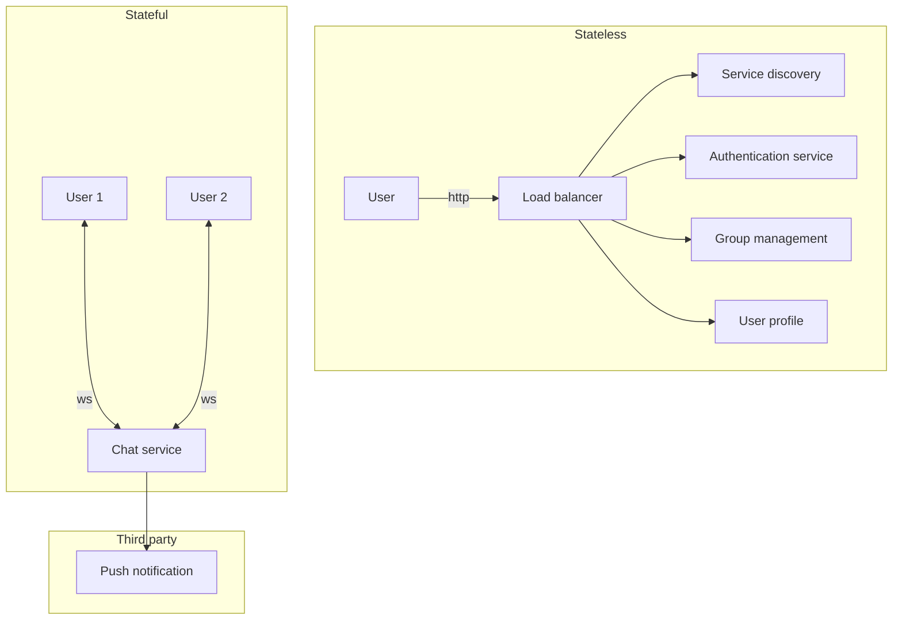
```mermaid
flowchart TB
    subgraph Stateless
        U[User] -->|http| LB[Load balancer]
        LB --> SD[Service discovery]
        LB --> AS[Authentication service]
        LB --> GM[Group management]
        LB --> UP[User profile]
    end

    subgraph Stateful
        U1[User 1] <-->|ws| CS[Chat service]
        U2[User 2] <-->|ws| CS
    end

    subgraph Third_party[Third party]
        PN[Push notification]
    end

    CS --> PN
```

### Stateless Services

Stateless services are traditional public-facing request/response services, used to manage the login, signup, user profile, etc. These are common features among many websites and apps.

Stateless services sit behind a load balancer whose job is to route requests to the correct services based on the request paths. These services can be monolithic or individual microservices. We do not need to build many of these stateless services by ourselves as there are services in the market that can be integrated easily. The one service that we will discuss more in deep dive is the service discovery. Its primary job is to give the client a list of DNS host names of chat servers that the client could connect to.

### Stateful Service

The only stateful service is the chat service. The service is stateful because each client maintains a persistent network connection to a chat server. In this service, a client normally does not switch to another chat server as long as the server is still available. The service discovery coordinates closely with the chat service to avoid server overloading. We will go into detail in deep dive.

### Third Party

Refer to designing a notification system

### Scalability

let's say 1M concurrent users
1 user- 10K of memory on the server
total- 10gb {not ideal}

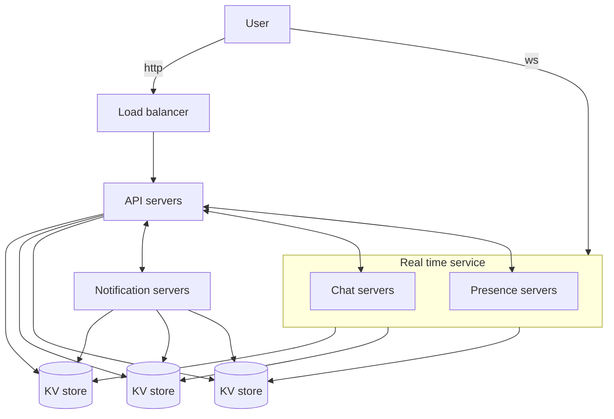
```mermaid
flowchart TB
    U[User]

    %% Entry
    U -->|http| LB[Load balancer]
    U -->|ws| RTS[Real time service]

    %% Real-time service split
    subgraph RTS[Real time service]
        CS[Chat servers]
        PS[Presence servers]
    end
    RTS --> KV1[(KV store)]
    RTS --> KV2[(KV store)]
    RTS --> KV3[(KV store)]

    %% API servers
    LB --> API[API servers]
    API --> KV1
    API --> KV2
    API --> KV3

    %% Notification servers
    API <--> NS[Notification servers]
    NS --> KV1
    NS --> KV2
    NS --> KV3

    %% Internal links
    API <--> CS
    API <--> PS
```

## Services

1. User A tries to log in to the app.

2. The load balancer sends the login request to API servers.

3. After the backend authenticates the user, service discovery finds the best chat server for User A. In this example, server 2 is chosen and the server info is returned back to User A.

4. User A connects to chat server 2 through WebSocket.

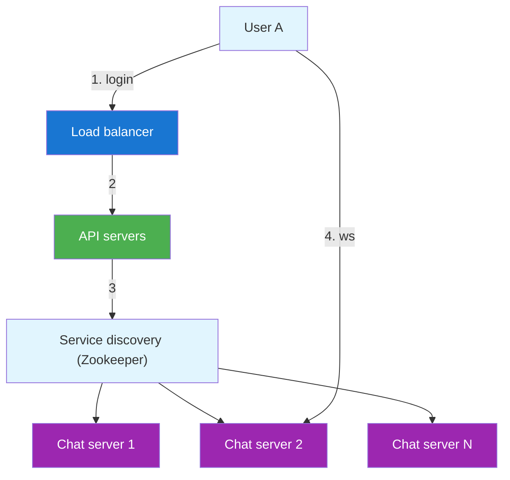
```mermaid
graph TD
    A["User A"] -->|1. login| B["Load balancer"]
    B -->|2| C["API servers"]
    C -->|3| D["Service discovery (Zookeeper)"]

    D --> E["Chat server 1"]
    D --> F["Chat server 2"]
    D --> G["Chat server N"]

    A -->|4. ws| F

    style A fill:#e1f5fe
    style B fill:#1976d2,color:#fff
    style C fill:#4caf50,color:#fff
    style D fill:#e1f5fe
    style E fill:#9c27b0,color:#fff
    style F fill:#9c27b0,color:#fff
    style G fill:#9c27b0,color:#fff
```

## Message Flow

### 1 on 1 chat flow

This diagram shows what happens when User A sends a message to User B.

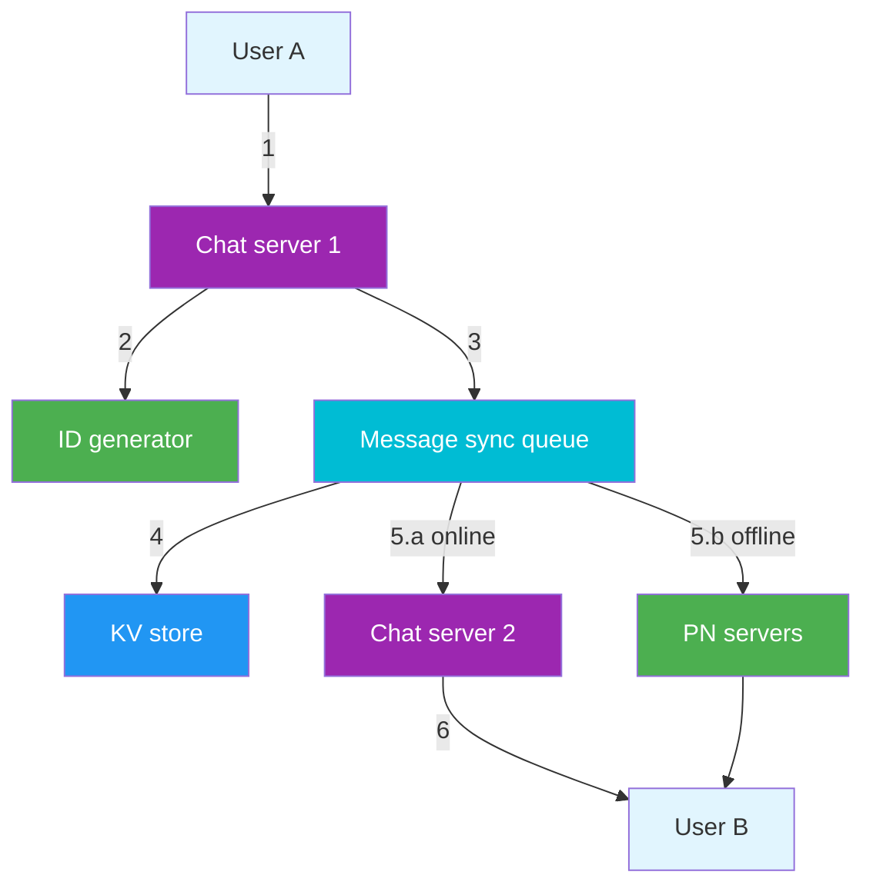
```mermaid
graph TD
    A[User A] -->|1| B[Chat server 1]
    B -->|2| C[ID generator]
    B -->|3| D[Message sync queue]
    D -->|4| E[KV store]
    D -->|5.a online| F[Chat server 2]
    D -->|5.b offline| G[PN servers]
    F -->|6| H[User B]
    G --> H

    style A fill:#e1f5fe
    style B fill:#9c27b0,color:#fff
    style C fill:#4caf50,color:#fff
    style D fill:#00bcd4,color:#fff
    style E fill:#2196f3,color:#fff
    style F fill:#9c27b0,color:#fff
    style G fill:#4caf50,color:#fff
    style H fill:#e1f5fe
```

**Flow Description:**

1. User A sends a chat message to Chat server 1
2. Chat server 1 obtains a message ID from the ID generator
3. Chat server 1 sends the message to the message sync queue
4. The message is stored in a key-value store
5. If User B is online (5.a), the message is forwarded to Chat server 2 where User B is connected. If User B is offline (5.b), a push notification is sent from push notification servers
6. Chat server 2 forwards the message to User B via persistent WebSocket connection

### Message Synchronization Across Multiple Devices

This shows how messages sync across a user's multiple devices.

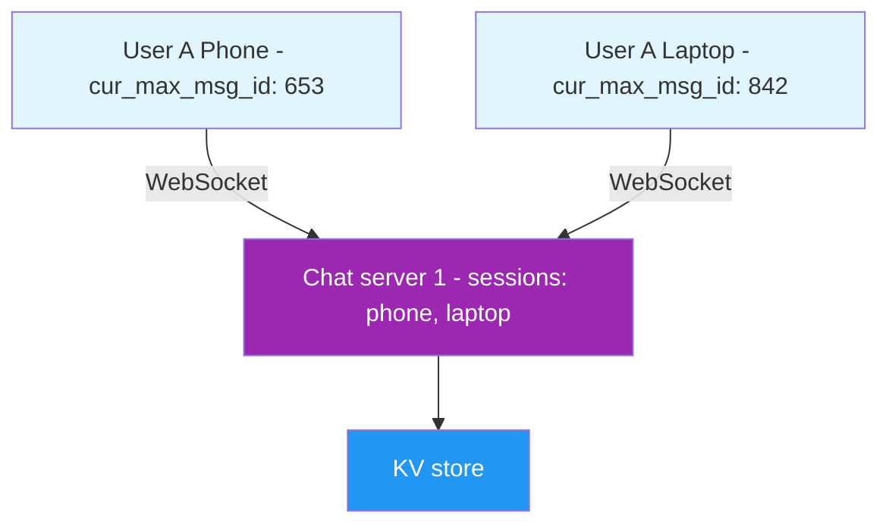
```mermaid
graph TD
    A["User A Phone - cur_max_msg_id: 653"] -->|WebSocket| C["Chat server 1 - sessions: phone, laptop"]
    B["User A Laptop - cur_max_msg_id: 842"] -->|WebSocket| C
    C --> D["KV store"]

    style A fill:#e1f5fe
    style B fill:#e1f5fe
    style C fill:#9c27b0,color:#fff
    style D fill:#2196f3,color:#fff
```

**Synchronization Logic:**

- Each device maintains `cur_max_message_id` tracking the latest message ID
- New messages are those where:
  - Recipient ID equals currently logged-in user ID
  - Message ID in KV store is larger than `cur_max_message_id`
- Each device can independently sync new messages from the KV store

## Small Group Chat Flow

### Message Distribution (User A sends to group)

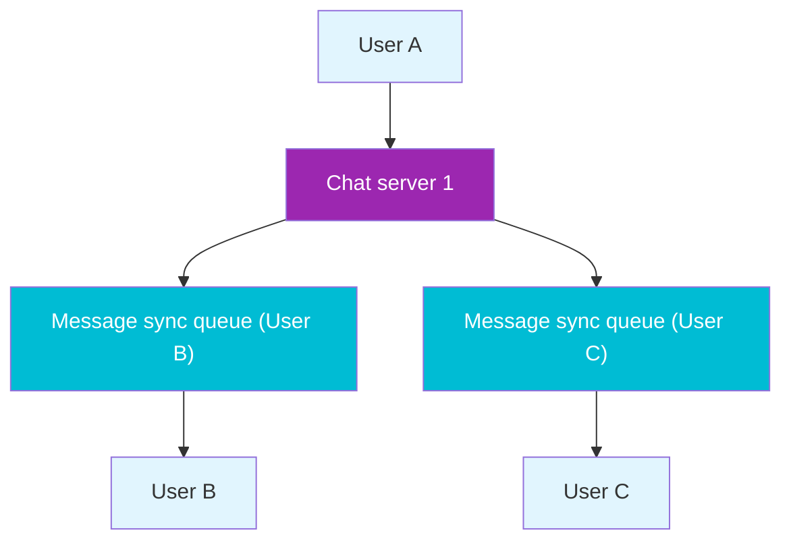
```mermaid
graph TD
    A[User A] --> B[Chat server 1]
    B --> C["Message sync queue (User B)"]
    B --> D["Message sync queue (User C)"]
    C --> E[User B]
    D --> F[User C]

    style A fill:#e1f5fe
    style B fill:#9c27b0,color:#fff
    style C fill:#00bcd4,color:#fff
    style D fill:#00bcd4,color:#fff
    style E fill:#e1f5fe
    style F fill:#e1f5fe
```

### Message Reception (User C receives from multiple users)

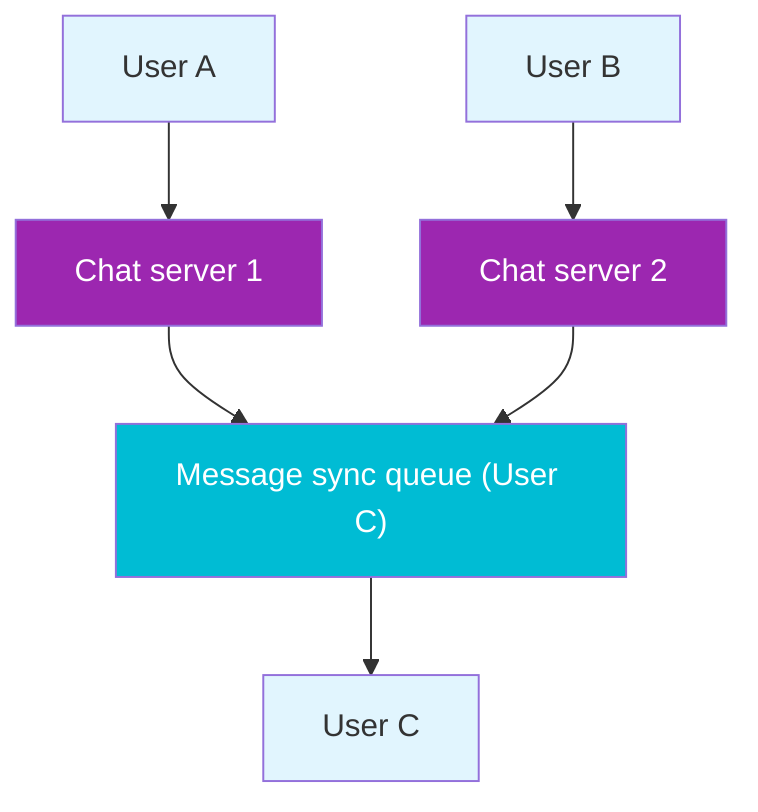
```mermaid
graph TD
    A[User A] --> B[Chat server 1]
    C[User B] --> D[Chat server 2]
    B --> E["Message sync queue (User C)"]
    D --> E
    E --> F[User C]

    style A fill:#e1f5fe
    style B fill:#9c27b0,color:#fff
    style C fill:#e1f5fe
    style D fill:#9c27b0,color:#fff
    style E fill:#00bcd4,color:#fff
    style F fill:#e1f5fe
```

**Group Chat Design Benefits:**

- Simplifies message sync flow - each client only checks its own inbox
- Works well for small groups (WeChat limits to 500 members)
- Each recipient has an inbox (message sync queue) containing messages from different senders

## Online Presence Flows

### User Login Flow

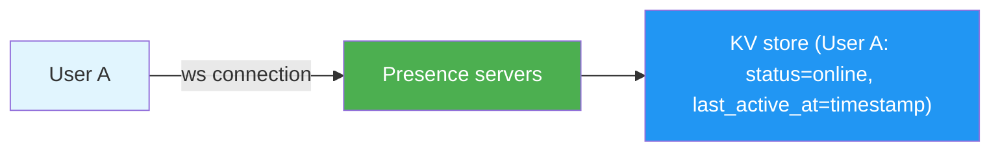
```mermaid
graph LR
    A[User A] -->|ws connection| B[Presence servers]
    B --> C["KV store (User A: status=online, last_active_at=timestamp)"]

    style A fill:#e1f5fe
    style B fill:#4caf50,color:#fff
    style C fill:#2196f3,color:#fff
```

### User Logout Flow

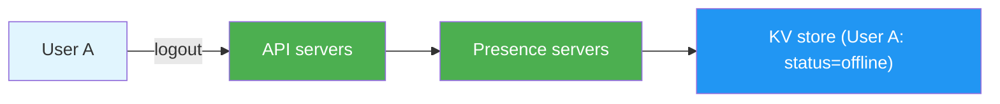
```mermaid
graph LR
    A[User A] -->|logout| B[API servers]
    B --> C[Presence servers]
    C --> D["KV store (User A: status=offline)"]

    style A fill:#e1f5fe
    style B fill:#4caf50,color:#fff
    style C fill:#4caf50,color:#fff
    style D fill:#2196f3,color:#fff
```

### Heartbeat Mechanism

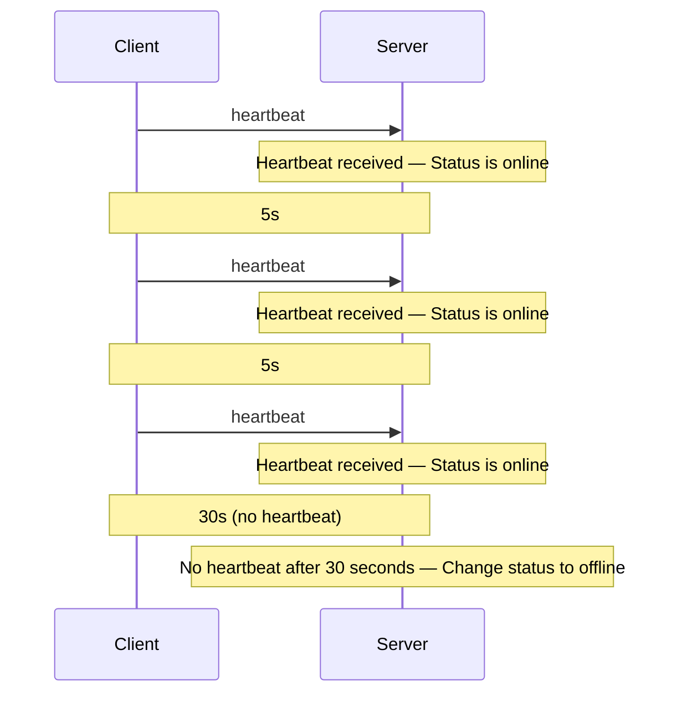
```mermaid
sequenceDiagram
    participant C as Client
    participant S as Server

    C->>S: heartbeat
    Note over S: Heartbeat received — Status is online
    Note over C,S: 5s

    C->>S: heartbeat
    Note over S: Heartbeat received — Status is online
    Note over C,S: 5s

    C->>S: heartbeat
    Note over S: Heartbeat received — Status is online
    Note over C,S: 30s (no heartbeat)

    Note over S: No heartbeat after 30 seconds — Change status to offline
```

**Heartbeat Logic:**

- Client sends heartbeat every 5 seconds
- If server receives heartbeat within x seconds, user is online
- Otherwise, user is marked offline
- Prevents frequent status changes due to temporary disconnections

### Online Status Fanout

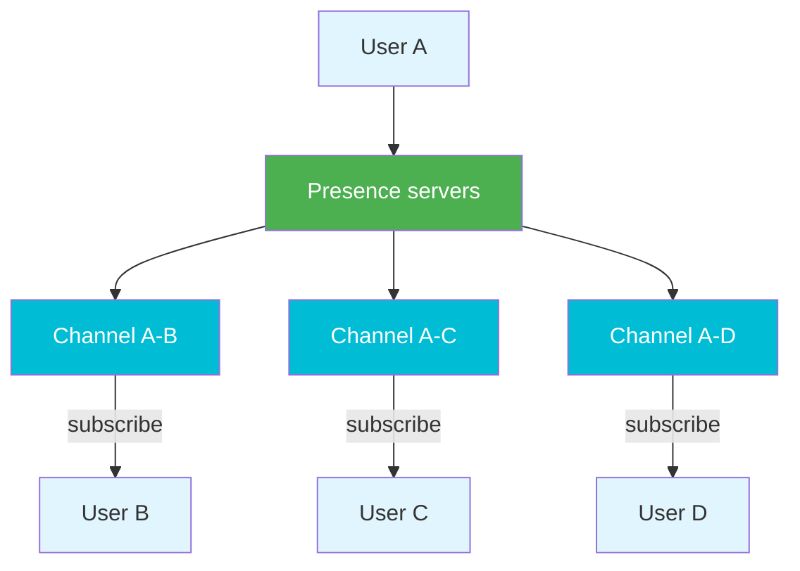
```mermaid
graph TD
    A[User A] --> B[Presence servers]
    B --> C[Channel A-B]
    B --> D[Channel A-C]
    B --> E[Channel A-D]
    C -->|subscribe| F[User B]
    D -->|subscribe| G[User C]
    E -->|subscribe| H[User D]

    style A fill:#e1f5fe
    style B fill:#4caf50,color:#fff
    style C fill:#00bcd4,color:#fff
    style D fill:#00bcd4,color:#fff
    style E fill:#00bcd4,color:#fff
    style F fill:#e1f5fe
    style G fill:#e1f5fe
    style H fill:#e1f5fe
```

**Fanout Design:**

- Uses publish-subscribe model
- Each friend pair maintains a dedicated channel
- When User A's status changes, event is published to all friend channels
- Friends subscribe to their respective channels for real-time updates
- Effective for small groups, but expensive for large groups (100,000+ members)
- Alternative: fetch status only when entering group or manually refreshing

# How Discord Stores Billions of Messages (Summary)

### Growth

- 2015: Built MVP in \~2 months on MongoDB (single replica set).
- By late 2015 → 100M+ stored messages → MongoDB no longer fit in RAM, latencies spiked.
- By 2017 → 120M+ messages/day.
- Decision: **store all messages forever**.

---

### MongoDB → Cassandra Migration

- MongoDB issues:
  - Single compound index `(channel_id, created_at)`.
  - Random reads + large datasets → disk cache thrashing.

- Requirements for new DB:
  - Linear scalability, automatic failover, low maintenance.
  - Proven in production (Netflix, Apple use it).
  - Predictable performance.
  - Open source.

- **Cassandra chosen**: write-heavy, fault-tolerant, horizontally scalable.

---

### Data Modeling in Cassandra

- Cassandra = KKV store (`partition key`, `clustering key`, `value`).
- Primary key: `(channel_id, message_id)` → `message_id` = Snowflake (time sortable).
- Problem: Large partitions (channels alive for years).
- Solution: **Bucket messages** (10-day windows).
  - New PK: `((channel_id, bucket), message_id)`.
  - Sequential queries until enough messages are collected.

---

### Migration & Consistency Issues

- **Dark launch**: double write/read to Mongo + Cassandra.
- Cassandra is **AP** (eventually consistent):
  - Writes = upserts (last-write-wins).
  - Deletes = tombstones (not immediate, expire after compaction).

- Problems:
  - Null writes created **tombstones** unnecessarily.
  - Edit/delete races → “zombie” messages with missing fields.

- Fixes:
  - Only write non-null columns.
  - Delete corrupt rows (e.g., when `author_id` missing).

---

### Performance

- Writes: sub-millisecond.
- Reads: \~5ms, predictable even on old data.
- Example: Jumping back 1 year in large channels = fast.

---

### Tombstone Surprise

- One public server deleted millions of messages in a channel, leaving 1.
- Cassandra still had to scan millions of **tombstones** → GC storm, cluster freeze.
- Fixes:
  - Reduced tombstone TTL (10 → 2 days).
  - Track empty buckets to skip useless queries.

---

### Current Setup (2017)

- 12-node Cassandra cluster.
- Replication factor: 3.
- \~1TB compressed data per node.
- Scaling plan: just add nodes.

---

### Future Plans

- **Near-term:**
  - Upgrade Cassandra 2 → 3 (better storage, \~50% less space).
  - Push per-node storage from 1TB → 2TB.

- **Long-term:**
  - Explore **ScyllaDB** (C++ Cassandra-compatible, faster repairs).
  - Possible archival of old channels to GCS flat files (avoid if possible).

---

**Takeaway:**
Discord’s solution relies on **Cassandra’s linear scalability + Snowflake IDs + bucketing strategy** to handle billions of messages with predictable performance, while carefully managing **tombstones, eventual consistency, and partition size**.

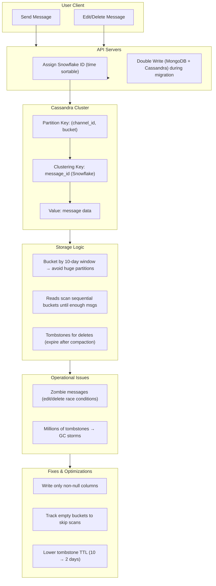
```mermaid
flowchart TD
    subgraph Client[User Client]
        U1["Send Message"]
        U2["Edit/Delete Message"]
    end

    subgraph API[API Servers]
        A1["Assign Snowflake ID (time sortable)"]
        A2["Double Write (MongoDB + Cassandra) during migration"]
    end

    subgraph Cassandra[Cassandra Cluster]
        direction TB
        C1["Partition Key: (channel_id, bucket)"]
        C2["Clustering Key: message_id (Snowflake)"]
        C3["Value: message data"]

        C1 --> C2 --> C3
    end

    subgraph StorageLogic[Storage Logic]
        S1["Bucket by 10-day window → avoid huge partitions"]
        S2["Reads scan sequential buckets until enough msgs"]
        S3["Tombstones for deletes (expire after compaction)"]
    end

    subgraph Issues[Operational Issues]
        I1["Zombie messages (edit/delete race conditions)"]
        I2["Millions of tombstones → GC storms"]
    end

    subgraph Fixes[Fixes & Optimizations]
        F1["Write only non-null columns"]
        F2["Track empty buckets to skip scans"]
        F3["Lower tombstone TTL (10 → 2 days)"]
    end

    U1 --> API
    U2 --> API
    API --> A1 --> Cassandra
    Cassandra --> StorageLogic
    StorageLogic --> Issues
    Issues --> Fixes

```