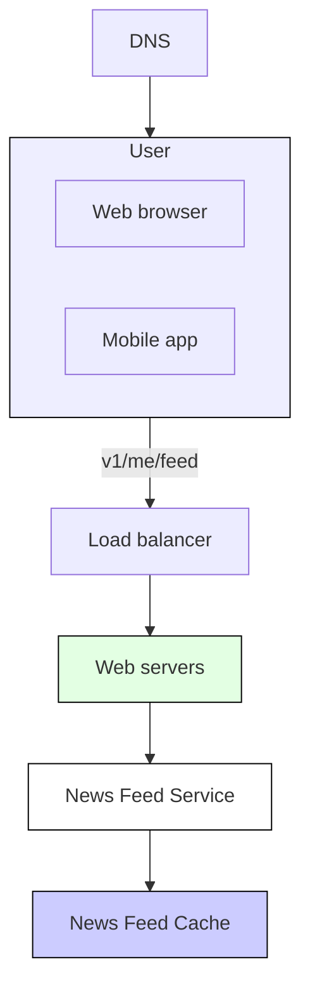
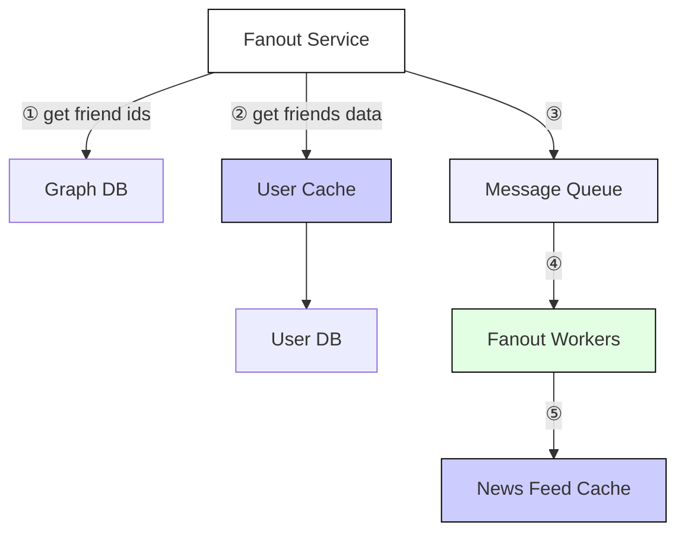
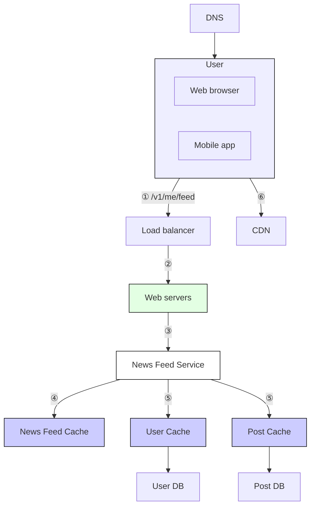

# News Feed System

WHat is **News Feed**?
News feed is the constantly updating list of stories in the middle of your home page.
News Feed includes status updates, photos, videos, links, app activity, and likes from people, pages, and groups that you follow on Facebook.

## Design Scope

- user can publish post, see other post
- sorted in reverse chronological order or sorted by latest upload
- max friend limit: 5000
- traffic volume: 10 million DAU
- multimedia post, contains images, videos, text

# High Level Design

- Feed publishing: when a user publishes a post, corresponding data is written into cache and database. A post is populated to her friends’ news feed.
- Newsfeed building: for simplicity, let us assume the news feed is built by aggregating friends’ posts in reverse chronological order.

## Newsfeed API

2 important apis: feed publishing API and news feed retrieval API.

1. Feed Publishing API - POST /v1/me/feed
   Params:
   • content: content is the text of the post.
   • auth_token: it is used to authenticate API requests.

2. Newsfeed Retrieval API - GET /v1/me/feed
   Params:
   • auth_token: it is used to authenticate API requests.

## Feed Publishing

```mermaid
flowchart TD
    subgraph User["User"]
        WB["Web browser"]
        MA["Mobile app"]
    end

    DNS["DNS"] --> User
    User -->|v1/me/feed?content=Hello&auth_token={auth_token}| LB["Load balancer"]
    LB --> WS["Web servers"]

    WS --> PS["Post Service"]
    WS --> FS["Fanout Service"]
    WS --> NS["Notification Service"]

    PS --> PC["Post Cache"]
    PC --> PDB["Post DB"]

    FS --> NFC["News Feed Cache"]

    style User fill:#eef,stroke:#000,stroke-width:1px
    style WS fill:#e3ffe3,stroke:#000,stroke-width:1px
    style PC fill:#ccf,stroke:#000,stroke-width:1px
    style NFC fill:#ccf,stroke:#000,stroke-width:1px
    style PDB fill:#ccf,stroke:#000,stroke-width:1px
```

- User: view news feed, publish post via `/v1/me/feed?content=Hello&auth_token={auth_token}`
- Load Balancer: distribute traffic to web servers.
- Web servers: web servers redirect traffic to different internal services.
- Post service: persist post in the database and cache.
- Fanout service: push new content to friends’ news feed. Newsfeed data is stored in the cache for fast retrieval.
- Notification service: inform friends that new content is available and send out push notifications.

## News Feed building



# Design Deep Dive

## Feed publishing deep dive

```mermaid
flowchart TD
    subgraph User["User"]
        WB["Web browser"]
        MA["Mobile app"]
    end

    DNS["DNS"] --> User
    User -->|v1/me/feed?content=Hello&auth_token={auth_token}| LB["Load balancer"]
    LB --> WS["Web servers"]
    WS -->|Authentication & Rate Limiting| PS["Post Service"]
    WS --> NS["Notification Service"]
    WS --> FS["Fanout Service"]

    PS --> PC["Post Cache"]
    PC --> PDB["Post DB"]

    FS -->|① get friend ids| GDB["Graph DB"]
    FS -->|② get friends data| UC["User Cache"]
    UC --> UDB["User DB"]

    FS -->|③| MQ["Message Queue"]
    MQ -->|④| FW["Fanout Workers"]
    FW -->|⑤| NFC["News Feed Cache"]

    style User fill:#eef,stroke:#000,stroke-width:1px
    style WS fill:#e3ffe3,stroke:#000,stroke-width:1px
    style PS fill:#fff,stroke:#000,stroke-width:1px
    style FS fill:#fff,stroke:#000,stroke-width:1px
    style NS fill:#fff,stroke:#000,stroke-width:1px
    style MQ fill:#eef,stroke:#000,stroke-width:1px
    style FW fill:#e3ffe3,stroke:#000,stroke-width:1px
    style PC fill:#ccf,stroke:#000,stroke-width:1px
    style NFC fill:#ccf,stroke:#000,stroke-width:1px
    style UC fill:#ccf,stroke:#000,stroke-width:1px

```

`Web Servers` -> authentication and rate-limiting
`Fanout`-> push post to all friends

_Fanout on write_
news feed is pre-computed during write time

- The news feed is generated in real-time and can be pushed to friends immediately.
- Fetching news feed is fast because the news feed is pre-computed during write time.

- friend list fetching and news feed genration for all of them is time consuming
- pre-compute wasted on inactive users

_Fanout on read_
feed generated during read time

- doesn't wastes resources on inactive users.
- data not pushed to friends, so no hot key problem.

we use hybrid approach



## Newsfeed retrieval deep dive



1. A user sends a request to retrieve her news feed. The request looks like this: /v1/me/feed
2. The load balancer redistributes requests to web servers.
3. Web servers call the news feed service to fetch news feeds.
4. News feed service gets a list post IDs from the news feed cache.
5. A user’s news feed is more than just a list of feed IDs. It contains username, profile picture, post content, post image, etc. Thus, the news feed service fetches the complete user and post objects from caches (user cache and post cache) to construct the fully hydrated news feed.
6. The fully hydrated news feed is returned in JSON format back to the client for rendering.

## Cache Architecture

```mermaid
graph TB
    subgraph "Social Media System Architecture"
        NF["`**News Feed**
        ┌─────────────────┐
        │ news feed       │
        └─────────────────┘
        Stores IDs of news feeds`"]

        subgraph Content ["Content Layer"]
            HC["`**Hot Cache**
            ┌─────────────────┐
            │ hot cache       │
            └─────────────────┘
            Popular content storage`"]

            NC["`**Normal Storage**
            ┌─────────────────┐
            │ normal          │
            └─────────────────┘
            Regular post data`"]
        end

        subgraph SocialGraph ["Social Graph"]
            FL["`**Follower**
            ┌─────────────────┐
            │ follower        │
            └─────────────────┘
            User relationship data`"]

            FG["`**Following**
            ┌─────────────────┐
            │ following       │
            └─────────────────┘
            User relationship data`"]
        end

        subgraph Actions ["Action Layer"]
            LK["`**Liked**
            ┌─────────────────┐
            │ liked           │
            └─────────────────┘
            User like actions`"]

            RP["`**Replied**
            ┌─────────────────┐
            │ replied         │
            └─────────────────┘
            User reply actions`"]

            OT["`**Others**
            ┌─────────────────┐
            │ others          │
            └─────────────────┘
            Other user actions`"]
        end

        subgraph Counters ["Counter Layer"]
            LC["`**Like Counter**
            ┌─────────────────┐
            │ like counter    │
            └─────────────────┘
            Tracks like counts`"]

            RC["`**Reply Counter**
            ┌─────────────────┐
            │ reply counter   │
            └─────────────────┘
            Tracks reply counts`"]

            OC["`**Other Counters**
            ┌─────────────────┐
            │ other counters  │
            └─────────────────┘
            Follower, following, etc.`"]
        end
    end

    NF --> Content
    Content --> SocialGraph
    SocialGraph --> Actions
    Actions --> Counters
```



- News Feed: It stores IDs of news feeds.
- Content: It stores every post data. Popular content is stored in hot cache.
- Social Graph: It stores user relationship data.
- Action: It stores info about whether a user liked a post, replied a post, or took other actions on a post.
- Counters: It stores counters for like, reply, follower, following, etc

# Referance Material

[1] [How News Feed Works](https://www.facebook.com/help/327131014036297/)
[2] [Friend of Friend recommendations Neo4j and SQL Sever](http://geekswithblogs.net/brendonpage/archive/2015/10/26/friend-of-friend-recommendations-with-neo4j.aspx)

---

[bun](https://github.com/NalinDalal/news-feed-bun)
[rust](https://github.com/NalinDalal/news-feed-rust)
