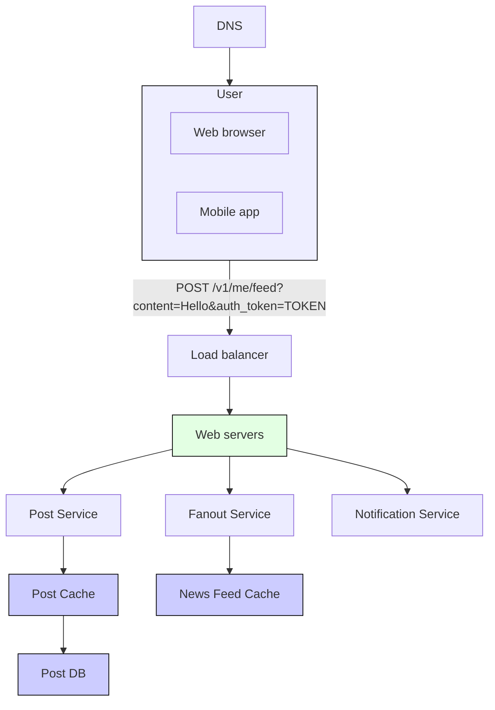
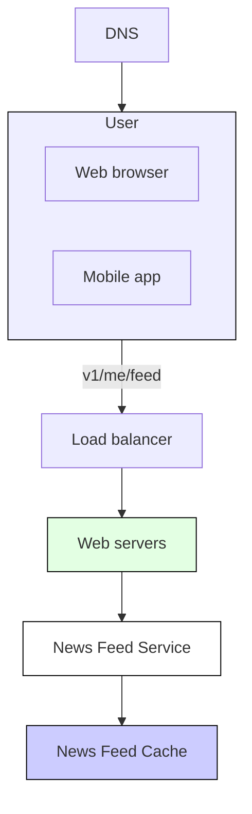
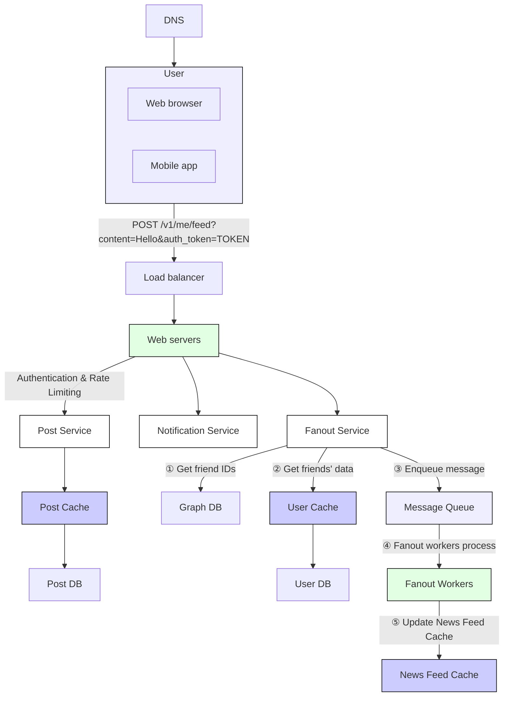
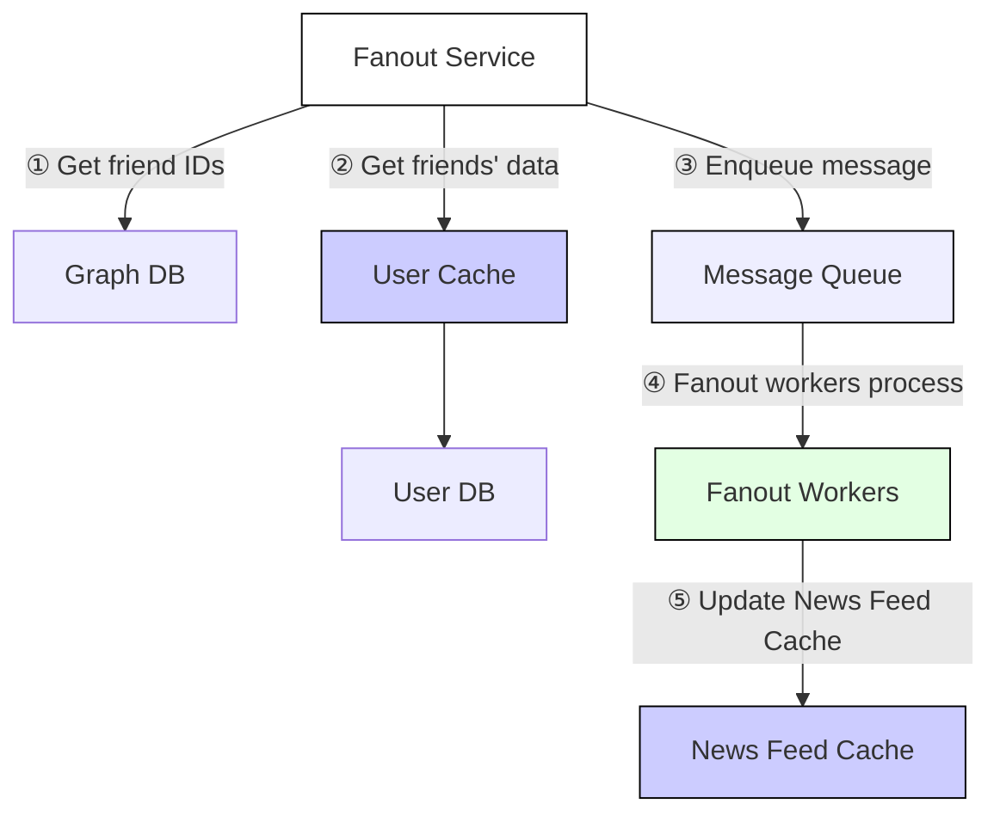
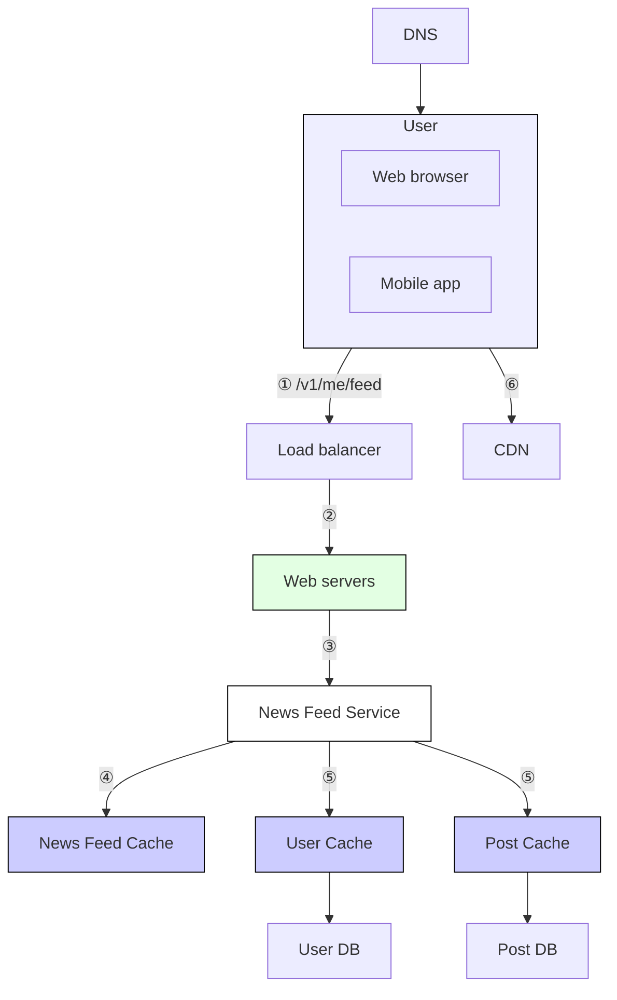

# News Feed System

What is **News Feed**?
News feed is the constantly updating list of stories in the middle of your home page.
News Feed includes status updates, photos, videos, links, app activity, and likes from people, pages, and groups that you follow on Facebook.

## Design Scope

- user can publish post, see other post
- sorted in reverse chronological order or sorted by latest upload
- max friend limit: 5000
- traffic volume: 10 million DAU
- multimedia post, contains images, videos, text

# High Level Design

- Feed publishing: when a user publishes a post, corresponding data is written into cache and database. A post is populated to her friends’ news feed.
- News Feed building: for simplicity, let us assume the news feed is built by aggregating friends’ posts in reverse chronological order.

## News Feed API

2 important APIs: feed publishing API and news feed retrieval API.

1. Feed Publishing API - POST `/v1/me/feed`
   Params:
   • content: content is the text of the post.
   • auth_token: it is used to authenticate API requests.

2. Newsfeed Retrieval API - GET `/v1/me/feed`
   Params:
   • auth_token: it is used to authenticate API requests.

## Feed Publishing

```mermaid
flowchart TD
    subgraph User["User"]
        WB["Web browser"]
        MA["Mobile app"]
    end

    DNS["DNS"] --> User
    User -->|POST /v1/me/feed?content=Hello&auth_token=TOKEN| LB["Load balancer"]
    LB --> WS["Web servers"]

    WS --> PS["Post Service"]
    WS --> FS["Fanout Service"]
    WS --> NS["Notification Service"]

    PS --> PC["Post Cache"]
    PC --> PDB["Post DB"]

    FS --> NFC["News Feed Cache"]

    style User fill:#eef,stroke:#000,stroke-width:1px
    style WS fill:#e3ffe3,stroke:#000,stroke-width:1px
    style PC fill:#ccf,stroke:#000,stroke-width:1px
    style NFC fill:#ccf,stroke:#000,stroke-width:1px
    style PDB fill:#ccf,stroke:#000,stroke-width:1px
```

- User: view news feed, publish post via `/v1/me/feed?content=Hello&auth_token={auth_token}`
- Load Balancer: distribute traffic to web servers.
- Web servers: web servers redirect traffic to different internal services.
- Post service: persist post in the database and cache.
- Fanout service: push new content to friends’ news feed. Newsfeed data is stored in the cache for fast retrieval.
- Notification service: inform friends that new content is available and send out push notifications.

## News Feed building

```mermaid
flowchart TD
    subgraph User["User"]
        WB["Web browser"]
        MA["Mobile app"]
    end

    DNS["DNS"] --> User
    User -->|v1/me/feed| LB["Load balancer"]
    LB --> WS["Web servers"]
    WS --> NFS["News Feed Service"]
    NFS --> NFC["News Feed Cache"]

    style User fill:#eef,stroke:#000,stroke-width:1px
    style WS fill:#e3ffe3,stroke:#000,stroke-width:1px
    style NFS fill:#fff,stroke:#000,stroke-width:1px
    style NFC fill:#ccf,stroke:#000,stroke-width:1px
```

# Design Deep Dive

## Feed Publishing deep dive

```mermaid
flowchart TD
    subgraph User["User"]
        WB["Web browser"]
        MA["Mobile app"]
    end

    DNS["DNS"] --> User
    User -->|POST /v1/me/feed?content=Hello&auth_token=TOKEN| LB["Load balancer"]
    LB --> WS["Web servers"]
    WS -->|Authentication & Rate Limiting| PS["Post Service"]
    WS --> NS["Notification Service"]
    WS --> FS["Fanout Service"]

    PS --> PC["Post Cache"]
    PC --> PDB["Post DB"]

    FS -->|① Get friend IDs| GDB["Graph DB"]
    FS -->|② Get friends' data| UC["User Cache"]
    UC --> UDB["User DB"]

    FS -->|③ Enqueue message| MQ["Message Queue"]
    MQ -->|④ Fanout workers process| FW["Fanout Workers"]
    FW -->|⑤ Update News Feed Cache| NFC["News Feed Cache"]

    style User fill:#eef,stroke:#000,stroke-width:1px
    style WS fill:#e3ffe3,stroke:#000,stroke-width:1px
    style PS fill:#fff,stroke:#000,stroke-width:1px
    style FS fill:#fff,stroke:#000,stroke-width:1px
    style NS fill:#fff,stroke:#000,stroke-width:1px
    style MQ fill:#eef,stroke:#000,stroke-width:1px
    style FW fill:#e3ffe3,stroke:#000,stroke-width:1px
    style PC fill:#ccf,stroke:#000,stroke-width:1px
    style NFC fill:#ccf,stroke:#000,stroke-width:1px
    style UC fill:#ccf,stroke:#000,stroke-width:1px
```

`Web Servers` -> authentication and rate-limiting
`Fanout`-> push post to all friends

_Fanout on write_
news feed is pre-computed during write time

- The news feed is generated in real-time and can be pushed to friends immediately.
- Fetching news feed is fast because the news feed is pre-computed during write time.

- Fetching friend lists and generating news feeds for all friends is time-consuming.
- Pre-computation is wasted on inactive users.

_Fanout on read_
feed generated during read time

- doesn't wastes resources on inactive users.
- data not pushed to friends, so no hot key problem.

we use hybrid approach

```mermaid
flowchart TD
    FS["Fanout Service"] -->|① Get friend IDs| GDB["Graph DB"]
    FS -->|② Get friends' data| UC["User Cache"]
    UC --> UDB["User DB"]

    FS -->|③ Enqueue message| MQ["Message Queue"]
    MQ -->|④ Fanout workers process| FW["Fanout Workers"]
    FW -->|⑤ Update News Feed Cache| NFC["News Feed Cache"]

    style FS fill:#fff,stroke:#000,stroke-width:1px
    style MQ fill:#eef,stroke:#000,stroke-width:1px
    style FW fill:#e3ffe3,stroke:#000,stroke-width:1px
    style NFC fill:#ccf,stroke:#000,stroke-width:1px
    style UC fill:#ccf,stroke:#000,stroke-width:1px
```

## News Feed retrieval deep dive

```mermaid
flowchart TD
    subgraph User["User"]
        WB["Web browser"]
        MA["Mobile app"]
    end

    DNS["DNS"] --> User
    User -->|① /v1/me/feed| LB["Load balancer"]
    LB -->|②| WS["Web servers"]
    WS -->|③| NFS["News Feed Service"]

    NFS -->|④| NFC["News Feed Cache"]
    NFS -->|⑤| UC["User Cache"]
    UC --> UDB["User DB"]
    NFS -->|⑤| PC["Post Cache"]
    PC --> PDB["Post DB"]

    User -->|⑥| CDN["CDN"]

    style User fill:#eef,stroke:#000,stroke-width:1px
    style WS fill:#e3ffe3,stroke:#000,stroke-width:1px
    style NFS fill:#fff,stroke:#000,stroke-width:1px
    style NFC fill:#ccf,stroke:#000,stroke-width:1px
    style UC fill:#ccf,stroke:#000,stroke-width:1px
    style PC fill:#ccf,stroke:#000,stroke-width:1px
```

1. A user sends a request to retrieve their news feed: `GET /v1/me/feed`.
2. The load balancer routes the request to a web server.
3. The web server calls the News Feed Service to fetch the feed.
4. The News Feed Service retrieves a list of post IDs from the News Feed Cache.
5. The News Feed Service fetches user and post objects from caches (`User Cache` and `Post Cache`) to construct a fully hydrated feed (author username, profile picture, post content, images, etc.).
6. The fully hydrated feed is returned as JSON to the client for rendering.

## Cache Architecture

```mermaid
graph TB
    subgraph "Social Media System Architecture"
        NF["`**News Feed**
        ┌─────────────────┐
        │ news feed       │
        └─────────────────┘
        Stores IDs of news feeds`"]

        subgraph Content ["Content Layer"]
            HC["`**Hot Cache**
            ┌─────────────────┐
            │ hot cache       │
            └─────────────────┘
            Popular content storage`"]

            NC["`**Normal Storage**
            ┌─────────────────┐
            │ normal          │
            └─────────────────┘
            Regular post data`"]
        end

        subgraph SocialGraph ["Social Graph"]
            FL["`**Follower**
            ┌─────────────────┐
            │ follower        │
            └─────────────────┘
            User relationship data`"]

            FG["`**Following**
            ┌─────────────────┐
            │ following       │
            └─────────────────┘
            User relationship data`"]
        end

        subgraph Actions ["Action Layer"]
            LK["`**Liked**
            ┌─────────────────┐
            │ liked           │
            └─────────────────┘
            User like actions`"]

            RP["`**Replied**
            ┌─────────────────┐
            │ replied         │
            └─────────────────┘
            User reply actions`"]

            OT["`**Others**
            ┌─────────────────┐
            │ others          │
            └─────────────────┘
            Other user actions`"]
        end

        subgraph Counters ["Counter Layer"]
            LC["`**Like Counter**
            ┌─────────────────┐
            │ like counter    │
            └─────────────────┘
            Tracks like counts`"]

            RC["`**Reply Counter**
            ┌─────────────────┐
            │ reply counter   │
            └─────────────────┘
            Tracks reply counts`"]

            OC["`**Other Counters**
            ┌─────────────────┐
            │ other counters  │
            └─────────────────┘
            Follower, following, etc.`"]
        end
    end

    NF --> Content
    Content --> SocialGraph
    SocialGraph --> Actions
    Actions --> Counters
```

- News Feed: It stores IDs of news feeds.
- Content: It stores every post data. Popular content is stored in hot cache.
- Social Graph: It stores user relationship data.
- Action: It stores info about whether a user liked a post, replied a post, or took other actions on a post.
- Counters: It stores counters for like, reply, follower, following, etc

---

[bun](https://github.com/NalinDalal/news-feed-bun)
[rust](https://github.com/NalinDalal/news-feed-rust)
