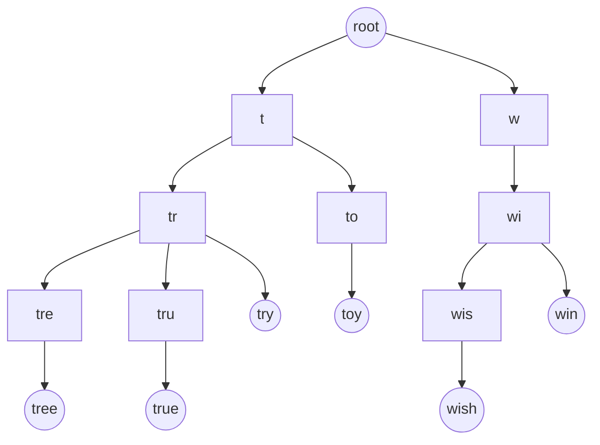
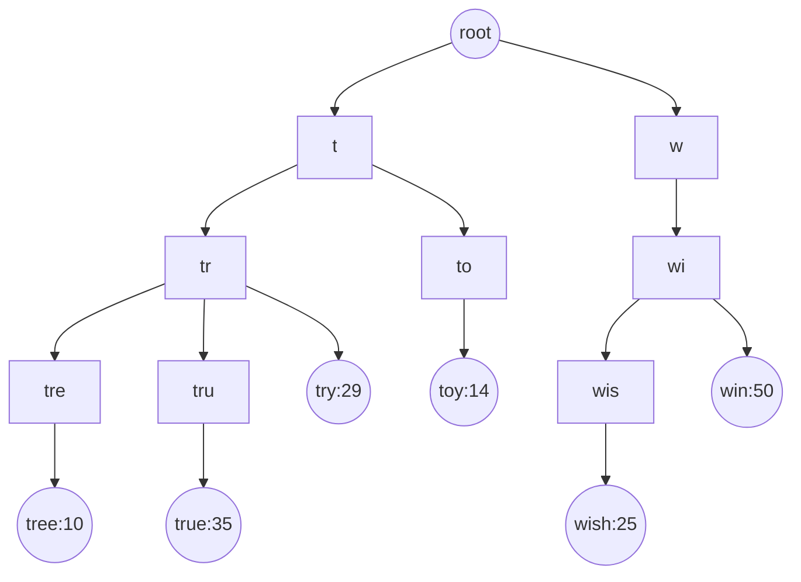
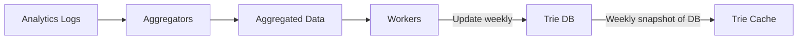
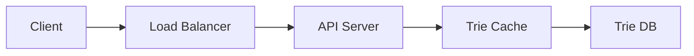

# DESIGN A SEARCH AUTOCOMPLETE SYSTEM

as you type in the search box, one or more matches for the search term are presented to you.

design a search autocomplete system, also called “design top k” or “design top k most searched queries”.

## Requirements and Design Scope

- matching supported at start of query
- fast response time(within 100 milliseconds)
- 5 suggestion {sorted by popularity}
- no spell check or autocorrect
- lowercase alphabetic characters
- 10 million DAU

## Back of Envelope Estimation

- 10 million Daily Active Users
- avg 10 search per day per user
- 20 byte of data
  - ASCII character encoding. 1 character = 1 byte
  - 4 words query, 1 word=5 chars
  - 20 byte per query

  so as you type dinner, 6 request must be sent
  `search?q=d`
  `search?q=di`
  `search?q=din`

- ~24,000 query per second (QPS) = 10,000,000 users _ 10 queries / day _ 20 characters / 24 hours / 3600 seconds.
- Peak QPS = QPS \* 2 = ~48,000
- let 20% query are new; 10 million _ 10 queries / day _ 20 byte per query \* 20% = 0.4 GB; 0.4 GB data added to storage

# High Level Design

- Data gathering service: It gathers user input queries and aggregates them in real-time. Real-time processing is not practical for large data sets; however, it is a good starting point. We will explore a more realistic solution in deep dive.
- Query service: Given a search query or prefix, return 5 most frequently searched terms.

## Data Gathering Service

frequency table that stores the query string and its frequency
in begginning table is empty. Later, users enter queries “twitch”,"twitter",“twitter,” and “twillo” sequentially.

| Query | Frequency |
| ----- | --------- |
|       |           |

---

**query: twitch**

| Query  | Frequency |
| ------ | --------- |
| twitch | 1         |

---

**query: twitter**

| Query   | Frequency |
| ------- | --------- |
| twitch  | 1         |
| twitter | 1         |

---

**query: twitter**

| Query   | Frequency |
| ------- | --------- |
| twitch  | 1         |
| twitter | 2         |

---

**query: twillo**

| Query   | Frequency |
| ------- | --------- |
| twitch  | 1         |
| twitter | 2         |
| twillo  | 1         |

## Query Service

frequency table
• Query: it stores the query string.
• Frequency: it represents the number of times a query has been searched.

| Query        | Frequency |
| ------------ | --------- |
| Twitter      | 35        |
| twitch       | 29        |
| twilight     | 25        |
| twin peak    | 21        |
| twitch prime | 18        |

as user types `tw` in search box, it fires up top 5 searched queries
|tw|
|-|
|twitter|
|twitch|
|twilight|

this actually executes the sql query

```sql
SELECT * FROM frequency_table
WHERE query Like `prefix%`
ORDER BY frequency DESC
LIMIT 5
```

acceptable for small dataset, bottle-neck in case of large dataset

# Design Deep Dive

• Trie data structure
• Data gathering service
• Query service
• Scale the storage
• Trie operations

## Trie Data structure

fetching the top 5 search queries from a relational database is inefficient.
The data structure trie (prefix tree) is used to overcome the problem.

it is a tree-like data structure that stores string compactly.

- A trie is a tree-like data structure.
- The root represents an empty string.
- Each node stores a character and has 26 children, one for each possible character. To save space, we do not draw empty links.
- Each tree node represents a single word or a prefix string.



frequency table:
|Query | Frequency |
|------|-----------|
|tree | 10|
|try|29|
|true|35|
|toy|14|
|wish|25|
|win|50|

hence update the data structure



## Algorithm

• p: length of a prefix
• n: total number of nodes in a trie
• c: number of children of a given node
Steps to get top k most searched queries are :

teps to get top k most searched queries are listed below:

1. Find the prefix. Time complexity: O(p).
2. Traverse the subtree from the prefix node to get all valid children. A child is valid if it can form a valid query string. Time complexity: O(c)
3. Sort the children and get top k. Time complexity: O(clogc)

• Step 1: Find the prefix node “tr”.
• Step 2: Traverse the subtree to get all valid children. In this case, nodes [tree: 10], [true:35], [try: 29] are valid.
• Step 3: Sort the children and get top 2. [true: 35] and [try: 29] are the top 2 queries with prefix “tr”.

sum of time spent on each step: `O(p)+O(c)+O(clogc)`

but the algo is slwo, put optimisations:

1. Limit the max length of a prefix
   say 50, so complexity moves from O(n) to O(1)
2. Cache top search queries at each node
   store top k most frequently used queries at each node.
   but need to store top 5 at each node, so space increase and time decrease
   For example, the node with prefix “be” stores the following: `[best: 35, bet: 29, bee: 20, be: 15,beer: 10]`.

new complexity:

1. Find the prefix node. Time complexity: O(1)
2. Return top k. Since top k queries are cached, the time complexity for this step is O(1).

# Data Gathering Service

2 problems:

- what if billion request, practically can't update, will become slow
- top suggestion may not change, so no point in updating trie



## query are stored against time in a log file

| query | Time                |
| ----- | ------------------- |
| tree  | 2019-10-01 22:01:01 |
| try   | 2019-10-01 22:01:05 |

logs files just dump data, not in right format
use **Aggregators** to easilt process data.

**Aggregated Data**

| query | time       | frequency |
| ----- | ---------- | --------- |
| tree  | 2019-10-01 | 12000     |
| tree  | 2019-10-08 | 15000     |

**Workers** server performing asynchronous jobs at regular intervals. build the trie data structure and store it in Trie DB.
**Trie Cache** distributed cache system that keeps trie in memory
**Trie DB** persistent storage, 2 options:

1. Document store: Since a new trie is built weekly, we can periodically take a snapshot of it, serialize it, and store the serialized data in the database. Document stores like MongoDB [4] are good fits for serialized data.
2. Key-value store: A trie can be represented in a hash table form [4] by applying the following logic:

- Every prefix in the trie is mapped to a key in a hash table.
- Data on each trie node is mapped to a value in a hash table.

# Query Service

calls the database directly to fetch the top 5 results.



1. A search query is sent to the load balancer.
2. The load balancer routes the request to API servers.
3. API servers get trie data from Trie Cache and construct autocomplete suggestions for the client.
4. In case the data is not in Trie Cache, we replenish data back to the cache. This way, all subsequent requests for the same prefix are returned from the cache. A cache miss can happen when a cache server is out of memory or offline.

**`some optimisations`:**

- AJAX Result: send AJAX requests to fetch autocomplete results; doesn't refresh the web-page
- Browser Caching: cache results, cause result may not change for long time
- Data sampling: can't log every search query, sample data -> 1 out of N request

## Trie Operations

- `Create`: created by workers using aggregated data
- `Update`: weekly new replace old, or update individual node; node is expensive cause it affects all upto root node
- `Delete`: put a filter to remove unwanted suggestion like hateful, violent, sexually explicit etc.

# Scale the storage

a naive way to shard is based on the first character. Here are some examples.
• If we need two servers for storage, we can store queries starting with ‘a’ to ‘m’ on the first server, and ‘n’ to ‘z’ on the second server.
• If we need three servers, we can split queries into ‘a’ to ‘i’,‘j’ to ‘r’ and ‘s’ to ‘z’.

can do upto 26 server for 26 language
can do more like 'a' can be breaked into ‘aa-ag’,‘ah-an’,‘ao-au’, and ‘av-az’

problem: what if words are uneven, 'c' has more than 'x'.
analyse historical data distribution pattern and apply smarter sharding logic

ex: there are a similar number of historical queries for ‘s’ and for ‘u’,‘v’,‘w’,‘x’,‘y’ and ‘z’ combined,
we can maintain two shards: one for ‘s’ and one for ‘u’ to ‘z’.

# Extra Bits

- multi-language: store Unicode characters in trie nodes
- top search queries in one country are different from others : store tries in CDN
- support the trending (real-time) search queries: reduce load by sharding,
- stream data with help of Apache Hadoop MapReduce, Apache Spark Streaming etc.

# Ref Material:

[1] [The Life of a Typeahead Query](https://www.facebook.com/notes/facebook-engineering/the-life-of-a-typeahead-query/389105248919/)
[2] [How We Built Prefixy: A Scalable Prefix Search Service for Powering Autocomplete](https://medium.com/@prefixyteam/how-we-built-prefixy-a-scalable-prefix-search-service-for-powering-autocomplete-c20f98e2eff1)
[3] [Prefix Hash Tree An Indexing Data Structure over Distributed Hash Tables](https://people.eecs.berkeley.edu/~sylvia/papers/pht.pdf)
[4] [MongoDB wikipedia](https://en.wikipedia.org/wiki/MongoDB)
[5] [Unicode frequently asked questions](https://www.unicode.org/faq/basic_q.html)
[6] [Apache hadoop](https://hadoop.apache.org/)
[7] [Spark streaming](https://spark.apache.org/streaming/)
[8] [Apache storm](https://storm.apache.org/)
[9] [Apache kafka](https://kafka.apache.org/documentation/)

# [implementation](github.com:NalinDalal/search-autocomplete-bun)
