# YouTube

## features:

- upload and view video
- apps, website, tvs etc
- 5 million users
- 30 min daily
- all video resolutions and formats
- encrypted
- for now max upload size is 1gb

## Back of Envelope Estimation

- 5 million daily actice users
- 1 user 5 video per ay
- 10% of user upload 1 video per day
- avg size=300mb
- total daily space: 5 million*10%*300mb=150tb
- CDN{you charge by data transferred out}
  say 100% served , avg cost=$0.02/gb
  5 million*5 video*0.3GB\*$0.02= $150,000/day

# High Level Design

why not build own cdn and blob storage, cause:

- mentioning is important, explaining it will just take up time
- complex and costly

high level design, it has 3 components:


Client can be mobie phones, computers, smart TV etc
Video are in CDN, upon playing video, they are streamed from CDN

## API Servers

Everything else except video streaming goes through API servers.
feed recommendation, generating video upload URL, updating metadata database and cache, user signup, etc.

- Video uploading flow
- Video streaming flow

**Video Uploading**

```mermai
flowchart TB
    subgraph Users
        U[User Devices<br>(TV, Laptop, Mobile)]
    end

    OS[Original Storage]
    LB[Load Balancer]
    API[API Servers]
    MC[Metadata Cache]
    DB[Metadata DB]
    TS[Transcoding Servers]
    TStore[Transcoded Storage]
    CDN[CDN]
    CQ[Completion Queue]
    CH[Completion Handler]

    %% Connections
    U --> LB --> API
    API --> MC
    API --> DB
    API --> OS
    OS --> TS
    TS --> TStore
    TStore --> CDN
    TS -->|transcoding complete| CQ --> CH
    CH --> DB
    CH --> MC
```

**Upload actual Video**


**Update the Metadata**


**Video are streamed via some protocls like `MPEG-DASH` , `Apple HLS`, `Microsoft Smooth Streaming`,`Adobe HTTP Dynamic Streaming (HDS)`.**

# Deep Dive

2 parts: `Video Uploading` and `Video Streaming`; we will basically optimise both

video recorded in some format, to play on other device the bitrates must match the device
Bitrate is the rate at which bits are processed over time.
A higher bitrate generally means higher video quality.
High bitrate streams need more processing power and fast internet speed.

reasons for video transcoding:

- raw hd at 60fps might take up gbs of storage
- devices and browsers are always not compatible
- video quality must be based as per bandwidth, and network strength

encoding formats have basically 2 main things:

- Container: This is like a basket that contains the video file, audio, and metadata. You can tell the container format by the file extension, such as .avi, .mov, or .mp4.
- Codecs: These are compression and decompression algorithms aim to reduce the video size while preserving the video quality. The most used video codecs are H.264, VP9, and HEVC.

## Directed Acyclic Graph(DAG) Model

computationally expensive and time-consuming.
different people have different requirement
some content creators require watermarks on top of their videos,
some provide thumbnail images themselves, and
some upload high definition videos, whereas others do not.

important to add some level of abstraction and let client programmers define what tasks to execute.

sample `DAG from facebook`


## Video Transcoding Architecture


### Preprocessor

4 responsibilites:

1. Video splitting. Video stream is split or further split into smaller Group of Pictures (GOP)
   alignment. GOP is a group/chunk of frames arranged in a specific order. Each chunk is an
   independently playable unit, usually a few seconds in length.
2. Some old mobile devices or browsers might not support video splitting. Preprocessor split
   videos by GOP alignment for old clients.
3. DAG generation. The processor generates DAG based on configuration files client
   programmers write.

```mermaid
flowchart LR
    D[download] -> T[Transcode]
```

4. Cache data. stores GOPs and metadata in temporary storage

### DAG Scheduler

```mermaid
flowchart LR
graph "DAG Scheduler"
        OV[Original video]

        subgraph "Stage 1"
            V1[Video]
            A1[Audio]
            M1[Metadata]
        end

        subgraph "Stage 2"
            VE[Video encoding]
            T[Thumbnail]
            AE[Audio encoding]
        end

        OV --> V1
        OV --> A1
        OV --> M1

        V1 --> VE
        V1 --> T
        A1 --> AE
    end
```

### Resource Manager

```mermaid
graph "Resource Manager System"
    subgraph "Resource Manager"
            TQ[Task queue<br/>📧📧📧]
            WQ[Worker queue<br/>📧📧📧]
            RQ[Running queue<br/>📧📧📧]
            TS[Task scheduler<br/>🖥️🖥️🖥️]
        end

        subgraph "Task Workers"
            W1[Watermark<br/>🖥️🖥️🖥️]
            W2[Encoder<br/>🖥️🖥️🖥️]
            W3[Thumbnail<br/>🖥️🖥️🖥️]
            W4[Merger<br/>🖥️🖥️🖥️]
            W5[...]
        end

        TQ -.->|get the highest priority task| TS
        WQ -.->|get the optimal worker| TS
        TS -.->|put task/worker info in queue| RQ
        TS -.->|run task| W1
        TS -.->|run task| W2
        TS -.->|run task| W3
        TS -.->|run task| W4
    end
```

• The task scheduler gets the highest priority task from the task queue.
• The task scheduler gets the optimal task worker to run the task from the worker queue.
• The task scheduler instructs the chosen task worker to run the task.
• The task scheduler binds the task/worker info and puts it in the running queue.
• The task scheduler removes the job from the running queue once the job is done.

### Task Worker

### Temporary Storage

# System Optimizations

**Speed Optimization**: parallelize video uploading
Uploading a video as a whole unit is inefficient. We can split a video into smaller chunks by GOP alignment.

```mermaid
graph LR
    OS[🗄️<br/>Original storage]
    DM[📥<br/>Download<br/>module]
    EM[🔄<br/>Encoding<br/>module]
    UM[📤<br/>Upload<br/>module]
    ES[🗄️<br/>Encoded<br/>storage]
    CDN[☁️<br/>CDN]

    OS -->|download original<br/>segmented videos| DM
    DM -->|original<br/>segmented videos| EM
    EM -->|encoded videos| UM
    UM -->|upload<br/>encoded videos| ES
    ES -->|upload<br/>encoded videos| CDN
```



**Speed Optimization**: upload center and cdn can be scheduled to fast data transfer

**Speed Optimization**: parallelism everywhere
build a loosely coupled system and enable high parallelism.

```mermaid
graph TB
    OS[🗄️<br/>Original storage]

    MQ1[📧📧📧<br/>Message queue]
    DM[📥<br/>Download<br/>module]

    MQ2[📧📧📧<br/>Message queue]
    EM[🔄<br/>Encoding<br/>module]

    MQ3[📧📧📧<br/>Message queue]
    UM[📤<br/>Upload<br/>module]

    MQ4[📧📧📧<br/>Message queue]
    ES[🗄️<br/>Encoded<br/>storage]
    CDN[☁️<br/>CDN]

    OS --> MQ1
    MQ1 --> DM
    DM --> MQ2
    MQ2 --> EM
    EM --> MQ3
    MQ3 --> UM
    UM --> MQ4
    MQ4 --> ES
    ES -->|upload<br/>encoded videos| CDN
```



introduce message queues to make system more loosely coupled

```mermaid
graph TB
    subgraph "User Devices"
        TV[📺 TV]
        LAPTOP[💻 Laptop]
        MOBILE[📱 Mobile]
    end

    API[🖥️🖥️🖥️<br/>API servers]
    OS[🗄️<br/>Original storage]

    TV -->|1. POST /upload| API
    LAPTOP -->|1. POST /upload| API
    MOBILE -->|1. POST /upload| API

    API -->|2. &lt;pre-signed URL&gt;| TV
    API -->|2. &lt;pre-signed URL&gt;| LAPTOP
    API -->|2. &lt;pre-signed URL&gt;| MOBILE

    TV -->|3. upload video| OS
    LAPTOP -->|3. upload video| OS
    MOBILE -->|3. upload video| OS
```



**Safety Optimization**: pre-signed upload URL
To ensure only authorized users
upload videos to the right location, we introduce pre-signed URLs

1. The client makes a HTTP request to API servers to fetch the pre-signed URL, which gives the access permission to the object identified in the URL. The term pre-signed URL is used by uploading files to Amazon S3. Other cloud service providers might use a different name. For instance, Microsoft Azure blob storage supports the same feature, but call it “Shared Access Signature” [10].
2. API servers respond with a pre-signed URL.
3. Once the client receives the response, it uploads the video using the pre-signed URL.

**Safety Optimization**: protect your videos

- put Digital Rights Management System
- AES Encryption: encrypt the video and configure an authorization policy.decryptes upon playback from authorised users
- Watermarking

**Cost Optimization**: put popular videos on CDN based on region, so makes it easy to cache

236-240

# Error Handling

- Recoverable error. For recoverable errors such as video segment fails to transcode, the general idea is to retry the operation a few times. If the task continues to fail and the system believes it is not recoverable, it returns a proper error code to the client.
  - Upload Error
  - Transcoding Error
  - Preprocessor Error
  - DAG Scheduler Error
  - Task WOrker DOwn
  - API Server down
  - Metadata cache server down
  - DB Down{use master-slave approach}

- Non-recoverable error. For non-recoverable errors such as malformed video format, the system stops the running tasks associated with the video and returns the proper error code to the client.
  - Split Video Error
  - Resource Mnaager Queue Down: use a replica

229-241

---

# Additional Points:

- Scale the API tier: Because API servers are stateless, it is easy to scale API tier horizontally.
- Scale the database: You can talk about database replication and sharding.
- Live streaming: It refers to the process of how a video is recorded and broadcasted in real time. Although our system is not designed specifically for live streaming, live streaming and non-live streaming have some similarities: both require uploading, encoding, and streaming. The notable differences are:
  - Live streaming has a higher latency requirement, so it might need a different streaming protocol.
  - Live streaming has a lower requirement for parallelism because small chunks of data are already processed in real-time.
  - Live streaming requires different sets of error handling. Any error handling that takes too much time is not acceptable.
- Video takedowns: Videos that violate copyrights, pornography, or other illegal acts shall be removed. Some can be discovered by the system during the upload process, while others might be discovered through user flagging.

# Reference materials

1. [YouTube by the numbers](https://www.omnicoreagency.com/youtube-statistics/)
2. [2019 YouTube Demographics](https://blog.hubspot.com/marketing/youtube-demographics)
3. [Cloudfront Pricing](https://aws.amazon.com/cloudfront/pricing/)
4. [Netflix on AWS](https://aws.amazon.com/solutions/case-studies/netflix/)
5. [Akamai homepage](https://www.akamai.com/)
6. [Binary large object](https://en.wikipedia.org/wiki/Binary_large_object)
7. [Here’s What You Need to Know About Streaming Protocols:](https://www.dacast.com/blog/streaming-protocols/)
8. [SVE: Distributed Video Processing at Facebook Scale:](https://www.cs.princeton.edu/~wlloyd/papers/sve-sosp17.pdf)
9. [Weibo video processing architecture (in Chinese):](https://www.upyun.com/opentalk/399.html)
10. [Delegate access with a shared access signature](https://docs.microsoft.com/en-us/rest/api/storageservices/delegate-access-with-shared-access-signature)
11. [YouTube scalability talk by early YouTube employee](https://www.youtube.com/watch?v=w5WVu624fY8)
12. [Understanding the characteristics of internet short video sharing: A youtube-based measurement study.](https://arxiv.org/pdf/0707.3670.pdf)
13. [Content Popularity for Open Connect](https://netflixtechblog.com/content-popularity-for-open-connect-b86d56f613b)
