# YouTube

## Features:

- upload and view video
- apps, website, tvs etc
- 5 million users
- 30 min daily
- all video resolutions and formats
- encrypted
- for now max upload size is 1gb

## Back of Envelope Estimation

 - 5 million daily active users
 - Each user watches 5 videos per day (on average)
 - 10% of users upload 1 video per day
 - Average upload size = 300 MB
 - Total daily uploaded data: $5\times10^{6}\times0.10\times300\ \mathrm{MB}=150\ \mathrm{TB}$
 - CDN (charged by data transferred out): assume 100% served, avg cost = $0.02/\mathrm{GB}$
 - Daily CDN data served (views): $5\times10^{6}\times5\times0.3\ \mathrm{GB}=7{,}500{,}000\ \mathrm{GB}$
 - Daily CDN cost: $7{,}500{,}000\ \mathrm{GB}\times\$0.02/\mathrm{GB}=\$150{,}000$


# High Level Design

why not build own cdn and blob storage, cause:

- mentioning is important, explaining it will just take up time
- complex and costly

high level design, it has 3 components:

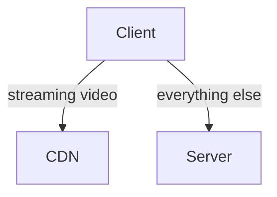

Client can be mobie phones, computers, smart TV etc
Video are in CDN, upon playing video, they are streamed from CDN

## API Servers

Everything else except video streaming goes through API servers.
feed recommendation, generating video upload URL, updating metadata database and cache, user signup, etc.

- Video uploading flow
- Video streaming flow

**Video Uploading**

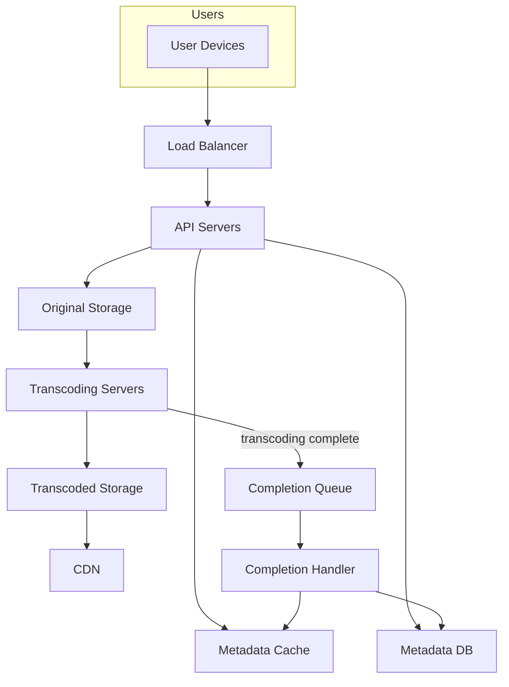

**Upload actual Video**

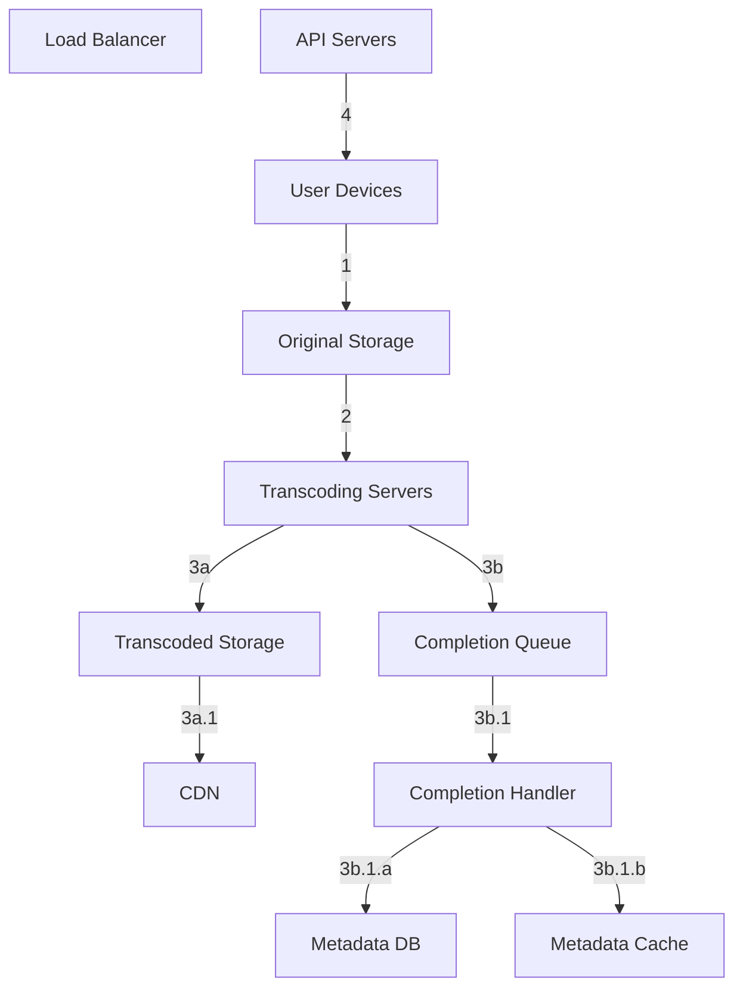

**Update the Metadata**

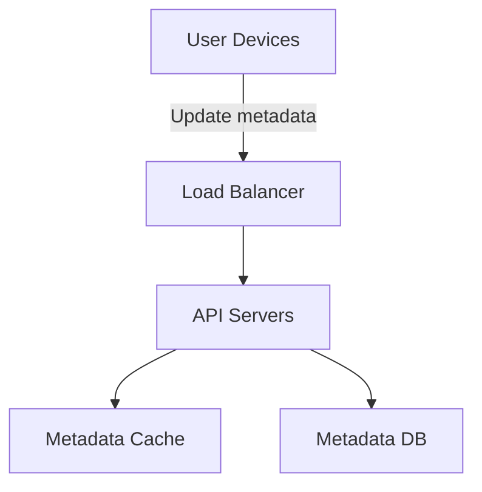

**Video are streamed via some protocls like `MPEG-DASH` , `Apple HLS`, `Microsoft Smooth Streaming`,`Adobe HTTP Dynamic Streaming (HDS)`.**

# Deep Dive

2 parts: `Video Uploading` and `Video Streaming`; we will basically optimise both

video recorded in some format, to play on other device the bitrates must match the device
Bitrate is the rate at which bits are processed over time.
A higher bitrate generally means higher video quality.
High bitrate streams need more processing power and fast internet speed.

reasons for video transcoding:

- raw hd at 60fps might take up gbs of storage
- devices and browsers are always not compatible
- video quality must be based as per bandwidth, and network strength

encoding formats have basically 2 main things:

- Container: This is like a basket that contains the video file, audio, and metadata. You can tell the container format by the file extension, such as .avi, .mov, or .mp4.
- Codecs: These are compression and decompression algorithms aim to reduce the video size while preserving the video quality. The most used video codecs are H.264, VP9, and HEVC.

## Directed Acyclic Graph(DAG) Model

computationally expensive and time-consuming.
different people have different requirement
some content creators require watermarks on top of their videos,
some provide thumbnail images themselves, and
some upload high definition videos, whereas others do not.

important to add some level of abstraction and let client programmers define what tasks to execute.

sample `DAG from facebook`

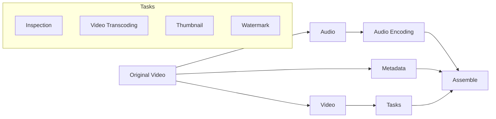

## Video Transcoding Architecture

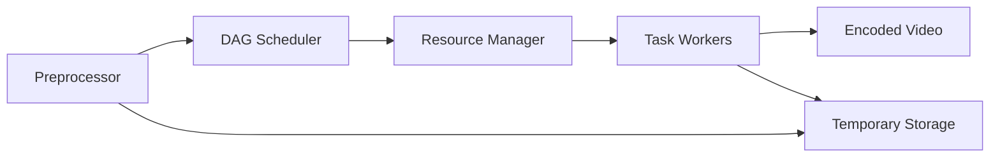

### Preprocessor

4 responsibilites:

1. Video splitting. Video stream is split or further split into smaller Group of Pictures (GOP)
   alignment. GOP is a group/chunk of frames arranged in a specific order. Each chunk is an
   independently playable unit, usually a few seconds in length.
2. Some old mobile devices or browsers might not support video splitting. Preprocessor split
   videos by GOP alignment for old clients.
3. DAG generation. The processor generates DAG based on configuration files client
   programmers write.

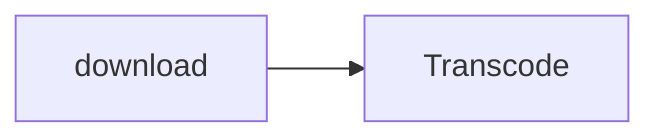

4. Cache data. stores GOPs and metadata in temporary storage

### DAG Scheduler

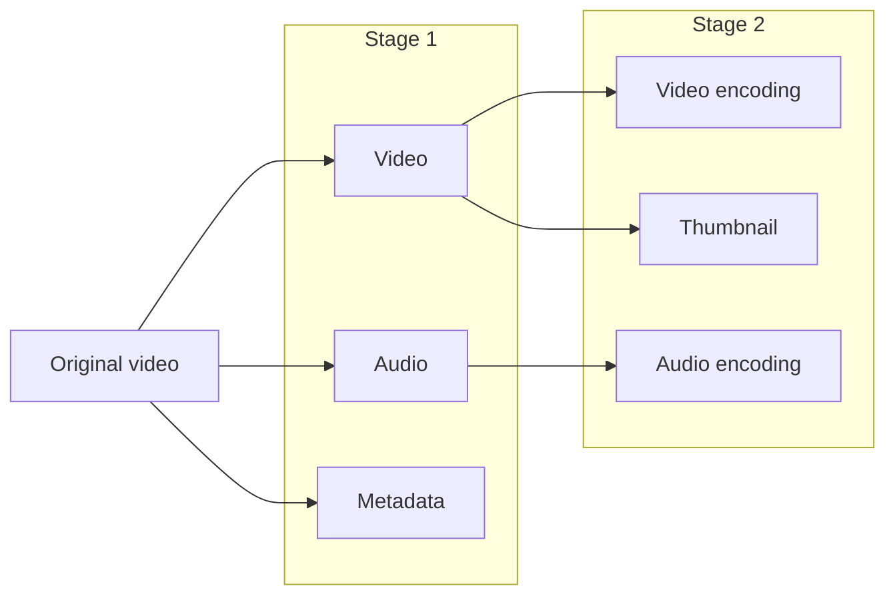

### Resource Manager

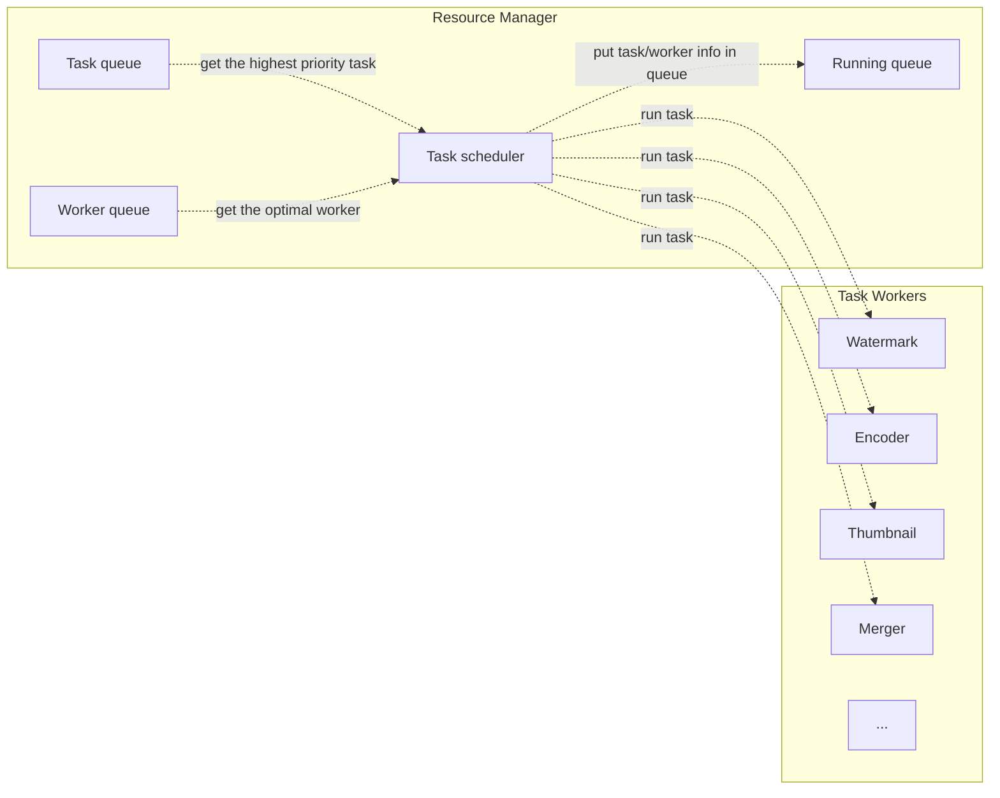

• The task scheduler gets the highest priority task from the task queue.
• The task scheduler gets the optimal task worker to run the task from the worker queue.
• The task scheduler instructs the chosen task worker to run the task.
• The task scheduler binds the task/worker info and puts it in the running queue.
• The task scheduler removes the job from the running queue once the job is done.

### Task Worker

### Temporary Storage

# System Optimizations

**Speed Optimization**: parallelize video uploading
Uploading a video as a whole unit is inefficient. We can split a video into smaller chunks by GOP alignment.

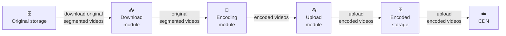

**Speed Optimization**: upload center and cdn can be scheduled to fast data transfer

**Speed Optimization**: parallelism everywhere
build a loosely coupled system and enable high parallelism.

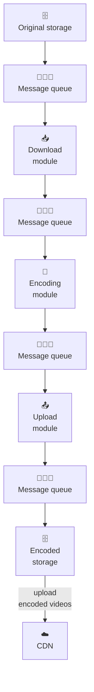

introduce message queues to make system more loosely coupled

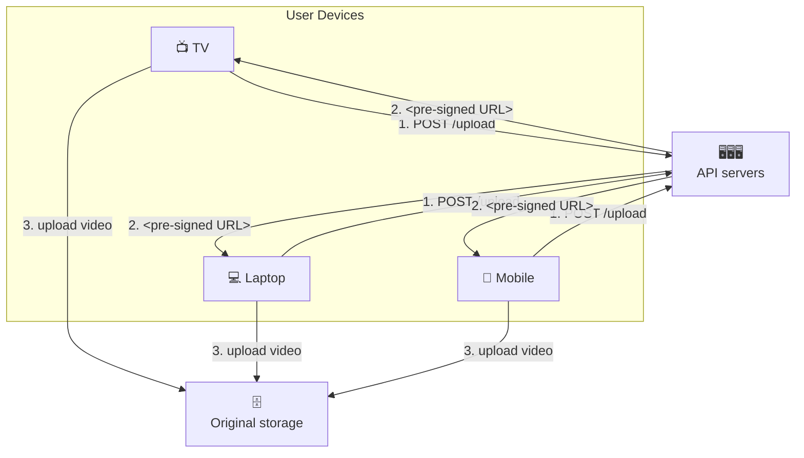

**Safety Optimization**: pre-signed upload URL
To ensure only authorized users
upload videos to the right location, we introduce pre-signed URLs

1. The client makes a HTTP request to API servers to fetch the pre-signed URL, which gives the access permission to the object identified in the URL. The term pre-signed URL is used by uploading files to Amazon S3. Other cloud service providers might use a different name. For instance, Microsoft Azure blob storage supports the same feature, but call it “Shared Access Signature” [10].
2. API servers respond with a pre-signed URL.
3. Once the client receives the response, it uploads the video using the pre-signed URL.

**Safety Optimization**: protect your videos

- put Digital Rights Management System
- AES Encryption: encrypt the video and configure an authorization policy.decryptes upon playback from authorised users
- Watermarking

**Cost Optimization**: put popular videos on CDN based on region, so makes it easy to cache

# Error Handling

- Recoverable error. For recoverable errors such as video segment fails to transcode, the general idea is to retry the operation a few times. If the task continues to fail and the system believes it is not recoverable, it returns a proper error code to the client.
  - Upload Error
  - Transcoding Error
  - Preprocessor Error
  - DAG Scheduler Error
  - Task WOrker DOwn
  - API Server down
  - Metadata cache server down
  - DB Down{use master-slave approach}

- Non-recoverable error. For non-recoverable errors such as malformed video format, the system stops the running tasks associated with the video and returns the proper error code to the client.
  - Split Video Error
  - Resource Mnaager Queue Down: use a replica

---

# Additional Points:

- Scale the API tier: Because API servers are stateless, it is easy to scale API tier horizontally.
- Scale the database: You can talk about database replication and sharding.
- Live streaming: It refers to the process of how a video is recorded and broadcasted in real time. Although our system is not designed specifically for live streaming, live streaming and non-live streaming have some similarities: both require uploading, encoding, and streaming. The notable differences are:
  - Live streaming has a higher latency requirement, so it might need a different streaming protocol.
  - Live streaming has a lower requirement for parallelism because small chunks of data are already processed in real-time.
  - Live streaming requires different sets of error handling. Any error handling that takes too much time is not acceptable.
- Video takedowns: Videos that violate copyrights, pornography, or other illegal acts shall be removed. Some can be discovered by the system during the upload process, while others might be discovered through user flagging.

# Reference materials

7. Here’s What You Need to Know About Streaming Protocols
    ABR (Adaptive Bitrate Streaming): A technique that adjusts video quality in real time based on a viewer’s internet speed, minimizing buffering and enhancing playback.
    CDN (Content Delivery Network): A distributed network of servers that deliver media content to users based on their geographic location to reduce latency and improve reliability.
    CMAF (Common Media Application Format): A media packaging format optimized for low-latency delivery, designed to work across HLS and MPEG-DASH using fragmented MP4 files.
    DRM (Digital Rights Management): A technology used to control how digital content is accessed, copied, or shared, often used in media protocols to prevent piracy.
    HESP (High-Efficiency Streaming Protocol): A low-latency streaming protocol designed for large-scale live events, offering sub-second latency and fast start times.
    HLS (HTTP Live Streaming): A widely used HTTP streaming protocol developed by Apple that breaks video into small, HTTP-delivered segments for reliable playback.
    HTTP3 / QUIC: A modern internet transport protocol (QUIC) built on UDP and used in HTTP3 for faster, more secure streaming over web protocols like WHIP/WHEP.
    Ingest: The process of bringing a video stream into a streaming platform from an encoder or camera. Common ingest protocols include RTMP and SRT.
    MPEG-DASH (Dynamic Adaptive Streaming over HTTP): An open-standard, codec-agnostic streaming format that supports ABR and is commonly used for on-demand and live streaming.
    RTMP (Real-Time Messaging Protocol): An older streaming protocol used for ingesting streams into video platforms; now often paired with HLS for delivery.
    RTSP (Real-Time Streaming Protocol): A network protocol used primarily in IP cameras and surveillance systems for low-latency, real-time video streaming.
    RTP (Real-Time Transport Protocol): A foundational protocol for delivering audio and video over IP networks, commonly used with RTSP and SIP.
    SRT (Secure Reliable Transport): An open-source live streaming protocol that delivers secure, low-latency streams over unreliable networks, popular for contribution workflows.
    Segment Duration: The length of each video segment or chunk in a streaming protocol. Shorter segments generally mean lower latency.
    Transcoding: The process of converting a video from one format, resolution, or bitrate to another—essential for ABR streaming and cross-device support.
    TS (Transport Stream): A container format used to deliver audio, video, and metadata over streaming systems, commonly seen in HLS and MPEG-DASH workflows.
    WebRTC (Web Real-Time Communication): A peer-to-peer protocol suite enabling low-latency, browser-based video/audio streaming, ideal for real-time communication like video calls.
    WHIP/WHEP: WebRTC-HTTP ingestion/protocols based on QUIC that streamline WebRTC workflows for streaming protocols in cloud computing environments.


8. SVE: Distributed Video Processing at Facebook Scale:
1st it was monolithic architecture

then broken down to DAG

```python
pipeline = create_pipeline(video)
video_track = pipeline.create_video_track()
if video.should_encode_hd
    hd_video = video_track.add(hd_encoding)
                .add(count_segments)

sd_video = video_track.add(
    {sd_encoding, thumbnail_generation},
).add(count_segments)

audio_track = pipeline.create_audio_track()
sd_audio = audio_track.add(sd_encoding)
meta_track = pipeline.create_metadata_track()
            .add(analysis)

pipeline.sync_point(
    {hd_video, sd_video, sd_audio},
    combine_tracks,
).add(notify, latency_sensitive)
.add(video_classification)
```


9. Weibo video processing architecture:
introduced DAG system
old: schedulers(schedule and dispatch task to actuator), actuators;
    not scalable
    processing complexity of each task is uneven, but we are still issuing a single task
    lack of task monitoring.
    
new: schedule layer, sense the business logic and understand how many branches and nodes a task has
issued by a single node

DAG: Starting from any node, you cannot go back to the origin through several edges

transcoding logic: 
- download the video, 
- download the watermark, and then 
- pre-process the video. After that, 
- do various business requirements, such as taking screenshots, drawing frames, and then 
- transferring out many videos with different bit rates and playback resolutions.


10. Delegate access with a shared access signature
share resources for a particular period of time; 3 types of shared access signature:
account SAS: delegates access to resources in one or more of the storage services
service SAS: delegates access to a resource in just one of the storage services: Azure Blob Storage, Azure Queue Storage, Azure Table Storage, or Azure Files.
user delegation SAS: supported for Blob Storage only, and you can use it to grant access to containers and blobs


13. Content Popularity for Open Connect
    simply cache the video data based on analytics or popularity(title level, file level)
---

[Rust Implementation](https://github.com/NalinDalal/video-transcoder-rs.git)
