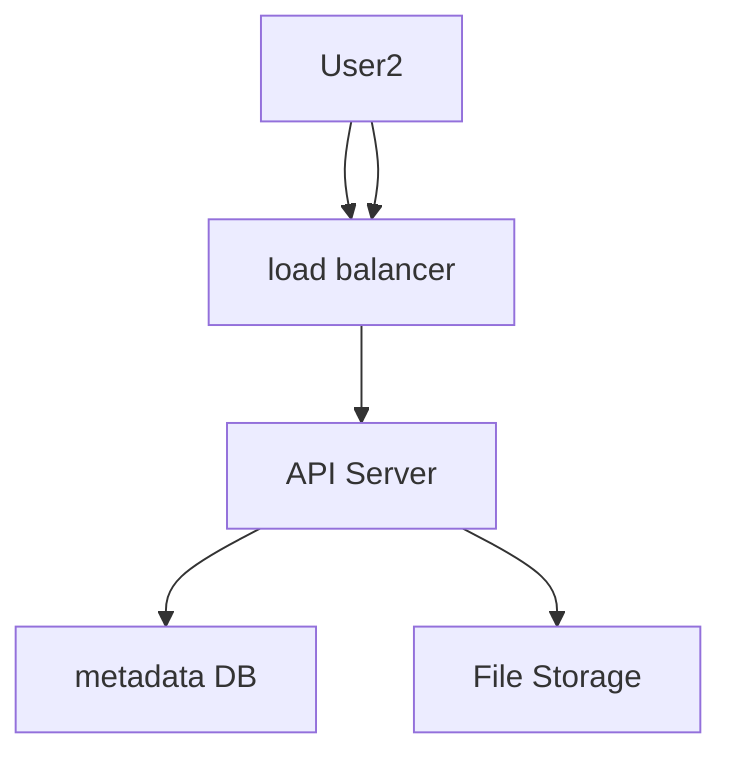
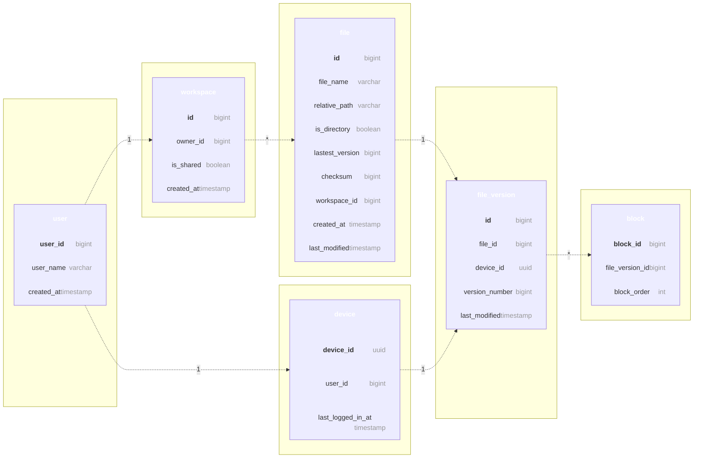

# DESIGN GOOGLE DRIVE

design a cloud storage service similar to google drive

# Design Scope

- features: Upload and download files, file sync, and notifications.
- web app and mobile app
- any file type supported
- storage must be encrypted
- file size<=10gb
- 10M Daily Active Users

## Back of Envelop Estimation

50 million signed up user, 10 million daily active users
10 gb free space
2 files/day=1 mb storage
1:1 read to write
total space= 50 million _ 10 GB = 500 Petabyte
QPS for upload API: 10 million _ 2 uploads / 24 hours / 3600 seconds = ~ 240
Peak QPS = QPS \* 2 = 480

# High Level Design

build everything on same server then gradually scale for users
Let us start with a single server setup as listed below:

- A web server to upload and download files.
- A database to keep track of metadata like user data, login info, files info, etc.
- A storage system to store files. We allocate 1TB of storage space to store files.

# API

mainly 3 apis: upload a file, download a file, and get file revisions.

**1. Upload a File**
2 types: simple and resumable
resumable is when you stop/pause upload when there is a issue/disturbance/disruption in network

ex: `https://api.example.com/files/upload?uploadType=resumable`
Params:

- uploadType=resumable
- data: Local file to be uploaded.

steps:
• Send the initial request to retrieve the resumable URL.
• Upload the data and monitor upload state.
• If upload is disturbed, resume the upload.

**2. Download File**
Example API: `https://api.example.com/files/download`
Params:
• path: download file path.
Example params:

```json
{
  "path": "/recipes/soup/best_soup.txt"
}
```

**3. Get file revisions**
Example API: `https://api.example.com/files/list_revisions`
Params:
• path: The path to the file you want to get the revision history.
• limit: The maximum number of revisions to return.
Example params:

```json
{
  "path": "/recipes/soup/best_soup.txt",
  "limit": 20
}
```

# Single to Distributed Server

say you are reaching the limit, can't upload anyhting more, so you decide to shard the data to store on multiple servers.
ex: user%4 and based on remainder you allocate server

still there's a chance of potential data losses in case of storage server outage.

say you store in s3, problem solved, now to improve more:

- load balancers to distribute traffic
- web servers autoscaling
- metadata database: move db out of server
- file storage: amazon s3



# Sync Conflict

2 user modify same file/folder at same time, a conflict happens
resolution: the first version that gets processed wins, and the version that gets processed later receives a conflict.

user1 and user2 both work on same file,
user1 gets it processed and synced, so user2 receives conflict

to resolve conflict for user2:
2 option: - merge both - override one version with other

## High Level Design

The cloud storage system follows a distributed microservices architecture designed for scalability, reliability, and efficient file synchronization across multiple devices. The system is composed of several key components that work together to provide seamless file storage and synchronization capabilities.

```mermaid
graph TD
    User[👤 User<br/>💻📱 Devices]

    subgraph BlockLayer["🔗 Block Processing Layer"]
        BS[🟢 Block Servers<br/>Split • Compress • Encrypt]
    end

    LB[⚖️ Load Balancer]

    subgraph APILayer["🔧 API Processing Layer"]
        API[🟢 API Servers<br/>Request Processing]
    end

    subgraph StorageLayer["💾 Storage Systems"]
        CS[☁️ Cloud Storage<br/>Primary Data]
        COLD[❄️ Cold Storage<br/>Archive Data]
    end

    subgraph CacheLayer["⚡ Cache & Metadata"]
        MC[🔵 Metadata Cache<br/>Fast Lookups]
        MDB[🗄️ Metadata DB<br/>Persistent Storage]
    end

    subgraph NotificationLayer["📡 Notification System"]
        NS[🔔 Notification Service]
        OBQ[📬📬📬 Offline Backup Queue]
    end

    User -->|"🔄 long polling"| LB
    User --> BS
    BS --> CS
    CS --> COLD
    LB --> API
    API --> MC
    API --> MDB
    API -->|"📤 notify"| NS
    NS --> OBQ

    classDef userStyle fill:#e1f5fe,stroke:#01579b,stroke-width:3px
    classDef serverStyle fill:#e8f5e8,stroke:#2e7d32,stroke-width:2px
    classDef storageStyle fill:#fff3e0,stroke:#ef6c00,stroke-width:2px
    classDef cacheStyle fill:#f3e5f5,stroke:#7b1fa2,stroke-width:2px
    classDef notifyStyle fill:#fce4ec,stroke:#c2185b,stroke-width:2px

    class User userStyle
    class BS,API serverStyle
    class CS,COLD storageStyle
    class MC,MDB cacheStyle
    class NS,OBQ notifyStyle
```



## Core Components

### Client Layer

**User Interface**: Users interact with the application through multiple channels:

- **Web Browser**: Full-featured web application for desktop access
- **Mobile Application**: Native mobile apps for iOS and Android devices
- **Desktop Client**: Synchronization client for automatic file backup

### Load Balancing & Traffic Management

**Load Balancer**: Acts as the entry point for all client requests, intelligently distributing traffic across multiple API server instances to ensure optimal performance and high availability. Implements health checks and automatic failover capabilities.

### Processing Layer

#### Block Servers

The backbone of our file processing system, responsible for:

- **File Chunking**: Splitting large files into smaller, manageable blocks (maximum 4MB per block, following Dropbox's proven approach)
- **Data Processing**: Compressing and encrypting each block for optimal storage and security
- **Hash Generation**: Creating unique hash values for each block to enable deduplication and integrity verification
- **Upload Coordination**: Managing the transfer of processed blocks to cloud storage systems

#### API Servers

Centralized service layer handling all non-upload operations:

- **Authentication & Authorization**: User login, session management, and access control
- **User Profile Management**: Account settings, preferences, and user data management
- **Metadata Operations**: File and folder metadata updates, version tracking
- **Synchronization Logic**: Coordinating file changes across multiple devices
- **Business Logic**: Implementing sharing permissions, workspace management, and collaboration features

### Storage Systems

#### Cloud Storage

**Primary Data Repository**: Utilizes cloud-based object storage (such as Amazon S3) for:

- **Block Storage**: Each file block is stored as an independent object with unique identifiers
- **High Durability**: Built-in redundancy and backup mechanisms
- **Scalability**: Automatic scaling based on storage requirements
- **Global Distribution**: Content delivery through geographically distributed storage nodes

#### Cold Storage

**Archival System**: Cost-effective long-term storage solution for:

- **Inactive Files**: Files not accessed for extended periods (configurable threshold)
- **Version History**: Older file versions for compliance and recovery purposes
- **Backup Archives**: System-level backups and disaster recovery data

### Data Management Layer

#### Metadata Database

**System of Record** for all structural information:

- **User Data**: Account information, authentication credentials, preferences
- **File Metadata**: File names, paths, sizes, modification timestamps, permissions
- **Block Information**: Block hashes, sizes, storage locations, relationships
- **Version Control**: File version history, change tracking, conflict resolution data
- **Workspace Management**: Folder structures, sharing settings, collaboration metadata

#### Metadata Cache

**Performance Optimization Layer**:

- **Hot Data Caching**: Frequently accessed metadata stored in high-speed cache (Redis/Memcached)
- **Query Acceleration**: Reducing database load and improving response times
- **Session Management**: User session data and temporary authentication tokens
- **Real-time Sync**: Quick access to recent changes for immediate synchronization

### Communication & Notification Layer

#### Notification Service

**Real-time Event Distribution System**:

- **Publisher/Subscriber Architecture**: Decoupled event-driven communication
- **Multi-device Synchronization**: Instant notifications when files are modified on any device
- **Event Types**: File creation, modification, deletion, sharing, and permission changes
- **Delivery Guarantees**: Ensuring all relevant clients receive critical updates
- **Long Polling Support**: Maintaining persistent connections for real-time updates

#### Offline Backup Queue

**Resilience and Reliability Component**:

- **Offline Client Support**: Queuing changes when devices are disconnected
- **Change Buffering**: Storing file modifications until clients reconnect
- **Conflict Resolution**: Managing simultaneous changes from multiple offline devices
- **Recovery Mechanisms**: Ensuring no data loss during network interruptions

## Data Flow Architecture

The system implements a sophisticated data flow pattern:

1. **Upload Flow**: Client → Block Servers → Cloud Storage → Metadata Updates
2. **Download Flow**: Client Request → API Servers → Metadata Lookup → Block Retrieval → File Reconstruction
3. **Synchronization Flow**: Change Detection → Notification Service → Client Updates → Selective Block Download
4. **Backup Flow**: Scheduled Archives → Cold Storage → Metadata Updates

## Design Principles

- **Scalability**: Horizontal scaling of all major components
- **Reliability**: Redundancy and failover mechanisms throughout the system
- **Security**: End-to-end encryption and secure access controls
- **Performance**: Caching strategies and optimized data paths
- **Cost Efficiency**: Tiered storage and intelligent data lifecycle management

This architecture provides a robust foundation for a modern cloud storage solution that can handle millions of users and petabytes of data while maintaining high performance and reliability standards.

# Design Deep Dive

## Block Server

large files are sent on each update, very inefficient
2 Optimization
• Delta sync. When a file is modified, only modified blocks are synced instead of the whole file using a sync algorithm [7] [8].
• Compression. Applying compression on blocks can significantly reduce the data size. Thus, blocks are compressed using compression algorithms depending on file types

```mermaid
graph LR
    subgraph Local["💻 Local Block Servers"]
        direction TB
        B1[⬜ Block 1<br/>unchanged]
        B2[⬛ Block 2<br/>modified]
        B3[⬜ Block 3<br/>unchanged]
        B4[⬜ Block 4<br/>unchanged]
        B5[⬛ Block 5<br/>modified]
        B6[⬜ Block 6<br/>unchanged]
        B7[⬜ Block 7<br/>unchanged]
        B8[⬜ Block 8<br/>unchanged]
        B9[⬜ Block 9<br/>unchanged]
        B10[⬜ Block 10<br/>unchanged]
    end

    subgraph Sync["🔄 Sync Process"]
        direction TB
        ONLY[📤 Only Changed Blocks<br/>Transferred]
    end

    subgraph Remote["☁️ Cloud Storage"]
        direction TB
        R2[⬛ Block 2<br/>updated]
        R5[⬛ Block 5<br/>updated]
        CS[💾 Storage System]
    end

    B2 -.->|"🚀 sync"| ONLY
    B5 -.->|"🚀 sync"| ONLY

    ONLY -->|"📡 upload"| R2
    ONLY -->|"📡 upload"| R5

    R2 --> CS
    R5 --> CS

    classDef unchanged fill:#e8f5e8,stroke:#4caf50,stroke-width:2px
    classDef modified fill:#424242,color:#ffffff,stroke:#000000,stroke-width:3px
    classDef sync fill:#fff3e0,stroke:#ff9800,stroke-width:2px
    classDef storage fill:#e1f5fe,stroke:#2196f3,stroke-width:2px

    class B1,B3,B4,B6,B7,B8,B9,B10 unchanged
    class B2,B5,R2,R5 modified
    class ONLY sync
    class CS storage
```



- A file is split into smaller blocks.
- Each block is compressed using compression algorithms.
- To ensure security, each block is encrypted before it is sent to cloud storage.
- Blocks are uploaded to the cloud storage.

## High Consistency requirements

unacceptable to show same file diff to diff users
Memory caches adopt an eventual consistency model by default, which means different replicas might have different data

- Data in cache replicas and the master is consistent.
- Invalidate caches on database write to ensure cache and database hold the same value.

we choose SQL cause of ACID Properties

## Metadata Database



## Upload FLow

```mermaid
sequenceDiagram
    participant C1 as 💻 Client 1
    participant C2 as 💻 Client 2
    participant BS as 🔗 Block Servers
    participant CS as ☁️ Cloud Storage
    participant API as 🔧 API Servers
    participant DB as 🗄️ Metadata DB
    participant NS as 📡 Notification Service

    Note over C1,NS: 📤 File Upload Process

    C1->>API: 1. 📄 add file metadata
    API->>DB: 2. 💾 upload status: pending
    API->>NS: 3. 🔔 notify change

    par Parallel Upload Process
        C1->>BS: 2.1 📤 upload file blocks
        BS->>CS: 2.2 💾 store blocks
        CS->>API: 2.3 ✅ update file metadata
        API->>DB: 2.4 💾 upload status: uploaded
        API->>NS: 2.5 🔔 notify change
    end

    Note over C1,NS: 📢 Change Notification
    NS-->>C2: 2.6 🔔 notify changes
    NS-->>C1: 4. 🔔 notify changes

    rect rgb(240, 248, 255)
        Note over C1,NS: ✨ Upload Complete - All clients notified
    end
```



## Download FLow

```mermaid
sequenceDiagram
    participant C2 as 📱 Client 2
    participant BS as 🔗 Block Servers
    participant CS as ☁️ Cloud Storage
    participant API as 🔧 API Servers
    participant DB as 🗄️ Metadata DB
    participant NS as 📡 Notification Service

    Note over C2,NS: 🔄 File Synchronization Process

    NS-->>C2: 1. 🔔 notify changes

    rect rgb(255, 248, 220)
        Note over C2,API: 📥 Metadata Retrieval Phase
        C2->>BS: 2. 📋 get changes
        BS->>API: 3. 🔍 get changes
        API-->>BS: 4. 📊 return changes
        BS-->>C2: 5. 📊 return changes
    end

    rect rgb(240, 255, 240)
        Note over C2,CS: 📦 Block Download Phase
        C2->>BS: 6. 📥 download blocks
        BS->>CS: 7. 📥 download blocks
        CS-->>BS: 8. 📦 blocks
        BS-->>C2: 9. 📦 blocks
    end

    Note over C2,NS:  Synchronization Complete
```



add notification service,

## Save Storage Space

- De-duplicate data blocks. Eliminating redundant blocks at the account level is an easy way to save space. Two blocks are identical if they have the same hash value.
- Adopt an intelligent data backup strategy. Two optimization strategies can be applied:
- Set a limit: We can set a limit for the number of versions to store. If the limit is reached, the oldest version will be replaced with the new version.
- Keep valuable versions only: Some files might be edited frequently.
  For example, saving every edited version for a heavily modified document could mean the file is saved over 1000 times within a short period. To avoid unnecessary copies, we could limit the number of saved versions. We give more weight to recent versions.
  Experimentation is helpful to figure out the optimal number of versions to save.
- Moving infrequently used data to cold storage. Cold data is the data that has not been active for months or years.

## **Failure Handling Strategies**

### **Load Balancer Failure**

- Secondary load balancer takes over automatically
- Uses heartbeat monitoring to detect failures
- Seamless traffic redirection

### **Block Server Failure**

- Other block servers pick up pending jobs
- Work distribution across remaining servers
- No data loss due to job queuing

### **Cloud Storage Failure**

- Multi-region replication (S3 buckets)
- Automatic failover to different regions
- Data always available from backup locations

### **API Server Failure**

- Stateless design enables easy replacement
- Load balancer redirects traffic to healthy servers
- No session data lost

### **Metadata Cache Failure**

- Multiple cache server replicas
- Access other nodes for data retrieval
- Auto-replacement of failed cache servers

### **Metadata Database Failure**

- **Master down**: Promote slave to master, add new slave
- **Slave down**: Use other slaves for reads, replace failed node
- Master-slave replication ensures data availability

### **Notification Service Failure**

- Long poll connections lost when server fails
- Clients reconnect to different notification servers
- Gradual reconnection process (1M+ connections per server)

### **Offline Backup Queue Failure**

- Queue replication across multiple instances
- Consumers re-subscribe to backup queues
- Message persistence ensures no data loss

## **Key Design Principles**

- **Redundancy**: Multiple copies of critical components
- **Automatic failover**: Systems detect and recover from failures
- **Stateless services**: Easy to replace and scale
- **Geographic distribution**: Multi-region data replication

---

# Reference

1. [Google Drive](https://www.google.com/drive/)
2. [Upload file data](https://developers.google.com/drive/api/v2/manage-uploads)
3. [Amazon S3](https://aws.amazon.com/s3)
4. [Differential Synchronization](https://neil.fraser.name/writing/sync/)
5. [Differential Synchronization youtube talk](https://www.youtube.com/watch?v=S2Hp_1jqpY8)
6. [How We've Scaled Dropbox](https://youtu.be/PE4gwstWhmc)
7. Tridgell, A., & Mackerras, P. (1996). The rsync algorithm.
8. [Librsync](https://github.com/librsync/librsync). (n.d.). Retrieved April 18, 2015.
9. [ACID](https://en.wikipedia.org/wiki/ACID)
10. [Dropbox security white paper](https://www.dropbox.com/static/business/resources/Security_Whitepaper.pdf)
11. [Amazon S3 Glacier](https://aws.amazon.com/glacier/faqs/)
