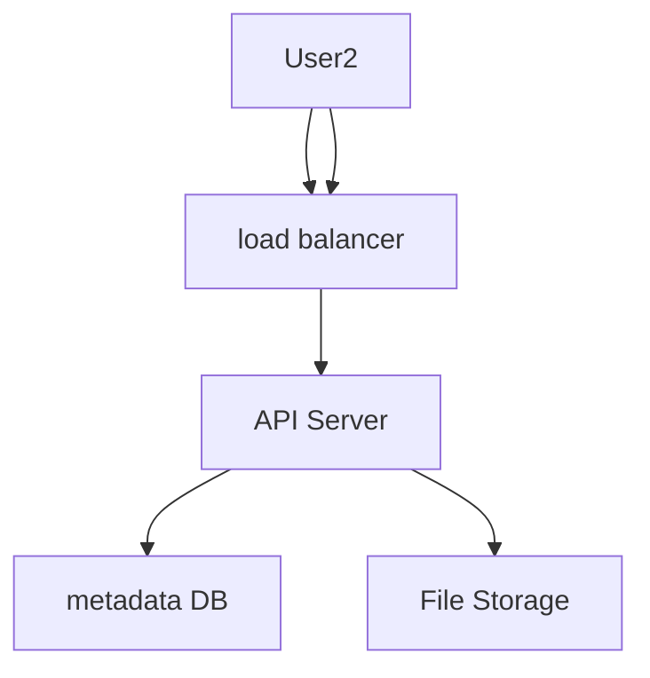
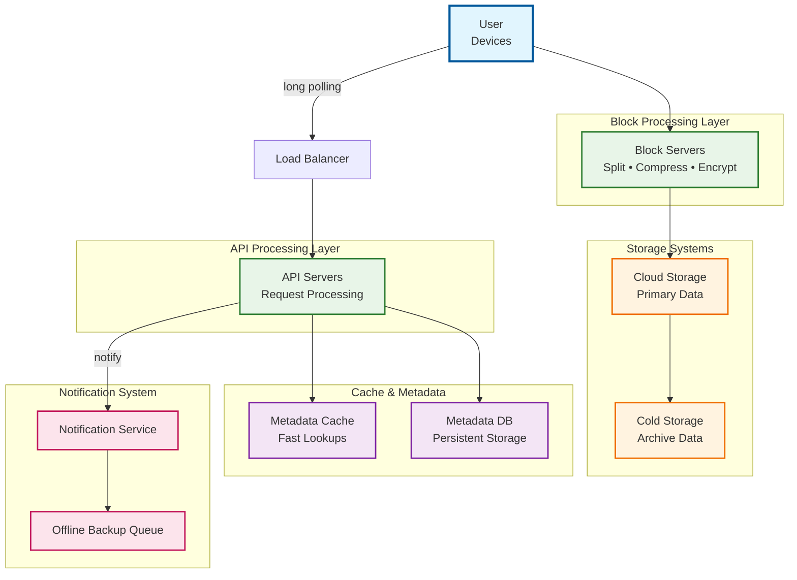
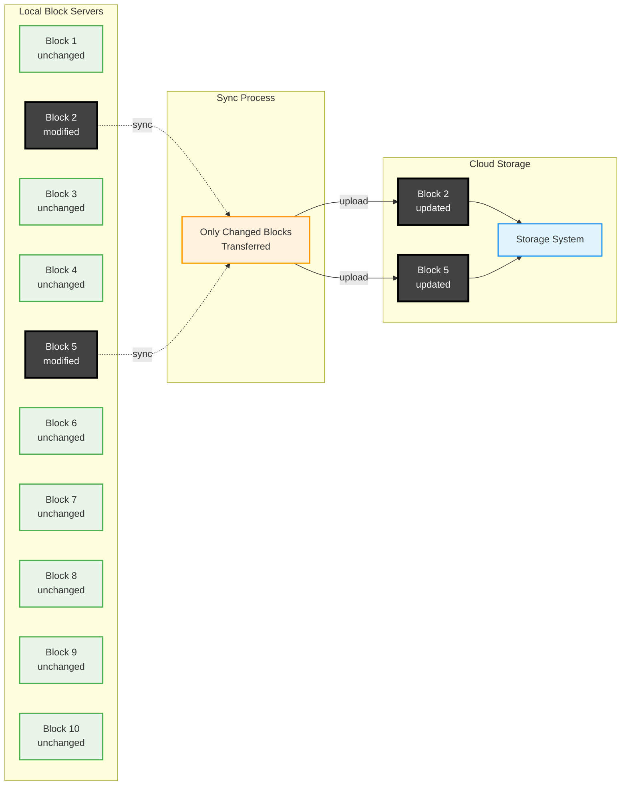
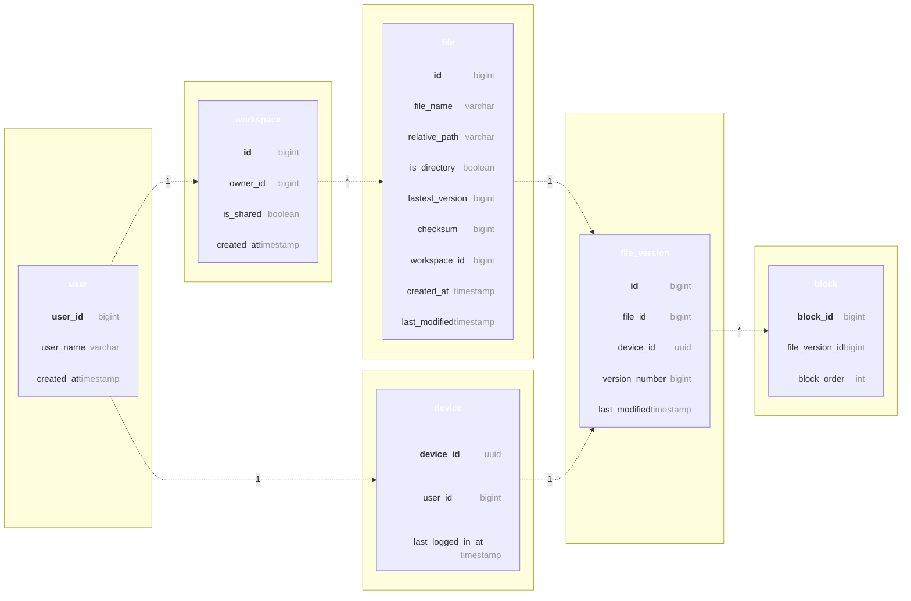
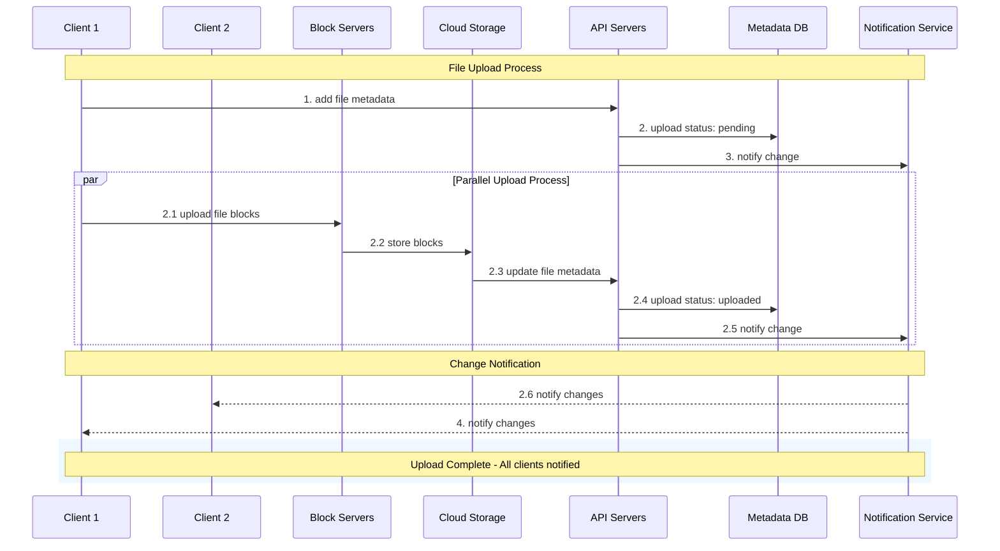
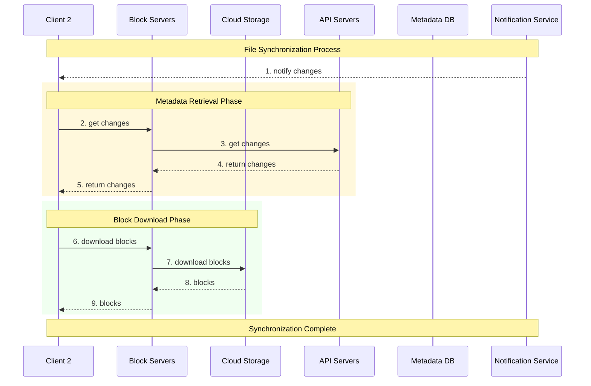

# DESIGN GOOGLE DRIVE

design a cloud storage service similar to google drive

# Design Scope

- features: Upload and download files, file sync, and notifications.
- web app and mobile app
- any file type supported
- storage must be encrypted
- file size<=10gb
- 10M Daily Active Users

## Back of Envelop Estimation

50 million signed up user, 10 million daily active users
10 gb free space
2 files/day=1 mb storage
1:1 read to write
total space= 50 million _ 10 GB = 500 Petabyte
QPS for upload API: 10 million _ 2 uploads / 24 hours / 3600 seconds = ~ 240
Peak QPS = QPS \* 2 = 480

# High Level Design

build everything on same server then gradually scale for users
Let us start with a single server setup as listed below:

- A web server to upload and download files.
- A database to keep track of metadata like user data, login info, files info, etc.
- A storage system to store files. We allocate 1TB of storage space to store files.

# API

mainly 3 apis: upload a file, download a file, and get file revisions.

**1. Upload a File**
2 types: simple and resumable
resumable is when you stop/pause upload when there is a issue/disturbance/disruption in network

ex: `https://api.example.com/files/upload?uploadType=resumable`
Params:

- uploadType=resumable
- data: Local file to be uploaded.

steps:
• Send the initial request to retrieve the resumable URL.
• Upload the data and monitor upload state.
• If upload is disturbed, resume the upload.

**2. Download File**
Example API: `https://api.example.com/files/download`
Params:
• path: download file path.
Example params:

```json
{
  "path": "/recipes/soup/best_soup.txt"
}
```

**3. Get file revisions**
Example API: `https://api.example.com/files/list_revisions`
Params:
• path: The path to the file you want to get the revision history.
• limit: The maximum number of revisions to return.
Example params:

```json
{
  "path": "/recipes/soup/best_soup.txt",
  "limit": 20
}
```

# Single to Distributed Server

say you are reaching the limit, can't upload anyhting more, so you decide to shard the data to store on multiple servers.
ex: user%4 and based on remainder you allocate server

still there's a chance of potential data losses in case of storage server outage.

say you store in s3, problem solved, now to improve more:

- load balancers to distribute traffic
- web servers autoscaling
- metadata database: move db out of server
- file storage: amazon s3



# Sync Conflict

2 user modify same file/folder at same time, a conflict happens
resolution: the first version that gets processed wins, and the version that gets processed later receives a conflict.

user1 and user2 both work on same file,
user1 gets it processed and synced, so user2 receives conflict

to resolve conflict for user2:
2 option: - merge both - override one version with other

## High Level Design

The cloud storage system follows a distributed microservices architecture designed for scalability, reliability, and efficient file synchronization across multiple devices. The system is composed of several key components that work together to provide seamless file storage and synchronization capabilities.



## Core Components

### Client Layer

**User Interface**: Users interact with the application through multiple channels:

- **Web Browser**: Full-featured web application for desktop access
- **Mobile Application**: Native mobile apps for iOS and Android devices
- **Desktop Client**: Synchronization client for automatic file backup

### Load Balancing & Traffic Management

**Load Balancer**: Acts as the entry point for all client requests, intelligently distributing traffic across multiple API server instances to ensure optimal performance and high availability. Implements health checks and automatic failover capabilities.

### Processing Layer

#### Block Servers

The backbone of our file processing system, responsible for:

- **File Chunking**: Splitting large files into smaller, manageable blocks (maximum 4MB per block, following Dropbox's proven approach)
- **Data Processing**: Compressing and encrypting each block for optimal storage and security
- **Hash Generation**: Creating unique hash values for each block to enable deduplication and integrity verification
- **Upload Coordination**: Managing the transfer of processed blocks to cloud storage systems

#### API Servers

Centralized service layer handling all non-upload operations:

- **Authentication & Authorization**: User login, session management, and access control
- **User Profile Management**: Account settings, preferences, and user data management
- **Metadata Operations**: File and folder metadata updates, version tracking
- **Synchronization Logic**: Coordinating file changes across multiple devices
- **Business Logic**: Implementing sharing permissions, workspace management, and collaboration features

### Storage Systems

#### Cloud Storage

**Primary Data Repository**: Utilizes cloud-based object storage (such as Amazon S3) for:

- **Block Storage**: Each file block is stored as an independent object with unique identifiers
- **High Durability**: Built-in redundancy and backup mechanisms
- **Scalability**: Automatic scaling based on storage requirements
- **Global Distribution**: Content delivery through geographically distributed storage nodes

#### Cold Storage

**Archival System**: Cost-effective long-term storage solution for:

- **Inactive Files**: Files not accessed for extended periods (configurable threshold)
- **Version History**: Older file versions for compliance and recovery purposes
- **Backup Archives**: System-level backups and disaster recovery data

### Data Management Layer

#### Metadata Database

**System of Record** for all structural information:

- **User Data**: Account information, authentication credentials, preferences
- **File Metadata**: File names, paths, sizes, modification timestamps, permissions
- **Block Information**: Block hashes, sizes, storage locations, relationships
- **Version Control**: File version history, change tracking, conflict resolution data
- **Workspace Management**: Folder structures, sharing settings, collaboration metadata

#### Metadata Cache

**Performance Optimization Layer**:

- **Hot Data Caching**: Frequently accessed metadata stored in high-speed cache (Redis/Memcached)
- **Query Acceleration**: Reducing database load and improving response times
- **Session Management**: User session data and temporary authentication tokens
- **Real-time Sync**: Quick access to recent changes for immediate synchronization

### Communication & Notification Layer

#### Notification Service

**Real-time Event Distribution System**:

- **Publisher/Subscriber Architecture**: Decoupled event-driven communication
- **Multi-device Synchronization**: Instant notifications when files are modified on any device
- **Event Types**: File creation, modification, deletion, sharing, and permission changes
- **Delivery Guarantees**: Ensuring all relevant clients receive critical updates
- **Long Polling Support**: Maintaining persistent connections for real-time updates

#### Offline Backup Queue

**Resilience and Reliability Component**:

- **Offline Client Support**: Queuing changes when devices are disconnected
- **Change Buffering**: Storing file modifications until clients reconnect
- **Conflict Resolution**: Managing simultaneous changes from multiple offline devices
- **Recovery Mechanisms**: Ensuring no data loss during network interruptions

## Data Flow Architecture

The system implements a sophisticated data flow pattern:

1. **Upload Flow**: Client → Block Servers → Cloud Storage → Metadata Updates
2. **Download Flow**: Client Request → API Servers → Metadata Lookup → Block Retrieval → File Reconstruction
3. **Synchronization Flow**: Change Detection → Notification Service → Client Updates → Selective Block Download
4. **Backup Flow**: Scheduled Archives → Cold Storage → Metadata Updates

## Design Principles

- **Scalability**: Horizontal scaling of all major components
- **Reliability**: Redundancy and failover mechanisms throughout the system
- **Security**: End-to-end encryption and secure access controls
- **Performance**: Caching strategies and optimized data paths
- **Cost Efficiency**: Tiered storage and intelligent data lifecycle management

This architecture provides a robust foundation for a modern cloud storage solution that can handle millions of users and petabytes of data while maintaining high performance and reliability standards.

# Design Deep Dive

## Block Server

large files are sent on each update, very inefficient
2 Optimization
• Delta sync. When a file is modified, only modified blocks are synced instead of the whole file using a sync algorithm [7] [8].
• Compression. Applying compression on blocks can significantly reduce the data size. Thus, blocks are compressed using compression algorithms depending on file types



- A file is split into smaller blocks.
- Each block is compressed using compression algorithms.
- To ensure security, each block is encrypted before it is sent to cloud storage.
- Blocks are uploaded to the cloud storage.

## High Consistency requirements

unacceptable to show same file diff to diff users
Memory caches adopt an eventual consistency model by default, which means different replicas might have different data

- Data in cache replicas and the master is consistent.
- Invalidate caches on database write to ensure cache and database hold the same value.

we choose SQL cause of ACID Properties

## Metadata Database



## Upload FLow



## Download FLow



add notification service,

## Save Storage Space

- De-duplicate data blocks. Eliminating redundant blocks at the account level is an easy way to save space. Two blocks are identical if they have the same hash value.
- Adopt an intelligent data backup strategy. Two optimization strategies can be applied:
- Set a limit: We can set a limit for the number of versions to store. If the limit is reached, the oldest version will be replaced with the new version.
- Keep valuable versions only: Some files might be edited frequently.
  For example, saving every edited version for a heavily modified document could mean the file is saved over 1000 times within a short period. To avoid unnecessary copies, we could limit the number of saved versions. We give more weight to recent versions.
  Experimentation is helpful to figure out the optimal number of versions to save.
- Moving infrequently used data to cold storage. Cold data is the data that has not been active for months or years.

## **Failure Handling Strategies**

### **Load Balancer Failure**

- Secondary load balancer takes over automatically
- Uses heartbeat monitoring to detect failures
- Seamless traffic redirection

### **Block Server Failure**

- Other block servers pick up pending jobs
- Work distribution across remaining servers
- No data loss due to job queuing

### **Cloud Storage Failure**

- Multi-region replication (S3 buckets)
- Automatic failover to different regions
- Data always available from backup locations

### **API Server Failure**

- Stateless design enables easy replacement
- Load balancer redirects traffic to healthy servers
- No session data lost

### **Metadata Cache Failure**

- Multiple cache server replicas
- Access other nodes for data retrieval
- Auto-replacement of failed cache servers

### **Metadata Database Failure**

- **Master down**: Promote slave to master, add new slave
- **Slave down**: Use other slaves for reads, replace failed node
- Master-slave replication ensures data availability

### **Notification Service Failure**

- Long poll connections lost when server fails
- Clients reconnect to different notification servers
- Gradual reconnection process (1M+ connections per server)

### **Offline Backup Queue Failure**

- Queue replication across multiple instances
- Consumers re-subscribe to backup queues
- Message persistence ensures no data loss

## **Key Design Principles**

- **Redundancy**: Multiple copies of critical components
- **Automatic failover**: Systems detect and recover from failures
- **Stateless services**: Easy to replace and scale
- **Geographic distribution**: Multi-region data replication

---


## Upload File Data (Google Drive API)

The Google Drive API lets you upload file data when you create or update a File. For information about how to create a metadata-only file, such as a folder, see Create metadata-only files.

### Types of Uploads

There are three types of uploads you can perform:

| Upload Type | `uploadType` | Use Case | Size Limit |
|---|---|---|---|
| **Simple upload** | `media` | Small media file without metadata | 5 MB or less |
| **Multipart upload** | `multipart` | Small file along with metadata in a single request | 5 MB or less |
| **Resumable upload** | `resumable` | Large files or high chance of network interruption (e.g., mobile apps); also works for small files at minimal cost of one additional HTTP request | Greater than 5 MB |

> **Note:** In the Drive API documentation, *media* refers to all available files with MIME types supported for upload to Drive. For a list of supported MIME types, refer to Google Workspace and Drive supported MIME types.

> **Note:** Users can upload any file type to Drive using the Drive UI and Drive attempts to detect and automatically set the MIME type. If the MIME type can't be detected, the MIME type is set to `application/octet-stream`.

### Use PATCH vs. PUT

- The HTTP verb **PATCH** supports a **partial** file resource update.
- The HTTP verb **PUT** supports **full** resource replacement. Note that `PUT` can introduce breaking changes when adding a new field to an existing resource.

**Guidelines:**

- Use the HTTP verb documented on the API reference for the initial request of a resumable upload or for the only request of a simple or multipart upload.
- Use `PUT` for all subsequent requests for a resumable upload once the request has started. These requests are uploading content no matter the method being called.

---

### 1. Perform a Simple Upload

Use the `create` method on the `files` resource with `uploadType=media`.

**HTTP:**

```
POST https://www.googleapis.com/upload/drive/v3/files?uploadType=media
```

**Steps:**
1. Create a `POST` request to the method's `/upload` URI with the query parameter `uploadType=media`.
2. Add the file's data to the request body.
3. Add these HTTP headers:
   - `Content-Type`: Set to the MIME media type of the object being uploaded.
   - `Content-Length`: Set to the number of bytes you upload. Not required if using chunked transfer encoding.
4. Send the request. If the request succeeds, the server returns `HTTP 200 OK` along with the file's metadata.

> **Note:** To update an existing file, use `PATCH`.

When you perform a simple upload, basic metadata is created and some attributes are inferred from the file, such as the MIME type or `modifiedTime`. Use a simple upload when you have small files and file metadata isn't important.

---

### 2. Perform a Multipart Upload

A multipart upload request lets you upload metadata and data in the same request. Use this option if the data you send is small enough to upload again, in its entirety, if the connection fails.

Use the `create` method on the `files` resource with `uploadType=multipart`.

**Example (Node.js):**

```js
import fs from 'node:fs';
import { GoogleAuth } from 'google-auth-library';
import { google } from 'googleapis';

/**
 * Uploads a file to Google Drive.
 * @return {Promise<string|null|undefined>} The ID of the uploaded file.
 */
async function uploadBasic() {
// Authenticate with Google and get an authorized client.
  // TODO (developer): Use an appropriate auth mechanism for your app.
  const auth = new GoogleAuth({
    scopes: 'https://www.googleapis.com/auth/drive',
  });

    // Create a new Drive API client (v3).
  const service = google.drive({ version: 'v3', auth });

 // The request body for the file to be uploaded.
  const requestBody = {
    name: 'photo.jpg',
    fields: 'id',
  };

    // The media content to be uploaded.
  const media = {
    mimeType: 'image/jpeg',
    body: fs.createReadStream('files/photo.jpg'),
  };

  // Upload the file.
  const file = await service.files.create({
    requestBody,
    media,
  });

  // Print the ID of the uploaded file.
  console.log('File Id:', file.data.id);
  return file.data.id;
}
```

> When creating files, specify a file extension in the file's `name` field. For example, `"name": "photo.jpg"`. Subsequent calls to the `get` method return the read-only `fileExtension` property containing the extension originally specified in the `name` field.

---

### 3. Perform a Resumable Upload

A resumable upload lets you resume an upload operation after a communication failure interrupts the flow of data. Because you don't have to restart large file uploads from the start, resumable uploads can also reduce your bandwidth usage if there's a network failure.

A resumable upload consists of several high-level steps:

1. **Send the initial request** and retrieve the resumable session URI.
2. **Upload the data** and monitor upload state.
3. *(Optional)* If the upload is disturbed, **resume the upload**.

#### Step 1: Send the Initial Request

Use the `create` method on the `files` resource with `uploadType=resumable`.

**HTTP:**

```
POST https://www.googleapis.com/upload/drive/v3/files?uploadType=resumable
```

**Successful response:**

```
HTTP/1.1 200 OK
Location: https://www.googleapis.com/upload/drive/v3/files?uploadType=resumable&upload_id=xa298sd_sdlkj2
Content-Length: 0
```

Save the resumable session URI so you can upload the file data and query the upload status. A resumable session URI **expires after one week**.

**HTTP Headers for the initial request:**

| Header | Required | Description |
|---|---|---|
| `X-Upload-Content-Type` | Optional | MIME type of the file data transferred in subsequent requests. Defaults to `application/octet-stream`. |
| `X-Upload-Content-Length` | Optional | Number of bytes of file data transferred in subsequent requests. |
| `Content-Type` | Required (if metadata present) | Set to `application/json; charset=UTF-8`. |
| `Content-Length` | Required (unless chunked) | Number of bytes in the body of the initial request. |

> **Note:** To update an existing file, use `PATCH`.

#### Step 2: Upload the Content

There are two ways to upload a file with a resumable session:

**a) Upload content in a single request** — Best when the file can be uploaded in one request, no fixed time limit, and no progress indicator needed. Fewer requests = better performance.

```
PUT <resumable_session_URI>
Content-Length: <file_size_in_bytes>

<file_data>
```

**b) Upload content in multiple chunks** — Use when you must reduce data transferred per request (e.g., App Engine request time limits) or need a custom upload progress indicator.

#### Step 3: Resume an Interrupted Upload

If an upload request is terminated before a response, or if you receive a `503 Service Unavailable` response, resume the interrupted upload:

1. **Request upload status** — Create an empty `PUT` request to the resumable session URI with a `Content-Range` header indicating the current position is unknown:
   - If total file length is known: `Content-Range: */2000000`
   - If total file length is unknown: `Content-Range: */*`

2. **Process the response:**

| Status Code | Meaning | Action |
|---|---|---|
| `200 OK` or `201 Created` | Upload completed | No further action needed |
| `308 Resume Incomplete` | Upload partially done | Continue uploading from next byte |
| `404 Not Found` | Session expired | Restart upload from the beginning |

3. If `308 Resume Incomplete`, check the `Range` header to determine which bytes were received:
   - Example: `Range: bytes=0-42` means the first 43 bytes were received; next chunk starts at byte 44.
   - If no `Range` header is present, no bytes have been received.

4. Resume the upload from the next byte:
   ```
   PUT <resumable_session_URI>
   Content-Range: bytes 43-1999999/2000000

   <remaining_file_data>
   ```

---

### Handle Media Upload Errors

Follow these best practices:

| Error | Action |
|---|---|
| **5xx errors** | Resume or retry uploads that failed due to connection interruptions. |
| **403 `rateLimitExceeded`** | Retry the upload. |
| **Any 4xx errors (including 403) during resumable upload** | Restart the upload by requesting a new session URI. Upload sessions expire after one week of inactivity. |

---

### Import to Google Docs Types

When you create a file in Drive, you might want to convert it into a Google Workspace file type (Docs, Sheets, Slides, etc.). Specify the Google Workspace `mimeType` when creating the file.

**Example — Convert CSV to Google Sheet (Node.js):**

```js
import fs from 'node:fs';
import { GoogleAuth } from 'google-auth-library';
import { google } from 'googleapis';

async function uploadWithConversion() {
  const auth = new GoogleAuth({
    scopes: 'https://www.googleapis.com/auth/drive',
  });

  const service = google.drive({ version: 'v3', auth });

  const fileMetadata = {
    name: 'My Report',
    mimeType: 'application/vnd.google-apps.spreadsheet',
  };

  const media = {
    mimeType: 'text/csv',
    body: fs.createReadStream('files/report.csv'),
  };

  const file = await service.files.create({
    requestBody: fileMetadata,
    media,
    fields: 'id',
  });

  console.log('File Id:', file.data.id);
  return file.data.id;
}
```

**Common Import Formats:**

| From | To |
|---|---|
| Microsoft Word, OpenDocument Text, HTML, RTF, plain text | Google Docs |
| Microsoft Excel, OpenDocument Spreadsheet, CSV, TSV, plain text | Google Sheets |
| Microsoft PowerPoint, OpenDocument Presentation | Google Slides |
| JPEG, PNG, GIF, BMP, PDF | Google Docs (embeds image in a Doc) |
| Plain text (special MIME type), JSON | Google Apps Script |

> When you upload and convert media during an update request to a Docs, Sheets, or Slides file, the **full contents** of the document are replaced.

> When you convert an image to a Doc, Drive uses **Optical Character Recognition (OCR)** to convert the image to text. You can improve OCR quality by specifying the applicable BCP 47 language code in the `ocrLanguage` parameter.

---

### Use a Pre-generated ID to Upload Files

The Drive API lets you retrieve a list of pre-generated file IDs that can be used to create, copy, and upload resources.

- You can safely retry uploads with pre-generated IDs if there's an indeterminate server error or timeout.
- If the file action is successful, subsequent retries return a `409 Conflict` HTTP status code and duplicate files aren't created.

> **Note:** Pre-generated IDs aren't supported for the creation of Google Workspace files, except for the `application/vnd.google-apps.drive-sdk` and `application/vnd.google-apps.folder` MIME types. Uploads referencing a conversion to a Google Workspace file format aren't supported either.

---

### Define Indexable Text for Unknown File Types

- Users can search for document content via the Drive UI. You can also use the `list` method on the `files` resource and the `fullText` field to search for content from your app.
- Drive automatically indexes documents for search when it recognizes the file type (text documents, PDFs, images with text, etc.).
- For other file types (drawings, video, shortcuts), improve discoverability by supplying indexable text in the `contentHints.indexableText` field of the file.

---

## Differential Synchronization

### 1. Conventional Strategies

The three most common approaches to synchronization are ownership, event passing and three-way merges. These methods are conceptually simple, but all have drawbacks.

**Locking** is the simplest technique. In its most basic form, a shared document may only be edited by one user at a time. A familiar example is Microsoft Word's behaviour when opening a document on a networked drive. The first user to open the document has global write access, while all others have read-only access. This does not allow for real-time collaboration by multiple users.

A refinement would be to dynamically lock and release subsections of the document. However this still prevents close collaboration. Subsection locking also restricts editability when the document is small. Furthermore, support for fine-grained locking would have to be explicitly built into the application. Finally, locking is ill-suited for operation in environments with unreliable connectivity since the lock or unlock signals can get lost, leaving no owner.

**Event passing** is also a simple technique. It relies on capturing all user actions and mirroring them across the network to other users. Algorithms based on Operation Transformation are currently popular for implementing edit-based collaborative systems. Obtaining a snapshot of the state is usually trivial, but capturing edits is a different matter altogether. A practical challenge with event passing synchronization is that all user actions must be captured. Obvious ones include typing, but edits such as cut, paste, drag, drop, replacements and autocorrect must also be caught. The richness of modern user interfaces can make this problematic, especially within a browser-based environment.

Any failure during edit passing results in a fork. Since each edit changes the location of subsequent edits, one lost edit may cause subsequent edits to be applied incorrectly, thus increasing the gap between the two versions. This is further complicated by the best-effort nature of most networking systems. If a packet gets lost or significantly delayed, the system must be able to recover gracefully. Google Wave is an example of a multi-user application which uses event passing as its synchronization strategy.

Event passing is not naturally convergent.

**Three-way merges** are found in Subversion, the Mjølner Project and many other products. An overview of the process is:

1. The client sends the contents of the document to the server.
2. The server performs a three-way merge to extract the user's changes and merge them with changes from other users.
3. The server sends a new copy of the document to the client.

If the user made any changes to the document during the time this synchronization was in flight, the client is forced to throw the newly received version away and try again later. This is a half-duplex system: as long as one is typing, no changes are arriving. Shortly after one stops typing, the input from other users is integrated and either appears, or else a dialog pops up to let one know that there was a collision.

This system could be compared to an automobile with a windshield which becomes opaque while driving. Look at the road ahead, then drive blindly for a bit, then stop and look again. Major collisions become commonplace when everyone else on the road has the same type of "look xor drive" cars.

Three-way merges are not a good solution for real-time collaboration across a network with latency.

---

### 2. Differential Synchronization Overview

Differential synchronization is a symmetrical algorithm employing an unending cycle of background difference (diff) and patch operations. There is no requirement that "the chickens stop moving so we can count them" which plagues server-side three-way merges.

Below is an idealized data flow diagram for differential synchronization. It assumes two documents (misleadingly called Client Text and Server Text) which are located on the same computer with no network.

The following walk-through starts with Client Text, Common Shadow and Server Text all being equal. Client Text and Server Text may be edited at any time. The goal is to keep these two texts as close as possible with each other at all times.

1. Client Text is diffed against the Common Shadow.
2. This returns a list of edits which have been performed on Client Text.
3. Client Text is copied over to Common Shadow. This copy must be identical to the value of Client Text in step 1, so in a multi-threaded environment a snapshot of the text should have been taken.
4. The edits are applied to Server Text on a best-effort basis.
5. Server Text is updated with the result of the patch. Steps 4 and 5 must be atomic, but they do not have to be blocking; they may be repeated until Server Text stays still long enough.

The process now repeats symmetrically in the other direction. This time the Common Shadow is the same as Client Text was in the previous half of the synchronization, so the resulting diff will return modifications made to Server Text, not the result of the patch in step 5.

The enabling feature is that the patch algorithm is fuzzy, meaning patches may be applied even if the document has changed. Thus if the client has typed a few keystrokes in the time that the synchronization took to complete, the patches from the server are likely to have enough recognizable context that they may still be applied successfully. However, if some or all of the patches fail in step 4, they will automatically show up negatively in the following diff and will be patched out of the Client Text. Here's an example of actual data flow:

- Client Text, Common Shadow and Server Text start out with the same string: `"Macs had the original point and click UI."`
- Client Text is edited (by the user) to say: `"Macintoshes had the original point and click interface."`
- The Diff in step 1 returns the following two edits:
  ```
  @@ -1,11 +1,18 @@
   Mac
  +intoshe
   s had th
  @@ -35,7 +42,14 @@
   ick
  -UI
  +interface
   .
  ```
- Common Shadow is updated to also say: `"Macintoshes had the original point and click interface."`
- Meanwhile Server Text has been edited (by another user) to say: `"Smith & Wesson had the original point and click UI."`
- In step 4 both edits are patched onto Server Text. The first edit fails since the context has changed too much to insert "intoshe" anywhere meaningful. The second edit succeeds perfectly since the context matches.
- Step 5 results in a Server Text which says: `"Smith & Wesson had the original point and click interface."`
- Now the reverse process starts. First the Diff compares Server Text with Common Shadow and returns the following edit:
  ```
  @@ -1,15 +1,18 @@
  -Macintoshes
  +Smith & Wesson
   had
  ```
- Finally this patch is applied to Client Text, thus backing out the failed "Macs" → "Macintoshes" edit and replacing it with "Smith & Wesson". The "UI" → "interface" edit is left untouched. Any changes which have been made to Client Text in the mean time will be patched around and incorporated into the next synchronization cycle.

A live demo of diff and patch algorithms for plain text: http://neil.fraser.name/software/diff_match_patch/demo_patch.html

---

### 3. Dual Shadow Method

The method described above is the simplest form of differential synchronization, but it will not work on client-server systems since the Common Shadow is, well, common. In order to execute on two systems, the shadow needs to be split in two and updated separately. Conceptually this is the same algorithm.

Client Text and Server Shadow (or symmetrically Server Text and Client Shadow) must be absolutely identical after every half of the synchronization. This should be the case since `"(v1 Diff v2) Patch v1 == v2"`. Thus assuming the system starts in a consistent state, it should remain in a consistent state. Note that the patches on the shadows should fit perfectly, thus they may be fragile patches, whereas the patches on the texts are best-effort fuzzy patches.

However, on a network with best-effort delivery, nothing is guaranteed. Therefore a simple checksum of Client Shadow ought to be sent along with the Edits and compared to Server Shadow after the patches have been applied. If the checksum fails to match, then something went wrong and one side or the other must transmit the whole body of the text to get the two parties back in sync. This will result in data loss equal to one synchronization cycle.

---

### 4. Guaranteed Delivery Method

In the event of a transitory network failure, an outbound or a return packet may get lost. In this case the client might stop synchronizing for a while until the connection times out. When the connection is restored on the following synchronization, the shadows will be out of sync which requires a transmission of the full text to get back in sync. This will destroy all changes since the previous successful synchronization. If this form of data-loss is unacceptable, a further refinement adds guaranteed delivery.

In a nutshell: Normal operation works identically to the Dual System Method described above. However in the case of packet loss, the edits are queued up in a stack and are retransmitted to the remote party on every sync until the remote party returns an acknowledgment of receipt. The server keeps two copies of the shadow: **Server Shadow** is the most up to date copy, and **Backup Shadow** is the previous version for use in the event that the previous transmission was not received.

**Normal operation:** Client Text is changed by the user. A Diff is computed between Client Text and Client Shadow to obtain a set of edits which were made by the user. These edits are tagged with a client version number (`n`) relating to the version of Client Shadow they were created from. Client Shadow is updated to reflect the current value of Client Text, and the client version number is incremented. The edits are sent to the server along with the client's acknowledgment of the current server version number (`m`) from the previous connection. The server's Server Shadow should match both the provided client version number and the provided server version number. The server patches the edits onto Server Shadow, increments the client version number of Server Shadow and takes a backup of Server Shadow into Backup Shadow. Finally the server then patches the edits onto Server Text. The process then repeats symmetrically from the server to the client, with the exception that the client doesn't take a backup shadow. During the return communication the server will inform the client that it received the edits for version `n`, whereupon the client will delete edits `n` from the stack of edits to send.

**Duplicate packet:** The client appears to send Edits `n` to the server twice. The first communication is processed normally and the response sent. Server Shadow's `n` is incremented. The second communication contains an `n` smaller than the `n` recorded on Server Shadow. The server has no interest in edits it has already processed, so does nothing and sends back a normal response.

**Lost outbound packet:** The client sends Edits `n` to the server. The server never receives it. The server never acknowledges receipt of the edit. The client leaves the edits in the outbound stack. After the connection times out, the client takes another diff, updates the `n` again, and sends both sets of edits to the server. The stack of edits transmitted keeps increasing until the server eventually responds with acknowledgment that it got a certain version.

**Lost return packet:** The client sends Edits `n` to the server. The server receives it, but the response is lost. The client leaves the edits in the outbound stack. After the connection times out, the client takes another diff, updates the `n` again, and sends both sets of edits to the server. The server observes that the server version number `m` which the client is sending does not match the server version number on Server Shadow. But both server and client version numbers do match the Backup Shadow. This indicates that the previous response must have been lost. Therefore the server deletes its edit stack and copies the Backup Shadow into Shadow Text (step 4). The server throws away the first edit because it already processed (same as a duplicate packet). The normal workflow is restored: the server applies the second edit, then computes and transmits a fresh diff to the client.

**Out of order packet:** The server appears to lose a packet, and one (or both) of the lost packet scenarios is played out. Then the lost packet arrives, and the duplicate packet scenario is played out.

**Data corruption in memory or network:** There are too many potential failure points to list, however if the shadow checksums become out of sync, or one side's version number skips into the future, the system will reinitialize itself. This will result in data loss for one side, but it will never result in an infinite loop of polling.

#### Asymmetry

An obvious question is that given the otherwise perfect symmetry between client and server, why does the server have a Backup Shadow whereas the client does not? The source of this asymmetry is the asymmetrical nature of the connections. In a web-based client-server configuration, the client is the only entity which can initiate a connection. Depending on data losses, there are only three possible outcomes:

1. Client sends data which is lost before reaching the server.
2. Client sends data to server, but server's response is lost before reaching client.
3. Client and server complete a successful round-trip.

Notably missing is the possibility that the client's data is lost but the server's data is received. Every time the server sends information to the client, that implies a successful connection must have been established from the client to the server. Thus the server cannot get into a situation where it repeatedly sends packets to the client which don't arrive — while not obtaining any packets from the client.

The client could implement a Backup Shadow, but it would never get used when run on a web-based client-server architecture. For symmetrical architectures (e.g. peer-to-peer or server-to-server) where either side can initiate a connection to the other, then a Backup Shadow would be required on both sides.

---

### 5. Topology

The above diagrams demonstrate synchronization between two parties, either a user and a server, or a pair of users. This same synchronization strategy can be multiplied to service any number of additional clients in a server-centric network. The Server Text for each synchronization loop is common with all the other loops. When Client 1 changes his document, Server Text is updated upon the next synchronization cycle, and those changes are passed on to all other clients on the following cycle.

Scalability may become an issue as the number of clients increase. Diff and patch can be expensive operations, thus a server may become overloaded. There are two simple methods of distributing the system onto multiple servers:

1. **Separate the database from the algorithm.** One database would service any number of load-balanced servers. A client could hit any server, and as long as the view of the shared database is identical across all servers, the system remains consistent.

2. **Introduce a server-to-server topology.** The clients are divided equally between two servers and the two servers are linked to each other with exactly the same type of connection as between the servers and the clients. Additional servers may be added seamlessly whenever capacity is exceeded. Servers may only be removed when all their clients depart and they only have a single connection to another server.

As the network expands, a potential problem is **latency**. Each link might synchronize every five seconds (see section 7). Thus it would take a change from Client 1 up to fifteen seconds to appear for Client 4. As latency increases, so does the potential for non-trivial collisions. Accordingly it is important to avoid a long chain of servers; a balanced tree offers the shortest path between clients, and thus the least latency. Latency may also be reduced by significantly increasing the synchronization frequency between servers. If the servers are located next to each other, then there is no bandwidth cost in synchronizing several times a second.

---

### 6. Diff and Patch

All the examples in this paper have shown synchronization of plain text. Differential synchronization can handle any content (plain text, rich text, bitmaps, vector graphics, etc.) as long as a difference algorithm and a fuzzy patch algorithm is available for the content.

As the most computationally expensive components, improving the efficiency of these algorithms dramatically improves the responsiveness of the system. Likewise, improving the accuracy of these algorithms greatly reduces the number and severity of collisions.

The diff operation fulfills two very different roles within the synchronization cycle:

1. **Updating Shadows:** Update Server Shadow with the current content of Client Text and Client Shadow. The result should make all three texts identical. This is a simple task which could use any form of synchronization: diff, delta edits or even transmission of the full text.

2. **Updating Texts:** Update Server Text with the changes made to Client Text. Server Text may have changed in the mean time, which means that the diff must be semantically meaningful.

For instance, if the word "cat" was deleted and replaced with "hag", then technically one could think of it as the replacement of the first and third letters, with the second letter being preserved. This would be the minimal diff.

```
Client Text:   The cat is here.
Client Shadow: The hag is here.
Minimal Diff:  The chatg is here.
Semantic Diff: The cathag is here.
```

But this was not the semantic intent of the user. The user changed the word, not two letters. The fact that 'a' was the same in both words was completely coincidental. This distinction matters because if in the mean time another user changed the server's text from "cat" to "cut", the result when applying the first user's patch should be either "hag" (client wins) or "cut" (server wins), but certainly not "hug" (merged differences). An algorithm must be used to expand minimal diffs into semantically meaningful diffs.

The patch operation is just as critical to the operation of the system. This system requires that patches be applied in and around text which may not exactly match the expected text. Furthermore, patches must be applied 'delicately', taking care not to overwrite changes which do not need to be overwritten.

---

## The rsync Algorithm

### 1. The Problem

Imagine you have two files, **A** and **B**, and you wish to update B to be the same as A. The obvious method is to copy A onto B. Now imagine that the two files are on machines connected by a slow communications link (e.g. a dial-up IP link). If A is large, copying A onto B will be slow. Compressing A before sending it will usually only gain a factor of 2 to 4.

Now assume that A and B are quite similar — perhaps both derived from the same original file. To really speed things up you would need to take advantage of this similarity. A common method is to send just the **differences** between A and B down the link and then use this list of differences to reconstruct the file.

The problem is that the normal methods for creating a set of differences between two files rely on being able to read **both** files. Thus they require that both files are available beforehand at one end of the link. If they are not both available on the same machine, these algorithms cannot be used (once you had copied the file over, you wouldn't need the differences). **This is the problem that rsync addresses.**

The rsync algorithm efficiently computes which parts of a source file match some part of an existing destination file. These parts need not be sent across the link; all that is needed is a reference to the part of the destination file. Only parts of the source file which are not matched need to be sent verbatim. The receiver can then construct a copy of the source file using the references to parts of the existing destination file and the verbatim material.

Additionally, the data sent to the receiver can be compressed using any common compression algorithm for further speed improvements.

---

### 2. The Algorithm

Suppose we have two computers **α** and **β**. Computer α has access to file **A** and β has access to file **B**, where A and B are "similar". There is a slow communications link between α and β.

The rsync algorithm consists of the following steps:

1. **β** splits file B into a series of non-overlapping fixed-sized blocks of size **S** bytes. The last block may be shorter than S bytes.

2. For each of these blocks, **β** calculates two checksums:
   - A **weak "rolling" 32-bit checksum** (described below)
   - A **strong 128-bit MD4 checksum**

3. **β** sends these checksums to **α**.

4. **α** searches through A to find all blocks of length S bytes (at **any offset**, not just multiples of S) that have the same weak and strong checksum as one of the blocks of B. This can be done in a single pass very quickly using a special property of the rolling checksum.

5. **α** sends **β** a sequence of instructions for constructing a copy of A. Each instruction is either:
   - A **reference to a block of B**, or
   - **Literal data** (sent only for sections of A which did not match any blocks of B)

The end result is that **β** gets a copy of A, but only the pieces of A that are not found in B (plus a small amount of data for checksums and block indexes) are sent over the link. The algorithm also only requires **one round trip**, which minimises the impact of link latency.

The most important details of the algorithm are the **rolling checksum** and the associated **multi-alternate search mechanism** which allows the all-offsets checksum search to proceed very quickly.

---

### 3. Rolling Checksum

The weak rolling checksum used in the rsync algorithm needs to have the property that it is very cheap to calculate the checksum of a buffer $X_2 \ldots X_{n+1}$ given the checksum of buffer $X_1 \ldots X_n$ and the values of the bytes $X_1$ and $X_{n+1}$.

The checksum algorithm (inspired by Mark Adler's adler-32 checksum) is defined by:

$$a(k, l) = \left(\sum_{i=k}^{l} X_i\right) \mod M$$

$$b(k, l) = \left(\sum_{i=k}^{l} (l - i + 1) \cdot X_i\right) \mod M$$

$$s(k, l) = a(k, l) + 2^{16} \cdot b(k, l)$$

where $s(k, l)$ is the rolling checksum of the bytes $X_k \ldots X_l$. For simplicity and speed, $M = 2^{16}$.

The important property of this checksum is that successive values can be computed very efficiently using the **recurrence relations**:

$$a(k+1, l+1) = \big(a(k, l) - X_k + X_{l+1}\big) \mod M$$

$$b(k+1, l+1) = \big(b(k, l) - (l - k + 1) \cdot X_k + a(k+1, l+1)\big) \mod M$$

Thus the checksum can be calculated for blocks of length S at all possible offsets within a file in a "rolling" fashion, with very little computation at each point.

Despite its simplicity, this checksum was found to be quite adequate as a first-level check for a match of two file blocks. In practice, the probability of this checksum matching when the blocks are not equal is quite low. This is important because the much more expensive strong checksum must be calculated for each block where the weak checksum matches.

---

### 4. Checksum Searching

Once **α** has received the list of checksums of the blocks of B, it must search A for any blocks at any offset that match the checksum of some block of B. The basic strategy is to compute the 32-bit rolling checksum for a block of length S starting at each byte of A in turn, and for each checksum, search the list for a match.

The implementation uses a **3-level searching scheme**:

#### Level 1 — Hash Table Lookup

- A **16-bit hash** of the 32-bit rolling checksum is computed.
- A $2^{16}$-entry hash table is used. The list of checksum values (from the blocks of B) is sorted according to the 16-bit hash.
- Each hash table entry points to the first element of the sorted list for that hash value, or contains a null value if no element has that hash value.
- At each offset in the file, the 32-bit rolling checksum and its 16-bit hash are calculated.
- If the hash table entry is **not null**, proceed to Level 2.

#### Level 2 — Rolling Checksum Match

- Scan the sorted checksum list starting from the entry pointed to by the hash table, looking for an entry whose **32-bit rolling checksum** matches the current value.
- The scan terminates when it reaches an entry whose 16-bit hash differs.
- If a match is found, proceed to Level 3.

#### Level 3 — Strong Checksum Match

- Calculate the **strong checksum** (MD4) for the current offset in the file.
- Compare it with the strong checksum in the current list entry.
- If the two strong checksums match, we assume a matching block has been found. (The blocks could theoretically differ, but the probability is microscopic.)

#### Match Behaviour

- **When a match is found:** α sends β the data in A between the current file offset and the end of the previous match, followed by the index of the matched block in B. This data is sent **immediately** upon match, allowing communication to overlap with further computation.

- **When no match is found** at a given offset: the rolling checksum is updated to the next offset and the search proceeds.

- **When a match is found:** the search is **restarted at the end of the matched block**. This saves considerable computation for the common case where the two files are nearly identical.

- Block indexes can be encoded as **runs** for the common case where a portion of A matches a series of consecutive blocks of B in order.
