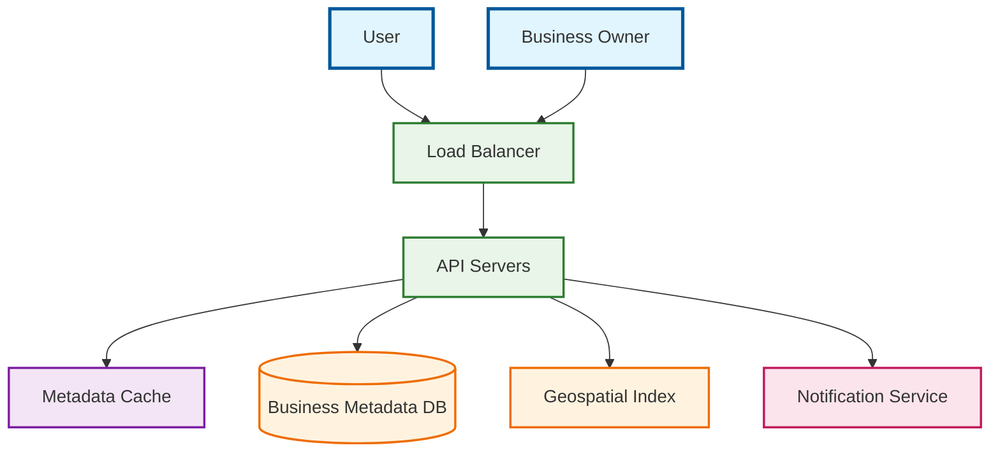
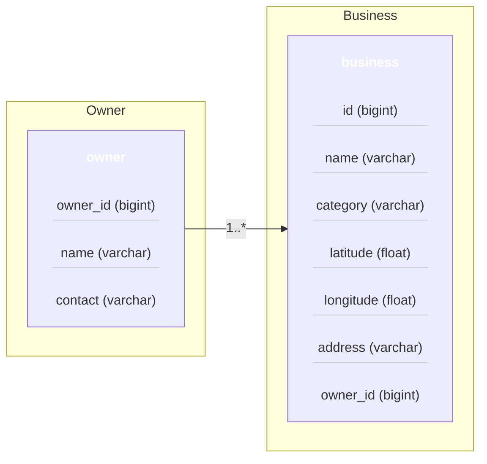
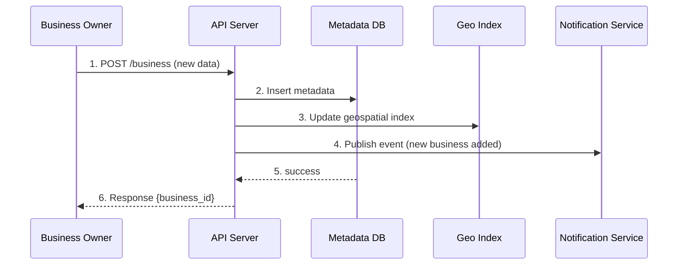
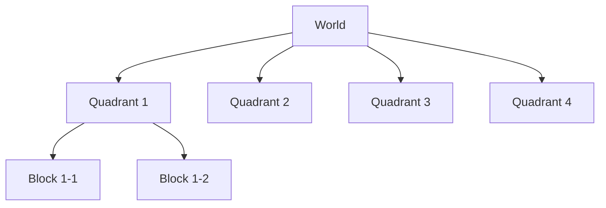
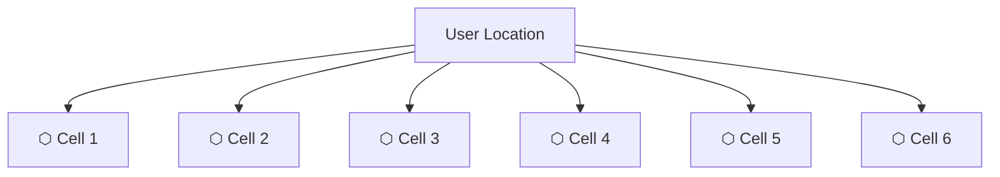
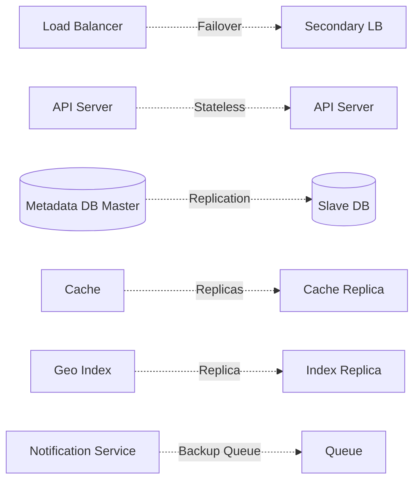

# Proximity Service

It is used to discover nearby places such as restaurant, hotel, threaters, museums etc.
Main component of a something similar to google maps.

---

# Design Scope

- **User-defined search radius** (default configurable).
- **Maximal radius**: 20 km.
- **UI control**: radius adjustable by user.
- **Business endpoints**: add, delete, or update business data.
- **User assumption**: moving speed is slow (no need for constant GPS streaming).

## Functional Requirements

- Return all businesses within a given `(latitude, longitude, radius)`.
- CRUD operations for business owners.
- Customers can view **detailed business info**.

## Non-Functional Requirements

- **Low latency**: fast lookup of nearby businesses.
- **High availability & scalability**.
- **Data privacy & security**.

---

# Back of Envelope Estimation

- **Seconds in a day**:

  ```
  24 * 60 * 60 ≈ 10^5
  ```

- **100M DAU**, average **5 queries/day**.

  ```
  Total queries = 100M * 5 = 500M/day
  ```

- **Average QPS**:

  ```
  500M / 10^5 ≈ 5000
  ```

- **Peak QPS**: ~10K (2x buffer).

### Storage

- Businesses: **100M globally**.
- Each record ≈ 1 KB (id, name, category, lat, lng, metadata).
- Total storage: **~100 GB**.

---

# High Level Design


```mermaid
graph TD
    U[ User] --> LB[ Load Balancer]
    BO[ Business Owner] --> LB

    LB --> API[ API Servers]

    API --> CACHE[ Metadata Cache]
    API --> DB[( Business Metadata DB)]
    API --> IDX[ Geospatial Index]

    API --> NS[ Notification Service]

    classDef userStyle fill:#e1f5fe,stroke:#01579b,stroke-width:3px
    classDef serverStyle fill:#e8f5e8,stroke:#2e7d32,stroke-width:2px
    classDef dbStyle fill:#fff3e0,stroke:#ef6c00,stroke-width:2px
    classDef cacheStyle fill:#f3e5f5,stroke:#7b1fa2,stroke-width:2px
    classDef notifyStyle fill:#fce4ec,stroke:#c2185b,stroke-width:2px

    class U,BO userStyle
    class API,LB serverStyle
    class DB,IDX dbStyle
    class CACHE cacheStyle
    class NS notifyStyle
```

---

# API Design

### 1. Search Nearby Businesses

**GET** `/v1/search/nearby`

Params:

- `lat` → user latitude
- `lng` → user longitude
- `radius` → search radius (≤ 20km)

Response:

```json
{
  "results": [
    {
      "id": "123",
      "name": "Cafe Coffee Day",
      "category": "restaurant",
      "lat": 12.934,
      "lng": 77.609,
      "distance": "1.2 km",
      "details_url": "/business/123"
    }
  ]
}
```

---

### 2. Get Business Details

**GET** `/v1/business/{id}`

Response:

```json
{
  "id": "123",
  "name": "Cafe Coffee Day",
  "category": "restaurant",
  "lat": 12.934,
  "lng": 77.609,
  "address": "MG Road, Bangalore",
  "phone": "+91-9876543210",
  "hours": "9am–11pm",
  "rating": 4.5
}
```

---

### 3. Create / Update / Delete Business

- **POST** `/v1/business` → add new business.
- **PUT** `/v1/business/{id}` → update details.
- **DELETE** `/v1/business/{id}` → delete listing.

---

# Data Model


```mermaid
graph LR
    subgraph Business
        B["<div style='background:#4682B4;color:white;padding:6px;font-weight:bold;'>business</div>
        <div style='background:#E6F3FF;padding:4px;border-bottom:1px solid #ccc;'>id (bigint)</div>
        <div style='background:#E6F3FF;padding:4px;border-bottom:1px solid #ccc;'>name (varchar)</div>
        <div style='background:#E6F3FF;padding:4px;border-bottom:1px solid #ccc;'>category (varchar)</div>
        <div style='background:#E6F3FF;padding:4px;border-bottom:1px solid #ccc;'>latitude (float)</div>
        <div style='background:#E6F3FF;padding:4px;border-bottom:1px solid #ccc;'>longitude (float)</div>
        <div style='background:#E6F3FF;padding:4px;border-bottom:1px solid #ccc;'>address (varchar)</div>
        <div style='background:#E6F3FF;padding:4px;'>owner_id (bigint)</div>"]
    end

    subgraph Owner
        O["<div style='background:#4682B4;color:white;padding:6px;font-weight:bold;'>owner</div>
        <div style='background:#E6F3FF;padding:4px;border-bottom:1px solid #ccc;'>owner_id (bigint)</div>
        <div style='background:#E6F3FF;padding:4px;border-bottom:1px solid #ccc;'>name (varchar)</div>
        <div style='background:#E6F3FF;padding:4px;'>contact (varchar)</div>"]
    end

    O -- 1..* --> B
```

---

# Deep Dive

## CRUD Flow (Business Owner)


```mermaid
sequenceDiagram
    participant BO as  Business Owner
    participant API as  API Server
    participant DB as  Metadata DB
    participant IDX as  Geo Index
    participant NS as  Notification Service

    BO->>API: 1. POST /business (new data)
    API->>DB: 2. Insert metadata
    API->>IDX: 3. Update geospatial index
    API->>NS: 4. Publish event (new business added)
    DB-->>API: 5.  success
    API-->>BO: 6. Response {business_id}
```

---

## Search Radius Deep Dive

### Quadtree Partitioning


```mermaid
graph TD
    W[ World] --> Q1[Quadrant 1]
    W --> Q2[Quadrant 2]
    W --> Q3[Quadrant 3]
    W --> Q4[Quadrant 4]
    Q1 --> Q11[Block 1-1]
    Q1 --> Q12[Block 1-2]
```

### H3 Hex Index


```mermaid
graph TD
    H1[⬡ Cell 1]
    H2[⬡ Cell 2]
    H3[⬡ Cell 3]
    H4[⬡ Cell 4]
    H5[⬡ Cell 5]
    H6[⬡ Cell 6]
    C[User Location] --> H1
    C --> H2
    C --> H3
    C --> H4
    C --> H5
    C --> H6
```

---

## Failure Handling Overview


```mermaid
graph LR
    LB[ Load Balancer] -.->|Failover| LB2[ Secondary LB]
    API[ API Server] -.->|Stateless| API2[ API Server]
    DB[( Metadata DB Master)] -.->|Replication| DB2[(Slave DB)]
    CACHE[ Cache] -.->|Replicas| CACHE2[ Cache Replica]
    IDX[ Geo Index] -.->|Replica| IDX2[ Index Replica]
    NS[ Notification Service] -.->|Backup Queue| Q[ Queue]
```

---

# Key Design Principles

- **Geospatial indexing** (QuadTree, R-Tree, H3).
- **Caching** for hot areas (popular cities).
- **Sharding by geohash** for scalability.
- **Event-driven updates** for real-time sync.
- **Redundancy & failover** for reliability.

---

# References

1. [Google Maps APIs](https://developers.google.com/maps/documentation)

Geocoding converts addresses into geographic coordinates; reverse geocoding converts coordinates into human-readable addresses. The Maps JavaScript API provides a `Geocoder` class for both.

```js
// Geocoding Request - GeocoderRequest object fields
// Required (supply exactly one): address, location, or placeId
// Optional: bounds, componentRestrictions, region, extraComputations, fulfillOnZeroResults

// Geocode an address
geocoder.geocode({ address: "1600 Amphitheatre Parkway, Mountain View, CA" })
  .then((result) => { /* result.results[0].geometry.location */ });

// Reverse geocode (coordinates to address)
geocoder.geocode({ location: { lat: 40.714224, lng: -73.961452 } })
  .then((response) => { /* response.results[0].formatted_address */ });

// Geocode a place ID
geocoder.geocode({ placeId: "ChIJd8BlQ2BZwokRAFUEcm_qrcA" })
  .then(({ results }) => { /* results[0].geometry.location */ });

// Viewport biasing - prefer results within bounds
geocoder.geocode({ address: "Winnetka", bounds: latLngBounds })
  .then((result) => { /* biased results */ });

// Region code biasing
geocoder.geocode({ address: "Toledo", region: "es" })
  .then((result) => { /* returns Toledo, Spain */ });

// Component filtering - restrict results to specific area
geocoder.geocode({ componentRestrictions: { country: "AU", postalCode: "2000" } })
  .then((result) => { /* results restricted to Australia, postal code 2000 */ });

// Fulfill on zero results (access plus_code/address_descriptor even with no geocode results)
geocoder.geocode({ location: latlng, fulfillOnZeroResults: true })
  .then((response) => { /* response.plus_code, response.address_descriptor */ });

// Address descriptors (extra landmark/area info, GA for India)
geocoder.geocode({ placeId: "ChIJyxAX8Bj9DDkRgBfAnBYa66Q", extraComputations: ["ADDRESS_DESCRIPTORS"] })
  .then((result) => { /* result.results[0].address_descriptor.landmarks[], .areas[] */ });
```

```js
// GeocoderResult structure
results[]: {
  types[]: string,                          // e.g. "locality", "political"
  formatted_address: string,                // human-readable address
  address_components[]: {
    short_name: string,
    long_name: string,
    postcode_localities[]: string,
    types[]: string
  },
  partial_match: boolean,                   // true if not an exact match
  place_id: string,                         // unique place identifier
  geometry: {
    location: LatLng,                       // geocoded lat/lng
    location_type: GeocoderLocationType,    // ROOFTOP | RANGE_INTERPOLATED | GEOMETRIC_CENTER | APPROXIMATE
    viewport: LatLngBounds,
    bounds: LatLngBounds
  }
}

// Status Codes: "OK", "ZERO_RESULTS", "OVER_QUERY_LIMIT", "REQUEST_DENIED", "INVALID_REQUEST", "UNKNOWN_ERROR", "ERROR"
```

```js
// Address types: street_address, route, intersection, political, country,
//   administrative_area_level_1..7, colloquial_area, locality, sublocality,
//   neighborhood, premise, subpremise, plus_code, postal_code,
//   natural_feature, airport, park, point_of_interest

// Address component types: floor, establishment, landmark, point_of_interest,
//   parking, post_box, postal_town, room, street_number,
//   bus_station, train_station, transit_station

// Component filter fields: route, locality, administrativeArea, postalCode, country

// Address descriptor spatial relationships: NEAR, WITHIN, BESIDE,
//   ACROSS_THE_ROAD, DOWN_THE_ROAD, AROUND_THE_CORNER, BEHIND

// Address descriptor containment: NEAR, WITHIN, OUTSKIRTS
```


2. [Uber H3 Geospatial Index](https://h3geo.org/)
H3 is a discrete global grid system for indexing geographies into a hexagonal grid, developed at Uber.

Coordinates can be indexed to cell IDs that each represent a unique cell.

Indexed data can be quickly joined across disparate datasets and aggregated at different levels of precision.

H3 enables a range of algorithms and optimizations based on the grid, including nearest neighbors, shortest path, gradient smoothing, and more.

```js
// Indexing functions
h3.latLngToCell(lat, lng, res)  //Indexes the location at the specified resolution, providing the index of the cell containing the location.
h3.cellToLatLng(cell) //Finds the center of the cell in grid space
h3.cellToBoundary(cell, [formatAsGeoJson])  //Finds the boundary of the cell.

// Index inspection functions
h3.getResolution(h)  //Returns the resolution of the index. (Works for cells, edges, and vertexes.)
h3.getBaseCellNumber(h)  //Returns the base cell number of the index. (Works for cells, edges, and vertexes.)
h3.isValidCell(h)  //Returns non-zero if this is a valid H3 cell index.
h3.isResClassIII(h)  //Returns non-zero if this index has a resolution with Class III orientation.
h3.isPentagon(h)  //Returns non-zero if this index represents a pentagonal cell.
h3.getIcosahedronFaces(h)  //Find all icosahedron faces intersected by a given H3 cell.

// Grid traversal functions
h3.gridDistance(a, b)  //Provides the grid distance between two cells (minimum number of hops across adjacent cells).
h3.gridRing(h3Index, k)  //Produces the "hollow ring" of cells which are exactly grid distance k from the origin cell.
h3.gridRingUnsafe(h3Index, k)  //Produces the "hollow ring" of cells exactly grid distance k from origin. May fail on pentagonal distortion.
h3.gridDisk(origin, k)  //Produces the "filled-in disk" of cells which are at most grid distance k from the origin cell.
h3.gridDiskDistances(origin, k)  //Same as gridDisk, but along with each cell's grid distance from the origin cell.
h3.gridPathCells(start, end)  //Returns a minimal-length contiguous path of cells between two cells (inclusive of endpoints).
h3.cellToLocalIj(origin, h3)  //Produces local IJ coordinates for an H3 cell anchored by an origin.
h3.localIjToCell(origin, coords)  //Produces an H3 cell from local IJ coordinates anchored by an origin.

// Hierarchical grid functions
h3.cellToParent(cell, parentRes)  //Provides the unique ancestor (coarser) cell for the provided resolution.
h3.cellToChildren(cell, childRes)  //Provides the children (descendant) cells at the given resolution.
h3.cellToChildrenSize(cell, childRes)  //Provides the number of children at a given resolution of the given cell.
h3.cellToCenterChild(cell, childRes)  //Provides the center child (finer) cell contained by cell at the given resolution.
h3.cellToChildPos(child, parentRes)  //Provides the position of the child cell within an ordered list of all children of the cell's parent.
h3.childPosToCell(childPos, parent, childRes)  //Provides the child cell at a given position within an ordered list of all children of parent.
h3.compactCells(cells)  //Compacts a collection of H3 cells by recursively replacing children with their parents if all children are present.
h3.uncompactCells(cells, res)  //Uncompacts the compacted set of indexes to the given resolution.

// Region functions
h3.polygonToCells(polygon, res, isGeoJson)  //Takes a GeoJSON-like polygon and target resolution, produces cells contained within the polygon.
h3.polygonToCellsExperimental(polygon, res, flags, isGeoJson)  //Like polygonToCells but supports center-based, fully-contained, and overlapping containment modes.
h3.cellsToMultiPolygon(cells, geoJson)  //Creates a GeoJSON-like multi-polygon describing the outline(s) of a set of cells.

// Directed edge functions
h3.areNeighborCells(origin, destination)  //Determines whether or not the provided H3 cells are neighbors.
h3.cellsToDirectedEdge(origin, destination)  //Provides a directed edge H3 index based on the provided origin and destination.
h3.isValidDirectedEdge(edge)  //Determines if the provided H3Index is a valid unidirectional edge index.
h3.getDirectedEdgeOrigin(edge)  //Provides the origin hexagon from the directed edge H3Index.
h3.getDirectedEdgeDestination(edge)  //Provides the destination hexagon from the directed edge H3Index.
h3.directedEdgeToCells(edge)  //Provides the origin-destination pair of cells for the given directed edge.
h3.originToDirectedEdges(h3Index)  //Provides all of the directed edges from the current cell.
h3.directedEdgeToBoundary(edge, [formatAsGeoJson])  //Provides the geographic lat/lng coordinates defining the directed edge.

// Vertex functions
h3.cellToVertex(origin, vertexNum)  //Returns the index for the specified cell vertex (0-5 for hexagons, 0-4 for pentagons).
h3.cellToVertexes(origin)  //Returns the indexes for all vertexes of the given cell.
h3.vertexToLatLng(vertex)  //Returns the latitude and longitude coordinates of the given vertex.
h3.isValidVertex(vertex)  //Determines if the given H3 index represents a valid H3 vertex.

// Miscellaneous functions
h3.degsToRads(degrees)  //Converts degrees to radians.
h3.radsToDegs(radians)  //Converts radians to degrees.
h3.getHexagonAreaAvg(res, h3.UNITS.km2)  //Average hexagon area in square kilometers at the given resolution.
h3.getHexagonAreaAvg(res, h3.UNITS.m2)  //Average hexagon area in square meters at the given resolution.
h3.cellArea(h, h3.UNITS.rads2)  //Exact area of specific cell in square radians.
h3.cellArea(h, h3.UNITS.km2)  //Exact area of specific cell in square kilometers.
h3.cellArea(h, h3.UNITS.m2)  //Exact area of specific cell in square meters.
h3.getHexagonEdgeLengthAvg(res, h3.UNITS.km)  //Average hexagon edge length in kilometers at the given resolution.
h3.getHexagonEdgeLengthAvg(res, h3.UNITS.m)  //Average hexagon edge length in meters at the given resolution.
h3.edgeLength(edge, h3.UNITS.km)  //Exact edge length of specific directed edge in kilometers.
h3.edgeLength(edge, h3.UNITS.m)  //Exact edge length of specific directed edge in meters.
h3.edgeLength(edge, h3.UNITS.rads)  //Exact edge length of specific directed edge in radians.
h3.getNumCells(res)  //Number of unique H3 indexes at the given resolution.
h3.getRes0Cells()  //Provides all resolution 0 H3 cells (122 base cells).
h3.getPentagons(res)  //All the pentagon H3 cells at the specified resolution (12 per resolution).
h3.greatCircleDistance(point1, point2, h3.UNITS.km)  //Great circle (haversine) distance between two points in kilometers.
h3.greatCircleDistance(point1, point2, h3.UNITS.m)  //Great circle (haversine) distance between two points in meters.
h3.greatCircleDistance(point1, point2, h3.UNITS.rads)  //Great circle (haversine) distance between two points in radians.
```


3. [Redis Geospatial Index](https://redis.io/docs/data-types/geospatial/)

Redis Query Engine supports geospatial data — store geographical locations and geometric shapes in JSON object fields, index them, and query by location or shape relationships.

Redis uses coordinate points for locations. Individual points or polygon shapes can be stored. Coordinates can be geographical (longitude/latitude) or Cartesian (flat plane).

**Schema Types:**
- **GEO**: Simple longitude-latitude pairs (e.g. `"-104.991531, 39.742043"`). Supports basic point-and-radius queries.
- **GEOSHAPE**: Uses WKT (Well-Known Text) subset for `POINT` and `POLYGON` primitives with geographical or Cartesian coordinates. Supports advanced queries.

```
// GEO — store as "longitude, latitude" string or JSON array of such strings
{ "location": "-104.991531, 39.742043" }
{ "location": ["-104.991531, 39.742043", "-105.0618814, 40.5150098"] }

// GEO query — find within radius (longitude, latitude, radius, unit)
FT.SEARCH productidx '@location:[-104.800644 38.846127 100 mi]'

// GEOSHAPE — POINT primitive
{ "geom": "POINT (2 2)" }

// GEOSHAPE — POLYGON primitive (closed shape, double parentheses; supports holes)
{ "geom": "POLYGON ((1 1, 1 3, 3 3, 3 1, 1 1))" }

// GEOSHAPE queries — four operations:
// WITHIN:     find points/shapes entirely within an enclosing shape
// CONTAINS:   find shapes that completely contain a specified point/shape
// INTERSECTS: find shapes whose boundary overlaps another shape
// DISJOINT:   find shapes whose boundary does not overlap another shape

// Example: find shapes within a polygon (excluding "Green Square" by name)
FT.SEARCH geomidx "(-@name:(Green Square) @geom:[WITHIN $qshape])" PARAMS 2 qshape "POLYGON ((1 1, 1 3, 3 3, 3 1, 1 1))" RETURN 1 name DIALECT 2
```

4. [Quadtree Spatial Indexing ](https://en.wikipedia.org/wiki/Quadtree)

A quadtree is a tree data structure where each internal node has exactly four children, used to partition a 2D space by recursively subdividing it into four quadrants. Named by Finkel and Bentley in 1974.

**Common features of all quadtrees:**
- Decompose space into adaptable cells
- Each cell/bucket has a maximum capacity; when reached, the bucket splits
- The tree directory follows the spatial decomposition

**Types of Quadtrees:**
- **Region quadtree**: Partitions space into four equal quadrants recursively. Each leaf stores data for its subregion. Used for image representation/compression, variable resolution data fields. Height depends on spatial distribution.
- **Point quadtree**: Adapts binary tree for 2D point data. Center of subdivision is always on a point. Operates in O(log n) time. Surpassed by k-d trees for generalized binary search.
- **Point-region (PR) quadtree**: Like region quadtree but leaf cells store a list of points rather than uniform values. Height depends on spatial distribution.
- **Edge quadtree**: Stores lines rather than points. Subdivides until one line segment per cell.
- **Polygonal map (PM) quadtree**: Stores collections of polygons. Variants: PM1, PM2, PM3 (differ in what black nodes store).
- **Compressed quadtree**: Prunes empty nodes and compresses long single-child paths. Achieves O(log n) search/insert/delete using Z-order curves.

**Common uses:** image representation, image processing, mesh generation, spatial indexing, point location queries, range queries, collision detection, view frustum culling, sparse data storage.

```pseudo
// Core structures
struct XY { float x; float y; }
struct AABB { XY center; float halfDimension; }  // Axis-aligned bounding box

class QuadTree {
    constant int QT_NODE_CAPACITY = 4;
    AABB boundary;
    Array of XY points;
    QuadTree* northWest, northEast, southWest, southEast;

    // Insert a point — subdivides when capacity is reached
    function insert(XY p) {
        if (!boundary.containsPoint(p)) return false;
        if (points.size < QT_NODE_CAPACITY && northWest == null) {
            points.append(p); return true;
        }
        if (northWest == null) subdivide();
        if (northWest->insert(p)) return true;
        if (northEast->insert(p)) return true;
        if (southWest->insert(p)) return true;
        if (southEast->insert(p)) return true;
        return false;
    }

    // Query range — find all points within an AABB
    function queryRange(AABB range) {
        Array of XY pointsInRange;
        if (!boundary.intersectsAABB(range)) return pointsInRange;
        for (int p = 0; p < points.size; p++)
            if (range.containsPoint(points[p]))
                pointsInRange.append(points[p]);
        if (northWest == null) return pointsInRange;
        pointsInRange.appendArray(northWest->queryRange(range));
        pointsInRange.appendArray(northEast->queryRange(range));
        pointsInRange.appendArray(southWest->queryRange(range));
        pointsInRange.appendArray(southEast->queryRange(range));
        return pointsInRange;
    }
}
```

5. [R-Tree Spatial Indexing ](https://en.wikipedia.org/wiki/R-tree)

R-trees are tree data structures for indexing multi-dimensional information (geographical coordinates, rectangles, polygons). Proposed by Antonin Guttman in 1984. Used for queries like "find all museums within 2 km" or "find nearest gas station".

**Key idea:** Group nearby objects and represent them with their minimum bounding rectangle (MBR) at the next higher level. A query that doesn't intersect the bounding rectangle cannot intersect contained objects — enabling efficient pruning.

**Properties:**
- Balanced search tree (all leaf nodes at same depth), like B-tree
- Organized in pages with max entries M and minimum fill (30-40% optimal)
- Suitable for large datasets and databases (nodes paged to memory as needed)
- Does not guarantee good worst-case performance, but works well with real-world data

**Variants:** Priority R-tree (worst-case optimal), R\*-tree, R+ tree, Hilbert R-tree, X-tree

**Data layout:**
- Non-leaf entries: child node pointer + bounding box of all entries in that child
- Leaf entries: spatial object data (point or MBR) + external identifier

**Algorithms:**

```
// Search (range query) — Filter & Refine Principle
function search(node, queryBox):
    if node is leaf:
        return entries where entry.MBR intersects queryBox
    results = []
    for each entry in node:
        if entry.MBR intersects queryBox:
            results.append(search(entry.child, queryBox))
    return results

// Nearest neighbor — priority queue approach
function nearestNeighbor(root, queryPoint):
    queue.insert(root)
    while queue not empty:
        entry = queue.popNearest(queryPoint)
        if entry is leaf object: return entry  // found result
        if entry is node: expand and reinsert children into queue

// Insertion — choose subtree needing least enlargement
function insert(node, object):
    if node is leaf:
        if node not full: add object to node
        else: split node, add object, propagate overflow upward
    else:
        choose child whose MBR needs least enlargement
        insert(child, object)
        update MBR

// Splitting heuristics:
// - QuadraticSplit: find worst pair, assign remaining by area increase preference
// - LinearSplit: faster but worse structure
// - R*-tree split: minimizes overlap, prefers quadratic pages, uses reinsertion
// - X-tree: may create super-nodes instead of splitting (for high-dimensional data)

// Deletion — remove entry, update MBRs, dissolve underfull pages (reinsert children)

// Bulk-loading strategies:
// - Nearest-X: sort by first coordinate, split into pages
// - Packed Hilbert R-tree: sort by Hilbert value of center
// - Sort-Tile-Recursive (STR): estimate leaves needed, split dimensions recursively
// - Overlap Minimizing Top-down (OMT): improves STR by minimizing overlap
```

7. [MongoDB Geospatial Queries](https://www.mongodb.com/docs/manual/geospatial-queries/)

MongoDB supports geospatial data as **GeoJSON objects** (for spherical calculations using WGS84) or **legacy coordinate pairs** (for flat/Euclidean calculations). Longitude is always listed first.

**Geospatial Indexes:**
- **2dsphere**: Queries that interpret geometry on a sphere (GeoJSON objects)
- **2d**: Queries that interpret geometry on a flat surface (legacy coordinate pairs)

**Data Formats:**

```js
// GeoJSON Point
{ location: { type: "Point", coordinates: [-73.856077, 40.848447] } }  // [longitude, latitude]

// Legacy coordinate pairs
{ location: [-73.856077, 40.848447] }  // array (preferred)
{ location: { lng: -73.856077, lat: 40.848447 } }  // embedded document
```

**Query Operators:**

```js
// $geoIntersects — geometries that intersect with a GeoJSON geometry (2dsphere)
db.collection.find({ location: { $geoIntersects: { $geometry: { type: "Polygon", coordinates: [[...]] } } } })

// $geoWithin — geometries within a bounding GeoJSON geometry (2dsphere, 2d)
db.collection.find({ location: { $geoWithin: { $geometry: { type: "Polygon", coordinates: [[[-80,10],[-80,9],[-79,9],[-79,10],[-80,10]]] } } } })

// $near — objects in proximity to a point, sorted nearest to farthest (2dsphere, 2d)
db.places.find({ location: { $near: { $geometry: { type: "Point", coordinates: [-73.9667, 40.78] }, $minDistance: 1000, $maxDistance: 5000 } } })

// $nearSphere — objects in proximity on a sphere (2dsphere, 2d)
db.collection.find({ location: { $nearSphere: { $geometry: { type: "Point", coordinates: [-73.9667, 40.78] }, $maxDistance: 5000 } } })

// $geoNear aggregation stage — ordered stream with distance field
db.places.aggregate([{ $geoNear: { near: { type: "Point", coordinates: [-73.9667, 40.78] }, spherical: true, query: { category: "Parks" }, distanceField: "calcDistance" } }])

// Create a 2dsphere index
db.places.createIndex({ location: "2dsphere" })
```

**Geospatial Models:**
- Spherical queries: `$near` (GeoJSON + 2dsphere), `$nearSphere`, `$geoWithin: { $geometry }`, `$geoWithin: { $centerSphere }`, `$geoIntersects`, `$geoNear` (2dsphere)
- Flat queries: `$near` (legacy + 2d), `$geoWithin: { $box }`, `$geoWithin: { $polygon }`, `$geoWithin: { $center }`, `$geoNear` (2d)

8. [Elasticsearch Geo Queries ](https://www.elastic.co/guide/en/elasticsearch/reference/current/geo-queries.html)

Elasticsearch supports two types of geo data: `geo_point` fields (lat/lon pairs) and `geo_shape` fields (points, lines, circles, polygons, multi-polygons, etc.).

**Geo Query Types:**
- **geo_bounding_box**: Find documents with geoshapes/geopoints intersecting a specified rectangle
- **geo_distance**: Find documents within a specified distance of a central point
- **geo_grid**: Find documents intersecting a geohash, map tile, or H3 bin
- **geo_polygon**: Find documents intersecting a specified polygon *(deprecated 7.12, use geo_shape)*
- **geo_shape**: Find documents related to a query shape (intersects, contained, within, disjoint)

**Spatial Relations** (for geo_shape queries): `INTERSECTS` (default), `DISJOINT`, `WITHIN`, `CONTAINS`

```json
// Mapping — geo_point
{ "mappings": { "properties": { "location": { "type": "geo_point" } } } }

// Mapping — geo_shape
{ "mappings": { "properties": { "location": { "type": "geo_shape" } } } }

// Indexing a point
{ "location": { "lat": 40.12, "lon": -71.34 } }

// Indexing a polygon (geo_shape)
{ "location": { "type": "polygon", "coordinates": [[[13.0,51.5],[15.0,51.5],[15.0,54.0],[13.0,54.0],[13.0,51.5]]] } }
```

```json
// geo_bounding_box — match points/shapes in a rectangle
{ "query": { "bool": { "filter": { "geo_bounding_box": { "pin.location": {
    "top_left": { "lat": 40.73, "lon": -74.1 },
    "bottom_right": { "lat": 40.01, "lon": -71.12 } } } } } } }
// Formats: lat/lon object, [lon,lat] array, "lat,lon" string, WKT "POINT(-74.1 40.73)", BBOX, geohash
// Vertices: top_left/bottom_right, top_right/bottom_left, or top/left/bottom/right

// geo_distance — match within radius of a point
{ "query": { "bool": { "filter": { "geo_distance": {
    "distance": "200km",
    "pin.location": { "lat": 40, "lon": -70 } } } } } }
// Options: distance (with units), distance_type ("arc" default or "plane")

// geo_grid — match documents in a grid cell bucket
{ "query": { "geo_grid": { "location": { "geohash": "u0" } } } }
{ "query": { "geo_grid": { "location": { "geotile": "6/32/22" } } } }
{ "query": { "geo_grid": { "location": { "geohex": "811fbffffffffff" } } } }

// geo_shape — match by spatial relation with inline shape
{ "query": { "bool": { "filter": { "geo_shape": { "location": {
    "shape": { "type": "envelope", "coordinates": [[13.0,53.0],[14.0,52.0]] },
    "relation": "within" } } } } } }

// geo_shape — match using pre-indexed shape
{ "query": { "bool": { "filter": { "geo_shape": { "location": {
    "indexed_shape": { "index": "shapes", "id": "deu", "path": "location" } } } } } } }
```

```json
// Aggregation — geohash_grid
{ "aggs": { "grouped": { "geohash_grid": { "field": "location", "precision": 2 } } } }

// Aggregation — geotile_grid
{ "aggs": { "grouped": { "geotile_grid": { "field": "location", "precision": 6 } } } }

// Aggregation — geohex_grid (geo_point only)
{ "aggs": { "grouped": { "geohex_grid": { "field": "location", "precision": 1 } } } }
```

**Common options:** `validation_method` (STRICT/IGNORE_MALFORMED/COERCE), `ignore_unmapped` (true/false), `_name` (query identifier). Supports multiple locations per document.

12. [GeoHashing Techniques](https://en.wikipedia.org/wiki/Geohash)

Geohash is a public domain geocode system (2008, Gustavo Niemeyer; based on Morton's 1966 Z-order curve) that encodes a geographic location into a short string of letters and digits. It is a hierarchical spatial data structure that subdivides space into buckets of grid shape.

**Key Properties:**
- Arbitrary precision — remove characters from end to reduce precision gradually
- Longer shared prefix = spatially closer (but reverse not guaranteed)
- Uses base-32 alphabet: `0-9, b-h, j-k, m-n, p-z` (excludes a, i, l, o)
- Hierarchical: each character adds precision, subdividing the cell into 32 sub-cells

**Algorithm:**
1. Interleave latitude and longitude bits (longitude = even positions, latitude = odd positions)
2. Each bit halves the search interval (longitude: -180 to 180, latitude: -90 to 90)
3. Encode the resulting binary string in base-32

**Precision Table:**

| Geohash Length | Lat Bits | Lng Bits | km Error |
|---|---|---|---|
| 1 | 2 | 3 | ±2,500 km |
| 2 | 5 | 5 | ±630 km |
| 3 | 7 | 8 | ±78 km |
| 4 | 10 | 10 | ±20 km |
| 5 | 12 | 13 | ±2.4 km |
| 6 | 15 | 15 | ±0.61 km |
| 7 | 17 | 18 | ±0.076 km (76 m) |
| 8 | 20 | 20 | ±0.019 km (19 m) |

**Limitations:**
- **Edge cases**: Points on opposite sides of 180° meridian, equator, or Greenwich meridian have no common prefix despite being close
- **Non-linearity**: Lat/lon distance ≠ actual distance (error grows from 0.67% at equator to infinity at poles)
- **Proximity search**: Bounding box approach retrieves too many points; solutions include prefix filter lists (used in Solr)

**Main uses:** Unique identifier, point data in databases (contiguous index slices for rectangular areas), quick proximity search, geotagging. Used in Elasticsearch, MongoDB, HBase, Redis, Accumulo.

**Similar systems:** Open Location Code (plus codes), S2 Geometry (Hilbert curve), what3words, MapCode, Military Grid Reference System, Maidenhead Locator System.

13. [KD-Trees for Spatial Search ](https://en.wikipedia.org/wiki/K-d_tree)

A k-d tree (k-dimensional tree) is a space-partitioning binary tree for organizing points in k-dimensional space. Invented by Jon Louis Bentley in 1975.

**How it works:** Each non-leaf node implicitly generates a splitting hyperplane that divides space into two half-spaces. The splitting dimension cycles through all k axes as you descend the tree (depth mod k). The median point is chosen at each level for a balanced tree.

**Complexity:**
- Build: O(n log n) with median-of-medians selection
- Insert: O(log n) in balanced tree
- Nearest neighbour: O(log n) average for randomly distributed points
- Range search: O(k · n^(1 - 1/k)) worst case

```js
// Construction pseudocode
function kdtree(pointList, depth) {
  const axis = depth % k; // cycle through dimensions
  const median = selectMedian(pointList, axis); // split on median
  return {
    location: median,
    left: kdtree(pointsBefore(median, axis), depth + 1),
    right: kdtree(pointsAfter(median, axis), depth + 1),
  };
}

// Nearest Neighbour Search
function nnSearch(node, target, best) {
  // 1. Recurse down the tree (go left or right based on splitting axis)
  // 2. At leaf, check distance - update best if closer
  // 3. Unwind recursion:
  //    a. Check if current node is closer than current best
  //    b. Check if hypersphere (radius = current best distance)
  //       crosses the splitting plane
  //    c. If yes → search the other subtree too
  //    d. If no  → prune that entire branch
}

// Range Search - find all points within an axis-aligned rectangle
function rangeSearch(node, range, depth) {
  if (!node) return [];
  const axis = depth % k;
  let results = [];
  if (range.contains(node.location)) results.push(node.location);
  if (range.min[axis] <= node.location[axis]) // overlap with left
    results.push(...rangeSearch(node.left, range, depth + 1));
  if (range.max[axis] >= node.location[axis]) // overlap with right
    results.push(...rangeSearch(node.right, range, depth + 1));
  return results;
}
```

**Degradation:** In high-dimensional spaces (curse of dimensionality), performance degrades toward linear search. Rule of thumb: n >> 2^k for k-d trees to be effective.

**Variants:** Implicit k-d tree, min/max k-d tree, relaxed k-d tree, K-D-B-tree, Bkd-tree. Related structures: Quadtree, Octree, Ball tree, R-tree, Vantage-point tree.

14. [Differential Privacy in Location Systems ](https://research.google/pubs/pub41892/)

Differential privacy is a mathematical framework for providing provable privacy guarantees when publishing statistical information about datasets. Google's RAPPOR (Randomized Aggregatable Privacy-Preserving Ordinal Response) applies this to location systems.

**Core concept:** A randomized algorithm M is ε-differentially private if for any two adjacent datasets D1, D2 and any output S: P(M(D1) ∈ S) ≤ e^ε · P(M(D2) ∈ S). The parameter ε (epsilon) controls the privacy-utility tradeoff — smaller ε = stronger privacy.

```js
// Differential Privacy mechanisms for location data
// 1. Laplace Mechanism - add noise proportional to sensitivity
function addLaplaceNoise(trueValue, sensitivity, epsilon) {
  const scale = sensitivity / epsilon; // b = Δf / ε
  const noise = laplaceSample(0, scale); // Lap(0, b)
  return trueValue + noise;
}

// 2. Geo-Indistinguishability - extend DP to 2D plane
// Adds planar Laplace noise to (lat, lng) coordinates
function geoIndistinguish(lat, lng, epsilon) {
  const r = gammaSample(2, 1 / epsilon); // radius
  const theta = uniformSample(0, 2 * Math.PI); // angle
  return {
    lat: lat + r * Math.cos(theta),
    lng: lng + r * Math.sin(theta),
  };
}

// 3. Exponential Mechanism - select from discrete set
// Picks a location region with probability ∝ exp(ε·utility / 2Δu)
// Useful for snapping noisy locations to valid POIs

// 4. Local Differential Privacy (LDP) - noise added on device
// Each user perturbs own data before sending to server
// Server aggregates noisy reports to get population statistics
// RAPPOR: Randomized response + Bloom filters for frequency estimation
```

**Key tradeoffs in location systems:**
- **Utility vs. Privacy:** More noise = better privacy but less accurate location services
- **Spatial granularity:** Privacy budget spent per query; frequent location updates drain budget faster
- **Composition theorem:** Total privacy loss accumulates across multiple queries (ε_total = Σ ε_i)
- **Applications:** Aggregate heatmaps, popular times, traffic estimation, census data

16. [LinkedIn Geo Infra ](https://engineering.linkedin.com/)

LinkedIn's geo infrastructure handles location-based features like nearby jobs, events, and member search at massive scale.

```js
// LinkedIn Geo Architecture Patterns

// 1. Geohash-based sharding for spatial data
// Each entity (job, member, event) stored with geohash prefix
// Queries fan out to relevant geohash shards only
const geoShards = {
  strategy: "geohash-prefix", // shard key = first N chars of geohash
  precision: 4,               // ~39km x 20km grid cells
  replication: 3,             // 3 replicas per shard
};

// 2. Spatial indexing with inverted geohash index
// Precompute geohash for each entity at multiple precision levels
// At query time: compute geohash of search center → look up matching cells
function nearbySearch(center, radiusKm) {
  const hashes = expandGeohashRadius(center, radiusKm); // neighboring cells
  const candidates = hashes.flatMap(h => index.lookup(h)); // fan-out
  return candidates
    .filter(c => haversine(center, c.location) <= radiusKm) // refine
    .sort((a, b) => a.distance - b.distance);
}

// 3. Multi-layer caching
// L1: Application-level cache (Caffeine/Guava) for hot geo queries
// L2: Distributed cache (Couchbase/Memcached) for geo tiles
// L3: Persistent store (Espresso/MySQL) with spatial indexes

// 4. Relevance scoring combines geo distance with engagement signals
function rankResults(candidates, userLocation) {
  return candidates.map(c => ({
    ...c,
    score: w1 * proximityScore(c, userLocation) // closer = higher
         + w2 * freshnessScore(c)                // recency boost
         + w3 * engagementScore(c)               // CTR, applies, etc.
         + w4 * personalizationScore(c),         // user affinity
  }));
}
```

**Key patterns:** Geohash-based partitioning, tiered caching, scatter-gather for spatial queries, distance-aware ranking, offline spatial index builds via Hadoop/Spark.

21. [Raft Consensus Algorithm](https://raft.github.io/)

Raft is a consensus algorithm designed to be understandable. It is equivalent to Paxos in fault-tolerance and performance but decomposed into independent subproblems: leader election, log replication, and safety.

**Core concept:** Consensus involves multiple servers agreeing on values. A cluster of 2F+1 servers tolerates F failures. Each server has a state machine and a replicated log.

```js
// Raft Node States
const states = {
  FOLLOWER: "follower",   // default state, responds to RPCs
  CANDIDATE: "candidate", // seeking votes for leadership
  LEADER: "leader",       // handles all client requests, replicates log
};

// Leader Election
// - Each node starts as FOLLOWER with a random election timeout (150-300ms)
// - If no heartbeat received → becomes CANDIDATE, increments term, votes for self
// - Sends RequestVote RPCs to all other servers
// - Wins if majority (> N/2) of votes received
// - Only one leader per term (term = logical clock)

function requestVote(candidateId, term, lastLogIndex, lastLogTerm) {
  // Grant vote if:
  // 1. Candidate's term >= voter's current term
  // 2. Voter hasn't voted for anyone else in this term
  // 3. Candidate's log is at least as up-to-date as voter's
  //    (compare lastLogTerm first, then lastLogIndex)
  return { term, voteGranted };
}

// Log Replication
// - Client sends command to leader
// - Leader appends to its log, sends AppendEntries RPCs to followers
// - Once majority acknowledges → entry is "committed"
// - Leader notifies followers of committed entries
// - Each follower applies committed entries to its state machine

function appendEntries(term, leaderId, prevLogIndex, prevLogTerm, entries, leaderCommit) {
  // Follower checks:
  // 1. term >= currentTerm (reject stale leaders)
  // 2. Log contains entry at prevLogIndex with prevLogTerm (consistency check)
  // 3. If conflict → delete conflicting entries and all after
  // 4. Append new entries, update commitIndex to min(leaderCommit, last new entry)
  return { term, success };
}

// Safety guarantees:
// - Election Safety: at most one leader per term
// - Leader Append-Only: leader never overwrites/deletes its log entries
// - Log Matching: if two logs have entry with same index+term → identical up to that point
// - Leader Completeness: committed entry appears in all future leaders' logs
// - State Machine Safety: if server applies entry at index → no other server applies different entry at same index
```

**Membership changes:** Joint consensus approach — old and new configs overlap during transition. Log compaction via snapshots (state machine state at a point, discard log entries before that).

**Production use:** etcd, CockroachDB, TiKV, Consul (hashicorp/raft), RabbitMQ (Ra), Hazelcast, ScyllaDB, many others (100+ implementations across all major languages).

22. [Paxos Algorithm Basics](https://en.wikipedia.org/wiki/Paxos_%28computer_science%29)

Paxos is a family of protocols for solving consensus in a network of unreliable processors. Proposed by Leslie Lamport, it guarantees safety (consistency) but not liveness (due to the FLP impossibility result).

**Assumptions:** Processors may fail and recover (crash-recovery model, no Byzantine faults). Messages may be lost, reordered, or duplicated but not corrupted. Requires n = 2F + 1 processors to tolerate F simultaneous failures.

```js
// Paxos Roles
const roles = {
  PROPOSER: "proposes values",           // usually the client-facing leader
  ACCEPTOR: "votes on proposals",         // maintains durable state
  LEARNER:  "learns the chosen value",    // applies decided values
};
// In practice, each server plays all three roles

// Basic Paxos - Two-Phase Protocol
// Phase 1: PREPARE / PROMISE
function phase1a_Prepare(proposer) {
  // Proposer picks unique proposal number n (must be > any previous n)
  // Sends Prepare(n) to a quorum of acceptors
  return { type: "Prepare", n };
}

function phase1b_Promise(acceptor, prepareMsg) {
  // If n > any previously seen proposal number:
  //   Promise to ignore all proposals < n
  //   Reply with highest previously accepted (n_a, v_a) if any
  // Else: ignore or send Nack
  return { type: "Promise", n: prepareMsg.n, accepted: { n_a, v_a } };
}

// Phase 2: ACCEPT / ACCEPTED
function phase2a_Accept(proposer, promises) {
  // If received Promise from quorum:
  //   If any acceptor reported a previously accepted value:
  //     Use the value with the highest proposal number (v = v_z)
  //   Else: proposer is free to choose any value (v = v_x)
  //   Send Accept!(n, v) to quorum
  return { type: "Accept", n, v };
}

function phase2b_Accepted(acceptor, acceptMsg) {
  // If acceptor has NOT promised to ignore this n:
  //   Accept the value, send Accepted(n, v) to proposer + all learners
  // Else: ignore
  // Consensus achieved when majority of acceptors accept same n
  return { type: "Accepted", n, v };
}

// Multi-Paxos Optimization
// If leader is stable, skip Phase 1 for subsequent instances
// Reduces message delay from 4 to 2 (just Accept→Accepted)
// Assigns incrementing instance number I to each command

// Paxos Variants:
// - Multi-Paxos:       skip Phase 1 with stable leader (2 msg delays)
// - Cheap Paxos:       F+1 main + F auxiliary processors
// - Fast Paxos:        2 msg delays (client→acceptors direct), needs 3F+1
// - Generalized Paxos: exploits commutativity of operations
// - Byzantine Paxos:   adds Verify phase for Byzantine fault tolerance
```

**Safety properties:** Validity (only proposed values chosen), Agreement (no two learners learn different values). Liveness not guaranteed (FLP impossibility — can't have safety + liveness + fault tolerance simultaneously).

**Production use:** Google Chubby/Spanner/Megastore, Microsoft Autopilot, Apache Cassandra (lightweight transactions), Amazon DynamoDB, Neo4j, MariaDB Xpand, Apache ZooKeeper (ZAB variant).

23. [Google S2 Geometry Library](https://s2geometry.io/)

S2 is a library for spherical geometry. Unlike traditional GIS (flat 2D projections), S2 represents all data on a 3D sphere — no seams, singularities, or discontinuities. Name derived from the mathematical notation S² (unit sphere).

**S2 Cell Hierarchy:** The sphere is decomposed by projecting 6 cube faces onto the unit sphere, then recursively subdividing each face into 4 children (quadtree). 31 levels (0-30), with level 30 "leaf cells" ≈ 1cm on Earth's surface. Total leaf cells: 6 × 4^30.

```js
// S2CellId: 64-bit identifier encoding face + position on Hilbert curve
// Format: [face:3 bits][child_0..child_k: 2 bits each][1][zeros]
// The trailing 1-bit marks the level; remaining bits are zero
// Example: 010 10 1 000...0  = subcell 2 of face cell 2 (level 1)

// S2 Coordinate Systems (in order of transformation)
// 1. (cellid)       → 64-bit Hilbert curve position (spatial indexing key)
// 2. (face, i, j)   → leaf cell coordinates (2^30 × 2^30 grid per face)
// 3. (face, s, t)   → [0,1]×[0,1] real coordinates on face
// 4. (face, u, v)   → [-1,1]×[-1,1] (nonlinear transform for uniform cell size)
// 5. (x, y, z)      → unit vector on sphere (the actual S2Point)

// Key advantage: cells numbered along Hilbert space-filling curve
// → nearby S2CellIds = nearby cells on sphere (great for spatial indexes)

// S2CellId operations (C++ API, similar in Go/Java/Python)
S2CellId.FromFacePosLevel(face, pos, level); // construct from components
cellId.face();           // which cube face (0..5)
cellId.level();          // subdivision level (0..30)
cellId.parent();         // parent cell
cellId.child(position);  // child at position 0..3
cellId.contains(other);  // containment test
cellId.range_min();      // smallest leaf cell within this cell
cellId.range_max();      // largest leaf cell within this cell
cellId.next();           // next cell along Hilbert curve
cellId.prev();           // previous cell along Hilbert curve
cellId.GetEdgeNeighbors(neighbors); // 4 adjacent cells

// S2RegionCoverer: approximate any region as a union of S2Cells
const options = { maxCells: 8, minLevel: 0, maxLevel: 30 };
const covering = S2RegionCoverer.GetCovering(region, options);
// Returns S2CellUnion — sorted, non-overlapping set of cell ids
// Used for spatial indexing: store covering cell ids in database index

// S2CellUnion operations
union.Contains(cellId);     // does the union contain this cell?
union.Intersects(cellId);   // does the union intersect this cell?
union1.Union(union2);       // set union
union1.Intersection(union2);// set intersection
union1.Difference(union2);  // set difference
```

**Cell size at each level (on Earth):**
| Level | Min Area | Max Area | Avg Edge |
|-------|----------|----------|----------|
| 0 | 85M km² | 85M km² | 7842 km |
| 12 | 3.3 km² | 6.4 km² | 1.9 km |
| 16 | 13k m² | 25k m² | 120 m |
| 23 | 12 m² | 24 m² | 3.7 m |
| 30 | 0.7 cm² | 1.5 cm² | 0.9 cm |

**Design choices:** Spherical geodesic edges (not lat/lng lines), interior-on-the-left polygon orientation, unit vectors internally (not lat/lng — avoids trig functions), 0.56% max distortion from sphere approximation.

**Advantages over HTM:** ~100x faster cell↔point conversion, no precomputation storage, better locality of reference via Hilbert curve. Used by Google Maps, BigTable geo indexes, and many large-scale spatial systems.

24. [Spatial Partitioning in Gaming Engines](https://developer.valvesoftware.com/wiki/Spatial_Partitioning)

Spatial partitioning divides game worlds into regions so that only relevant objects are processed for rendering, physics, and AI — crucial for real-time performance.

```js
// Common Spatial Partitioning Structures in Game Engines

// 1. BSP Tree (Binary Space Partitioning)
// Used by Quake/Source engine for indoor environments
// Recursively split space with arbitrary planes (often polygon-aligned)
// Each leaf = convex region (sector/leaf node)
// Enables fast PVS (Potentially Visible Set) computation at compile time
const bspNode = {
  plane: { normal: [0, 0, 1], dist: 50 }, // splitting plane
  front: { /* subtree for objects in front of plane */ },
  back:  { /* subtree for objects behind plane */ },
};

// 2. Octree (3D Quadtree)
// Recursively subdivide 3D space into 8 equal octants
// Good for open-world games with varying object density
// Dynamic — objects can be inserted/removed at runtime
function octreeInsert(node, object) {
  if (node.isLeaf && node.objects.length < MAX_OBJECTS) {
    node.objects.push(object); // store here
  } else {
    if (node.isLeaf) subdivide(node); // split into 8 children
    const octant = determineOctant(node.center, object.position);
    octreeInsert(node.children[octant], object);
  }
}

// 3. Uniform Grid (fixed-size cells)
// Fastest for uniformly distributed objects (e.g., particle systems)
// Hash: cellKey = floor(x/cellSize) + floor(y/cellSize) * gridWidth
// O(1) lookup but wastes memory in sparse worlds
function gridLookup(position, cellSize) {
  const cx = Math.floor(position.x / cellSize);
  const cy = Math.floor(position.y / cellSize);
  return grid[cx][cy]; // all objects in this cell
}

// 4. BVH (Bounding Volume Hierarchy)
// Tree of bounding volumes (AABB or sphere) wrapping groups of objects
// Used for ray tracing, collision detection (Bullet, PhysX, Embree)
// Top-down or bottom-up construction; SAH (Surface Area Heuristic) for quality

// 5. Portal System
// Manually or auto-placed portals connect convex rooms
// Only render rooms visible through portal chain from camera
// Used in Unreal Engine, Doom 3, Prey

// 6. PVS (Potentially Visible Set) - compile-time visibility
// For each leaf in BSP, precompute which other leaves are visible
// At runtime: just look up current leaf → render only visible leaves
// Trade storage for runtime speed (Source engine uses compressed PVS)

// Broad Phase vs. Narrow Phase Collision Detection
// Broad phase: spatial partition → find candidate pairs (O(n) instead of O(n²))
// Narrow phase: precise intersection test on candidate pairs (GJK, SAT)
```

**Key patterns:** Frustum culling against spatial structure, LOD (Level of Detail) based on distance, streaming/loading based on spatial proximity, physics broadphase with sweep-and-prune or spatial hashing.

25. [Cassandra for Geo Data](https://cassandra.apache.org/_/use_cases.html)

Apache Cassandra is a distributed NoSQL database designed for high availability and linear scalability. It's widely used for geo/location data in IoT, fleet tracking, and logistics.

```js
// Cassandra Geo Data Modeling Strategies

// 1. Geohash as partition key — group nearby entities
CREATE TABLE nearby_places (
  geohash_prefix text,    // e.g., "9q8y" (precision 4 ≈ 39km)
  geohash text,           // full precision geohash
  place_id uuid,
  name text,
  lat double,
  lng double,
  PRIMARY KEY (geohash_prefix, geohash, place_id)
);
// Query: SELECT * FROM nearby_places WHERE geohash_prefix IN ('9q8y', '9q8z', ...)
// Fan out to neighboring geohash prefixes for radius search

// 2. Time-series geo data (fleet tracking, ride-sharing)
CREATE TABLE vehicle_locations (
  vehicle_id uuid,
  date text,              // partition by day to bound partition size
  timestamp timeuuid,     // clustering key for time ordering
  lat double,
  lng double,
  speed double,
  heading double,
  PRIMARY KEY ((vehicle_id, date), timestamp)
) WITH CLUSTERING ORDER BY (timestamp DESC);
// Latest position: SELECT * FROM vehicle_locations WHERE vehicle_id=? AND date=? LIMIT 1

// 3. Materialized view for reverse lookups (geo → entities)
CREATE TABLE entities_by_geohash (
  geohash_prefix text,
  entity_type text,
  entity_id uuid,
  lat double,
  lng double,
  PRIMARY KEY ((geohash_prefix, entity_type), entity_id)
);
// Find all restaurants in a geohash region:
// SELECT * FROM entities_by_geohash WHERE geohash_prefix='9q8y' AND entity_type='restaurant'

// Cassandra Geo Advantages:
// - Linear horizontal scaling (add nodes → more capacity)
// - Tunable consistency (ONE, QUORUM, LOCAL_QUORUM, ALL)
// - Multi-datacenter replication (geo-redundancy built in)
// - High write throughput (LSM-tree storage engine)
// - TTL support for expiring old location data
// - Lightweight transactions (Paxos-based) for conditional updates
```

**Use cases:** Apple (400K+ nodes), Netflix (real-time streaming telemetry), Uber (trip data), Instagram (feed storage), Discord (message storage). Geo-partitioning with `NetworkTopologyStrategy` ensures data locality.

26. [Couchbase Geo Queries](https://docs.couchbase.com/)

Couchbase is a distributed document database with built-in full-text search (FTS) that supports geospatial queries. It combines key-value, SQL (N1QL), and search in one platform.

```js
// Couchbase Geospatial Query Types (via Full-Text Search / FTS)

// 1. Geo Bounding Box — find docs within a rectangle
const boundingBoxQuery = {
  query: {
    field: "geo",
    top_left: { lon: -122.5, lat: 37.8 },
    bottom_right: { lon: -122.3, lat: 37.7 },
  },
};

// 2. Geo Distance — find docs within radius of a point
const geoDistanceQuery = {
  query: {
    field: "geo",
    location: { lon: -122.4194, lat: 37.7749 },
    distance: "5km", // supports km, mi, m, ft, etc.
  },
};

// 3. Geo Polygon — find docs within arbitrary polygon
const geoPolygonQuery = {
  query: {
    field: "geo",
    polygon_points: [
      { lon: -122.5, lat: 37.8 },
      { lon: -122.3, lat: 37.8 },
      { lon: -122.3, lat: 37.7 },
      { lon: -122.5, lat: 37.7 },
    ],
  },
};

// 4. Sorting results by geo distance
const sortedQuery = {
  query: { field: "geo", location: { lon: -122.4, lat: 37.8 }, distance: "10km" },
  sort: [{ by: "geo_distance", field: "geo", location: { lon: -122.4, lat: 37.8 }, unit: "km" }],
};

// N1QL (SQL++) spatial functions (via user-defined or built-in)
// SELECT name, geo FROM `bucket` WHERE geo IS NOT NULL
// Uses B-tree or GSI index on geo fields

// Document format for geo-enabled documents
const doc = {
  type: "restaurant",
  name: "Pizza Place",
  geo: { lon: -122.4194, lat: 37.7749 }, // FTS indexes this
  address: "123 Main St, San Francisco",
};

// Couchbase Geo Advantages:
// - Sub-millisecond KV access + full-text geo search in one DB
// - Built-in caching tier (managed cache)
// - Multi-datacenter replication (XDCR) for geo-distributed deployments
// - Mobile sync (Couchbase Lite + Sync Gateway) for offline-first geo apps
// - Memory-optimized indexes for real-time geo queries
```

27. [OpenStreetMap APIs](https://wiki.openstreetmap.org/wiki/API)

OpenStreetMap (OSM) is a collaborative, open-source map of the world. Its API provides programmatic access to map data for reading, editing, and building location-based applications.

```js
// OpenStreetMap API Overview

// 1. OSM API v0.6 (Editing API) — read/write raw map data
// Base URL: https://api.openstreetmap.org/api/0.6/
// Data model: Nodes (points), Ways (lines/polygons), Relations (groups)

// GET /api/0.6/map?bbox=left,bottom,right,top
// Returns all nodes, ways, relations in bounding box (max 0.25 deg²)

// Data primitives:
const node = { id: 123, lat: 51.5074, lon: -0.1278, tags: { name: "London" } };
const way = { id: 456, nodes: [1, 2, 3, 4, 1], tags: { highway: "residential" } }; // closed = polygon
const relation = { id: 789, members: [
  { type: "way", ref: 456, role: "outer" },
], tags: { type: "multipolygon", landuse: "residential" } };

// 2. Overpass API — powerful read-only query language
// Base URL: https://overpass-api.de/api/interpreter
// Find all cafes within 1km of a point:
const overpassQuery = `
  [out:json];
  node["amenity"="cafe"](around:1000, 51.5074, -0.1278);
  out body;
`;
// Supports: area queries, tag filters, recursion (>;), union/difference
// Much more flexible than bbox-only main API

// 3. Nominatim — geocoding & reverse geocoding (free)
// Forward: /search?q=London → { lat, lon, display_name, ... }
// Reverse: /reverse?lat=51.5074&lon=-0.1278 → { address, ... }

// 4. Tile Servers — rendered map tiles
// URL pattern: https://tile.openstreetmap.org/{z}/{x}/{y}.png
// z = zoom level (0-19), x/y = tile coordinates
// Slippy map convention: 2^z × 2^z tiles at zoom level z

// 5. Vector Tiles (Mapbox Vector Tiles / MVT format)
// Protocol Buffers-encoded vector data for client-side rendering
// Smaller transfers, dynamic styling, smooth zooming

// OSM Data Formats:
// - .osm (XML) — human-readable, verbose
// - .pbf (Protocol Buffers) — compact binary, fast to parse
// - Planet.osm — full weekly dump (~70 GB compressed)
// - Regional extracts via Geofabrik (continent/country/state level)

// Common tools: Osmosis (ETL), osm2pgsql (load into PostGIS),
// Leaflet/OpenLayers (web map rendering), OSRM (routing engine)
```

28. [Cloudflare Geo Load Balancing](https://developers.cloudflare.com/load-balancing/)

Cloudflare Load Balancing distributes traffic across multiple origins based on geographic proximity, health checks, and steering policies — ensuring low latency and high availability.

```js
// Cloudflare Geo Load Balancing Architecture

// Core concepts:
// Pool   = group of origin servers (e.g., us-east pool, eu-west pool)
// Monitor = health check configuration (HTTP, HTTPS, TCP, ICMP)
// Rule   = traffic steering logic (geo, random, hash, proximity, etc.)

// 1. Geo Steering — route by client region
const geoSteeringPolicy = {
  steering: "geo",
  pools: {
    "NA":  ["pool-us-east", "pool-us-west"],  // North America → US pools
    "EU":  ["pool-eu-west", "pool-eu-central"],
    "AS":  ["pool-ap-southeast", "pool-ap-northeast"],
    "OC":  ["pool-ap-southeast"],              // Oceania → closest Asian pool
    "default": ["pool-us-east"],               // fallback for unmapped regions
  },
  // Cloudflare maps client IP → region → route to nearest pool
  // Failover: if primary pool unhealthy → next pool in list
};

// 2. Proximity Steering (dynamic) — route to nearest healthy origin
// Uses Cloudflare edge PoP location + origin coordinates
// Automatically picks lowest-latency origin based on real-time RTT
const proximityPolicy = {
  steering: "proximity",
  origins: [
    { name: "us-east", lat: 39.0, lng: -77.5 },
    { name: "eu-west", lat: 51.5, lng: -0.1 },
    { name: "ap-se",   lat: 1.3,  lng: 103.8 },
  ],
};

// 3. Health Checks — continuous origin monitoring
const healthCheck = {
  type: "HTTPS",
  path: "/health",
  interval: 60,          // check every 60 seconds
  timeout: 5,            // 5 second timeout
  retries: 2,            // retry twice before marking unhealthy
  expected_codes: "2xx", // 200-299 = healthy
  follow_redirects: true,
  // Checked from multiple Cloudflare PoPs worldwide
};

// 4. Session Affinity — sticky sessions by geo
const sessionAffinity = {
  type: "cookie",          // or "ip_cookie", "header"
  ttl: 1800,               // 30 minutes
  // Ensures user stays on same origin within a session
  // Even with geo steering, prevents mid-session origin switches
};

// 5. Load Balancing Rules (custom traffic steering)
// Match by URI, header, cookie, source IP, geo, etc.
// Example: route /api/v2/* to canary pool, everything else to prod
const rule = {
  condition: 'http.request.uri.path matches "^/api/v2/"',
  action: { pool: "canary-pool", weight: 10 },
  // Weighted pools for gradual rollouts (canary deployments)
};

// Traffic flow:
// Client → Cloudflare Edge (anycast to nearest PoP)
//   → Geo/Proximity steering selects pool
//   → Health check filters unhealthy origins
//   → Load balance within pool (round-robin or weighted)
//   → Request forwarded to selected origin
```

**Key features:** 300+ global PoPs, sub-second failover, SSL/TLS termination at edge, DDoS protection included, Argo Smart Routing (optimized paths), integrated with Workers (edge compute) for geo-aware logic.

---

[bun](https://github.com/NalinDalal/proximity-service-bun)
