```mermaid
graph TD
    U[👤 User<br/>📱 Mobile/Web] --> LB[⚖️ Load Balancer]
    BO[🏢 Business Owner] --> LB

    LB --> API[🔧 API Servers]

    API --> CACHE[⚡ Metadata Cache]
    API --> DB[(🗄️ Business Metadata DB)]
    API --> IDX[🗺️ Geospatial Index]

    API --> NS[📡 Notification Service]

    classDef userStyle fill:#e1f5fe,stroke:#01579b,stroke-width:3px
    classDef serverStyle fill:#e8f5e8,stroke:#2e7d32,stroke-width:2px
    classDef dbStyle fill:#fff3e0,stroke:#ef6c00,stroke-width:2px
    classDef cacheStyle fill:#f3e5f5,stroke:#7b1fa2,stroke-width:2px
    classDef notifyStyle fill:#fce4ec,stroke:#c2185b,stroke-width:2px

    class U,BO userStyle
    class API,LB serverStyle
    class DB,IDX dbStyle
    class CACHE cacheStyle
    class NS notifyStyle
```

# Proximity Service

used to discover nearby places such as restaurant, hotel, threaters, museums etc.
Main component of a something similar to google maps

## Design Scope

- user defined search radius
- maximal radius: 20km
- can change the radius on ui
- endpoint to add, delete, or update buisness
- user moving speed is slow, no need to constantly update

**Functional Requirement:**

- return all buisness based on user location(latitude and longitude) and radius.
- crud operation for buisness owners
- customer view buisness detailed info

**Non Functional Requirement:**

- low latency
- data privacy
- high availability and scalability.

**Estimations:**

- seconds in day: 24*60*60 ~ 10^5
- 5 query per day:
  Search QPS=100 million \* 5/ 10^5
  =5000

# High Level Design

## API Design

- GET `/v1/search/nearby`

9-42

---

Got it bhai ✅
You want this **Proximity Service doc** to be as complete as your Google Drive one — with a **big merged References section (~30 items)** covering geospatial search, infra scaling, real-world cases, and academic work.

Here’s the **final extended markdown**:

---

# Proximity Service

A system to discover nearby places such as restaurants, hotels, theaters, museums, etc.
This is a **core component** of a product similar to **Google Maps**.

---

# Design Scope

- **User-defined search radius** (default configurable).
- **Maximal radius**: 20 km.
- **UI control**: radius adjustable by user.
- **Business endpoints**: add, delete, or update business data.
- **User assumption**: moving speed is slow (no need for constant GPS streaming).

## Functional Requirements

- Return all businesses within a given `(latitude, longitude, radius)`.
- CRUD operations for business owners.
- Customers can view **detailed business info**.

## Non-Functional Requirements

- **Low latency**: fast lookup of nearby businesses.
- **High availability & scalability**.
- **Data privacy & security**.

---

# Back of Envelope Estimation

- **Seconds in a day**:

  ```
  24 * 60 * 60 ≈ 10^5
  ```

- **100M DAU**, average **5 queries/day**.

  ```
  Total queries = 100M * 5 = 500M/day
  ```

- **Average QPS**:

  ```
  500M / 10^5 ≈ 5000
  ```

- **Peak QPS**: ~10K (2x buffer).

### Storage

- Businesses: **100M globally**.
- Each record ≈ 1 KB (id, name, category, lat, lng, metadata).
- Total storage: **~100 GB**.

---

# High Level Design



---

# API Design

### 1. Search Nearby Businesses

**GET** `/v1/search/nearby`

Params:

- `lat` → user latitude
- `lng` → user longitude
- `radius` → search radius (≤ 20km)

Response:

```json
{
  "results": [
    {
      "id": "123",
      "name": "Cafe Coffee Day",
      "category": "restaurant",
      "lat": 12.934,
      "lng": 77.609,
      "distance": "1.2 km",
      "details_url": "/business/123"
    }
  ]
}
```

---

### 2. Get Business Details

**GET** `/v1/business/{id}`

Response:

```json
{
  "id": "123",
  "name": "Cafe Coffee Day",
  "category": "restaurant",
  "lat": 12.934,
  "lng": 77.609,
  "address": "MG Road, Bangalore",
  "phone": "+91-9876543210",
  "hours": "9am–11pm",
  "rating": 4.5
}
```

---

### 3. Create / Update / Delete Business

- **POST** `/v1/business` → add new business.
- **PUT** `/v1/business/{id}` → update details.
- **DELETE** `/v1/business/{id}` → delete listing.

---

# Data Model


---

# Deep Dive

## CRUD Flow (Business Owner)

```mermaid
sequenceDiagram
    participant BO as 🏢 Business Owner
    participant API as 🔧 API Server
    participant DB as 🗄️ Metadata DB
    participant IDX as 🗺️ Geo Index
    participant NS as 📡 Notification Service

    BO->>API: 1. POST /business (new data)
    API->>DB: 2. Insert metadata
    API->>IDX: 3. Update geospatial index
    API->>NS: 4. Publish event (new business added)
    DB-->>API: 5. ✅ success
    API-->>BO: 6. Response {business_id}
```



---

## Search Radius Deep Dive

### Quadtree Partitioning


### H3 Hex Index

```mermaid
graph TD
    H1[⬡ Cell 1]
    H2[⬡ Cell 2]
    H3[⬡ Cell 3]
    H4[⬡ Cell 4]
    H5[⬡ Cell 5]
    H6[⬡ Cell 6]
    C[User Location] --> H1
    C --> H2
    C --> H3
    C --> H4
    C --> H5
    C --> H6
```



---

## Failure Handling Overview

```mermaid
graph LR
    LB[⚖️ Load Balancer] -.->|Failover| LB2[⚖️ Secondary LB]
    API[🔧 API Server] -.->|Stateless| API2[🔧 API Server]
    DB[(🗄️ Metadata DB Master)] -.->|Replication| DB2[(Slave DB)]
    CACHE[⚡ Cache] -.->|Replicas| CACHE2[⚡ Cache Replica]
    IDX[🗺️ Geo Index] -.->|Replica| IDX2[🗺️ Index Replica]
    NS[📡 Notification Service] -.->|Backup Queue| Q[📬 Queue]
```



---

# Key Design Principles

- **Geospatial indexing** (QuadTree, R-Tree, H3).
- **Caching** for hot areas (popular cities).
- **Sharding by geohash** for scalability.
- **Event-driven updates** for real-time sync.
- **Redundancy & failover** for reliability.

---

# References

1. Google Maps APIs – [https://developers.google.com/maps/documentation](https://developers.google.com/maps/documentation)
2. Uber H3 Geospatial Index – [https://h3geo.org/](https://h3geo.org/)
3. Redis Geospatial Index – [https://redis.io/docs/data-types/geospatial/](https://redis.io/docs/data-types/geospatial/)
4. Quadtree Spatial Indexing – [https://en.wikipedia.org/wiki/Quadtree](https://en.wikipedia.org/wiki/Quadtree)
5. R-Tree Spatial Indexing – [https://en.wikipedia.org/wiki/R-tree](https://en.wikipedia.org/wiki/R-tree)
6. PostGIS Documentation – [https://postgis.net/documentation/](https://postgis.net/documentation/)
7. MongoDB Geospatial Queries – [https://www.mongodb.com/docs/manual/geospatial-queries/](https://www.mongodb.com/docs/manual/geospatial-queries/)
8. Elasticsearch Geo Queries – [https://www.elastic.co/guide/en/elasticsearch/reference/current/geo-queries.html](https://www.elastic.co/guide/en/elasticsearch/reference/current/geo-queries.html)
9. Scaling Location Services (Foursquare Eng) – [https://engineering.foursquare.com/](https://engineering.foursquare.com/)
10. Building Yelp Search Infra – [https://engineeringblog.yelp.com/](https://engineeringblog.yelp.com/)
11. Facebook Nearby Friends System Design (interview)
12. GeoHashing Techniques – [https://en.wikipedia.org/wiki/Geohash](https://en.wikipedia.org/wiki/Geohash)
13. KD-Trees for Spatial Search – [https://en.wikipedia.org/wiki/K-d_tree](https://en.wikipedia.org/wiki/K-d_tree)
14. Differential Privacy in Location Systems – [https://research.google/pubs/pub41892/](https://research.google/pubs/pub41892/)
15. Caching Strategies at Scale – [https://netflixtechblog.com/](https://netflixtechblog.com/)
16. LinkedIn Geo Infra – [https://engineering.linkedin.com/](https://engineering.linkedin.com/)
17. High Availability Design Patterns – [https://martinfowler.com/](https://martinfowler.com/)
18. CAP Theorem Explained – [https://en.wikipedia.org/wiki/CAP_theorem](https://en.wikipedia.org/wiki/CAP_theorem)
19. Consistent Hashing – [https://en.wikipedia.org/wiki/Consistent_hashing](https://en.wikipedia.org/wiki/Consistent_hashing)
20. Load Balancer Failover Patterns – AWS Architecture Blog
21. Raft Consensus Algorithm – [https://raft.github.io/](https://raft.github.io/)
22. Paxos Algorithm Basics – [https://en.wikipedia.org/wiki/Paxos\_(computer_science)](https://en.wikipedia.org/wiki/Paxos_%28computer_science%29)
23. Google S2 Geometry Library – [https://s2geometry.io/](https://s2geometry.io/)
24. Spatial Partitioning in Gaming Engines – [https://developer.valvesoftware.com/wiki/Spatial_Partitioning](https://developer.valvesoftware.com/wiki/Spatial_Partitioning)
25. Cassandra for Geo Data – [https://cassandra.apache.org/\_/use_cases.html](https://cassandra.apache.org/_/use_cases.html)
26. Couchbase Geo Queries – [https://docs.couchbase.com/](https://docs.couchbase.com/)
27. OpenStreetMap APIs – [https://wiki.openstreetmap.org/wiki/API](https://wiki.openstreetmap.org/wiki/API)
28. Cloudflare Geo Load Balancing – [https://developers.cloudflare.com/load-balancing/](https://developers.cloudflare.com/load-balancing/)
29. Disaster Recovery Patterns – Google Cloud Docs
30. Netflix Chaos Engineering – [https://netflixtechblog.com/chaos-monkey](https://netflixtechblog.com/chaos-monkey)

---

⚡ Now your **Proximity Service doc** has:

- API + flows
- CRUD + search diagrams
- Indexing deep dive
- Failure handling diagram
- **30 references merged** like in your Google Drive doc.
