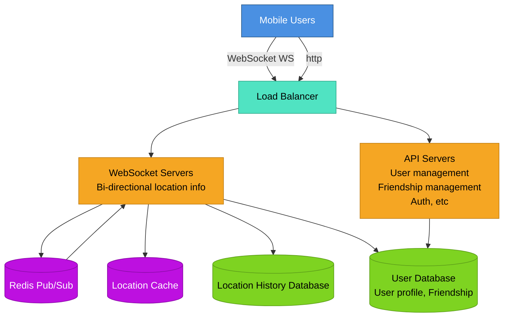
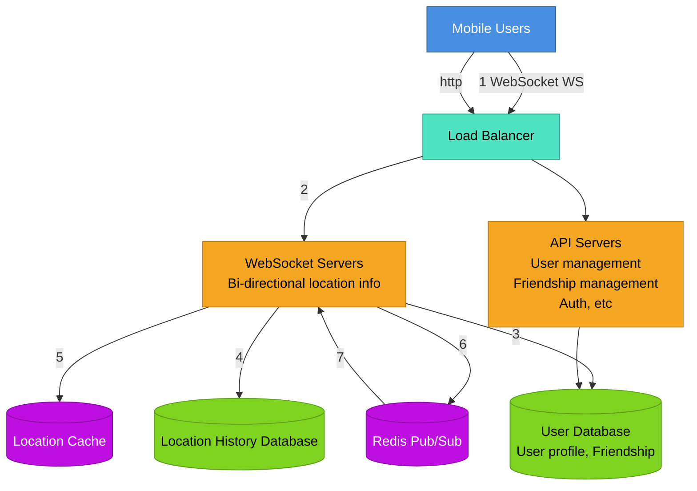
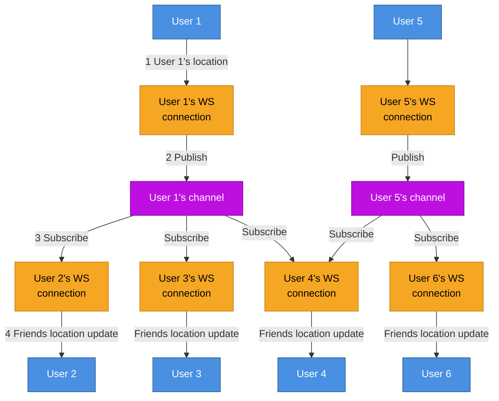

# Nearby Friends

when a opt-in user grants permission to access their location, the mobile client presents a list fo friends who are geographically neaby.

here the location changes for friends, so dynamic data, proximity service was like for static data

## Design Scope

- 5 miles radius, configurable
- assume straight line for now, in real-life there can be a river b/w 2
- user- 1 billion, 10% use friend feature
- store location history
- inactive users are no longer shown

## Functional Requirements

- user is able to see nearby friends, each entry has distance and timestamp when it was last updated.
- update every few seconds

## Non-Functional Requirements

- low latency
- reliable overall, but occasional data point loss is acceptable
- eventual consistency

## Back of Envelope Estimation

- 5 mile radius
- update every 30 sec(human walking speed is low)
- 100 million users
- 400 friends for 1 user
- pagination of 20

QPS:

- 100 million DAU
- concurrent users: 10% \* 100 million
- location update: 30 sec
- location update QPS: 10 million/30=334,000

# High Level Design

well user wants location update from every of contact, one way to do it is peer-to-peer
user can maintain connection with each device individually, but not efficient

solution is not practical cause phone can have flaky connections, tight power consumption
practical approach would be to have a shared backend

backend responsibilites:

- receive location update from user
- for location update find concerned users, and forward to them
- if distance>threshold, do not forward

10 million active users
update information every 30 seconds
334k updates per second

avg each user- 400 friends
10% online
334kx400x10%=14 million location updates/second

## Proposed Design

- `Load Balancer`: distribute traffic across servers to spread out load evenly
- `RESTful API`: handles request/response traffic
- `WebSocket Server`: handles the users connections and then updates the location when it changes
- `Redis location cache`: stores most recent location data for each active user, TTl is set on each entry, when TTl expires, user is not active location gets revoked from cache
- `User DataBase`: stores user data and friendship data
- `Location History DB`: stores users historical location data.
- `Redis`: maintains and creates the channels easily

## Location Update

example:

## API Design

### WebSocket APIs

Users send/receive location updates through WebSocket protocol:

1. **Periodic location update**
   - Request: Client sends latitude, longitude, timestamp
   - Response: Nothing

2. **Client receives location updates**
   - Data sent: Friend location data and timestamp

3. **WebSocket initialization**
   - Request: Client sends latitude, longitude, timestamp
   - Response: Client receives friends' location data

4. **Subscribe to new friend**
   - Request: WebSocket server sends friend ID
   - Response: Friend's latest latitude, longitude, timestamp

5. **Unsubscribe a friend**
   - Request: WebSocket server sends friend ID
   - Response: Nothing

### HTTP APIs

API servers handle: adding/removing friends, updating user profiles, auth, etc.

## Data Model

### Location Cache (Redis)

- Stores latest locations of all active users with nearby friends feature ON
- **Key:** `user_id`
- **Value:** `{latitude, longitude, timestamp}`
- TTL set on each key, renewed on every update
- Auto-purges inactive users

**Why Redis?**

- Only need current location (1 per user)
- Super-fast read/write
- TTL support
- Not durable storage needed - if Redis goes down, replace with empty instance and let cache refill
- Users miss 1-2 update cycles while cache warms (acceptable tradeoff)

**Scaling:**

- 10M active users × 100 bytes = ~1GB (single server can handle)
- But 334K updates/sec too high for single server
- **Solution:** Shard by user ID across multiple Redis servers
- Add replication with standby nodes for availability

### Location History Database

**Schema:** `user_id | latitude | longitude | timestamp`

**Requirements:**

- Heavy write workload
- Horizontal scaling

**Options:**

- **Cassandra** (good candidate)
- **Relational DB** with sharding by user ID (ensures even load distribution)

### User Database

- Stores user profiles (user ID, username, profile URL, etc.)
- Stores friendships
- At scale: shard by user ID (horizontally scalable)
- Likely managed by dedicated team via internal API

# Design Deep Dive

## Scaling Components

### API Servers

- Stateless servers
- Auto-scale based on CPU usage, load, or I/O
- Well-understood scaling methods

### WebSocket Servers

- **Stateful servers** - requires careful handling
- Before removing node: mark as "draining" at load balancer
- No new connections routed to draining server
- Wait for existing connections to close
- Same care needed for software version releases
- Good load balancer handles stateful auto-scaling well

### Client Initialization Flow

When WebSocket connection initialized:

1. Update user's location in location cache
2. Save location in connection handler variable
3. Load all user's friends from user database
4. Batched request to location cache for friends' locations (TTL removes inactive friends)
5. Compute distance for each friend, return if within search radius
6. Subscribe to **ALL** friends' channels in Redis Pub/Sub (active + inactive)
   - Creating channels is cheap
   - Inactive friends use minimal memory, no CPU/I/O until online
7. Send user's location to user's channel in Redis Pub/Sub

### Location Cache Scaling

- Single Redis: can handle 10M users (~1GB)
- Problem: 334K updates/sec too high
- Solution: Shard by user ID across multiple Redis servers
- Add replication: standby nodes for availability
- If primary down, promote standby quickly

## Redis Pub/Sub Deep Dive

### Why Redis Pub/Sub?

- Lightweight channel creation
- Channel created on first subscribe
- No subscribers = message dropped (minimal load)
- Channel uses: hash table + linked list to track subscribers
- Offline channels use no CPU after creation

### Design Benefits

1. Unique channel per user using "nearby friends"
2. User subscribes to ALL friends' channels (online + offline)
3. Backend doesn't handle subscribe/unsubscribe on friend status change
4. **Tradeoff:** more memory, simpler architecture

### Capacity Planning

**Memory:**

- 100M channels (1B × 10%)
- 100 active friends avg per user
- 20 bytes per subscriber
- Total: 200GB (100M × 20 bytes × 100 / 10⁹)
- **Need: ~2 Redis servers** (with 100GB memory each)

**CPU:**

- 14M updates/sec to push
- Assume: 100K pushes/sec per server (conservative)
- **Need: 14M / 100K = 140 Redis servers**
- **Bottleneck: CPU, not memory**

### Distributed Redis Pub/Sub Cluster

**Service Discovery (etcd/ZooKeeper):**

- Stores hash ring of active Redis Pub/Sub servers
- Key: `/config/pub_sub_ring`
- Value: `["p_1", "p_2", "p_3", "p_4"]`
- WebSocket servers subscribe to updates

**How it works:**

1. WebSocket server consults hash ring (cached locally)
2. Hash channel name to find correct Redis server
3. Publish/Subscribe to that server
4. Subscribe to hash ring updates

**Scaling Up/Down:**

- Treat as **stateful cluster** (like storage)
- Over-provision for peak traffic
- Resize causes channel moves → mass resubscriptions
- Do during low usage periods

**Steps:**

1. Determine new ring size, provision servers
2. Update hash ring key
3. Monitor CPU spike in WebSocket cluster

**Replacing Failed Server:**

- Monitoring alerts on-call operator
- Update hash ring with new node
- WebSocket handlers re-subscribe affected channels
- **Lower risk** than full resize (only affected channels move)

**Example:** Replace `p_1` with `p_1_new`:

- Old: `["p_1", "p_2", "p_3", "p_4"]`
- New: `["p_1_new", "p_2", "p_3", "p_4"]`

## Adding/Removing Friends

**Add Friend:**

- Client callback on friend add
- Sends message to WebSocket server
- Server subscribes to new friend's channel
- Returns friend's latest location/timestamp if active

**Remove Friend:**

- Client callback on friend remove
- Sends message to WebSocket server
- Server unsubscribes from friend's channel

**Opt-in/out:**

- Same subscribe/unsubscribe mechanism

## Users with Many Friends

- Hard cap on friends (e.g., Facebook: 5K)
- Bi-directional friendships (not follower model)
- Pub/Sub subscribers scattered across WebSocket servers
- Load spread evenly, **no hotspots**
- "Whale" users spread across 100+ Pub/Sub servers
- Incremental load won't overwhelm single server

## Nearby Random Person (Extra Credit)

**Design:**

- Pool of Pub/Sub channels by geohash
- One channel per geohash grid
- Users subscribe to their grid's channel

**Flow:**

1. User updates location
2. Connection handler computes geohash ID
3. Sends location to geohash channel
4. Nearby subscribers receive update (exclude sender)

**Border Handling:**

- Subscribe to **9 grids:** current + 8 surrounding
- Ensures coverage for users near borders

## Alternative: Erlang

**Why better than Redis Pub/Sub:**

- Lightweight processes (~300 bytes each)
- Millions of processes per server
- No CPU when idle
- Easy distribution across servers
- Great debugging/deployment tools

**Implementation:**

- WebSocket service in Erlang
- Replace entire Redis Pub/Sub cluster with Erlang app
- Each user = one Erlang process
- Native subscription in Erlang/OTP
- Efficient mesh of connections

**Challenge:**

- Niche language
- Hard to hire Erlang developers
- Need existing team expertise

# Reference

1. [Facebook Launches "Nearby Friends"](https://techcrunch.com/2014/04/17/facebook-nearby-friends/)
2. [Redis Pub/Sub ](https://redis.io/topics/pubsub)
3. [Redis Pub/Sub under the hood](https://making.pusher.com/redis-pubsub-under-the-hood/)
4. [etcd](https://etcd.io/)
5. [ZooKeeper](https://zookeeper.apache.org/)
6. [Consistent hashingones](https://www.toptal.com/big-data/consistent-hashing)
7. [Erlang](https://www.erlang.org/)
8. [Elixir](https://elixir-lang.org/)
9. [A brief introduction to BEAM](https://www.erlang.org/blog/a-brief-beam-primer/)
10. [OTP](https://www.erlang.org/doc/design_principles/des_princ.html)
