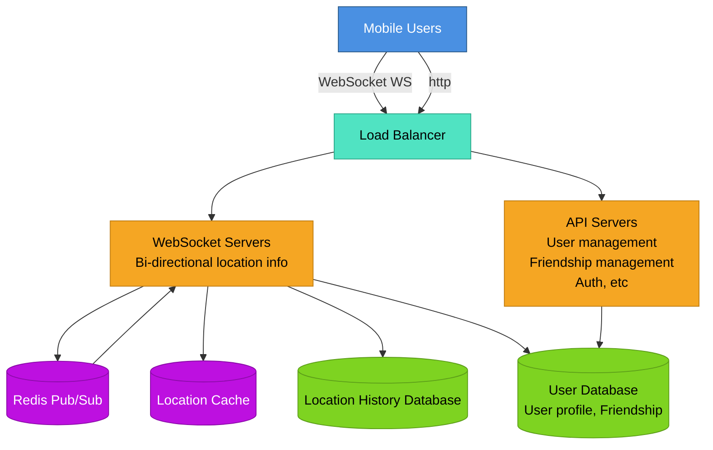
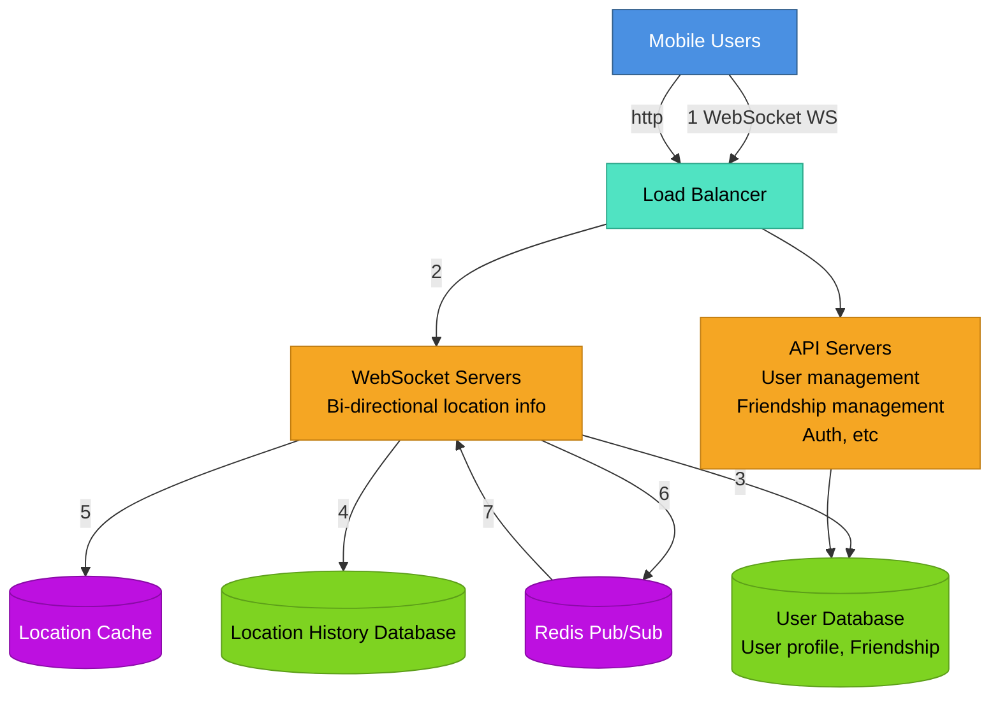
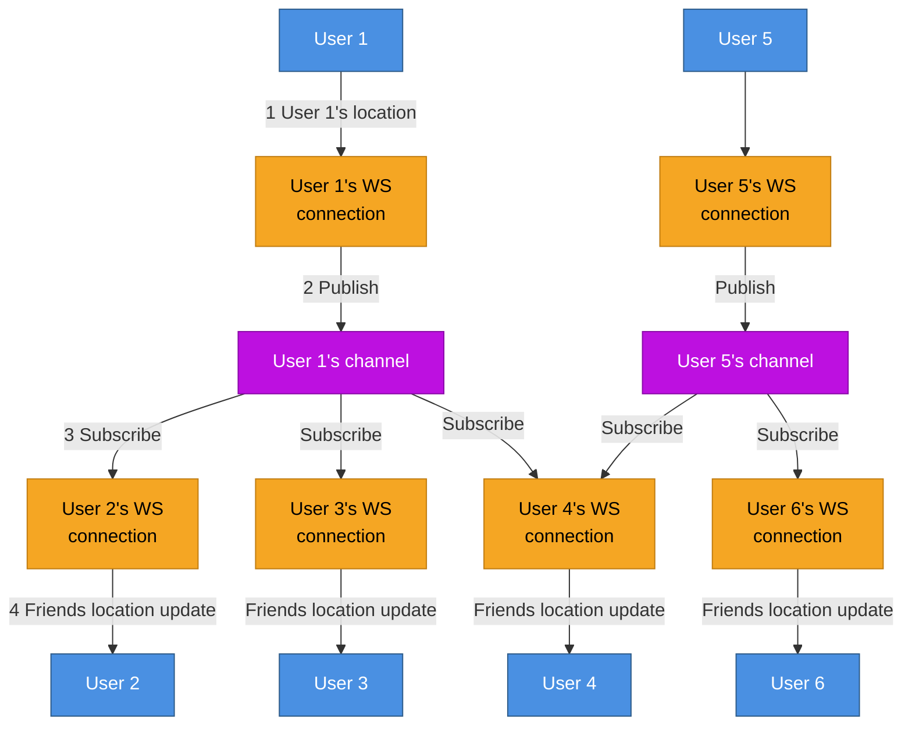

# Nearby Friends

When a opt-in user grants permission to `access their location`, the mobile client presents a list fo friends who are geographically neaby.

Here the location changes for friends, hence dynamic data, proximity service was like for static data

- Proximity Service: Static Location
- Nearby Service: Dynamic Location

## Design Scope

- 5 miles radius, configurable
- assume straight line for now, in real-life there can be a river b/w the two users
- user count 1 billion, 10% use friend feature
- store location history
- inactive users are no longer shown

## Functional Requirements

- User is able to see nearby friends, each entry has distance and timestamp when it was last updated.
- Update every few seconds

## Non-Functional Requirements

- low latency
- reliable overall, but occasional data point loss is acceptable
- eventual consistency

## Back of Envelope Estimation

- 5 mile radius
- update every 30 sec(human walking speed is low)
- 100 million users
- 400 friends for 1 user
- pagination of 20

QPS:

- 100 million DAU
- concurrent users: 10% \* 100 million
- location update: 30 sec
- location update QPS: 10 million/30=334,000

# High Level Design

User wants location update from every of contact, one way to do it is peer-to-peer
User can maintain connection with each device individually, but not efficient

It is Not Practical solution cause phone can have flaky connections, tight power consumption
Practical Solution : shared backend

backend responsibilites:
- receive location update from user
- for location update find concerned users, and forward to them
- if distance>threshold, do not forward

Active Users: 10 Million
Update Information every 30 seconds
334k updates per second

Each user has average 400 friends
10% online
334kx400x10%=14 million location updates/second

## Proposed Design


```mermaid
graph TD
    MobileUsers[Mobile Users]
    LB[Load Balancer]
    WSServers[WebSocket Servers<br/>Bi-directional location info]
    APIServers[API Servers<br/>User management<br/>Friendship management<br/>Auth, etc]
    Redis[(Redis Pub/Sub)]
    LocationCache[(Location Cache)]
    LocationHistory[(Location History Database)]
    UserDB[(User Database<br/>User profile, Friendship)]

    MobileUsers -->|WebSocket WS| LB
    MobileUsers -->|http| LB
    LB --> WSServers
    LB --> APIServers
    WSServers --> Redis
    Redis --> WSServers
    WSServers --> LocationCache
    WSServers --> LocationHistory
    WSServers --> UserDB
    APIServers --> UserDB

    classDef client fill:#4A90E2,stroke:#2E5C8A,color:#fff
    classDef loadbalancer fill:#50E3C2,stroke:#2BA88A,color:#000
    classDef server fill:#F5A623,stroke:#C17D11,color:#000
    classDef cache fill:#BD10E0,stroke:#8B0AA8,color:#fff
    classDef database fill:#7ED321,stroke:#5C9E19,color:#000

    class MobileUsers client
    class LB loadbalancer
    class WSServers,APIServers server
    class Redis,LocationCache cache
    class LocationHistory,UserDB database
```

- `Load Balancer`: distribute traffic across servers to spread out load evenly
- `RESTful API`: handles request/response traffic
- `WebSocket Server`: handles the users connections and then updates the location when it changes
- `Redis location cache`: stores most recent location data for each active user, TTl is set on each entry, when TTl expires, user is not active location gets revoked from cache
- `User DataBase`: stores user data and friendship data
- `Location History DB`: stores users historical location data.
- `Redis`: maintains and creates the channels easily

## Location Update


```mermaid
graph TD
    MobileUsers[Mobile Users]
    LB[Load Balancer]
    WSServers[WebSocket Servers<br/>Bi-directional location info]
    APIServers[API Servers<br/>User management<br/>Friendship management<br/>Auth, etc]
    Redis[(Redis Pub/Sub)]
    LocationCache[(Location Cache)]
    LocationHistory[(Location History Database)]
    UserDB[(User Database<br/>User profile, Friendship)]

    MobileUsers -->|1 WebSocket WS| LB
    MobileUsers -->|http| LB
    LB -->|2| WSServers
    LB --> APIServers
    WSServers -->|5| LocationCache
    WSServers -->|4| LocationHistory
    WSServers -->|3| UserDB
    WSServers -->|6| Redis
    Redis -->|7| WSServers
    APIServers --> UserDB

    classDef client fill:#4A90E2,stroke:#2E5C8A,color:#fff
    classDef loadbalancer fill:#50E3C2,stroke:#2BA88A,color:#000
    classDef server fill:#F5A623,stroke:#C17D11,color:#000
    classDef cache fill:#BD10E0,stroke:#8B0AA8,color:#fff
    classDef database fill:#7ED321,stroke:#5C9E19,color:#000

    class MobileUsers client
    class LB loadbalancer
    class WSServers,APIServers server
    class Redis,LocationCache cache
    class LocationHistory,UserDB database
```

example:


```mermaid
graph TD
    U1[User 1]
    U5[User 5]
    U2[User 2]
    U3[User 3]
    U4[User 4]
    U6[User 6]

    WS1[User 1's WS<br/>connection]
    WS5[User 5's WS<br/>connection]
    WS2[User 2's WS<br/>connection]
    WS3[User 3's WS<br/>connection]
    WS4[User 4's WS<br/>connection]
    WS6[User 6's WS<br/>connection]

    CH1[User 1's channel]
    CH5[User 5's channel]

    U1 -->|1 User 1's location| WS1
    U5 --> WS5

    WS1 -->|2 Publish| CH1
    WS5 -->|Publish| CH5

    CH1 -->|3 Subscribe| WS2
    CH1 -->|Subscribe| WS3
    CH1 -->|Subscribe| WS4

    CH5 -->|Subscribe| WS4
    CH5 -->|Subscribe| WS6

    WS2 -->|4 Friends location update| U2
    WS3 -->|Friends location update| U3
    WS4 -->|Friends location update| U4
    WS6 -->|Friends location update| U6

    classDef user fill:#4A90E2,stroke:#2E5C8A,color:#fff
    classDef wsconn fill:#F5A623,stroke:#C17D11,color:#000
    classDef channel fill:#BD10E0,stroke:#8B0AA8,color:#fff

    class U1,U2,U3,U4,U5,U6 user
    class WS1,WS2,WS3,WS4,WS5,WS6 wsconn
    class CH1,CH5 channel
```

## API Design

### WebSocket APIs

Users send/receive location updates in real time through WebSocket protocol:

1. **Periodic location update**
   - Request: Client sends latitude, longitude, timestamp
   - Response: Nothing

2. **Client receives location updates**
   - Data sent: Friend location data and timestamp

3. **WebSocket initialization**
   - Request: Client sends latitude, longitude, timestamp
   - Response: Client receives friends' location data

4. **Subscribe to new friend**
   - Request: WebSocket server sends friend ID
   - Response: Friend's latest latitude, longitude, timestamp

5. **Unsubscribe a friend**
   - Request: WebSocket server sends friend ID
   - Response: Nothing

### HTTP APIs

API servers handle: adding/removing friends, updating user profiles, auth, etc.

## Data Model

### Location Cache (Redis)

- Stores latest locations of all active users with nearby friends feature ON
- **Key:** `user_id`
- **Value:** `{latitude, longitude, timestamp}`
- TTL set on each key, renewed on every update
- Auto-purges inactive users

**Why Redis?**

- Only need current location (1 per user)
- Super-fast read/write
- TTL support
- Not durable storage needed - if Redis goes down, replace with empty instance and let cache refill
- Users miss 1-2 update cycles while cache warms (acceptable tradeoff)

**Scaling:**

- 10M active users × 100 bytes = ~1GB (single server can handle)
- But 334K updates/sec too high for single server
- **Solution:** Shard by user ID across multiple Redis servers
- Add replication with standby nodes for availability

### Location History Database

**Schema:** `user_id | latitude | longitude | timestamp`

**Requirements:**

- Heavy write workload
- Horizontal scaling

**Options:**

- **Cassandra** (good candidate)
- **Relational DB** with sharding by user ID (ensures even load distribution)

### User Database

- Stores user profiles (user ID, username, profile URL, etc.)
- Stores friendships
- At scale: shard by user ID (horizontally scalable)
- Likely managed by dedicated team via internal API

# Design Deep Dive

## Scaling Components

### API Servers

- Stateless servers
- Auto-scale based on CPU usage, load, or I/O
- Well-understood scaling methods

### WebSocket Servers

- **Stateful servers** - requires careful handling
- Before removing node: mark as "draining" at load balancer
- No new connections routed to draining server
- Wait for existing connections to close
- Same care needed for software version releases
- Good load balancer handles stateful auto-scaling well

### Client Initialization Flow

When WebSocket connection initialized:

1. Update user's location in location cache
2. Save location in connection handler variable
3. Load all user's friends from user database
4. Batched request to location cache for friends' locations (TTL removes inactive friends)
5. Compute distance for each friend, return if within search radius
6. Subscribe to **ALL** friends' channels in Redis Pub/Sub (active + inactive)
   - Creating channels is cheap
   - Inactive friends use minimal memory, no CPU/I/O until online
7. Send user's location to user's channel in Redis Pub/Sub

### Location Cache Scaling

- Single Redis: can handle 10M users (~1GB)
- Problem: 334K updates/sec too high
- Solution: Shard by user ID across multiple Redis servers
- Add replication: standby nodes for availability
- If primary down, promote standby quickly

## Redis Pub/Sub Deep Dive

### Why Redis Pub/Sub?

- Lightweight channel creation
- Channel created on first subscribe
- No subscribers = message dropped (minimal load)
- Channel uses: hash table + linked list to track subscribers
- Offline channels use no CPU after creation

### Design Benefits

1. Unique channel per user using "nearby friends"
2. User subscribes to ALL friends' channels (online + offline)
3. Backend doesn't handle subscribe/unsubscribe on friend status change
4. **Tradeoff:** more memory, simpler architecture

### Capacity Planning

**Memory:**

- 100M channels (1B × 10%)
- 100 active friends avg per user
- 20 bytes per subscriber
- Total: 200GB (100M × 20 bytes × 100 / 10⁹)
- **Need: ~2 Redis servers** (with 100GB memory each)

**CPU:**

- 14M updates/sec to push
- Assume: 100K pushes/sec per server (conservative)
- **Need: 14M / 100K = 140 Redis servers**
- **Bottleneck: CPU, not memory**

### Distributed Redis Pub/Sub Cluster

**Service Discovery (etcd/ZooKeeper):**

- Stores hash ring of active Redis Pub/Sub servers
- Key: `/config/pub_sub_ring`
- Value: `["p_1", "p_2", "p_3", "p_4"]`
- WebSocket servers subscribe to updates

**How it works:**

1. WebSocket server consults hash ring (cached locally)
2. Hash channel name to find correct Redis server
3. Publish/Subscribe to that server
4. Subscribe to hash ring updates

**Scaling Up/Down:**

- Treat as **stateful cluster** (like storage)
- Over-provision for peak traffic
- Resize causes channel moves → mass resubscriptions
- Do during low usage periods

**Steps:**

1. Determine new ring size, provision servers
2. Update hash ring key
3. Monitor CPU spike in WebSocket cluster

**Replacing Failed Server:**

- Monitoring alerts on-call operator
- Update hash ring with new node
- WebSocket handlers re-subscribe affected channels
- **Lower risk** than full resize (only affected channels move)

**Example:** Replace `p_1` with `p_1_new`:

- Old: `["p_1", "p_2", "p_3", "p_4"]`
- New: `["p_1_new", "p_2", "p_3", "p_4"]`

## Adding/Removing Friends

**Add Friend:**

- Client callback on friend add
- Sends message to WebSocket server
- Server subscribes to new friend's channel
- Returns friend's latest location/timestamp if active

**Remove Friend:**

- Client callback on friend remove
- Sends message to WebSocket server
- Server unsubscribes from friend's channel

**Opt-in/out:**

- Same subscribe/unsubscribe mechanism

## Users with Many Friends

- Hard cap on friends (e.g., Facebook: 5K)
- Bi-directional friendships (not follower model)
- Pub/Sub subscribers scattered across WebSocket servers
- Load spread evenly, **no hotspots**
- "Whale" users spread across 100+ Pub/Sub servers
- Incremental load won't overwhelm single server

## Nearby Random Person (Extra Credit)

**Design:**

- Pool of Pub/Sub channels by geohash
- One channel per geohash grid
- Users subscribe to their grid's channel

**Flow:**

1. User updates location
2. Connection handler computes geohash ID
3. Sends location to geohash channel
4. Nearby subscribers receive update (exclude sender)

**Border Handling:**

- Subscribe to **9 grids:** current + 8 surrounding
- Ensures coverage for users near borders

## Alternative: Erlang

**Why better than Redis Pub/Sub:**

- Lightweight processes (~300 bytes each)
- Millions of processes per server
- No CPU when idle
- Easy distribution across servers
- Great debugging/deployment tools

**Implementation:**

- WebSocket service in Erlang
- Replace entire Redis Pub/Sub cluster with Erlang app
- Each user = one Erlang process
- Native subscription in Erlang/OTP
- Efficient mesh of connections

**Challenge:**

- Niche language
- Hard to hire Erlang developers
- Need existing team expertise


## [Redis Pub/Sub ](https://redis.io/topics/pubsub)

SUBSCRIBE, UNSUBSCRIBE and PUBLISH implement the Publish/Subscribe messaging paradigm where senders (publishers) are not programmed to send their messages to specific receivers (subscribers). Published messages are categorized into channels, without knowledge of what (if any) subscribers there may be. Subscribers express interest in one or more channels and only receive messages that are of interest, without knowledge of what (if any) publishers there are. This decoupling of publishers and subscribers allows for greater scalability and a more dynamic network topology.

For instance, to subscribe to channels "channel11" and "ch:00":

```redis
SUBSCRIBE channel11 ch:00
```

Messages sent by other clients to these channels will be pushed by Redis to all the subscribed clients. Subscribers receive the messages in the order that the messages are published.

A client subscribed to one or more channels shouldn't issue commands, although it can SUBSCRIBE and UNSUBSCRIBE to and from other channels. The commands allowed in the context of a subscribed RESP2 client are: PING, PSUBSCRIBE, PUNSUBSCRIBE, QUIT, RESET, SSUBSCRIBE, SUBSCRIBE, SUNSUBSCRIBE, UNSUBSCRIBE. However, if RESP3 is used (see HELLO), a client can issue any commands while in the subscribed state.

### Delivery Semantics

Redis' Pub/Sub exhibits **at-most-once** message delivery semantics — a message will be delivered once if at all. Once the message is sent by the Redis server, there's no chance of it being sent again. If the subscriber is unable to handle the message (e.g., due to an error or a network disconnect) the message is forever lost. For stronger delivery guarantees, consider **Redis Streams**, which support both at-most-once and at-least-once delivery semantics.

### Format of Pushed Messages

A message is an array-reply with three elements. The first element is the kind of message:

- **subscribe**: successfully subscribed to the channel (second element). Third argument = number of channels currently subscribed to.
- **unsubscribe**: successfully unsubscribed from the channel (second element). Third argument = number of channels currently subscribed to. When zero, the client exits Pub/Sub state.
- **message**: a message received as a result of a PUBLISH command. Second element = originating channel, third = actual message payload.

### Database & Scoping

Pub/Sub has no relation to the key space. Publishing on db 10 will be heard by a subscriber on db 1. If you need scoping, prefix the channels with the environment name (test, staging, production...).

### Wire Protocol Example

```
SUBSCRIBE first second
*3
$9
subscribe
$5
first
:1
*3
$9
subscribe
$6
second
:2
```

From another client: `PUBLISH second Hello`

The first client receives:

```
*3
$7
message
$6
second
$5
Hello
```

### Pattern-Matching Subscriptions

Clients may subscribe to glob-style patterns to receive all messages sent to channel names matching a given pattern:

```redis
PSUBSCRIBE news.*
```

This receives all messages sent to `news.art.figurative`, `news.music.jazz`, etc. To unsubscribe:

```redis
PUNSUBSCRIBE news.*
```

Messages received via pattern matching are sent as type **pmessage**: second element = original pattern matched, third = originating channel, last = actual message payload.

A client may receive a single message multiple times if subscribed to multiple patterns matching a published message, or if subscribed to both patterns and channels matching the message.

### Sharded Pub/Sub (Redis 7.0+)

Shard channels are assigned to slots by the same algorithm used to assign keys to slots. A shard message must be sent to a node that owns the slot the shard channel is hashed to. Uses SSUBSCRIBE, SUNSUBSCRIBE and SPUBLISH. This restricts message propagation to within the shard of a cluster, reducing data passing through the cluster bus compared to global Pub/Sub and allowing horizontal scaling by adding more shards.