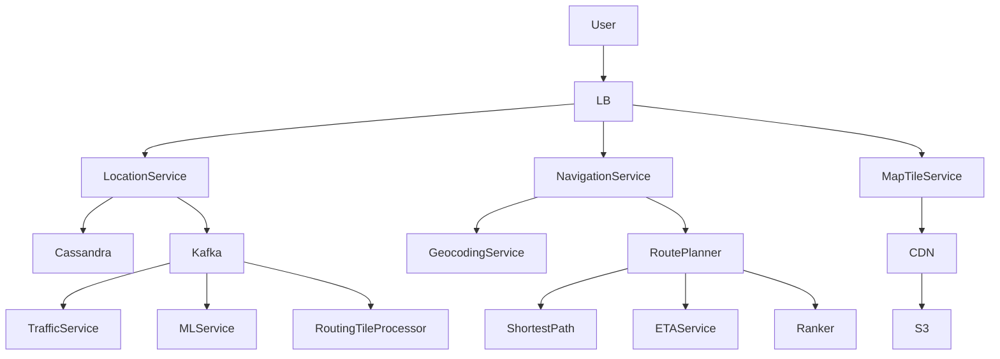
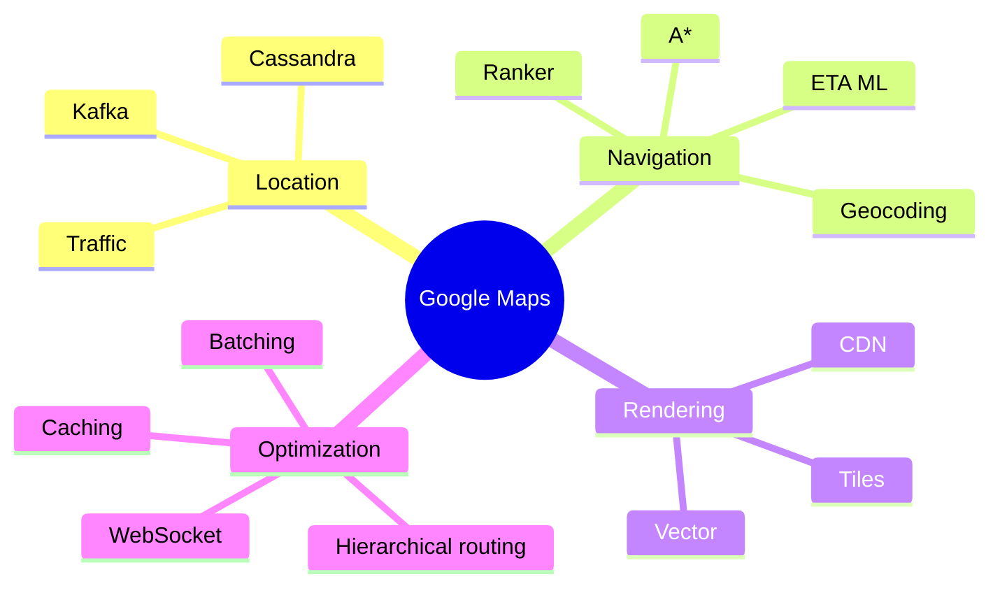

# Designing a Simple Version of Google Maps

This is a **complete, one-stop system design guide** for building Google Maps at scale.

We will cover:

- Requirements & back-of-the-envelope estimation
- Core geospatial concepts (projection, geohashing, routing tiles)
- High-level architecture
- Deep dive into services and data models
- Adaptive ETA & rerouting
- CDN, bandwidth and storage math
- Trade-offs and interview insights
- Summary of all referenced articles

---

# 1. Requirements

### Functional Requirements

1. Location updates (real-time GPS tracking)
2. Navigation with ETA
3. Map rendering (zoom, pan)
4. Traffic-aware routing
5. Multiple travel modes (driving, walking, transit)

### Non-Functional Requirements

- Highly available
- Low latency
- Highly accurate
- Low mobile data usage
- Horizontally scalable

---

# 2. Map 101 – Core Geospatial Concepts

---

## 2.1 Positioning System

Earth is a rotating sphere.

- **Latitude** → North/South
- **Longitude** → East/West

Coordinates uniquely identify a location:

```
(37.423021, -122.083739)
```

---

## 2.2 3D → 2D: Map Projection

Transforming spherical Earth to flat 2D surface is called **Map Projection**.

Google Maps uses:

## Web Mercator


### Why Web Mercator?

- Preserves angles (important for navigation)
- Tiles align into perfect squares
- Easy tiling system
- Industry standard for web maps

### Trade-off

- Distorts area near poles

---

### Other Projections (Reference Summary)

| Projection                    | Key Property        | Tradeoff         |
| ----------------------------- | ------------------- | ---------------- |
| Mercator projection           | Preserves angles    | Area distortion  |
| Gall–Peters projection        | Preserves area      | Shape distortion |
| Winkel tripel projection      | Balanced compromise | Not conformal    |
| Peirce quincuncial projection | Conformal           | Complex layout   |

For navigation, **angle preservation matters most**, hence Mercator.

---

## 2.3 Geocoding

Convert address → (lat, lng)

Example:

```
"1600 Amphitheatre Parkway" → (37.423021, -122.083739)
```

### How it works

- Parse address
- Match against GIS database
- Interpolate building location
- Return coordinate

Reverse geocoding does opposite.

---

## 2.4 Geohashing

Spatial indexing technique that encodes lat/lng into short string.

Recursive space partitioning:

```
World
 ├── 00
 ├── 01
 ├── 10
 └── 11
```

Each block subdivided recursively.

Benefits:

- Nearby locations share prefix
- Easy sharding
- Perfect for tiling
- Efficient range queries

---

# 3. Map Rendering

---

## 3.1 Tile-Based Rendering

Instead of rendering whole world:

- Break into 256×256 pixel tiles
- Client fetches only visible tiles
- Tiles stitched into mosaic

### Zoom Levels

Google Maps uses 21 zoom levels.


- Zoom 0 → 1 tile (whole Earth)
- Zoom 1 → 2×2 tiles
- Zoom 2 → 4×4 tiles
- Each zoom → 4× more tiles

---

## 3.2 Raster vs Vector Tiles

Modern systems use vectors.


### Why vectors?

- Smaller payload
- Smooth zooming
- No pixelation
- GPU accelerated via WebGL

This aligns with insights from **Google’s smoother map article**:
Move rendering to client GPU → better performance & less bandwidth.

---

# 4. Back-of-Envelope Estimation

---

## Storage

### Tiles at Zoom 21

- ~4.4 trillion tiles
- 100KB each
- ≈ 440 PB

After compression (90% water/desert):

≈ 50–70 PB

Safe estimate:

**~100 PB**

---

## Traffic Estimation

Assume:

- 1B DAU
- 35 mins/week usage
- 5B minutes/day

If 1 GPS update/sec:

```
5B × 60 = 300B requests/day
QPS ≈ 3M
```

Batch every 15s:

```
3M / 15 = 200K QPS
Peak (×5) ≈ 1M QPS
```

---

# 5. High-Level Architecture


```mermaid
graph TD

User --> LB
LB --> LocationService
LB --> NavigationService
LB --> MapTileService

LocationService --> Cassandra
LocationService --> Kafka

Kafka --> TrafficService
Kafka --> MLService
Kafka --> RoutingTileProcessor

NavigationService --> GeocodingService
NavigationService --> RoutePlanner

RoutePlanner --> ShortestPath
RoutePlanner --> ETAService
RoutePlanner --> Ranker

MapTileService --> CDN
CDN --> S3
```

---

# 6. Location Service

### Responsibilities

- Record location updates
- Feed traffic system
- Enable personalization

### Storage

- Cassandra
- Partition key: (user_id)
- Clustering key: timestamp

### CAP Theorem

Based on CAP theorem:

We choose:

- Availability
- Partition tolerance

Consistency can be eventual.

---

## Why Kafka?

- Decouples services
- Enables async processing
- High throughput stream ingestion

Consumers:

- Traffic update service
- ML models
- Routing tile processor
- Analytics

---

# 7. Routing & Navigation

---

## 7.1 Road Data Model

Road network = Graph

- Nodes → intersections
- Edges → roads
- Stored as adjacency list

Reference: Adjacency list

---

## 7.2 Routing Tiles

Inspired by hierarchical routing (Valhalla docs).

3 layers:

1. Local roads
2. Arterial roads
3. Highways

Stored in object storage.

Loaded on demand.

---

## 7.3 Shortest Path

Uses:

## A\* search algorithm

Why A\*?

- Faster than Dijkstra
- Uses heuristic (distance to goal)
- Perfect for spatial graphs

---

## 7.4 ETA Service

From:

- Real-time traffic
- Historical patterns
- ML models

Google research shows usage of Graph Neural Networks.

Reference summary from DeepMind traffic paper:

- Traffic modeled as graph
- Nodes = road segments
- GNN captures spatial dependencies
- Predicts future speeds 10–20 min ahead

Key insight:

Traffic is **spatio-temporal problem**, not independent edges.

---

## 7.5 Ranker

Filters:

- Avoid tolls
- Avoid highways
- Fastest
- Shortest
- User preference

Returns top-k routes.

---

# 8. Adaptive ETA & Rerouting

Naive approach:

Store route as list of tiles → O(n × m)

Optimized:

Store hierarchical parents:

```
r1 → super(r1) → super(super(r1))
```

When incident happens:

- Check high-level tile containment
- Filter most users quickly

Time reduces dramatically.

---

## Real-time Push

Options:

- Push notifications (limited)
- Long polling (inefficient)
- SSE
- WebSocket

Choose:

WebSocket (bi-directional, low latency)

---

# 9. Data Model Summary

| Data          | Storage        | Why                   |
| ------------- | -------------- | --------------------- |
| Location      | Cassandra      | High write throughput |
| Routing Tiles | Object storage | Large binary blobs    |
| Geocoding     | Redis          | Fast read             |
| Map Tiles     | CDN + S3       | Static, cacheable     |
| Traffic       | Time-series DB | Real-time analytics   |

---

# 10. CDN & Bandwidth

Assume:

- 30 km/h
- 200m × 200m tiles
- 25 tiles per km²
- 100KB per tile

→ 2.5MB/km²
→ 75MB/hour
→ 1.25MB/min

Global daily CDN traffic:

≈ 6.25B MB/day

With 200 POPs:

≈ 300MB/s per POP

---

# 11. Deep Dive Improvements

---

## Multi-Stop Routing

TSP (NP-hard)

Possible heuristics:

- Genetic algorithms
- Ant colony optimization
- Simulated annealing
- ML ranking

Used by delivery companies.

---

## Offline Support

- Pre-download tiles
- Cache route polyline
- GPS works offline
- Queue updates
- LRU eviction

---

## Privacy

- Anonymization
- Data retention policies
- Encryption
- GDPR compliance
- Rate limiting

---

# 12. Mermaid Overview


```mermaid
mindmap
  root((Google Maps))
    Location
      Cassandra
      Kafka
      Traffic
    Navigation
      Geocoding
      A*
      ETA ML
      Ranker
    Rendering
      Tiles
      CDN
      Vector
    Optimization
      Hierarchical routing
      Batching
      Caching
      WebSocket
```

---

# 13. Reference Article Summaries

---

### 1. Google Maps Platform Docs

- REST APIs for maps, places, directions
- Billing based on usage
- Rate limits
- API key security
- Modular services

Key takeaway:
Maps is API-driven microservices architecture.

---

### 2. Smoother Map Article

Key insight:

- Move rendering to GPU
- Use vector tiles
- Reduce bandwidth
- Enable fluid zooming

Performance shift from server → client.

---

### 3. Mercator Projection Article

- Preserves local angles
- Great for navigation
- Distorts area at poles

Chosen because navigation > visual area accuracy.

---

### 4. Address Geocoding Article

- Parsing → normalization → interpolation
- Rooftop vs approximate matches
- Uses multiple data sources

Accuracy tiers matter.

---

### 5. Geohashing Article

- Base32 encoding
- Prefix similarity
- Efficient range search
- Great for distributed sharding

Core spatial indexing technique.

---

### 6. Routing Tiles (Valhalla Docs)

- Tile-based routing graph
- Memory efficient
- Load on demand
- Hierarchical levels
- Used by large-scale navigation engines

---

### 7. DeepMind ETA (GNN Paper)

- Graph neural networks
- Predict travel time
- Spatio-temporal modeling
- Real-time updates
- Improves ETA accuracy significantly

---

### 8. Google Maps AI Traffic Blog

- Combines live data + historical trends
- ML forecasts traffic ahead
- Uses anonymized user speed signals
- Continuously retrains models

---

### 9. HTTP Keep-Alive

Persistent connections:

- Reduce handshake overhead
- Lower latency
- Important for frequent location updates

---

# 14. Final System Flow

1. User sends location → Location Service → Cassandra + Kafka
2. Kafka updates traffic + ML + routing tiles
3. User requests navigation → Geocoding → Route Planner
4. A\* finds paths
5. ETA ML ranks them
6. Ranker applies filters
7. Map tiles fetched via CDN
8. Adaptive ETA via WebSocket

---

# 15. Key Takeaways

This system combines:

- Distributed systems
- Graph algorithms
- Spatial indexing
- CDN architecture
- Stream processing
- ML prediction
- Hierarchical tiling
- Mobile optimization

Design pillars:

- Batch aggressively
- Cache everywhere
- Precompute heavy data
- Use hierarchical spatial partitioning
- Separate real-time from offline processing
- Optimize for availability

---

# Final Summary

Designing Google Maps requires:

- 100 PB storage
- 1M peak QPS
- Graph-based routing
- ML-based ETA
- Tile-based rendering
- CDN distribution
- Kafka-based streaming
- Cassandra for write-heavy workloads
- Hierarchical routing tiles
- WebSocket for adaptive rerouting

It is a combination of:

Geospatial math + distributed systems + graph theory + ML + large-scale caching.
