# Google Maps

Designing a simple version of Google Maps

- 1 million DAU
- location update, navigation, ETA, map rendering
- road data is raw, TBs of size
- consider traffic also
- different travel modes like driving, walking, bus etc

Mainly 3 area of focus: User location Update, Navigation service including ETA service, Map Rendering

# Positioning System

World is a sphere that rotates on its axis. At very top is north pole, and at bottom is south pole

Lat(Lattitude): Denotes how far north or south we are
Long(Longitude): Denotes how far east or west we are

# Going 3D to 2D

this process of translating points from 3d to 2d is called Map Projection

Google Maps uses Web Mercator.

# GeoCoding

Process of converting Address to Geographic Coordinates
ex: `1600 Amphitheatre Parkway, Mountain View, CA` encodes to `(Lattitude:37.423021, Longitude:-122.083739)`
one way is interpolation, leverages data from different sources such as Geographic Information System(GIS)

# GeoHashig

encoding system that encodes geographic area into short string of letters and digits.
so basically convert whole 2d map of world into 4 parts, like do it recursively from 0 to 3
so whole square will have like 01,11,00,10
then that 01 wu=ill be again parted into 4 like: [01 01],[01 11],[01 00],[01 10]

we are using GeoHashig to do Map Tiling

# Map Rendering

okay so instead of rendering whole map as one large image we break it up into smaller tiles.
Client only downloads relevant tiles for area user is in, stitches them up for mosiac like display.

so if user is zommed out at max, do you download whole map, no
client would download one tile at lowest zoom level, which represent entire world with single 256x256 pixel image.

## Road Data processing for Navigation Algorithms

most of them are either Djisktra or A-Star algos
they operate on top of graph data structure where intersections are nodes, and roads are edges.

hmm algo is sensitive to sixe of graph, so graph is broken into manageable unit for these algos to work at our scale

By breaking up road networks into routing tiles that can be loaded on demand, the routing algo significantly reduce memory consumption

## Hierarchical routing Tiles

basically 3 types of tiling,

- shows local and small roads
- arterial roads connectiing districts together
- cover large ares and contain only major highways connecting cities and states together.

# Back of Envelop Estimation

- 1 foot = 0.3048 meters
- 1 kilometer = 0.6214 miles
- 1 km = 1000 meters

### 🗺️ Storage Usage Summary

We need to store three main things:

1. **Map images (tiles)**
2. **Metadata (tiny, can ignore)**
3. **Road data (from external sources, several TBs)**

### 🌍 Map of the World (Main Storage)

- Maps are made of **tiles** — small 256×256 pixel images.
- At the **highest zoom level (21)**, there are about **4.4 trillion tiles**.
- Each tile ≈ **100 KB** → total ≈ **440 PB** (petabytes).

But:

- About **90% of Earth** is ocean, desert, or mountains — easy to compress.
- So, real storage needed ≈ **50 PB** after compression.

### 📉 Lower Zoom Levels

- Each lower zoom level has **¼ as many tiles** (since both width and height are halved).
- Adding up storage from all levels gives about **67 PB total**.
- To be safe, round it to about **100 PB** for all map tiles.

### 🧮 Final Estimate

| Data Type                 | Size Estimate |
| ------------------------- | ------------- |
| Map Tiles                 | ~100 PB       |
| Metadata                  | Negligible    |
| Road Data (routing tiles) | Several TBs   |

Server Throughput
Two main types of requests:

1. Navigation requests: Initiate a navigation session
2. Location update requests: Sent as user moves during navigation
   Location Update Analysis
   Assumptions:

- 1 billion DAU
- Each user uses navigation for 35 minutes per week on average
- Translates to 35 billion minutes per week or 5 billion minutes per day
  Simple approach (every second):
- Sending GPS coordinates every second
- Results in 300 billion requests per day (5 billion minutes × 60)
- QPS: 3 million (300 billion / 10⁵ seconds in a day)
  Optimized approach (batching):
- Client batches updates and sends them every 15 seconds instead
- Reduces QPS to 200,000 (3 million / 15)
- Frequency can depend on factors like user speed
- If stuck in traffic, client can slow down GPS updates
  Peak QPS:
- Assume peak QPS is 5× the average
- Peak QPS for location updates = 200,000 × 5 = 1 million

Step 2 - High-Level Design
Architecture Overview
Navigation
Service
Mobile User
Load Balancer
Geocoding DB
Routing Tiles
(Object storage)
Location
Service
User Location DB

CON
Precomputed Map Images
(Origin)
Figure 3.7: High-level design
The high-level design supports three main features:

1. Location service
2. Navigation service
3. Map rendering

4. Location Service
   Responsibility: Recording user location updates.
   Load Balancer
   Location
   Service
   User Location DB
   Figure 3.8: Location service
   Design Details
   Update Frequency:

- Clients send location updates every t seconds (configurable interval)
  Benefits of Periodic Updates:

1. Monitor live traffic conditions
2. Detect new or closed roads
3. Analyze user behavior for personalization
4. Provide more accurate ETA estimates
5. Enable dynamic rerouting around traffic
   Batching Strategy:
   Location history is buffered on the client and sent in batches to reduce server load.
   -- ----- ----- - -- - -- --- -------------- -------- ---------------- -- ------------------ i
   I
   I
   Batch 3
   fic;lo~~
   ~-- - ~~
   Client
   Batch 2
   ~o~fic;l
   ~ -- ·~~
   Batch 1
   i , .. 15s I I 15s I I• 15s .. ,
   I •
   I
   I
   I
   ~---- -- --- - - -- ---- --- - - - ----- -- -- - ----- -- ----- - ------- - --- - - - - - - -- - ---- ---- -- -- --- - -- --- -
   Figure 3.9: Batch requests
   Example:

- Location updates recorded every second on the client
- Sent to server as a batch every 15 seconds
- Significantly reduces total update traffic
  Database Choice
  For high write volume systems like Google Maps:
- Need a database optimized for high write volume and high scalability
- Cassandra is a good choice
- May also use a stream processing engine like Kafka for further processing
  Communication Protocol
  HTTP with keep-alive option is a good choice because:
- Very efficient for this use case
- Maintains persistent connections
  API Example:
  POST /v1/locations

Parameters:
locs: JSON encoded array of (latitude, longitude, timestamp) tuples

2. Navigation Service
   Responsibility: Finding a reasonably fast route from point A to point B.
   Characteristics:

- Can tolerate a little bit of latency
- Route doesn't have to be the absolute fastest
- Accuracy is critical
  API Design
  Request:
  GET /v1/nav?origin=1355+market+street,SF&destination=Disneyland
  Response Example:
  {
  "distance": {
  "text": "0.2 mi",
  "value": 259
  },
  "duration": {
  "text": "1 min",
  "value": 83
  },
  "end_location": {
  "lat": 37.4038943,
  "lng": -121.9410454
  },
  "html_instructions": "Head <b>northeast</b> on <b>Brandon St</b> toward <b>Lumin Way</b>
Restricted usage road
",
  "polyline": {
  "points": "\_fhcFjbhgVuAwDsCal"
  },
  "start_location": {
  "lat": 37.4027165,
  "lng": -121.9435809
  },
  "geocoded_waypoints": [
  {
  "geocoder_status": "OK",
  "partial_match": true,
  "place_id": "ChIJwZNMti1fawwR02aVVVX2yKg",
  "types": ["locality", "political"]
  },
  {
  "geocoder_status": "OK",
  "partial_match": true,
  "place_id": "ChIJ3aPgQGtXawwRLYeiBMUi7bM",
  "types": ["locality", "political"]
  }
  ],
  "travel_mode": "DRIVING"
  }
  Note: Rerouting and traffic changes are handled by the Adaptive ETA service (discussed in deep dive section).

3. Map Rendering
   Challenge: The entire collection of map tiles at various zoom levels is about 100 petabytes in size. It's not practical to hold the entire dataset on the client.
   Solution: Map tiles must be fetched on-demand from the server based on:

- Client's location
- Zoom level of the client viewport
  When to Fetch New Map Tiles
  Scenarios:

1. User is zooming and panning the map viewport to explore surroundings
2. During navigation, user moves out of current map tile into a nearby tile
   Rendering Options
   Option 1: Dynamic Generation (Not Recommended)
   Server builds map tiles on the fly based on client location and zoom level.
   Disadvantages:

- Puts huge load on server cluster
- Infinite combinations of location and zoom level
- Hard to take advantage of caching
- Not scalable
  Option 2: Pre-generated Static Tiles (Recommended)
  Serve a pre-generated set of map tiles at each zoom level.
  How it works:
- Map tiles are static
- Each tile covers a fixed rectangular grid using geohashing
- Each tile is represented by its geohash
- Unique geohash associated with each grid
- Client determines which tiles to fetch based on zoom level
- Converts location to geohash at appropriate zoom level
  Mobile User
  CON
  Precomputed Map Images
  (Origin)
  Figure 3.10: Pre-generated images are served by a CDN
  Flow:

1. Mobile user makes HTTP request to fetch a tile from CDN
2. If CDN hasn't served that specific tile before, it fetches from origin server
3. CDN caches it locally and returns to user
4. Subsequent requests (even from different users) are served from CDN cache
   Benefits:

- More scalable and performant
- Tiles served from nearest point of presence (POP) to client
- Static nature makes them highly cacheable
  Wi1hou1 CON

* - 300 ms
    D
    With CON
    ,
    ,
    ,
    ,
    ,
    ,
    ,l!l- 10ms
    . POP
    ~ -------- - -----~~: ----- - ----- -- -- ~!~
    POP
    Orig in Servef- ',,,' , ,,',, , l!~OP
    POP
    Figure 3.11: Without CDN vs with CDN
    Data Usage Calculation
    Important: Keep mobile data usage low.
    Assumptions:

- User moves at 30 km/h
- Zoom level where each image covers 200m × 200m
- Each tile is 256×256 pixels, average size 100KB
  Calculation:
- For 1km × 1km area: Need 25 images (5×5 grid)
- Data: 25 × 100KB = 2.5MB per km²
- At 30 km/h: 30 × 2.5MB = 75MB per hour
- Or 1.25MB per minute
  Note: These calculations don't consider client-side caching. Since routes users take could be similar each day, actual data usage would be lower with caching.
  CDN Traffic Analysis
  Daily navigation volume:
- 5 billion minutes of navigation per day
- 5 billion × 1.25MB = 6.25 billion MB per day
- 62,500 MB per second through CDN
  With 200 POPs worldwide:
- Each POP serves: 62,500 / 200 = ~300 MB/s
- Map images are being served from POPs all over the world
  Tile URL Generation
  Question: How does the client know which URLs to use to fetch map tiles from CDN?
  Approach 1: Client-side Calculation
  Since we encode grids in geohash:
- One unique geohash per grid
- Computationally efficient to convert from (lat, lng) + zoom level → geohash
- Calculation done on client
- Can fetch any static image tile from CDN
  Example URL:
  https://cdn.map-provider.com/tiles/9q9hvu.png
  Considerations:
- Algorithm is hardcoded in all clients on all platforms
- Shipping changes to mobile apps is time-consuming and risky
- Must be sure geohashing is the long-term method
- Switching to another encoding method would require significant effort
  Approach 2: Service-based (More Flexible)
  Instead of hardcoded client algorithm, introduce a Map Tile Service:
- Intermediary service constructs tile URLs
- Input: (lat, lng) pair and zoom level
- Output: Tile URLs
- Very simple service
- Added operational flexibility
  Mobile User
  ~ Download tiles
  G) Fetch URLs of tiles
  Load Balancer
  ® Forward Request
  ®
  Construct
  URLs of tiles
  Map Tile Service

CON
Figure 3.12: Map rendering
Flow:

1. Mobile user calls map tile service to fetch tile URLs (via load balancer)
2. Load balancer forwards request to map tile service
3. Map tile service takes client's location and zoom level as inputs
4. Returns 9 URLs of tiles (the tile to render + 8 surrounding tiles)
5. Mobile client downloads tiles from CDN
   Tradeoff Discussion: This is an interesting architectural decision to discuss with the interviewer.

Step 3 - Design Deep Dive
Data Model
Four types of data to manage:

1. Routing tiles
2. User location data
3. Geocoding data
4. Precomputed map tiles of the world

5. Routing Tiles
   Source:

- Initial road dataset obtained from different sources and authorities
- Contains terabytes of raw data
- Improved over time by location data collected from users
  Content:
- Large number of roads
- Associated metadata: names, county, longitude, latitude
- Not organized as graph data structures initially
- Not directly usable by routing algorithms
  Processing:
- Run periodic offline processing pipeline
- Service: Routing Tile Processing Service
- Transforms raw dataset into routing tiles
- Runs periodically to capture changes to road data
  Output - Routing Tiles:
- Three sets of tiles at different resolutions (as described in Map 101)
- Each tile contains:
  - List of graph nodes (intersections)
  - Graph edges (roads)
  - References to other tiles its roads connect to
- Together form interconnected network of roads
- Routing algorithms can consume incrementally
  Storage:
- Most graph data represented as adjacency lists in memory
- Too many tiles to keep entire set in memory
- Could store nodes and edges as database rows, but expensive
- Don't need database features for routing tiles
  Recommended Storage: Object Storage (e.g., S3)
- More efficient than database
- Cache aggressively on routing service
- Use high-performance software packages to serialize adjacency lists to binary files
- Organize tiles by geohashes in object storage
- Provides fast lookup mechanism to locate tile by (lat, lng) pair

2. User Location Data
   Importance:

- Valuable for updating road data and routing tiles
- Build database of live and historical traffic data
- Consumed by multiple data stream processing services
- Updates map data continuously
  Database Requirements:
- Handle write-heavy workload
- Horizontally scalable
- Cassandra is a good candidate
  Table Schema Example:
  user_id timestamp user_mode driving_mode location
  101 1635740977 active driving (20.0, 30.5)
  Table 3.2: Location table

3. Geocoding Database
   Purpose:

- Stores places and their corresponding (lat, lng) pairs
- Converts origin or destination to (lat, lng) before passing to route planner
  Database Choice:
- Key-value database such as Redis
- Optimized for fast reads
- Frequent reads, infrequent writes

4. Precomputed Images of the World Map
   Challenge:

- Computing images for particular areas could be heavy and redundant
- Need to get nearby roads and compute image with all roads and details
  Solution:
- Precompute images at different zoom levels
- Store them in CDN
- CDN backed by cloud storage (e.g., Amazon S3)
  [Image showing precomputed map tile]
  Figure 3.13: Precomputed tiles

Services Deep Dive
Location Service
Architecture with Database:
Mobile User
Load Balancer
Location
Service
User Location DB
Figure 3.14: User location database
Database Design:
Requirements:

- 1 million location updates per second
- Need database supporting fast writes
- NoSQL key-value or column-oriented database recommended
  Data Characteristics:
- User's location continuously changes
- Location becomes stale as soon as new update arrives
- Can prioritize availability over consistency
  CAP Theorem Application:
- Choose two attributes among: Consistency, Availability, Partition Tolerance
- Our constraints: Choose Availability + Partition Tolerance
- Cassandra is a good fit with strong availability guarantee
  Schema Design:
- Key: Combination of (user_id, timestamp)
- Value: (lat, lng) pair
- user_id: Primary key (partition key)
- timestamp: Clustering key
  Advantages:
- All data with same partition key stored together, sorted by timestamp
- Quickly read latest position of specific user
- Efficient retrieval of location data for specific user within time range
  Table Example:
  key (user_id) timestamp lat long user_mode navigation_mode
  51 132053000 21.9 89.8 active driving
  Table 3.3: Location data

How User Location Data is Used
Use Cases:

1. Detect new and recently closed roads
2. Improve accuracy of map over time
3. Input for live traffic data
4. Support real-time traffic updates
5. Enable personalization features
   Enhanced Architecture with Kafka:
   In addition to writing to database, write location information into message queue.
   Kafka:

- Unified, low-latency, high-throughput data streaming platform
- Designed for real-time data feeds
  Load Balancer
  Location
  Service
  User Location DB
  Kafka
  Traffic Update
  Service
  Machine Learning
  Traffic
  DB
  Service for
  Personalization
  Routing Tile
  Processing
  Service
  Analytics
  Personalization
  DB
  Routing Tiles
  (Object storage)
  Analytics
  DB
  Figure 3.15: Location data is used by other services
  Consumer Services:
- Traffic Update Service: Digests stream and updates live traffic database
- Routing Tile Processing Service: Improves map by detecting new/closed roads, updates routing tiles in object storage
- ML Service: Processes data for machine learning models
- Personalization Service: Updates personalization features
- Analytics Service: Analyzes patterns and trends

Map Rendering - Deep Dive
Precomputed Tiles
Zoom Levels:

- Different sets of precomputed map tiles at various zoom levels
- Provide appropriate level of detail based on viewport size and zoom level
- Google Maps uses 21 zoom levels (we use the same)
  Zoom Level 0:
- Most zoomed-out level
- Entire map represented by single tile
- Size: 256×256 pixels
  Zoom Level Progression:
- Each increment: number of tiles doubles in both north-south and east-west directions
- Each tile stays 256×256 pixels
  Zoom level 0: [single tile image]

Zoom level 1: [2×2 tiles image]

Zoom level 2: [4×4 tiles image]
Figure 3.16: Zoom levels
Resolution Increase:

- Zoom level 1: 2×2 tiles = 512×512 pixels total
- Zoom level 2: 4×4 tiles = 1024×1024 pixels total
- Each increment: 4× as many pixels as previous level
- Increased pixel count provides increasing level of detail
  Benefits:
- Client renders map at best granularity depending on zoom level
- Doesn't consume excessive bandwidth downloading tiles in excessive detail
  Optimization: Use Vectors
  Modern Improvement with WebGL:
- Change from sending images over network
- Send vector information instead (paths and polygons)
- Client draws paths and polygons from vector information
  Advantages:

1. Better Compression:
   - Vector data compresses much better than images
   - Substantial bandwidth savings
2. Better Zooming Experience:
   - With rasterized images: everything gets blurry when zooming between levels
   - With vectors: smooth, crisp rendering at any zoom level
   - No pixelation or blurriness

Navigation Service - Deep Dive
Components:

1. Geocoding Service
2. Route Planner Service
   _ Shortest-path service
   _ ETA service \* Ranker service
   Geocoding Service
   Purpose:

- Converts address strings to (lat, lng) coordinates
- Handles reverse geocoding: (lat, lng) → address
  Example:
  Input: "1600 Amphitheatre Parkway, Mountain View, CA"
  Output: (37.423021, -122.083739)

Route Planner Service
Orchestrates the navigation workflow by calling various services.
Shortest-path Service
Function:

- Receives origin and destination in (lat, lng) pairs
- Returns top-k shortest paths
- Does NOT consider traffic or current conditions
- Computation depends only on road structure
  Caching:
- Routes can be cached because graph rarely changes
- Beneficial for frequently requested routes
  Algorithm:
- Runs variation of A pathfinding algorithm\*
- Operates against routing tiles in object storage
  Process:

1. Initialization:
   - Receives origin and destination in (lat, lng) pairs
   - Converts (lat, lng) pairs to geohashes
   - Uses geohashes to load start and end-points of routing tiles
2. Graph Traversal:
   - Starts from origin routing tile
   - Traverses graph data structure
   - Hydrates additional neighboring tiles from object storage (or local cache)
   - Expands search area as needed
3. Multi-resolution Navigation:
   - Connections exist from one tile level to another covering same area
   - Algorithm can "enter" bigger tiles containing only highways
   - Can switch between local roads, arterial roads, and highways
4. Completion:
   _ Continues expanding search
   _ Hydrates more neighboring tiles or tiles at different resolutions \* Finds set of best routes
   [Conceptual diagram of graph traversal across tiles]
   Figure 3.18: Graph traversal

ETA Service
Function:

- Route planner receives list of possible shortest paths
- Calls ETA service for each possible route
- Gets time estimate for each route
  Input:
- Route information (sequence of routing tiles)
- Current traffic data
  Technology:
- Uses machine learning to predict ETAs
- Based on current traffic and historical data
  Challenges:
- Need real-time traffic data
- Must predict future traffic conditions (10-20 minutes ahead)
- Traffic is dynamic and changes during the journey
- Requires sophisticated ML models
  Note: Algorithmic details of ML prediction not covered in this design. See references [15] and [16] for more information.

Ranker Service
Function:

- After route planner obtains ETA predictions
- Applies filters as defined by user
  Filter Examples:
- Avoid toll roads
- Avoid freeways
- Shortest distance
- Fastest time
- Avoid U-turns
  Process:
- Takes possible routes with ETAs
- Applies user-defined filters
- Ranks routes from fastest to slowest
- Returns top-k results to navigation service

Updater Services
Purpose:

- Tap into Kafka location update stream
- Asynchronously update important databases
- Keep data up-to-date
  Services:

1. Routing Tile Processing Service
   Responsibility:

- Transform road dataset with newly found roads and road closures
- Continuously update set of routing tiles
- Helps shortest path service be more accurate
  Inputs:
- New road discoveries from user location data
- Reported road closures
- Construction updates
  Output:
- Updated routing tiles in object storage

2. Traffic Update Service
   Responsibility:

- Extract traffic conditions from location update streams
- Sent by active users during navigation
  Process:
- Analyzes streams of location data
- Identifies traffic patterns, congestion, accidents
- Feeds insights into live traffic database
- Enables ETA service to provide more accurate estimates

Improvement: Adaptive ETA and Rerouting
Current Design Limitation:

- Does not support adaptive ETA
- Does not support dynamic rerouting
  Requirements for Adaptive System:
- Server tracks all actively navigating users
- Updates users on ETA continuously
- Responds to traffic condition changes
  Key Questions:

1. How do we track actively navigating users?
2. How do we store data to efficiently locate users affected by traffic changes among millions of navigation routes?

Naive Solution
User Route Representation:
User_1's navigation route represented by routing tiles:
r_1, r_2, r_3, r_4, r_5, r_6, r_7
(origin) → → → → → → (destination)
.- - - - -- - - -,- - ----- -,- - - -- - - -,--- -- - -- -.
: r_1 : r_2 : r_3 : r_4 :
: (origin) : : : :
l ------- - -'-------- -' -- -- ----- ~
l l
l
r_5 :
I l
....\_**\_ ...\_L. \_\_\_** - - - -
' ' '
: r_6 : r_7 :
: l (destination) :
'- - -- - -- - - L- ---- - --- 1
Figure 3.19: Navigation route
Database Structure:
user_1: r_1, r_2, r_3, ..., r_k
user_2: r_4, r_6, r_9, ..., r_n
user_3: r_2, r_8, r_9, ..., r_m
...
user_n: r_2, r_10, r_21, ..., r_l
Traffic Incident Handling:

- If traffic incident in routing tile r_2
- Scan through each row
- Check if routing tile 2 is in list of routing tiles
  Example:
  user_1: r_1, r_2, r_3, ..., r_k ✓ affected
  user_2: r_4, r_6, r_9, ..., r_n ✗ not affected
  user_3: r_2, r_8, r_9, ..., r_m ✓ affected
  ...
  user_n: r_2, r_10, r_21, ..., r_l ✓ affected
  Time Complexity:
- Number of rows: n
- Average route length: m
- Find all affected users: O(n × m)
  Problem: Not efficient for millions of users!

Optimized Solution - Hierarchical Approach
Concept: For each actively navigating user, keep track of:

1. Current routing tile
2. Routing tile at next resolution level (that contains it)
3. Recursively find routing tile at next resolution level
4. Continue until finding tile that contains both origin AND destination
   I
   : This routing tile only contains origin
   I
   Origin
   0
   Origin
   Routing tile
   Level 1
   Routing tile
   I
   --------'
   r------------------ - ---------- ---- -- -- ---------------------- --------,
   0 Origin
   Destination 0
   Level 2
   Routing tile
   I
   I
   This routing tile contains
   both origin and destination
   I
   I I
   '--------- -- --------------- ---------- ----- -- ---------- --- -- -- -------- --
   Figure 3.20: Build routing tiles
   Database Row Structure:
   user_1: r_1, super(r_1), super(super(r_1)), ...
   Where:

- r_1: Current routing tile
- super(r_1): Parent tile at next resolution level
- super(super(r_1)): Grandparent tile at next resolution level
- Continue until tile contains both origin and destination
  Traffic Incident Handling:
- Check if incident routing tile is inside the last routing tile of the row
- If NOT inside: user is not impacted
- If inside: user is affected
- Can quickly filter out many users
  Benefits:
- Much faster than O(n × m) approach
- Leverages hierarchical structure of routing tiles
- Efficient spatial filtering
  Additional Consideration - Route Clearing:
- What happens when traffic clears?
- How do users know rerouting is available?
  Solution:
- Keep track of all possible routes for navigating user
- Recalculate ETAs regularly
- Notify user if new route with shorter ETA is found

Delivery Protocols
Challenge:

- During navigation, route conditions can change
- Server needs reliable way to push data to mobile clients
  Options:

1. Mobile push notification
2. Long polling
3. WebSocket
4. Server-Sent Events (SSE)
   Analysis:
   Mobile Push Notification ❌

- Payload size very limited (4,096 bytes for iOS)
- Doesn't support web applications
- Not suitable
  Long Polling ❌
- Less efficient than WebSocket
- Higher server footprint
- Not optimal for our use case
  WebSocket vs SSE:
  Both can work, but WebSocket is preferred ✓
  Reasons to choose WebSocket:
- Supports bi-directional communication
- Lower latency for real-time updates
- Features like last-mile delivery might require bi-directional real-time communication
- More flexible for future enhancements
  For more details about ETA and rerouting, refer to [15].

Final Updated Design
Mobile User
[===]\_\_\_,\_J Geocoding
L_J Service ---]
Geocoding DB '----.---.......

Navigation
Service

Ranker
Filter Service
(Avoid tolls, ...)

Route Planner
Service

Shortest Path
Service

Routing Tiles
(Object storage)

ETA Service

Traffic DB

Update Traffic
Service

Location DB

Kafka

Traffic Update
Service

Machine Learning

Service for
Personalization

Routing Tile
Processing
Service

Analytics

Personalization
DB

Routing Tiles
(Object storage)

Analytics
DB

Adaptive ETA and
Rerouting

Active Users
Figure 3.21: Final design
Complete Data Flow:

1. User Location Updates:
   - Mobile user sends location updates
   - Goes through load balancer to Location Service
   - Stored in User Location DB (Cassandra)
   - Published to Kafka stream
2. Kafka Consumers:
   - Traffic Update Service → Updates Traffic DB
   - Routing Tile Processing Service → Updates Routing Tiles
   - ML Service → Processes for predictions
   - Personalization Service → Updates user preferences
   - Analytics Service → Analyzes patterns
3. Navigation Request:
   - User requests navigation from origin to destination
   - Goes through load balancer to Navigation Service
   - Navigation Service orchestrates:
     - Geocoding Service: Converts addresses to (lat, lng)
     - Route Planner Service: Coordinates the routing
       - Shortest Path Service: Finds possible routes using routing tiles
       - ETA Service: Predicts time for each route using traffic data
       - Ranker Service: Filters and ranks routes
     - Returns top-k routes to user
4. Map Rendering:
   - Mobile user requests map tiles
   - Map Tile Service determines which tiles are needed
   - Returns tile URLs to client
   - Client downloads tiles from CDN
   - CDN serves from cache or fetches from origin (precomputed images in S3)
5. Active Navigation:
   - User selects route and starts navigation
   - Adaptive ETA and Rerouting Service:
     - Tracks actively navigating users
     - Monitors traffic changes
     - Updates ETAs in real-time
     - Suggests rerouting when beneficial
   - Uses WebSocket for bi-directional communication

Step 4 - Wrap Up
Summary of Key Design Decisions
Data Storage Decisions
Data Type Storage Solution Reasoning
User Location Data Cassandra High write volume, horizontal scalability, eventual consistency acceptable
Routing Tiles Object Storage (S3) Large binary files, aggressive caching, organized by geohash
Geocoding Data Redis (Key-Value) Frequent reads, infrequent writes, fast lookups
Precomputed Map Tiles CDN + S3 Static content, global distribution, high cache hit rate
Traffic Data Time-series DB Real-time updates, historical analysis
Architecture Highlights
Scalability:

- Horizontal scaling with load balancers
- Microservices architecture for independent scaling
- CDN for global map tile distribution
- Kafka for decoupled stream processing
  Performance:
- Batching location updates (15-second intervals)
- Aggressive caching at multiple levels
- Pre-generated map tiles
- Hierarchical routing tiles for efficient pathfinding
  Reliability:
- Multi-level redundancy
- Eventual consistency where acceptable
- Graceful degradation
- Real-time traffic monitoring
  Efficiency:
- Vector tiles for better compression and smooth zooming
- Geohashing for spatial indexing
- A\* algorithm for optimal pathfinding
- ML-based ETA predictions

Future Enhancements
Multi-Stop Navigation
Use Case:

- Enterprise customers (DoorDash, Uber, Lyft, delivery services)
- Given set of destinations, find optimal visiting order
- Provide navigation based on live traffic conditions
  Challenges:
- Traveling Salesman Problem (TSP): NP-hard problem
- Need heuristic algorithms for approximation
- Consider:
  _ Time windows for each stop
  _ Vehicle capacity constraints
  _ Real-time traffic changes
  _ Priority of deliveries
  Potential Solutions:
- Genetic algorithms
- Simulated annealing
- Ant colony optimization
- Dynamic programming with pruning
- ML-based route optimization

Additional Considerations
Privacy and Security
Location Data Privacy:

- Anonymize user data in analytics
- Implement data retention policies
- Allow users to opt-out of location tracking
- Encrypt data in transit and at rest
- Comply with GDPR, CCPA regulations
  Security Measures:
- Rate limiting to prevent abuse
- Authentication and authorization
- API key management
- DDoS protection
- Secure CDN configuration

Offline Support
Requirements:

- Users may lose connectivity during navigation
- Need to continue navigation offline
  Solutions:
- Pre-download route tiles before starting navigation
- Cache surrounding area tiles
- Store route polyline locally
- Use GPS for position tracking
- Queue location updates for later sync
- Fallback to cached traffic data
  Implementation:
- Calculate storage budget (e.g., 100MB offline cache)
- Prioritize tiles along route + surrounding area
- Implement cache eviction policy (LRU)
- Sync when connectivity restored

International Support
Challenges:

- Different map data sources per country
- Varying road rules and regulations
- Multiple languages and character sets
- Different address formats
- Local points of interest
  Solutions:
- Federated data sources
- Localization framework
- Regional routing tile sets
- Multi-language geocoding
- Country-specific route preferences

Additional Features to Consider

1. Real-time Incidents:

- Accidents, road closures, construction
- User-reported incidents
- Integration with traffic authorities
- Visual indicators on map

2. Public Transportation:

- Bus, train, metro routes
- Real-time arrival information
- Multi-modal navigation (drive + transit)
- Station locations and transfers

3. Parking Information:

- Parking availability
- Parking prices
- Parking restrictions
- Navigate to parking, then walk to destination

4. Points of Interest (POI):

- Gas stations, restaurants, hotels
- Reviews and ratings
- Opening hours
- Integration with business listings

5. Voice Navigation:

- Turn-by-turn voice instructions
- Multiple language support
- Text-to-speech engine
- Natural sounding directions

6. AR Navigation:

- Augmented reality overlays
- Camera feed with route arrows
- Building identification
- Pedestrian-friendly navigation

---

```mermaid
graph TB
    Root["🗺️ Google Maps System Design"]

    Root --> Step1["📋 Step 1: Requirements & Estimation"]
    Root --> Step2["🏗️ Step 2: High-Level Design"]
    Root --> Step3["🔍 Step 3: Deep Dive"]
    Root --> Step4["✅ Step 4: Wrap Up"]

    Step1 --> FR["Functional Requirements"]
    Step1 --> NFR["Non-Functional Requirements"]
    Step1 --> EST["Estimation"]

    FR --> FR1["• Location Updates<br/>• Navigation with ETA<br/>• Map Rendering<br/>• Route Planning"]
    NFR --> NFR1["• High Accuracy<br/>• Low Latency<br/>• Low Data Usage<br/>• High Availability"]
    EST --> EST1["• Storage: ~100 PB<br/>• Peak QPS: 1M<br/>• DAU: 1B users"]

    Step2 --> Map101["Map 101"]
    Step2 --> Services["Core Services"]

    Map101 --> M1["• Positioning System<br/>• Geocoding<br/>• Geohashing<br/>• Routing Tiles"]

    Services --> LS["Location Service"]
    Services --> NS["Navigation Service"]
    Services --> MR["Map Rendering"]

    LS --> LS1["• Cassandra DB<br/>• Kafka Stream<br/>• Batch every 15s"]
    NS --> NS1["• Route Planner<br/>• ETA Service<br/>• Ranker"]
    MR --> MR1["• CDN Distribution<br/>• 21 Zoom Levels<br/>• Pre-generated Tiles"]

    Step3 --> DM["Data Model"]
    Step3 --> SD["Services Deep Dive"]

    DM --> DM1["Routing Tiles"]
    DM --> DM2["User Location"]
    DM --> DM3["Geocoding"]
    DM --> DM4["Map Tiles"]

    DM1 --> DM1A["S3 Storage"]
    DM2 --> DM2A["Cassandra"]
    DM3 --> DM3A["Redis"]
    DM4 --> DM4A["CDN + S3"]

    SD --> SD1["Location Service"]
    SD --> SD2["Navigation Service"]
    SD --> SD3["Adaptive ETA"]

    SD2 --> SD2A["• A* Algorithm<br/>• ML-based ETA<br/>• Traffic Updates"]
    SD3 --> SD3A["• Track Active Users<br/>• Hierarchical Tiles<br/>• WebSocket"]

    Step4 --> W1["Key Decisions"]
    Step4 --> W2["Future Enhancements"]

    W1 --> W1A["• Storage Choices<br/>• Protocol Selection<br/>• Algorithm Optimization"]
    W2 --> W2A["• Multi-stop Navigation<br/>• Offline Support<br/>• AR Navigation<br/>• Public Transport"]

    classDef rootStyle fill:#4CAF50,stroke:#2E7D32,stroke-width:3px,color:#fff
    classDef stepStyle fill:#2196F3,stroke:#1565C0,stroke-width:2px,color:#fff
    classDef categoryStyle fill:#FF9800,stroke:#E65100,stroke-width:2px,color:#fff
    classDef serviceStyle fill:#9C27B0,stroke:#6A1B9A,stroke-width:2px,color:#fff
    classDef detailStyle fill:#00BCD4,stroke:#00838F,stroke-width:1px,color:#fff
    classDef dataStyle fill:#E91E63,stroke:#AD1457,stroke-width:2px,color:#fff

    class Root rootStyle
    class Step1,Step2,Step3,Step4 stepStyle
    class FR,NFR,EST,Map101,Services,DM,SD,W1,W2 categoryStyle
    class LS,NS,MR,SD1,SD2,SD3 serviceStyle
    class DM1,DM2,DM3,DM4 dataStyle
    class FR1,NFR1,EST1,M1,LS1,NS1,MR1,DM1A,DM2A,DM3A,DM4A,SD2A,SD3A,W1A,W2A detailStyle
```

## Key Takeaways

Technical Concepts Learned

1. Geospatial Indexing:
   - Geohashing for efficient spatial queries
   - Hierarchical tile structures
   - Spatial caching strategies
2. High-Scale System Design:
   - Handling 1M QPS at peak
   - 100 PB data storage
   - Global CDN distribution
   - Horizontal scaling patterns
3. Graph Algorithms:
   - A\* pathfinding optimization
   - Multi-resolution graph traversal
   - Caching strategies for static graphs
4. Real-time Systems:
   - Stream processing with Kafka
   - WebSocket bi-directional communication
   - Adaptive updates and rerouting
5. ML Integration:
   _ ETA prediction models
   _ Traffic pattern recognition \* Personalization features
   Design Patterns Applied
6. Microservices Architecture:
   - Independent, focused services
   - Easy to scale and maintain
   - Clear separation of concerns
7. Event-Driven Architecture:
   - Kafka for event streaming
   - Decoupled consumers
   - Asynchronous processing
8. Caching Strategies:
   - Multi-level caching (CDN, local, in-memory)
   - Cache invalidation strategies
   - Aggressive caching for static content
9. Data Partitioning:
   - Geohash-based partitioning
   - User-based partitioning
   - Time-based partitioning
10. CAP Theorem Application:
    - Chose AP (Availability + Partition Tolerance)
    - Eventual consistency acceptable
    - High availability critical for user experience

Interview Tips
Things to Discuss

1. Trade-offs:

- Client-side vs server-side tile URL generation
- Real-time updates vs batching
- Accuracy vs latency
- Storage cost vs computation cost

2. Scalability Concerns:

- How to handle 10x user growth
- Regional expansion challenges
- Peak traffic management
- Database scaling strategies

3. Edge Cases:

- Loss of GPS signal
- Network connectivity issues
- Rapid route changes
- Concurrent navigation requests

4. Optimizations:

- Caching strategies at each layer
- Data compression techniques
- Efficient data structures
- Algorithm improvements
  Questions to Ask Interviewer

1. Clarifying Requirements:
   - What features are highest priority?
   - What's the expected user growth?
   - What regions do we need to support?
   - What are latency requirements?
2. Technical Constraints:
   - What's the budget for CDN and storage?
   - Do we need to support offline mode?
   - What accuracy level is acceptable?
   - Do we need real-time traffic?
3. Business Context:
   - Are we B2C or B2B or both?
   - Do we monetize with ads?
   - Do we integrate with third parties?
   - What's our competitive advantage?

Common Mistakes to Avoid

1. Not considering scale:
   - Forgetting to calculate storage and bandwidth requirements
   - Ignoring peak traffic scenarios
2. Overcomplicating initial design:
   - Start simple, then iterate
   - Don't introduce unnecessary components
3. Ignoring data consistency:
   - Not discussing CAP theorem trade-offs
   - Assuming strong consistency everywhere
4. Forgetting about mobile constraints:
   - Battery consumption
   - Data usage limits
   - Network reliability
5. Not discussing failure scenarios:
   - What happens when services go down?
   - How do we handle partial failures?
   - Recovery strategies

# Conclusion

Designing Google Maps involves multiple complex systems working together:

- Data Collection: Continuous location updates from millions of users
- Data Processing: Real-time stream processing for traffic and routing
- Data Storage: Distributed storage across multiple databases and object stores
- Navigation: Sophisticated algorithms for route finding and ETA prediction
- Rendering: Efficient tile-based map rendering with global CDN
- Real-time Updates: Adaptive routing based on changing traffic conditions
  The key is to understand the trade-offs, choose appropriate technologies for each component, and design for scale from the beginning while keeping the system maintainable and extensible.
  Congratulations on completing this comprehensive system design!
  Give yourself a pat on the back. Good job! 🎉

References

- [10] HTTP Keep-Alive
- [11] Google Maps Official APIs
- [12] Adjacency Lists for Graph Representation
- [13] CAP Theorem
- [14] Graph Traversal in Routing
- [15] ETA Prediction and Rerouting
- [16] Machine Learning for Traffic Prediction

Quick Reference Card
System Scale

- DAU: 1 billion users
- Peak QPS: 1 million
- Storage: ~100 PB (map tiles)
- Daily Navigation: 5 billion minutes
  Key Technologies
- Database: Cassandra (location data)
- Cache: Redis (geocoding)
- Storage: S3 (tiles, routing data)
- Streaming: Kafka (location updates)
- CDN: Global distribution (map tiles)
- Protocol: WebSocket (real-time updates)
  Core Services

1. Location Service - Track user positions
2. Navigation Service - Calculate routes
3. Map Rendering - Serve map tiles
4. ETA Service - Predict arrival times
5. Traffic Service - Monitor conditions
6. Geocoding Service - Convert addresses
   Data Models

- Routing Tiles: Graph (nodes + edges)
- User Location: (user_id, timestamp, lat, lng)
- Geocoding: (place_name, lat, lng)
- Map Tiles: (geohash, image_url)
  Algorithms
- Routing: A\* pathfinding
- Spatial Indexing: Geohashing
- ETA: Machine Learning models
- Ranking: Multi-criteria filtering

# Summary

# Reference Material

[1] [Google Maps](https://developers.google.com/maps?hl=en_US)
[2] [Google Maps Platform](https://cloud.google.com/maps-platform/)
[3] [Prototyping a Smoother Map](https://medium.com/google-design/google-maps-cb0326d165f5)
[4] [Mercator projection](https://en.wikipedia.org/wiki/Mercator_projection)
[5] [Peirce quincuncial projection](https://en.wikipedia.org/wiki/Peirce_quincuncial_projection)
[6] [Gall-Peters projection](https://en.wikipedia.org/wiki/Gall-Peters_projection)
[7] [Winkel tripel projection](https://en.wikipedia.org/wiki/Winkel_tripel_projection)
[8] [Address geocoding](https://en.wikipedia.org/wiki/Address_geocoding)
[9] [Geohashing](https://kousiknath.medium.com/system-design-design-a-geo-spatial-index-for-real-time-location-search-10968fe62b9c)
[10] [HTTP keep-alive](https://en.wikipedia.org/wiki/HTTP_persistent_connection)
[11] [Directions API](https://developers.google.com/maps/documentation/directions/start?hl=en_US)
[12] [Adjacency list](https://en.wikipedia.org/wiki/Adjacency_list)
[13] [CAP theorem](https://en.wikipedia.org/wiki/CAP_theorem)
[14] [Routing Tiles](https://valhalla.readthedocs.io/en/latest/mjolnir/why_tiles/)
[15] [ETAs with GNNs](https://deepmind.com/blog/article/traffic-prediction-with-advanced-graph-neural-networks)
[16] [Google Maps 101: How AI helps predict traffic and determine routes](https://blog.google/products/maps/google-maps-101-how-ai-helps-predict-traffic-and-determine-routes/)
