# Distributed Message Queue

 systems are broken up into small and
independent building blocks with well-defined interfaces between them. Message queues provide communication and coordination for those building blocks.
Benefits:

• Decoupling. Message queues eliminate the tight coupling between components so they can be updated independently.
• Improved scalability. We can scale producers and consumers independently based on traffic load. For example, during peak hours, more consumers can be added to handle the increased traffic.
• Increased availability. If one part of the system goes offline, the other components can continue to interact with the queue.
• Better performance. Message queues make asynchronous communication easy. Producers can add messages to a queue without waiting for the response and consumers consume messages whene er they ar available. They don't need to wait for each other.

**Design Scope**
• Producers send messages to a message queue.
• Consumers consume messages from a message queue.
• Messages can be consumed repeatedly or only once.
• Historical data can be truncated.
• Message size is in the kilobyte range.
• Ability to deliver messages to consumers in the order they were added to the queue.
• Data delivery semantics (at-least once, at-most once, or exactly once) can be configured by users.

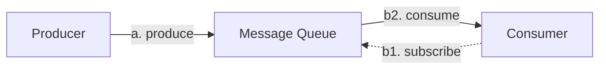

• Producer sends messages to a message queue.
• Consumer subscribes to a queue and consumes the subscribed messages.
• Message queue is a service in the middle that decouples the producers from the con-
sumers, allowing each of them to operate and scale independently.
• Both producer and consumer are clients in the client/server model, while the message
queue is the server. The clients and servers communicate over the network.

**Publish Subscribe**
Topics are the categories used to organize
messages. Each topic has a name that is unique across the entire message queue service.
Messages are sent to and read from a specific topic.

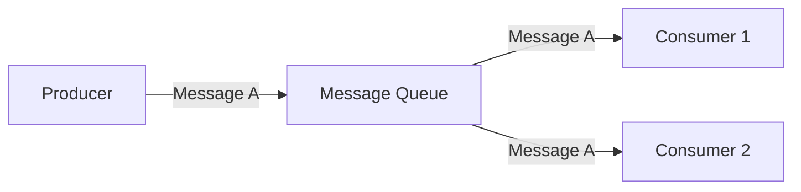

**Topics, partitions, and brokers**
What if the data volume in a topic is too large for a single server to handle?

solve via `Partition`
divide a topic into partitions and deliver messages evenly across partitions.

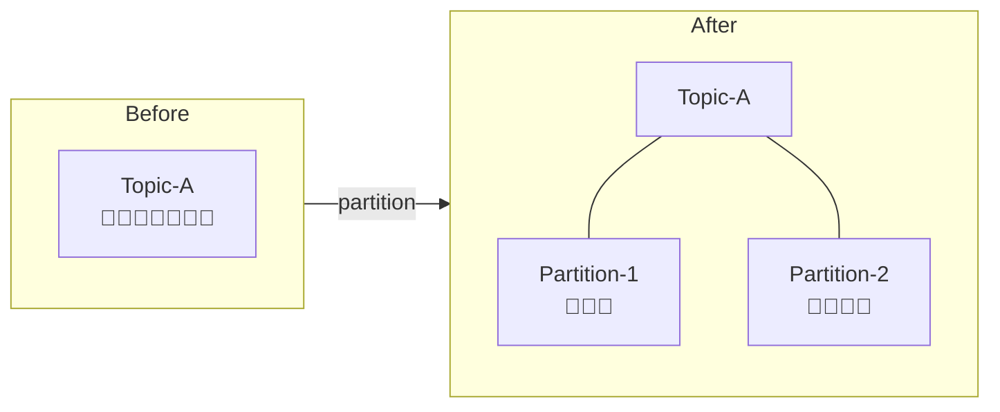

partition as a small subset of the messages for a topic
evenlyt spread across brokers(servers)
operates in queue(fifo)
position of a message in the partition is called an off set.


**Consumer Group**
a set of consumers, working together to consume messages from topics.

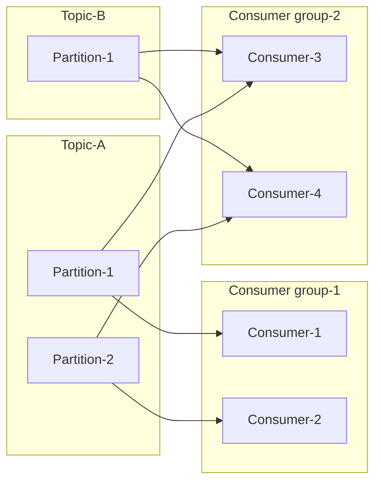

## High Level Architecture

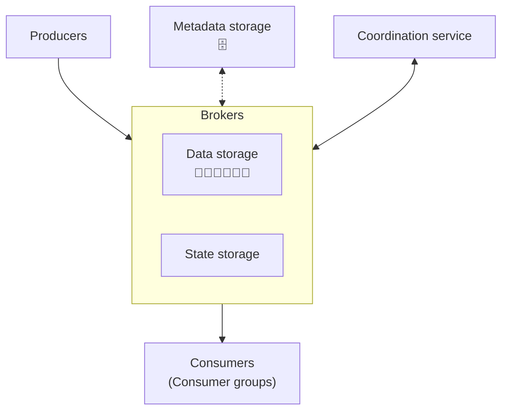

# Design Deep Dive

## Data Storage

Now let's explore the options to persist messages in more detail. In order to find the best choice, let's consider the traffic pattern of a message queue:
- Write-heavy, read-heavy.
- No update or delete operations. As a side note, a traditional message queue does not persist messages unless the queue falls behind, in which case there will be delete operations when the queue catches up. What we are talking about here is the persistence of a data streaming platform.
- Predominantly sequential read/write access.

### Option 1: Database

The first option is to use a database.
- **Relational database**: create a topic table and write messages to the table as rows.
- **NoSQL database**: create a collection as a topic and write messages as documents.

Databases can handle the storage requirement, but they are not ideal because it is hard to design a database that supports both write-heavy and read-heavy access patterns at a large scale. The database solution does not fit our specific data usage patterns very well.

This means a database is not the best choice and could become a bottleneck of the system.

### Option 2: Write-ahead log (WAL)

The second option is write-ahead log (WAL). WAL is just a plain file where new entries are appended to an append-only log. WAL is used in many systems, such as the redo log in MySQL and the WAL in ZooKeeper.

We recommend persisting messages as WAL log files on disk. WAL has a pure sequential read/write access pattern. The disk performance of sequential access is very good. Also, rotational disks have large capacity and they are pretty affordable.

As shown below, a new message is appended to the tail of a partition, with a monotonically increasing offset. The easiest option is to use the line number of the log file as the offset. However, a file cannot grow infinitely, so it is a good idea to divide it into segments.

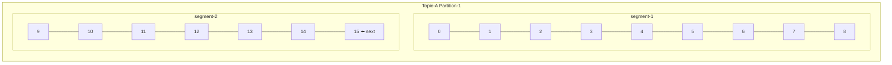

With segments, new messages are appended only to the active segment file. When the active segment reaches a certain size, a new active segment is created to receive new messages, and the currently active segment becomes inactive, like the rest of the non-active segments. Non-active segments only serve read requests. Old non-active segment files can be truncated if they exceed the retention or capacity limit.

Segment files of the same partition are organized in a folder named `Partition-{partition_id}`.

To meet the high data retention requirement, our design relies heavily on disk drives to hold a large amount of data. There is a common misconception that rotational disks are slow, but this is really only the case for random access. For our workload, as long as we design our on-disk data structure to take advantage of the sequential access pattern, the modern disk drives in a RAID configuration (i.e., with disks striped together for higher performance) could comfortably achieve several hundred MB/sec of read and write speed. This is more than enough for our needs, and the cost structure is favorable.

Also, a modern operating system caches disk data in main memory very aggressively, so much so that it would happily use all available free memory to cache disk data. The WAL takes advantage of the heavy OS disk caching, too.

## Message Data Structure

The data structure of a message is key to high throughput. It defines the contract between the producers, message queue, and consumers. Our design achieves high performance by eliminating unnecessary data copying while the messages are in transit from the producers to the queue and finally to the consumers. If any parts of the system disagree on this contract, messages will need to be mutated which involves expensive copying, seriously hurting performance.

**Message key**: Used to determine the partition of the message. If the key is not defined, the partition is randomly chosen. Otherwise, the partition is chosen by `hash(key) % numPartitions`. The producer can also define its own mapping algorithm. Note: the key is not equivalent to the partition number. The key can be a string or a number carrying business information, while the partition number is an internal message queue concept.

**Message value**: The payload of a message. It can be plain text or a compressed binary block.

> **Reminder**: The key and value of a message are different from a key-value (KV) store. In a KV store, keys are unique and we can find the value by key. In a message, keys do not need to be unique — sometimes they are not even mandatory — and we don't need to find a value by key.

**Other fields of a message**:
- **Topic**: the name of the topic that the message belongs to.
- **Partition**: the ID of the partition that the message belongs to.
- **Offset**: the position of the message in the partition. A message can be found via the combination of: topic + partition + offset.
- **Timestamp**: when this message was stored.
- **Size**: the size of this message.
- **CRC**: Cyclic redundancy check — used to ensure the integrity of raw data.

Optional fields (e.g., tags) can be added on demand to support additional features like message filtering.

## Batching

Batching is pervasive in this design — in the producer, the consumer, and the message queue itself. Batching is critical to performance because:
- It allows the operating system to group messages together in a single network request, reducing expensive network round trips.
- The broker writes messages to the append-only log in large sequential chunks, which leads to larger blocks of sequential disk writes and contiguous blocks of disk cache. The operating system's both lead to much greater sequential disk access throughput.

There is a trade-off between throughput and latency. If the system is deployed as a traditional message queue where latency might be more important, the system could be tuned to use a smaller batch size. Disk performance will suffer a little; to compensate for the slower sequential disk write throughput, there might need to be a higher number of partitions per topic.

---

## Producer Flow

If a producer wants to send messages to a partition, which broker should it connect to?

### Option 1: Routing Layer

All messages sent to the routing layer are routed to the "correct" broker (the leader replica).

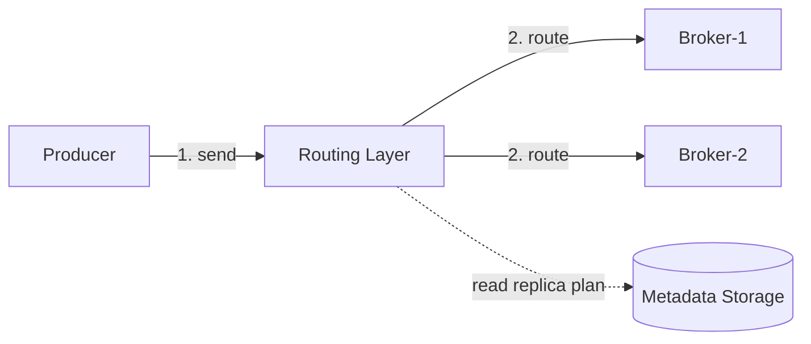

1. The producer sends messages to the routing layer.
2. The routing layer reads the replica distribution plan from the metadata storage and caches it locally. When a message arrives, it routes the message to the leader replica of the target partition.
3. The leader replica receives the message and follower replicas pull data from the leader.
4. When "enough" replicas have synchronized the message, the leader commits the data (persisted on disk), then responds to the producer.

**Drawbacks**:
- A new routing layer means additional network latency caused by overhead and additional network hops.
- Request batching is not taken into consideration.

### Option 2: Producer with Buffer and Routing (Improved)

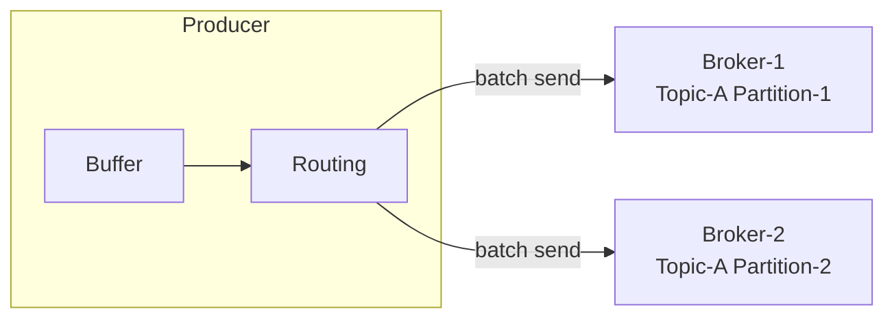

The routing layer is wrapped into the producer and a buffer component is added. Both are installed as part of the producer client library. Benefits:
- **Fewer network hops** mean lower latency.
- Producers can have their **own logic** to determine which partition the message should be sent to.
- **Batching**: buffer messages in memory and send out larger batches in a single request, improving throughput.

The choice of batch size is a classic trade-off between throughput and latency:

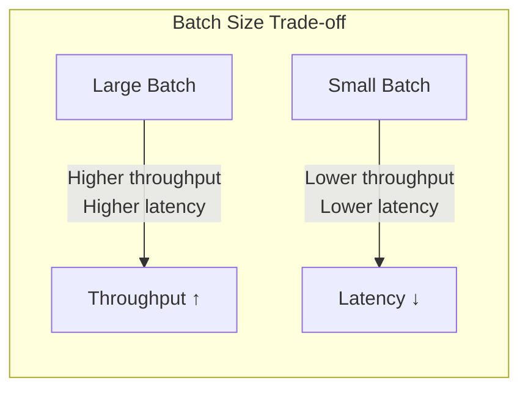

---

## Consumer Flow

The consumer specifies its offset in a partition and receives back a chunk of events beginning from that position.

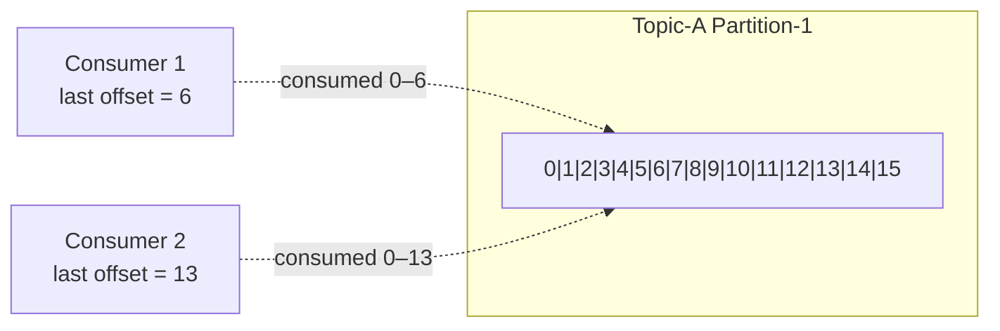

### Push vs Pull

**Push model**:
- **Pros**: Low latency — the broker can push messages to the consumer immediately upon receiving them.
- **Cons**: If the rate of consumption falls below the rate of production, consumers could be overwhelmed. Difficult to deal with consumers with diverse processing power because the broker controls the transfer rate.

**Pull model**:
- **Pros**:
  - Consumers control the consumption rate. One set can process in real-time, another in batch mode.
  - If consumption falls behind production, we can scale out consumers or simply catch up later.
  - More suitable for batch processing — pulls all available messages after the consumer's current position (or up to a configurable max size).
- **Cons**: When there is no message in the broker, a consumer might still keep pulling, wasting resources. Solution: **long polling** — allows pulls to wait a specified amount of time for new messages.

**Most message queues choose the pull model.**

### Consumer Rebalancing

Consumer rebalancing decides which consumer is responsible for which subset of partitions.

**New consumer joins the group**:

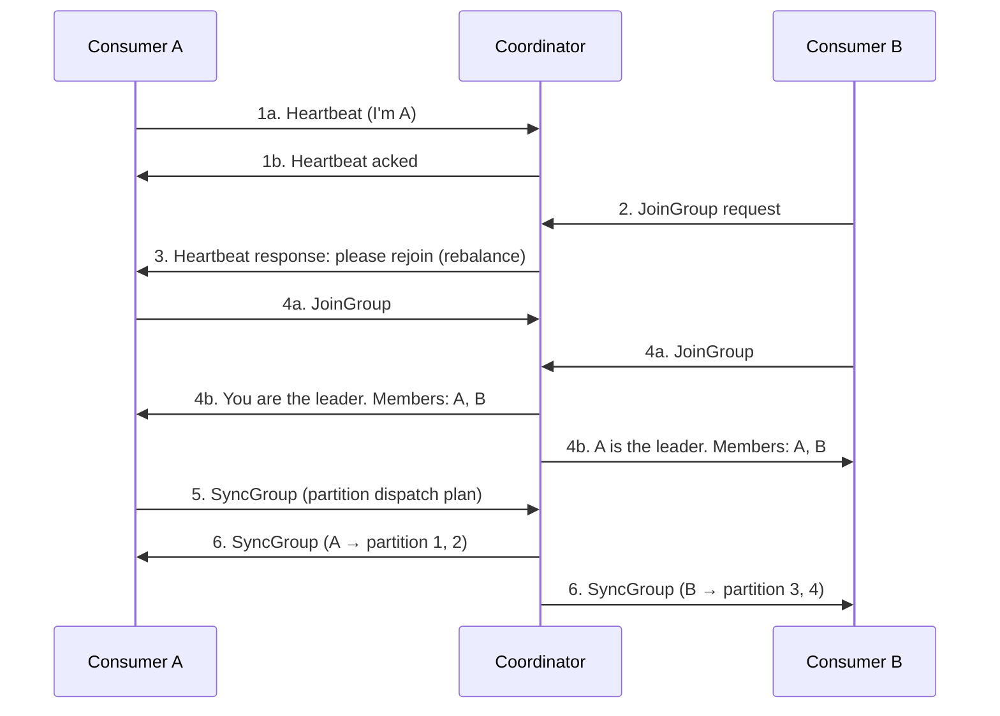

**Existing consumer leaves the group**:

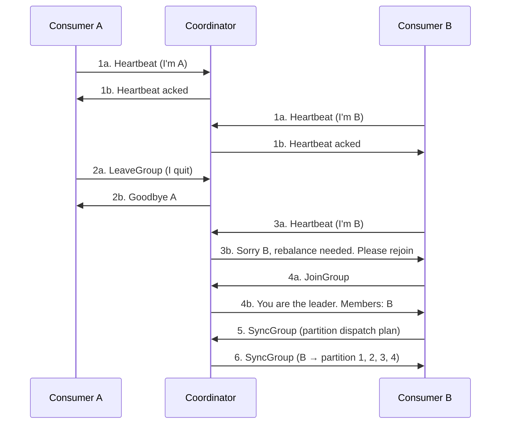

**Existing consumer crashes**:

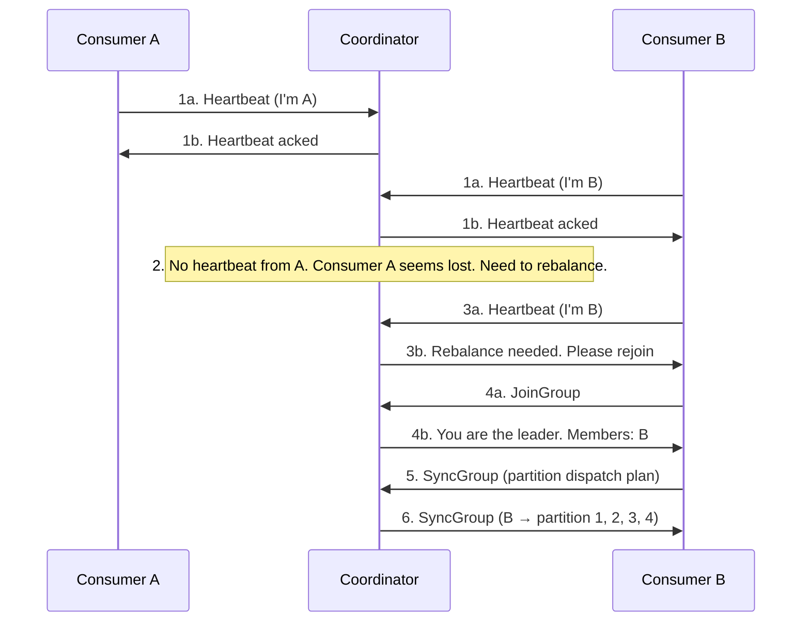

---

## State Storage

In the message queue broker, the state storage stores:
- The **mapping between partitions and consumers**.
- The **last consumed offsets** of consumer groups for each partition.

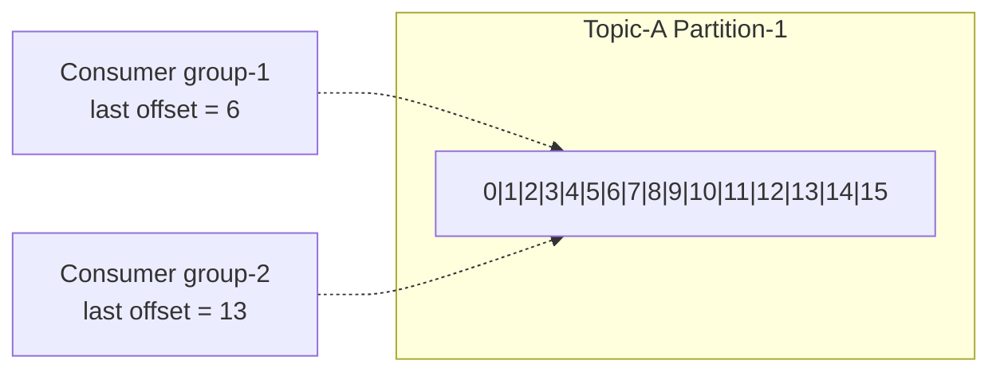

When a consumer in a group consumes messages in sequence and commits offset 6, all messages at or before offset 6 are considered consumed. If the consumer crashes, a new consumer in the same group resumes from the last committed offset.

**Data access patterns for consumer states**:
- Frequent read and write operations (but volume is not high).
- Data is updated frequently and is rarely deleted.
- Random read and write operations.
- Data consistency is important.

A KV store like **ZooKeeper** is a great choice. Kafka has moved offset storage from ZooKeeper to Kafka brokers.

## Metadata Storage

The metadata storage stores configuration and properties of topics, including:
- Number of partitions
- Retention period
- Distribution of replicas

Metadata does not change frequently and the data volume is small, but it has a **high consistency requirement**. ZooKeeper is a good choice.

## ZooKeeper

ZooKeeper is an essential service for distributed systems offering a hierarchical key-value store. It is commonly used to provide a distributed configuration service, synchronization service, and naming registry.

ZooKeeper simplifies our design:

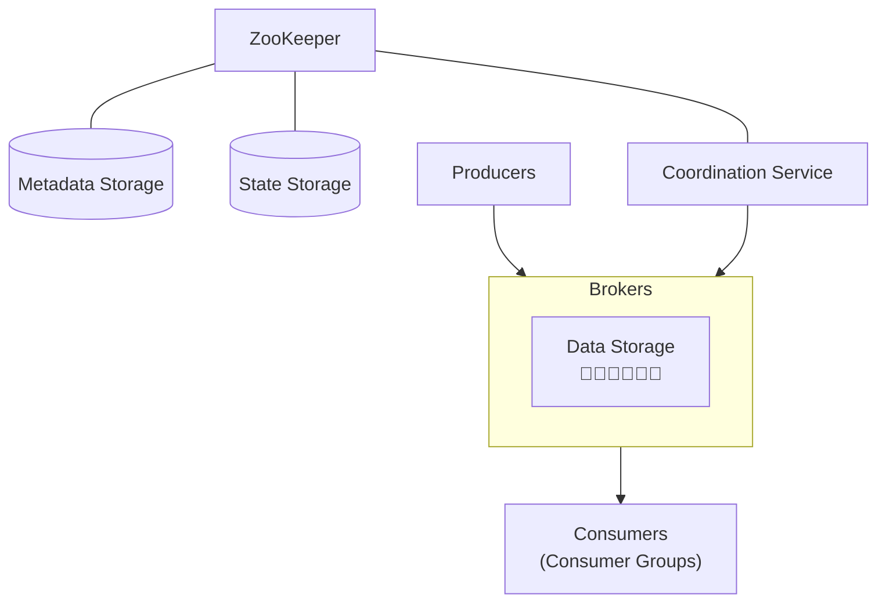

- Metadata and state storage are moved to ZooKeeper.
- The broker now only needs to maintain the data storage for messages.
- ZooKeeper helps with the **leader election** of the broker cluster.

---

## Replication

In distributed systems, hardware issues are common. Replication is the classic solution to achieve high availability.

Each partition has multiple replicas (e.g., 3), distributed across different broker nodes. For each partition, one replica is the **leader** and the others are **followers**. Producers only send messages to the leader replica. Followers keep pulling new messages from the leader. Once messages are synchronized to "enough" replicas, the leader commits the data and responds to the producer.

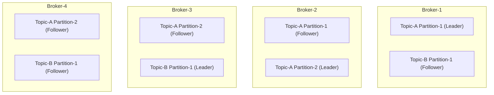

**Replica distribution plan** (example):
- Partition-1 of Topic-A: 3 replicas — leader in Broker-1, followers in Broker-2 and 3
- Partition-2 of Topic-A: 3 replicas — leader in Broker-2, followers in Broker-3 and 4
- Partition-1 of Topic-B: 3 replicas — leader in Broker-3, followers in Broker-4 and 1

The coordination service elects one broker as the leader, which generates the replica distribution plan and persists it in metadata storage.

## In-Sync Replicas (ISR)

ISR refers to replicas that are "in-sync" with the leader. The definition depends on topic configuration. For example, if `replica.lag.max.messages = 4`, the follower will not be removed from ISR as long as it is behind the leader by no more than 3 messages. The leader is always an ISR by default.

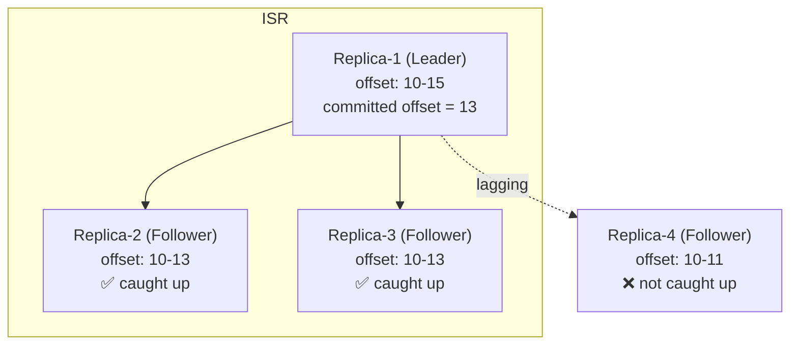

**Why ISR?** ISR reflects the trade-off between **performance and durability**. Ensuring all replicas are in sync before acknowledgment is safest, but a slow replica would cause the whole partition to become slow or unavailable.

### ACK Settings

Producers can choose to receive acknowledgments based on the number of ISRs that have received the message:

**ACK=all**: Producer gets an ACK when **all ISRs** have received the message. Strongest durability, but higher latency (waiting for the slowest ISR).

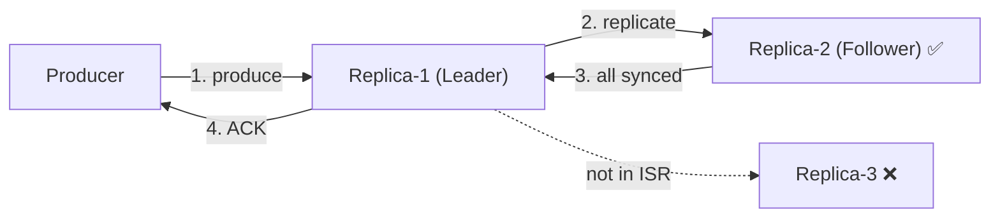

**ACK=1**: Producer receives an ACK once **the leader** persists the message. Lower latency, but if the leader fails before replication, the message is lost. Suitable for low-latency systems where occasional data loss is acceptable.

**ACK=0**: Producer keeps sending messages **without waiting for any ACK** and never retries. Lowest latency at the cost of potential message loss. Good for metrics collection or logging where volume is high and occasional loss is acceptable.

| ACK Setting | Durability | Latency | Use Case |
|-------------|-----------|---------|----------|
| ACK=all | Strongest | Highest | Critical data, no loss allowed |
| ACK=1 | Medium | Medium | Low-latency, some loss acceptable |
| ACK=0 | Weakest | Lowest | Metrics, logging, high volume |

**Why not always read from ISR followers?** Reasons:
- Design and operational simplicity.
- Messages in one partition are dispatched to one consumer within a consumer group, limiting the number of connections per leader replica.
- The number of connections is not large as long as a topic is not super hot.
- If a topic is hot, we can add more partitions and consumers.
- In cross-datacenter scenarios, enabling consumers to read from the closest ISR can be worthwhile.

---

## Scalability

### Producer
Conceptually simple — no group coordination needed. Scalability is easily achieved by adding or removing producer instances.

### Consumer
Consumer groups are isolated from each other, making it easy to add or remove groups. Inside a group, the **rebalancing mechanism** handles consumers being added, removed, or crashing. This provides both scalability and fault tolerance.

### Broker

**Failure recovery**: When a broker crashes:

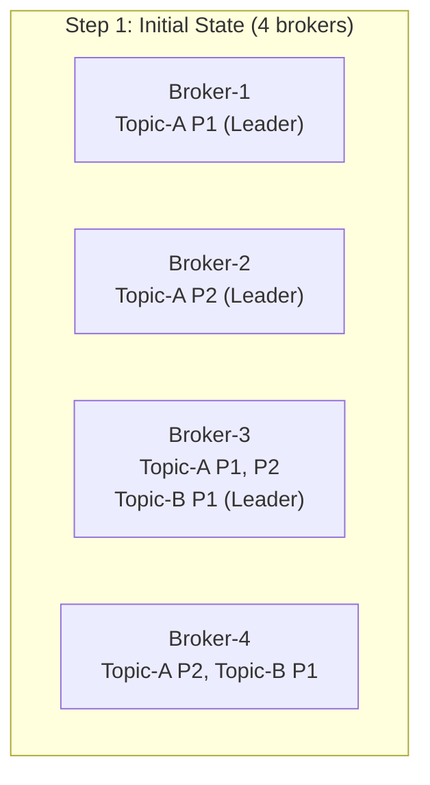

1. **Initial state**: 4 brokers with replica distribution across them.
2. **Broker-3 crashes**: All partitions on that node are lost. Distribution plan is updated to remaining brokers.
3. **Controller detects failure**: Generates a new replica distribution plan for remaining nodes, assigning new replicas to fill the gap.
4. **New replicas catch up**: New follower replicas synchronize data from leaders.

**Fault tolerance considerations**:
- **Minimum ISR count**: The higher the number, the safer — but balance latency and safety.
- **Replica placement**: Replicas of the same partition should **never** be on the same node.
- **Cross-datacenter replicas**: Safer but incurs more latency and cost. Data mirroring can help.

**Adding a new broker**:

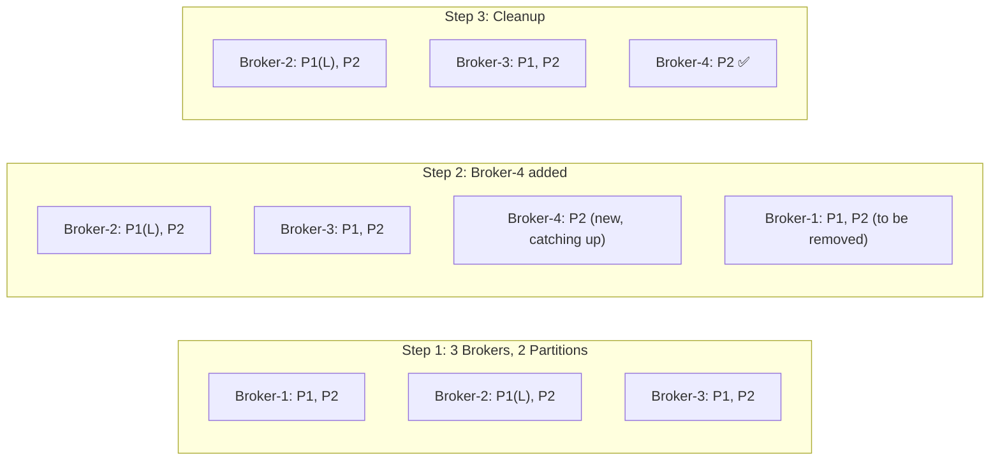

1. Initial: 3 brokers, 2 partitions, 3 replicas each.
2. **Broker-4 added**: Controller changes Partition-2's replica distribution to include Broker-4. The new replica starts copying from the leader. Temporarily more than 3 replicas.
3. **After catch-up**: The redundant replica on Broker-1 is gracefully removed.

This process avoids data loss while adding brokers. A similar process applies when removing brokers.

### Partition

**Increasing partitions**:

```mermaid
graph LR
    subgraph Before
        P1a["Partition-1 📨📨📨"]
        P2a["Partition-2 📨📨📨"]
    end
    subgraph After
        P1b["Partition-1 📨📨📨 + new"]
        P2b["Partition-2 📨📨📨 + new"]
        P3b["Partition-3 (new, receives new msgs)"]
    end
    Before -->|"add partition"| After
```

- Persisted messages stay in old partitions — no data migration.
- New messages are distributed across all partitions (including new ones).

**Decreasing partitions**:
- The decommissioned partition stops receiving new messages.
- It **cannot be removed immediately** because consumers may still be reading data.
- Only after the configured retention period passes can the data be truncated and storage freed.
- During the transition: producers send to remaining partitions, consumers can still read from all (including decommissioned).
- After retention expires, consumer groups need rebalancing.

---

## Data Delivery Semantics

### At-most once

Messages may be **lost but are never redelivered**.

```mermaid
graph LR
    Producer -->|"send (ACK=0, no retry)"| MQ["Message Queue<br/>may lose msg"]
    MQ -->|"commit offset before processing<br/>may lose msg"| Consumer
```

- Producer sends asynchronously without waiting for ACK (ACK=0). No retry on failure.
- Consumer commits the offset **before** data is processed. If it crashes after commit, the message won't be re-consumed.
- **Use case**: Monitoring metrics where small data loss is acceptable.

### At-least once

**No message should be lost**, but a message may be delivered more than once.

```mermaid
graph LR
    Producer -->|"send (ACK=1 or all, retry on fail)"| MQ["Message Queue<br/>may have duplicates"]
    MQ -->|"commit offset after processing"| Consumer
```

- Producer sends with ACK=1 or ACK=all. Retries on failure or timeout.
- Consumer commits the offset **only after** data is successfully processed. If processing fails, re-consume. If commit fails after processing, re-consume → potential duplicates.
- **Use case**: Data duplication is not a big issue, or deduplication is possible on the consumer side (e.g., unique key per message).

### Exactly once

The **most difficult** to implement. Friendly to users but high cost for performance and complexity.

```mermaid
graph LR
    Producer -->|"send with idempotent key"| MQ["Message Queue<br/>exactly once guarantee"]
    MQ -->|"transactional consume + commit"| Consumer
```

- **Use case**: Financial systems (payment, trading, accounting) where duplication is not acceptable and downstream services don't support idempotency.

| Semantic | Lost Messages | Duplicates | Complexity | Use Case |
|----------|:---:|:---:|:---:|----------|
| At-most once | Possible | No | Low | Metrics, logging |
| At-least once | No | Possible | Medium | Most applications |
| Exactly once | No | No | High | Financial systems |

---

## Advanced Features

### Message Filtering

A topic contains messages of various subtypes. Some consumer groups may only care about certain subtypes (e.g., a payment system only cares about refund orders, not all orders).

**Naive solution**: Consumer fetches all messages and filters during processing. Flexible but introduces unnecessary traffic.

**Better solution**: Filter on the **broker side** using message metadata (tags). The broker should not extract message payloads (to avoid decryption/deserialization overhead and security concerns).

```mermaid
graph LR
    Producer -->|"msg with tags"| Broker
    Broker -->|"tag filter"| Consumer["Consumer<br/>(subscribed with specific tags)"]
```

- Attach a **tag** to each message.
- Consumers subscribe based on specified tags.
- Multiple tags support multi-dimensional filtering.
- For complex logic (math formulae), the broker would need a grammar parser — typically too heavyweight.

### Delayed Messages & Scheduled Messages

Sometimes you want to delay delivery for a specified period. Example: an order should be closed if not paid within 30 minutes. A delayed verification message is sent immediately but delivered to the consumer 30 minutes later.

```mermaid
graph LR
    Producer -->|"delayed message"| TS["Temporary Storage"]
    TS -->|"deliver when time's up"| Broker["Broker<br/>📨📨📨📨"]
    Broker --> Consumer
```

**Core components**:
- **Temporary storage**: Can be one or more special message topics.
- **Timing function** (two popular solutions):
  - **Dedicated delay queues with predefined delay levels** (e.g., RocketMQ supports: 1s, 5s, 10s, 30s, 1m, 2m, 3m, 4m, 5m, 6m, 7m, 8m, 9m, 10m, 20m, 30m, 1h, 2h).
  - **Hierarchical time wheel**.

**Scheduled messages** are similar — delivered at a specific scheduled time rather than after a delay.

---

# Wrap Up

In this chapter, we presented the design of a distributed message queue with advanced features commonly found in data streaming platforms.

**Additional talking points**:

- **Protocol**: Defines the rules, syntax, and APIs for exchanging information and transferring data. The protocol should support operations like produce, consume, heartbeat, etc. Example: Advanced Message Queuing Protocol (AMQP).
- **Retry consumption**: If some messages cannot be consumed successfully, how to retry? To not block incoming messages, send failed messages to a dedicated **retry topic** for later consumption.
- **Historical data archive**: With time-based or capacity-based log retention, if a consumer needs to replay truncated historical messages, use large-capacity storage systems like **HDFS** or **object storage** to archive historical data.