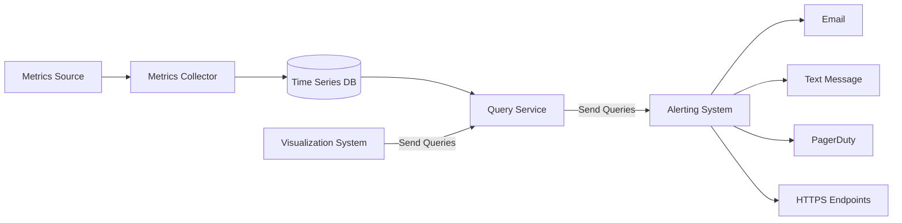
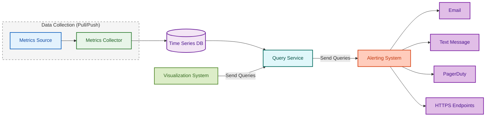
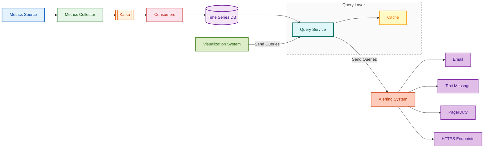
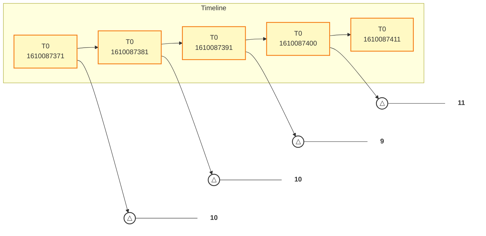
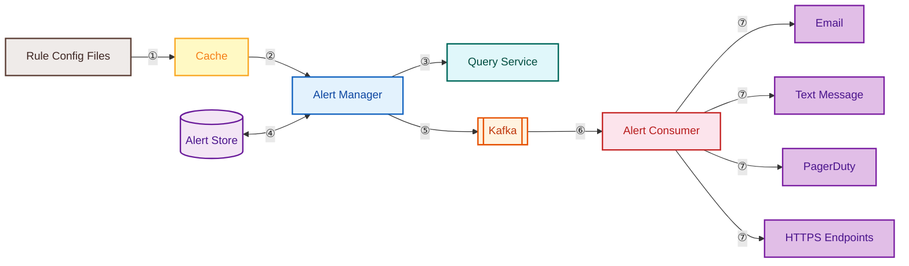
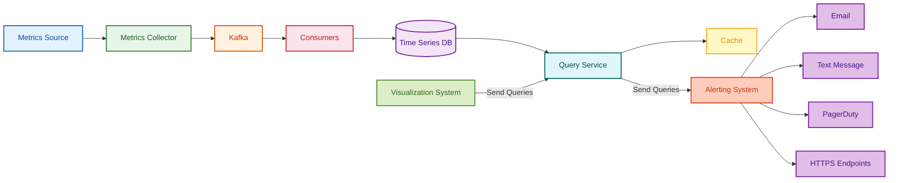

We want to monitor our services, hence we use metrics monitoring and alerting services

**High Level Requirements**
- 100 million daily active users
- Assume we have 1000 server pools, 100 machine per pool, 100 metrics per machine ~ 10 million metrics
- 1 year data retention
- Data retention polirv: raw form for 7 day. 1 minute resolution for 30 days.1 hour resolution for 1 year.


A variety of metrics can be monitored. for example:
- CPU usage
- Request count
- Memory usage
- Message count in message queues

# High Level Design

**Fundamental Components:**
- Data collection: c llect metric data from different sources.
- Data transmission: tcan fer data from urce lo the metrics monitoring system.
- Data storage: organize and tore incomin g data.
- Alerting: analyse incoming data. detect anomali s. and gen rate alerts. The system must be able to send alerts to different communication channels.
- Visualization: data in graphs and charts

**Data Model**: record metric data as time series that contains a set of values with their associated timestamps.

|metric_name |cpu.load|
|------|-----|
|labels|host:i631 ,env:prod|
|timestamp|1613707265|
|value|0.29|

**Data Storage**
- Not recommended to build your own or use a general-purpose DB (e.g., MySQL) for time-series data
- Relational DBs are not optimized for time-series operations (e.g., moving averages in rolling windows require complex SQL)
- Tagging/labeling needs an index per tag; relational DBs don't handle constant heavy write loads well at scale
- NoSQL (e.g., Cassandra, BigTable) can handle time-series data but require deep internal knowledge to devise a scalable schema
- With industrial-scale time-series DBs readily available, general-purpose NoSQL is not appealing
- **Time-Series DB examples:**
  - **OpenTSDB** — distributed, but based on Hadoop/HBase (adds operational complexity)
  - **MetricsDB** — used by Twitter
  - **Amazon Timestream** — managed time-series DB by AWS
  - **InfluxDB** & **Prometheus** — two most popular; optimized for large-volume time-series storage and real-time analysis
    - Rely on in-memory cache + on-disk storage; handle durability & performance well
    - InfluxDB (8 cores, 32 GB RAM) can handle **250,000+ writes/sec**
- These specialized DBs use far fewer servers for the same data volume, offer custom query interfaces easier than SQL, and provide built-in data retention & aggregation features




# Design Deep Dive
- Metrics collection
- Scaling the metrics transmission pipeline
- Query service
- Storage layer
- Alerting system
- Visualization system

## `Metric Collection`
Either use Push or Pull Model



## `Scaling the metrics transmission pipeline`
metrics collector is cluster of servers and receives huge amiunt of data
set up for auto scaling

risk of data loss if database is down; add queues to overcome this

the metrics collector sends metrics data to queuing systems like Kafka.
Then consumers or streaming processing services such as Apache Storm, Flink, and
Spark, process and push data to the time-series database. This approach has several advantages:
• Kafka is used as a highly reliable and scalable distributed messaging platform.
• It decouples the data collection and data processing services from each other.
• It can easily prevent data loss when the database is unavailable, by retaining the data in Kafka.


## `Query Service`
comprises a clusler of query servers, which access the time-series databases and handle requests from the visualization or alerting systems. 
Having a dedicated set of query servers decouples time-series databases from the clients (visualization and alerting systems). 
This gives us the flexibility to change the time-series database or the visualization and alerting systems, whenever needed.

## `Cache Layer`
To reduce the load of the time-series database and make query service more performant, cache servers are added to store query results


no need to add our own caching system

we use timeseries database instead of relational, using sql is difficult
```SQL
SELECT id,
temp,
avg(temp) over (partition by group_nr order by time_ read)
as rolling_avg
from(
    select id, 
    temp, 
    time_read,
    interval_group,
    id - row_number() over (partition by interval_group
    order
    by time_read) as group_nr
    from(
        select id,
time_read,
"epoch":: timestamp +
"900 seconds":: interval * (
    extract (epoch from time_read)::int4 / 900) as interval_group,
    temp
from readings
    )t1
)t2
order by time_read;
```

while in flux
```flux
from ( db : "telegraf")
    |> range ( start :-1h)
    |> filter ( fn : (r) => r._measure m ent =="foo")
    |> exponentialMovingAverage ( size :-10s)
```


## `Storage`
**Choose a time-series database carefully**

**Space Optimisation**
Data encoding and compression can significantly reduce the size of data. 
Those features are usually built into a good time-series database.

1610087371 and 1610087381 differ by only 10 seconds, which takes only 4 bits to represent, instead of the full timestamp of 32 bits.



**Downsampling**
process of converting high-resolution data to low-resolution to reduce overall disk usage.
example:
• Retention: 7 days, no sampling
• Retention: 30 days, downsample to 1 minute resolution
• Retention: 1 year, downsample to 1 hour resolution

use cold storage as it's cost is low

## `Alert System`
you can either build your own or rent one existing system
depends on you, justify your own decision based on the case study given



**The alert flow works as follows:**

1. **Load config files to cache servers.** Rules are defined as config files on disk. YAML is a commonly used format to define rules. Example:
   ```yaml
   - name: instance_down
     rules:
       # Alert for any instance that is unreachable for >5 minutes.
       - alert: instance_down
         expr: up == 0
         for: 5m
         labels:
           severity: page
   ```

2. **The alert manager fetches alert configs from the cache.**

3. **Based on config rules, the alert manager calls the query service at a predefined interval.** If the value violates the threshold, an alert event is created. The alert manager is responsible for:
   - **Filter, merge, and dedupe alerts.** Example: merging alerts triggered within one instance in a short time window.

     ```mermaid
     graph LR
         E1["Event 1<br/>Instance 1<br/>disk_usage > 90%"]:::event --> M["Merge"]:::merge
         E2["Event 2<br/>Instance 1<br/>disk_usage > 90%"]:::event --> M
         E3["Event 3<br/>Instance 1<br/>disk_usage > 90%"]:::event --> M
         M --> R["1 alert on Instance 1"]:::result

         classDef event fill:#fff3e0,stroke:#e65100,stroke-width:2px,color:#bf360c
         classDef merge fill:#e3f2fd,stroke:#1565c0,stroke-width:2px,color:#0d47a1
         classDef result fill:#e8f5e9,stroke:#2e7d32,stroke-width:2px,color:#1b5e20
     ```

   - **Access control.** Restrict access to certain alert management operations to authorized individuals only.
   - **Retry.** The alert manager checks alert states and ensures a notification is sent at least once.

4. **The alert store** is a key-value database (e.g., Cassandra) that keeps the state (inactive, pending, firing, resolved) of all alerts. Ensures notification is sent at least once.

5. **Eligible alerts are inserted into Kafka.**

6. **Alert consumers pull alert events from Kafka.**

7. **Alert consumers process alert events** and send notifications over to different channels such as email, text message, PagerDuty, or HTTP endpoints.

## `Visualisation System`
Visualization is built on top of the data layer. 
Metrics can be shown on the metrics dashboard over various time scales and alerts can be shown on the alerts dashboard


---
# Final Design
