# Ad Click Event Aggregation
Digital advertising has a core process called Real-Time Bidding (RTB), in which digital
advertising inventory is bought and sold. 

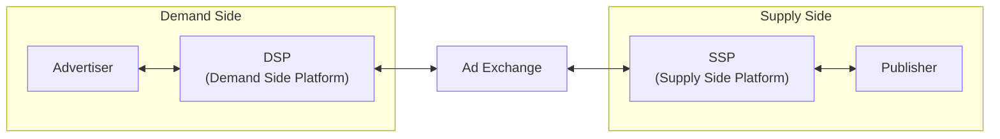

# Requirements

**Functional Requirements**
- aggregate no of click of *ad_id* in last *M* minutes
- return top 100 most click *ad_id* every min
- filters on top of attributes

**Non Functional Requirements**
- correctness of data
- handling delayed/duplicate events
- robust
- latency

**Estimations**
- 1 billion DAU
- 1 user clicks 1 ad per day-> 1 billion ad clicks per day
- ad click qps= \frac{10^9 events}{10^5 seconds in day}= 10,000
- peak qps=5*avg=50000 qps
- single click event=0.1kb; 0.1kbx1 billion=100gb

# High Level Design

## Query API Design
The purpose of the API design is to have an agreement between the client and the server. In a consumer app, a client is usually the end-user who uses the product. In our case, however, a client is the dashboard user (data scientist, product manager, advertiser, etc.) who runs queries against the aggregation service.

Let's review the functional requirements so we can better design the APIs:
- Aggregate the number of clicks of ad_id in the last *M* minutes.
- Return the top *N* most clicked ad_ids in the last *M* minute.
- Support aggregation filtering by different attributes.

We only need two APIs to support those three use cases because filtering (the last requirement) can be supported by adding query parameters to the requests.

### API 1: Aggregate the number of clicks of ad_id in the last *M* minutes

| API | Detail |
|-----|--------|
| `GET /v1/ads/{:ad_id}/aggregated_count` | Return aggregated event count for a given ad_id |

**Request parameters:**

| Field | Description | Type |
|-------|-------------|------|
| from | Start minute (default is now minus 1 minute) | long |
| to | End minute (default is now) | long |
| filter | An identifier for different filtering strategies. For example, `filter = 001` filters out non-US clicks | long |

**Response:**

| Field | Description | Type |
|-------|-------------|------|
| ad_id | The identifier of the ad | string |
| count | The aggregated count between the start and end minutes | long |

### API 2: Return top *N* most clicked ad_ids in the last *M* minutes

| API | Detail |
|-----|--------|
| `GET /v1/ads/popular_ads` | Return top *N* most clicked ads in the last *M* minutes |

**Request parameters:**

| Field | Description | Type |
|-------|-------------|------|
| count | Top *N* most clicked ads | integer |
| window | The aggregation window size (*M*) in minutes | integer |
| filter | An identifier for different filtering strategies | long |

**Response:**

| Field | Description | Type |
|-------|-------------|------|
| ad_ids | A list of the most clicked ads | array |

## Data Model

There are two types of data in the system: raw data and aggregated data.

### Raw data

Below shows what the raw data looks like in log files:

```
[AdClickEvent] ad001, 2021-01-01 00:00:01, user 1, 207.148.22.22, USA
```

| ad_id | click_timestamp | user_id | ip | country |
|-------|-----------------|---------|-----|---------|
| ad001 | 2021-01-01 00:00:01 | user1 | 207.148.22.22 | USA |
| ad001 | 2021-01-01 00:00:02 | user1 | 207.148.22.22 | USA |
| ad002 | 2021-01-01 00:00:02 | user2 | 209.153.56.11 | USA |

### Aggregated data

Assume that ad click events are aggregated every minute.

| ad_id | click_minute | count |
|-------|-------------|-------|
| ad001 | 202101010000 | 5 |
| ad001 | 202101010001 | 7 |

To support ad filtering, we add an additional field called `filter_id` to the table. Records with the same `ad_id` and `click_minute` are grouped by `filter_id`.

| ad_id | click_minute | filter_id | count |
|-------|-------------|-----------|-------|
| ad001 | 202101010000 | 0012 | 2 |
| ad001 | 202101010000 | 0023 | 3 |
| ad001 | 202101010001 | 0012 | 1 |
| ad001 | 202101010001 | 0023 | 6 |

**Filter table:**

| filter_id | region | ip | user_id |
|-----------|--------|------|---------|
| 0012 | US | 0012 | * |
| 0013 | * | 0023 | 123.1.2.3 |

To support the query to return the top *N* most clicked ads in the last *M* minutes, the following structure is used.

**most_clicked_ads:**

| Field | Type | Description |
|-------|------|-------------|
| window_size | integer | The aggregation window size *M* in minutes |
| update_time_minute | timestamp | Last updated timestamp at minute granularity |
| most_clicked_ads | array | List of ad IDs in JSON format |

### Comparison

| | Raw data only | Aggregated data only |
|------|---------------|----------------------|
| **Pros** | Full data set; Support data filter and recalculation | Smaller data set; Fast query |
| **Cons** | Huge data storage; Slow query | Data loss — this is derived data. For example, 10 entries might be aggregated to 1 entry |

Should we store raw data or aggregated data? Our recommendation is to store both. Let's take a look at why:

- It's a good idea to keep the raw data. If something goes wrong, we could use the raw data for debugging. If the aggregated data is corrupted due to a bad bug, we can recalculate the aggregated data from the raw data, after the bug is fixed.
- Aggregated data should be stored as well. The data size of the raw data is huge. The large size makes querying raw data directly very inefficient. To mitigate this problem, we run read queries on aggregated data.
- Raw data serves as backup data. We usually don't need to query raw data unless recalculation is needed. Old raw data could be moved to cold storage to reduce costs.
- Aggregated data serves as active data. It is tuned for query performance.

# High Level Design


In real-time big data processing, data flows into and out of the processing system as unbounded data streams. The aggregation service works the same way; the input is the raw data (unbounded data streams), and the output is the aggregated results.

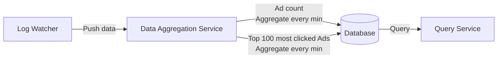

## Asynchronous Processing

The synchronous design is not good because the capacity of producers and consumers is not always equal. If there is a sudden increase in traffic and the number of events produced is far beyond what consumers can handle, consumers might get out-of-memory errors or experience an unexpected shutdown. If one component in the synchronous link is down, the whole system stops working.

A common solution is to adopt a message queue (Kafka) to decouple producers and consumers. This makes the whole process asynchronous and producers/consumers can be scaled independently.

Log watcher, aggregation service, and database are decoupled by two message queues. The database writer polls data from the message queue, transforms the data into the database format, and writes it to the database.

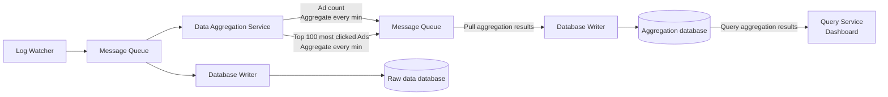

**What is stored in the first message queue?**

It contains ad click event data:

| ad_id | click_timestamp | user_id | ip | country |
|-------|-----------------|---------|-----|---------|

**What is stored in the second message queue?**

Two types of data:

1. Ad click counts aggregated at per-minute granularity:

| ad_id | click_minute | count |
|-------|-------------|-------|

2. Top *N* most clicked ads aggregated at per-minute granularity:

| update_time_minute | most_clicked_ads |
|-------------------|-----------------|

**Why not write aggregated results to the database directly?** The short answer is that we need the second message queue like Kafka to achieve end-to-end exactly once semantics (atomic commit).

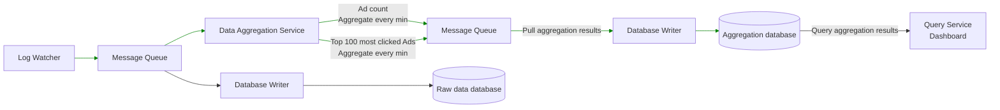
*End-to-end exactly once: atomic commit across Kafka consumer → aggregation → Kafka producer*

## Aggregation Service

The MapReduce framework is a good option to aggregate ad click events. The directed acyclic graph (DAG) is a good model for it. The key to the DAG model is to break down the system into small computing units, like the Map/Aggregate/Reduce nodes.

### Ad count aggregation (DAG)

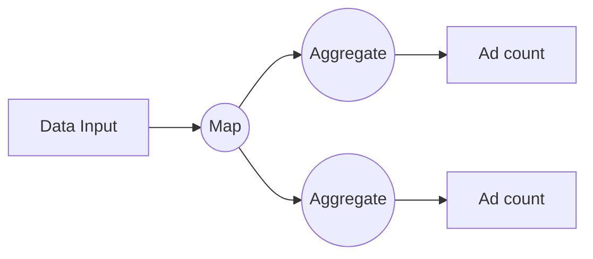
*Aggregate every minute*

### Top 100 aggregation (DAG)

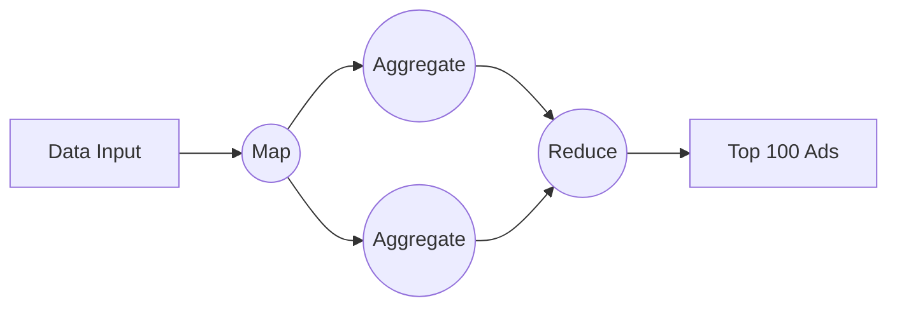

Each node is responsible for one single task and sends the processing result to its downstream nodes.

### Map node

A Map node reads data from a data source, and then filters and transforms the data. For example, a Map node sends ads with `ad_id % 2 = 0` to node 1, and the other ads go to node 2.

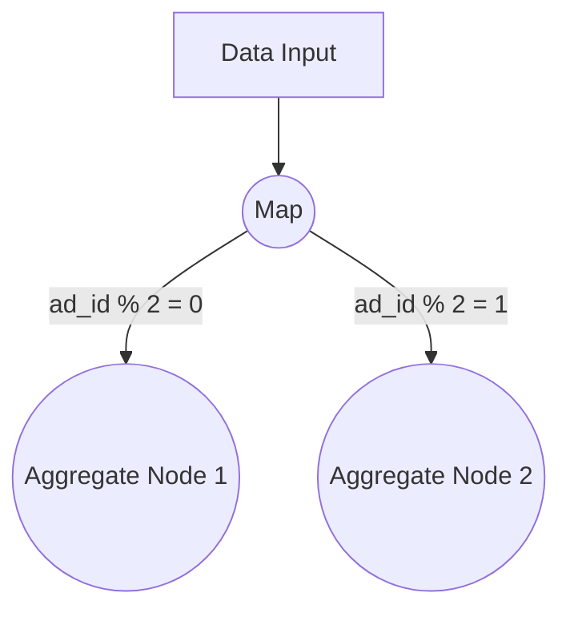

An alternative option is to set up Kafka partitions or tags and let the aggregate nodes subscribe to Kafka directly. This works, but the input data may need to be cleaned or normalized, and these operations can be done by the Map node. Another reason is that we may not have control over how data is produced and therefore events with the same ad_id might land in different Kafka partitions.

### Aggregate node

An Aggregate node counts ad click events by ad_id in memory every minute. In the MapReduce paradigm, the Aggregate node is part of the Reduce. So the map-aggregate-reduce process really means map-reduce-reduce.

### Reduce node

A Reduce node reduces aggregated results from all "Aggregate" nodes to the final result. For example, if there are three aggregation nodes and each contains the top 3 most clicked ads within the node, the Reduce node reduces the total number of most clicked ads to 3.

The DAG model represents the well-known MapReduce paradigm. It is designed to take big data and use parallel distributed computing to turn big data into little- or regular-sized data.

In the DAG model, intermediate data can be stored in memory and different nodes communicate with each other through either TCP (nodes running in different processes) or shared memory (nodes running in different threads).

## Main Use Cases

### Use case 1: Aggregate the number of clicks

Input events are partitioned by ad_id (e.g., `ad_id % 3`) in Map nodes and are then aggregated by Aggregation nodes.

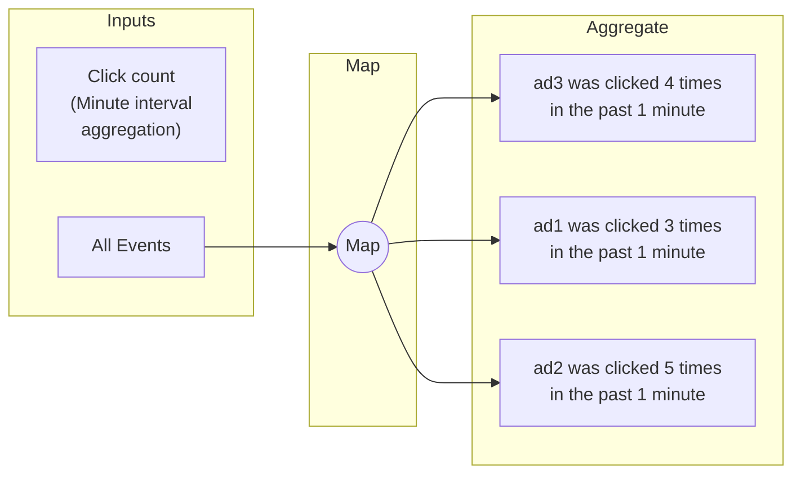
*Events with the same ad_id are routed to the same Aggregate node*

### Use case 2: Return top *N* most clicked ads

Input events are mapped using ad_id and each Aggregate node maintains a heap data structure to get the top 3 ads within the node efficiently. In the last step, the Reduce node reduces 9 ads (top 3 from each aggregate node) to the top 3 most clicked ads every minute.

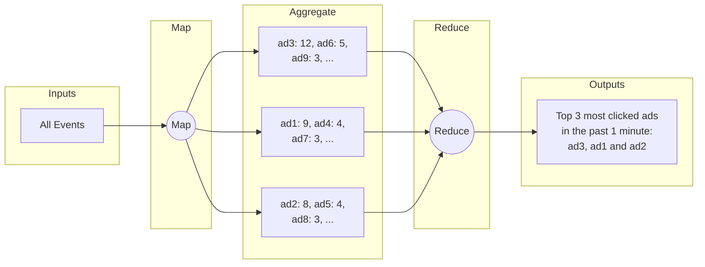

### Use case 3: Data filtering

To support data filtering like "show me the aggregated click count for ad001 within the USA only", we can pre-define filtering criteria and aggregate based on them. This technique is called the **star schema**, widely used in data warehouses. The filtering fields are called **dimensions**.

| ad_id | click_minute | country | count |
|-------|-------------|---------|-------|
| ad001 | 202101010001 | USA | 100 |
| ad001 | 202101010001 | GPB | 200 |
| ad001 | 202101010001 | others | 3000 |
| ad002 | 202101010001 | USA | 10 |
| ad002 | 202101010001 | GPB | 25 |
| ad002 | 202101010001 | others | 12 |

Benefits of the star schema approach:
- Simple to understand and build.
- The current aggregation service can be reused to create more dimensions in the star schema. No additional component is needed.
- Accessing data based on filtering criteria is fast because the result is pre-calculated.

A limitation is that it creates many more buckets and records, especially when we have a lot of filtering criteria.

# Low Level Design

## Streaming v/s Batching

| |Services | Batch system | Streaming System|
|--|-------|--------------|------------------|
|Responsiveness|respond to client quickly|no response needed|no response needed|
|input|user req|finite size|infinte size|
|output|response to client|materialised view|same as batch|
|performance|availabiltiy, latency|throughput|throughput, latency|
|ex|online shopping|mapreduce|flink|


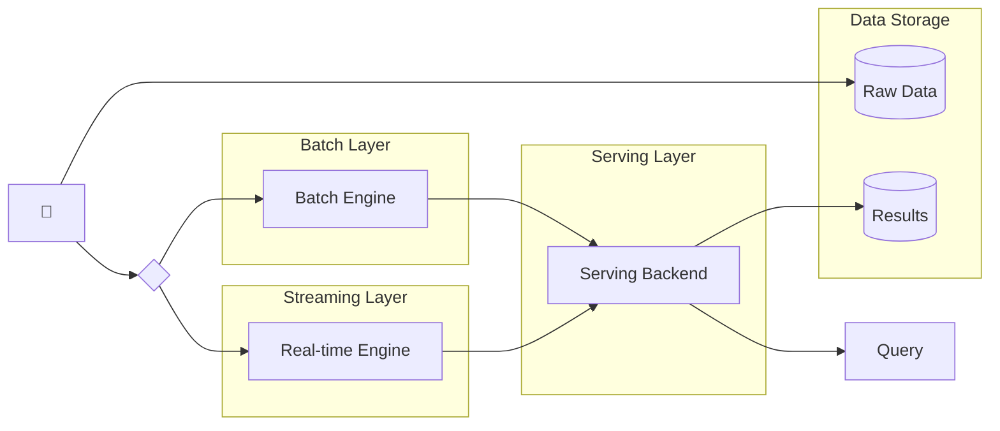
*Lambda Architecture*


we are using both, this type of system architecture is known as lambda
disadvantage: 2 codebases to maintain
solved by kappa architecture: batch+streaming in 1 processing path; handle real-time data processing and continuous ata preprocessing using single steeam processing engine

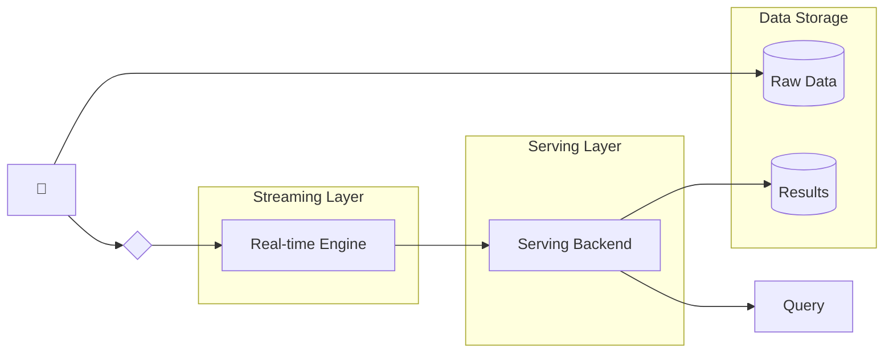
*Kappa Architecture*

## Data Recalculation
need to recalculate data cause, some bug discovered; recalculation flow:
1. The recalculation service retrieves data from raw data storage. 1his is a batched job .
2. Retrieved data is sent to a dedicated aggregation service so that the real-time processing is not impacted by historical data replay.
3. Aggregated results are sent to the second message queue, then updated in the aggregation database.

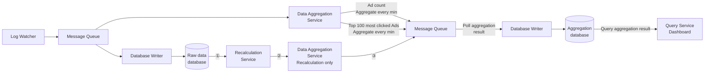
*Data recalculation flow*

## Time
need time to perform aggregation; timestamp can be gnrt:
- Event Time: when ad click happens
- Processng Time: refer to system time of aggregation server that processes click event

| |Pros|Cons|
|-|----|----|
|Event Time|aggregation more correct, cause w eknow when click happened|depens on user, can be malicious|
|Processing TIme|server timestamp more reliable|not accurate if event reaches late|

use **Watermark** Technique to handle
The value set for the watermark depends on the business requirement. A long watermark
could catch events that arrive very late, but it adds more latency to the system. A short
watermark means data is less accurate, but it adds less latency to the system.

## Aggregation Window
**Tumbling Window** time partitioned into same-length non-overlapping chunks
**Sliding Window**events grouped within a window that slides across data stream

## Delievery Guarantee
Message queues such as Kafka usually provide three delivery semantics: at-most once, at-least once, and exactly once.

use ince-delievery method for the system

## Data DeDuplication Logic
reasns:
client side: client sent out duplicate data more than once
server outage: server goes down in middle of aggregation

duplicate data:

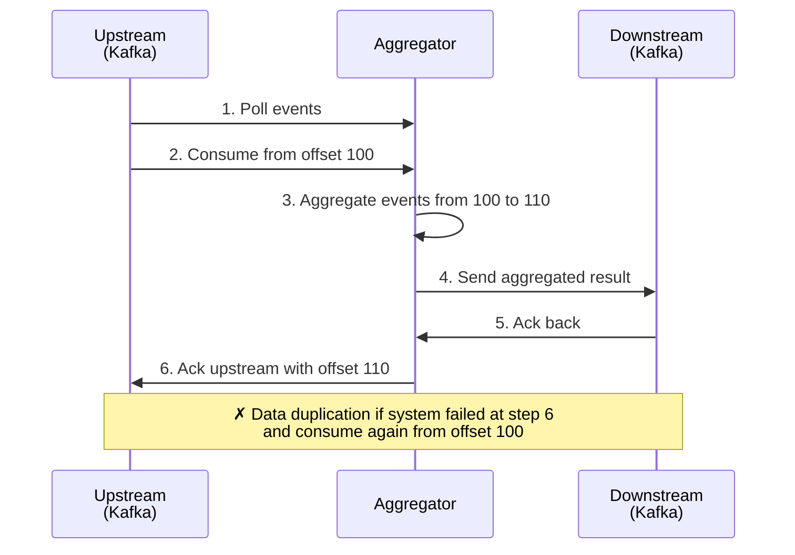


record the off set

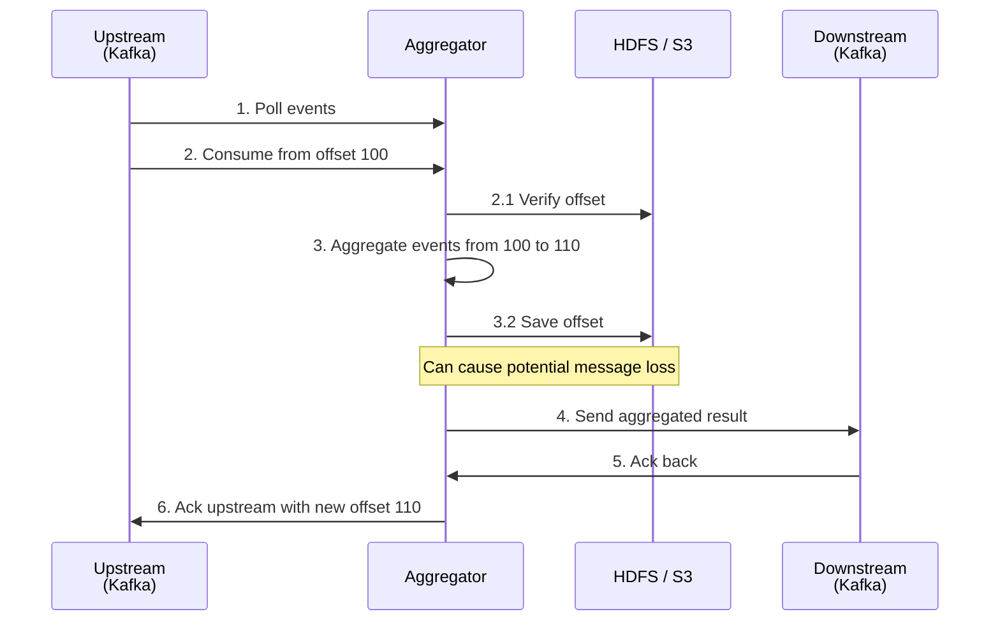

problem: the offset is saved to HDFS or S3 (step 3.2) before the aggregation result is sent downstream. 
If step 4 fails due to Aggregator outage, events from 100 to 110 will never be processed by a newly brought up aggregator node, 
since the offset stored in external storage is 110.
To avoid data loss, we need to save the offset once we get an acknowledgment back from downstream. The updated design is shown
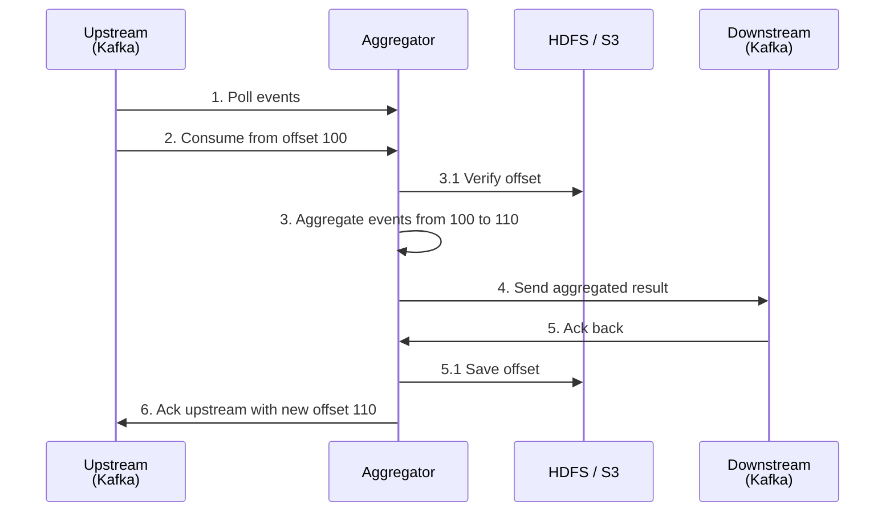

However, the problem with saving offset after ack is that if step 5.1 fails, the offset is not saved and the same events will be re-consumed — causing data duplication. The solution is a **distributed transaction** that atomically commits the aggregated result, offset save, and downstream ack together.

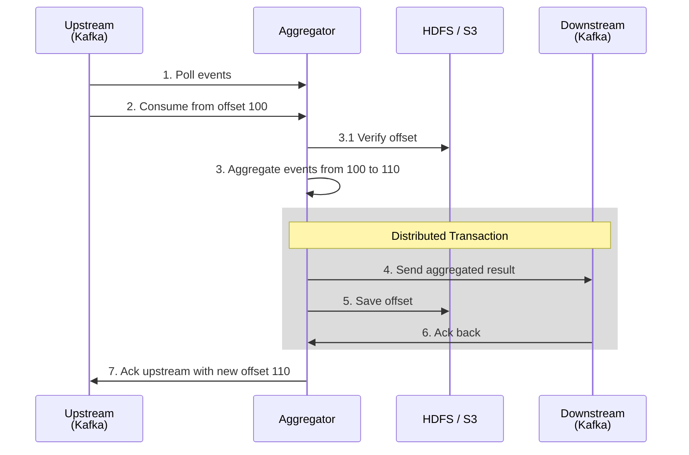
*Distributed transaction: steps 4, 5, and 6 are committed atomically*

# Scaling the System

From the back-of-the-envelope estimation, we know the business grows 30% per year, which doubles traffic every 3 years. How do we handle this growth?

Our system consists of three independent components: **message queue**, **aggregation service**, and **database**. Since these components are decoupled, we can scale each one independently.

## Scale the Message Queue

We have already discussed how to scale the message queue extensively in the "Distributed Message Queue" chapter, so we'll only briefly touch on a few points.

### Producers
We don't limit the number of producer instances, so the scalability of producers can be easily achieved.

### Consumers
Inside a consumer group, the rebalancing mechanism helps to scale the consumers by adding or removing nodes. By adding more consumers, each consumer only processes events from one partition.

```mermaid
graph LR
    subgraph Before Rebalance
        direction LR
        subgraph Topic1[Topic]
            P0a[Partition 0]
            P1a[Partition 1]
            P2a[Partition 2]
            P3a[Partition 3]
        end
        C0a[Consumer 0]
        C1a[Consumer 1]
        P0a --> C0a
        P1a --> C0a
        P2a --> C1a
        P3a --> C1a
    end

    Before Rebalance -->|Rebalance| After

    subgraph After[After Rebalance]
        direction LR
        subgraph Topic2[Topic]
            P0b[Partition 0]
            P1b[Partition 1]
            P2b[Partition 2]
            P3b[Partition 3]
        end
        C0b[Consumer 0]
        C1b[Consumer 1]
        C2b[Consumer 2]
        C3b[Consumer 3]
        P0b --> C0b
        P1b --> C1b
        P2b --> C2b
        P3b --> C3b
    end
```
*Add consumers: after rebalance, each consumer handles exactly one partition*

When there are **hundreds of Kafka consumers** in the system, consumer rebalance can be quite slow and could take a few minutes or even more. Therefore, if more consumers need to be added, try to do it during **off-peak hours** to minimize the impact.

### Brokers

- **Hashing key**: Using `ad_id` as hashing key for Kafka partition to store events from the same `ad_id` in the same Kafka partition. In this case, an aggregation service can subscribe to all events of the same `ad_id` from one single partition.

- **The number of partitions**: If the number of partitions changes, events of the same `ad_id` might be mapped to a different partition. Therefore, it's recommended to **pre-allocate enough partitions** in advance, to avoid dynamically increasing the number of partitions in production.

- **Topic physical sharding**: One single topic is usually not enough. We can split the data by geography (`topic_north_america`, `topic_europe`, `topic_asia`, etc.) or by business type (`topic_web_ads`, `topic_mobile_ads`, etc).
  - **Pros**: Slicing data to different topics can help increase the system throughput. With fewer consumers for a single topic, the time to rebalance consumer groups is reduced.
  - **Cons**: It introduces extra complexity and increases maintenance costs.

## Scale the Aggregation Service

In the high-level design, we talked about the aggregation service being a map/reduce operation. The aggregation service is horizontally scalable by adding or removing nodes.

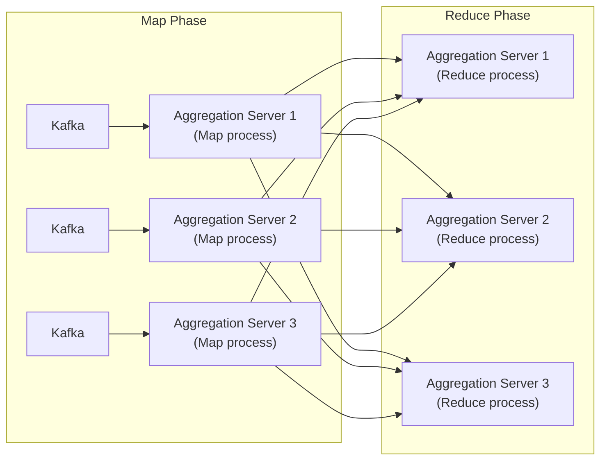
*Aggregation service: Map processes feed into Reduce processes across servers*

How do we increase the throughput of the aggregation service? There are two options:

### Option 1: Multi-threading
Allocate events with different `ad_id`s to different threads.

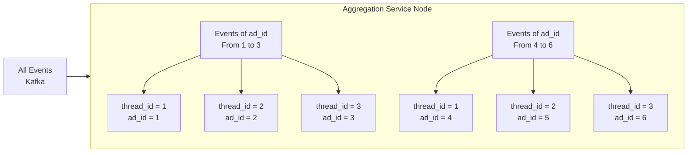
*Multi-threading: different ad_ids allocated to different threads within an aggregation node*

### Option 2: Multi-processing (e.g., Apache Hadoop YARN)
Deploy aggregation service nodes on resource providers like Apache Hadoop YARN.

**Option 1** is easier to implement and doesn't depend on resource providers. In reality, however, **option 2** is more widely used because we can scale the system by adding more computing resources.

## Scale the Database

Cassandra natively supports horizontal scaling, in a way similar to consistent hashing.

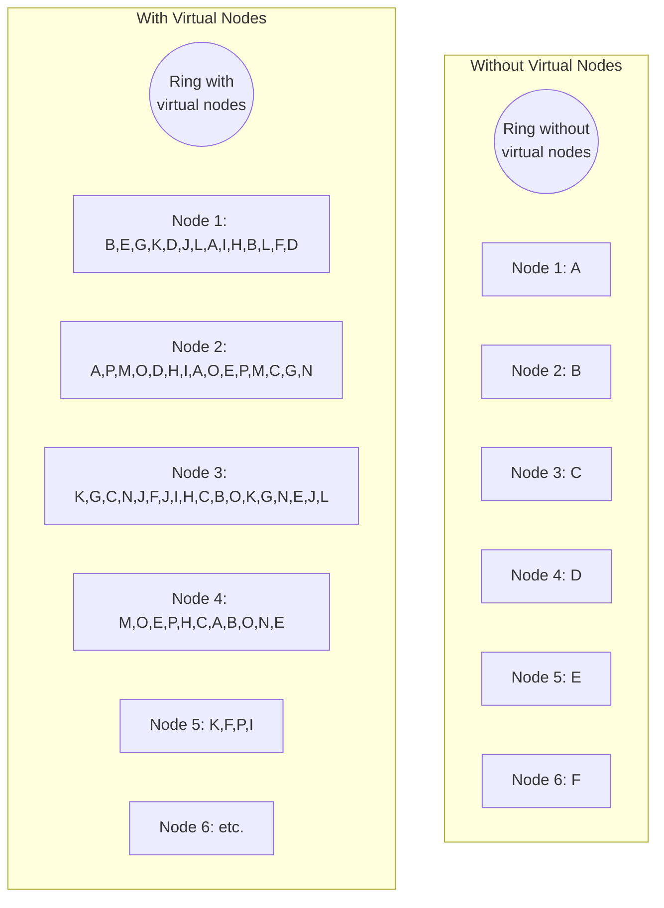
*Virtual nodes: Data is evenly distributed to every node with a proper replication factor*

Data is evenly distributed to every node with a proper replication factor. Each node saves its own part of the ring based on hashed value and also saves copies from other virtual nodes.

If we add a new node to the cluster, it automatically rebalances the virtual nodes among all nodes. **No manual resharding is required.**

## Hotspot Issue

A shard or service that receives much more data than the others is called a **hotspot**. This occurs because major companies have advertising budgets in the millions of dollars and their ads are clicked more often. Since events are partitioned by `ad_id`, some aggregation service nodes might receive many more ad click events than others, potentially causing server overload.

This problem can be mitigated by **allocating more aggregation nodes** to process popular ads. Assume each aggregation node can handle only 100 events:

1. Since there are 300 events in the aggregation node (beyond the capacity of a node), it applies for extra resources through the resource manager.
2. The resource manager allocates more resources (for example, add two more aggregation nodes) so the original aggregation node isn't overloaded.
3. The original aggregation node splits events into 3 groups and each aggregation node handles 100 events.
4. The result is written back to the original aggregate node.

```mermaid
graph TD
    DI[Data Input] --> Map((Map))
    Map -->|"ad1, 300 events"| Agg1((Aggregate))
    Agg1 -->|"① Apply for\nextra resources"| RM[Resource Manager]
    RM -->|"② Extra resource\nallocated"| Agg1

    Agg1 -->|"③ Split events"| AggH1((Aggregate\n100 events))
    Agg1 -->|"③ Split events"| AggH2((Aggregate\n100 events))
    Agg1 -->|"③ Split events"| AggH3((Aggregate\n100 events))

    AggH1 --> Reduce((Reduce))
    AggH2 --> Reduce
    AggH3 --> Reduce

    Reduce -->|"④ Reduced result"| Agg1

    Map --> AggOther((Aggregate))
    AggOther --> ReduceOut((Reduce))
    ReduceOut --> Output[Aggregated Output]
    Agg1 --> ReduceOut
```
*Allocate more aggregation nodes to handle hotspot ads*

There are more sophisticated ways to handle this problem, such as **Global-Local Aggregation** or **Split Distinct Aggregation**.

## Fault Tolerance

Let's discuss the fault tolerance of the aggregation service. Since aggregation happens in memory, when an aggregation node goes down, the aggregated result is lost as well. We can rebuild the count by replaying events from upstream Kafka brokers.

Replaying data from the beginning of Kafka is slow. A good practice is to save the "system status" like upstream offset to a **snapshot** and recover from the last saved status. In our design, the "system status" is more than just the upstream offset because we need to store data like top *N* most clicked ads in the past *M* minutes.

### Snapshot data example

```
Snapshot for top 3 most clicked ads from last 5 minutes:

ad1: 12  → ad1  [1, 3, 2, 3, 3]
ad3: 5   → ad3  [1, 1, 3, 0, 0]
ad2: 3   → ad2  [0, 2, 0, 1, 0]
                  ───────────────
                  1  2  3  4  5  ← Minute
```

```mermaid
graph LR
    MQ[Message Queue] --> DAS[Data Aggregation\nService]
    DAS --> SS[(Snapshot\nStorage)]
    SS -->|Incremental\nSnapshot| SS
```

### Aggregation Node Failover

With a snapshot, the failover process of the aggregation service is quite simple. If one aggregation service node fails, we bring up a new node and recover data from the latest snapshot. If there are new events that arrive after the last snapshot was taken, the new aggregation node will pull those data from the Kafka broker for replay.

```mermaid
graph LR
    EN[External Nodes] --> PAN[Primary\naggregation\nnode]
    EN --> NAN[New\naggregation\nnode]
    PAN -->|Incremental\nSnapshot| SS[(Snapshot\nStorage)]
    SS --> NAN
```
*Aggregation node failover: new node recovers from snapshot storage*

## Data Monitoring and Correctness

As mentioned earlier, aggregation results can be used for RTB and billing purposes. It's critical to monitor the system's health and to ensure correctness.

### Continuous Monitoring

Here are some metrics we might want to monitor:

- **Latency**: Since latency can be introduced at each stage, it's invaluable to track timestamps as events flow through different parts of the system. The differences between those timestamps can be exposed as latency metrics.
- **Message queue size**: If there is a sudden increase in queue size, we may need to add more aggregation nodes. Note that Kafka is a message queue implemented as a distributed commit log, so we need to monitor the **records-lag** metrics instead.
- **System resources on aggregation nodes**: CPU, disk, JVM, etc.

## Reconciliation

Reconciliation means comparing different sets of data in order to ensure data integrity. Unlike reconciliation in the banking industry, where you can compare your records with the bank's records, the result of ad click aggregation has no third-party result to reconcile with.

What we can do is to sort the ad click events by event time in every partition at the end of the day, by using a **batch job** and reconciling with the real-time aggregation result. If we have higher accuracy requirements, we can use a smaller aggregation window; for example, one hour.

> **Please note**: No matter which aggregation window is used, the result from the batch job **might not match exactly** with the real-time aggregation result, since some events might arrive late (see "Time" section above).

```mermaid
graph LR
    LW[Log Watcher] --> MQ1[Message Queue]
    MQ1 --> DAS[Data Aggregation\nService]
    DAS -->|"Ad count\n(Aggregate every min)"| MQ2[Message Queue]
    DAS -->|"Top 100 most clicked Ads\n(Aggregate every min)"| MQ2

    MQ1 --> DBW1[Database Writer]
    DBW1 --> RawDB[(Raw data\ndatabase)]

    MQ2 --> DBW2[Database Writer]
    DBW2 --> AggDB[(Aggregation\ndatabase)]

    AggDB --> QS[Query Service\nDashboard]

    RawDB --> RS[Recalculation\nService]
    RS --> DASR[Data Aggregation\nService\nRecalculation only]
    DASR --> MQ2

    RawDB -.->|Reconciliation| Recon[Reconciliation]
    AggDB -.-> Recon
```
*Final design with reconciliation support*

## Alternative Design

In a generalist system design interview, you are not expected to know the internals of different pieces of specialized software used in a big data pipeline. Explaining your thought process and discussing trade-offs is very important, which is why we propose a generic solution.

**Another option** is to store ad click data in **Hive**, with an **ElasticSearch** layer built for faster queries. **Aggregation** is usually done in OLAP databases such as **ClickHouse** or **Druid**.

```mermaid
graph LR
    LW[Log Watcher] --> MQ[Message Queue]
    MQ --> RCE[Risk Control\nEngine]
    RCE --> Hive[(Hive)]
    RCE --> CH[(ClickHouse)]
    Hive --> ES[ElasticSearch]
    CH -->|Query| QAR[Query aggregation\nresults]
    QAR --> MFA[Merchant Facing\nAnalytics]
    QAR --> DSQ[Data Scientist\nQueries]
```
*Alternative design: Hive + ElasticSearch + ClickHouse/Druid*

# Step 4 - Wrap Up

In this chapter, we went through the process of designing an ad click event aggregation system at the scale of Facebook or Google. We covered:

- **Data model and API design.**
- **Use MapReduce paradigm** to aggregate ad click events.
- **Scale the message queue, aggregation service, and database.**
- **Mitigate hotspot issue.**
- **Monitor the system continuously.**
- **Use reconciliation** to ensure correctness.
- **Fault tolerance.**

The ad click event aggregation system is a typical big data processing system. It will be easier to understand and design if you have prior knowledge or experience with industry-standard solutions such as **Apache Kafka**, **Apache Flink**, or **Apache Spark**.
