# Rate Limiter

A rate limiter is used to control the rate of traffic sent by a client or a service.

A rate limiter limits the number of client requests allowed to be sent over a specified period.
If the API request count exceeds the threshold defined by the rate limiter, all the excess calls are blocked.

ex:
• A user can write no more than 2 posts per second.
• You can create a maximum of 10 accounts per day from the same IP address.
• You can claim rewards no more than 5 times per week from the same device.

## Benefits:

• Prevent resource starvation caused by Denial of Service (DoS) attack [1]. Almost all
APIs published by large tech companies enforce some form of rate limiting. For example,
Twitter limits the number of tweets to 300 per 3 hours [2]. Google docs APIs have the
following default limit: 300 per user per 60 seconds for read requests [3]. A rate limiter
prevents DoS attacks, either intentional or unintentional, by blocking the excess calls.

• Reduce cost. Limiting excess requests means fewer servers and allocating more
resources to high priority APIs. Rate limiting is extremely important for companies that
use paid third party APIs. For example, you are charged on a per-call basis for the
following external APIs: check credit, make a payment, retrieve health records, etc.
Limiting the number of calls is essential to reduce costs.

• Prevent servers from being overloaded. To reduce server load, a rate limiter is used to
filter out excess requests caused by bots or users’ misbehavior.

## Features

- client side rate limiter
- flexible enough to support different sets of throttle routes{IP, userID, etc}.
- large request
- distributed environment
- inform users who are throttled
- low latency

# Implementation

- Client
- Server
- middleware

questions to aks while Implementation:

- tech stack{language, cache service, etc}
- rate limiting algorithm
- microservice architecture and included an API gateway in the design to perform authentication, IP whitelisting, etc., you may add a rate limiter to the API gateway.
- if you have resources and time else commercial API gateway

# Algorithms

- Token bucket
- Leaking bucket
- Fixed window counter
- Sliding window log
- Sliding window counter

## Token Bucket

A container has pre-defined capacity. token are dumped into container at some preset
rates periodically.
once bucket is full no more token shall be allowed, hence extra token will overflow

Each request consumes one token. When a request arrives, we check if there are enough tokens in the bucket. Figure 4-5 explains how it works: - If there are enough tokens, we take one token out for each request, and the request goes through. - If there are not enough tokens, the request is dropped.

1. Refiller continuously adds tokens to the bucket at a fixed rate.
2. Requests arrive and check the bucket.
3. If there are enough tokens, requests consume tokens and are forwarded.
4. If not, the requests are dropped.

### Flow Diagram


token bucket size is 4, and the refill rate is 4 per 1 minute.

algorithm takes two parameters

• Bucket size: the maximum number of tokens allowed in the bucket
• Refill rate: number of tokens put into the bucket every second

Pro:

- easy to implement
- memory efficient
- tokens allow a burst of traffic, request go through as long as tokens are left.

Cons:

- challenging to tune the bucket size and token refill rate.

## Leaking Bucket

similar to the token bucket except that requests are processed
at a fixed rate.

- When a request arrives, the system checks if the queue is full. If it is not full, the request is added to the queue.
- Otherwise, the request is dropped.
- Requests are pulled from the queue and processed at regular intervals.


takes two parameters
• Bucket size: it is equal to the queue size. The queue holds the requests to be processed at
a fixed rate.
• Outflow rate: it defines how many requests can be processed at a fixed rate, usually in
seconds.

Pro:

- Memory efficient given the limited queue size.
- Requests are processed at a fixed rate therefore it is suitable for use cases that a stable outflow rate is needed.

Cons:

- A burst of traffic fills up the queue with old requests, and if they are not processed in time, recent requests will be rate limited.
- There are two parameters in the algorithm. It might not be easy to tune them properly.

## Fixed window counter

Fixed window counter algorithm works as follows:

- The algorithm divides the timeline into fix-sized time windows and assign a counter for each window.
- Each request increments the counter by one.
- Once the counter reaches the pre-defined threshold, new requests are dropped until a new time window starts.

A major problem with this algorithm is that a burst of traffic at the edges of time windows
could cause more requests than allowed quota to go through.

Pro:

- Memory Efficient
- Easy to understand
- Resetting available quota at the end of a unit time window fits certain use cases.

Cons:

- Spike in traffic at the edges of a window could cause more requests than the allowed quota to go through.

## Sliding window log algorithm

the fixed window counter algorithm has a major issue: it allows
more requests to go through at the edges of a window.

this one fixes that issue:
• The algorithm keeps track of request timestamps. Timestamp data is usually kept in cache, such as sorted sets of Redis [8].
• When a new request comes in, remove all the outdated timestamps. Outdated timestamps are defined as those older than the start of the current time window.
• Add timestamp of the new request to the log.
• If the log size is the same or lower than the allowed count, a request is accepted. Otherwise, it is rejected.

```mermaid
flowchart TD

    subgraph Step1[①]
        A1[Request at 1:00:01] --> B1[Log: &#123;1:00:01&#125;]
        B1 --> C1[✅ Accepted]
    end

    subgraph Step2[②]
        A2[Request at 1:00:30] --> B2[Log: &#123;1:00:01, 1:00:30&#125;]
        B2 --> C2[✅ Accepted]
    end

    subgraph Step3[③]
        A3[Request at 1:00:50] --> B3[Log: &#123;1:00:01, 1:00:30, 1:00:50&#125;]
        B3 --> C3[❌ Rejected]
    end

    subgraph Step4[④]
        A4[Request at 1:01:40] --> B4[Log: &#123;1:00:50, 1:01:40&#125;]
        B4 --> C4[✅ Accepted]
    end

```



the rate limiter allows 2 requests per minute. Usually, Linux timestamps are
stored in the log.

Pros:

- Rate limiting implemented by this algorithm is very accurate. In any rolling window,
  requests will not exceed the rate limit.

Cons:

- The algorithm consumes a lot of memory because even if a request is rejected, its
  timestamp might still be stored in memory.

## Sliding window counter algorithm

a hybrid approach that combines the fixed window counter and sliding window log.

rate limiter allows max 7req/min; 5 in previos;3 in current

no of rolling request= request in current + request in previous * overlap % of rolling and previous
= 3+5*0.7%
= 6.5 request

rounded down to 6
but 7 can be made and 7th will go through
however limit will be reached after 1 more rquest

some Pros and Cons

### Pros

- It smooths out spikes in traffic because the rate is based on the average rate of the
  previous window.
- Memory efficient.

### Cons

- It only works for not-so-strict look back window. It is an approximation of the actual rate
  because it assumes requests in the previous window are evenly distributed. However, this
  problem may not be as bad as it seems. According to experiments done by Cloudflare [10],
  only 0.003% of requests are wrongly allowed or rate limited among 400 million requests.

---

# High Level Architecture

we need a counter to keep track of how many requests are sent from the same user, IP address, etc. If the counter is
larger than the limit, the request is disallowed.

In-memory cache is chosen because it is fast and supports time-based expiration
strategy. 2 commands:

- INCR: It increases the stored counter by 1.
- EXPIRE: It sets a timeout for the counter. If the timeout expires, the counter is
  automatically deleted.

```mermaid
flowchart LR
    subgraph Client
        A[💻 Laptop]
        B[📱 Mobile]
    end

    A --> C[Rate limiter middleware]
    B --> C

    C --> D[API Servers]
    C --> E[(Redis)]
    E --> C
```



• The client sends a request to rate limiting middleware.
• Rate limiting middleware fetches the counter from the corresponding bucket in Redis and checks if the limit is reached or not.
• If the limit is reached, the request is rejected.
• If the limit is not reached, the request is sent to API servers. Meanwhile, the system increments the counter and saves it back to Redis.

---

# Design Deep Dive

• How are rate limiting rules created? Where are the rules stored?
• How to handle requests that are rate limited?

## Rate Limiting Rules

ex:
system is configured to allow a maximum of 5 marketing messages per day

```yaml
domain: messaging
descriptors:
    - key: message_type
      Value: marketing
    rate_limit:
        unit: day
        requests_per_unit: 5
```

clients are not allowed to login more than 5 times in 1 minute

```yaml
domain: auth
descriptors:
  - key: auth_type
    Value: login
    rate_limit:
      unit: minute
      requests_per_unit: 5
```

## Exceeding the rate limit

In case a request is rate limited, APIs return a HTTP response code 429 (too many requests) to the client.

we may enqueue the rate-limited requests to be
processed later. For example, if some orders are rate limited due to system overload, we may
keep those orders to be processed later.

### Rate Limit Headers

`X-Ratelimit-Remaining`: The remaining number of allowed requests within the window.
`X-Ratelimit-Limit`: It indicates how many calls the client can make per time window.
`X-Ratelimit-Retry-After`: The number of seconds to wait until you can make a request again without being throttled.
When a user has sent too many requests, a 429 too many requests error and
`X-Ratelimit-Retry-After` header are returned to the client.

```mermaid
flowchart LR
    subgraph Client
        A[💻 Laptop]
        B[📱 Mobile]
    end
    A --> C[Rate limiter middleware]
    B --> C

    C -- success --> D[API Servers]
    C --> E[(Redis)]
    C -- cached rules --> F[Cache]
    F --> G[Workers]
    G --> H[Rules]

    C -- rate limited --> I[429: too many requests]
    I --> A

    C -. option 1 .-> J[(Request dropped)]
    C -. option 2 .-> K[(Message queue)]
```



- Rules are stored on the disk. Workers frequently pull rules from the disk and store them in the cache.
- When a client sends a request to the server, the request is sent to the rate limiter middleware first.
- Rate limiter middleware loads rules from the cache. It fetches counters and last request timestamp from Redis cache. Based on the response, the rate limiter decides:
  - if the request is not rate limited, it is forwarded to API servers.
  - if the request is rate limited, the rate limiter returns 429 too many requests error to the client. In the meantime, the request is either dropped or forwarded to the queue.

## Rate limiter in a distributed environment

hmm, single server is no task. However, scaling the system to support multiple servers and concurrent threads is a different story.
2 challenges:

- Race condition
- Synchronization issue

**Race Condition:**
high level the condition are:
• Read the counter value from Redis.
• Check if ( counter + 1 ) exceeds the threshold.
• If not, increment the counter value by 1 in Redis.

```mermaid
flowchart TB
    T["Original counter value: 3"]
    style T fill=none,stroke=none,font-weight=bold

    subgraph R1["request 1"]
        A[read_counter<br/>counter: 3] --> B[check_and_increment<br/>counter: 4]
    end

    subgraph R2["request 2"]
        C[read_counter<br/>counter: 3] --> D[check_and_increment<br/>counter: 4]
    end

    style title fill=none,stroke=none

    note["Counter should be: 5"]:::error
    D --> note

    classDef error fill=none,stroke=none,color=red,font-weight=bold;
```

Assume the counter value in Redis is 3.
If two requests concurrently read the counter value before either of them writes the value back, each will increment the counter by one and write
it back without checking the other thread.
Both requests (threads) believe they have the correct counter value 4. However, the correct counter value should be 5.

**Synchronization issue:**
To support millions of users, one rate limiter server might not be enough to handle the traffic.
When multiple rate limiter servers are used, synchronization is required.

client 1 sends requests to rate limiter 1, and client 2 sends requests to rate limiter 2. If no synchronization happens, rate limiter 1 does
not contain any data about client 2. Thus, the rate limiter cannot work properly.

```mermaid
flowchart LR
    subgraph L[" "]
        direction TB
        subgraph C1["Client 1"]
            Laptop1["💻"] --- Phone1["📱"]
        end
        C1 --> RL1["Rate limiter 1"]

        subgraph C2["Client 2"]
            Laptop2["💻"] --- Phone2["📱"]
        end
        C2 --> RL2["Rate limiter 2"]
    end

    subgraph R[" "]
        direction TB
        subgraph C3["Client 1"]
            Laptop3["💻"] --- Phone3["📱"]
        end

        subgraph C4["Client 2"]
            Laptop4["💻"] --- Phone4["📱"]
        end

        C3 --> RL3["Rate limiter 1"]
        C4 --> RL4["Rate limiter 2"]

        C3 -.-> RL4
        C4 -.-> RL3
    end
```



One possible solution is to use sticky sessions that allow a client to send traffic to the same
rate limiter
problem: neither scalable nor flexible

better approach is to use centralized data stores like Redis.

```mermaid
flowchart LR
    subgraph Client1["Client 1"]
        Laptop1["💻"] --- Phone1["📱"]
    end
    Client1 --> RL1["Rate limiter 1"]

    subgraph Client2["Client 2"]
        Laptop2["💻"] --- Phone2["📱"]
    end
    Client2 --> RL2["Rate limiter 2"]

    RL1 --> Redis[(Redis)]
    RL2 --> Redis[(Redis)]

```



# Performance

1. multi-data center setup is crucial for a rate limiter because latency is high for users
   located far away from the data center.
   ex: Cloudflare has 194 geographically distributed edge servers [14]. Traffic is automatically routed to the closest edge server to reduce latency.

2. synchronize data with an eventual consistency model.

# Monitoring

we want to make sure:

- The rate limiting algorithm is effective.
- The rate limiting rules are effective.

---

# References

[1] 

[2] 

[3] 

[4] 

[5] 

[6] 

[7] 

[8] 

[9] 

[10] 

[11] 

[12] 

[13] 

[14] 

[15] 

[16] 
