# Rate Limiter

A rate limiter controls the rate of traffic from a client or a service.

It limits the number of requests allowed within a specified time window. When the request count exceeds the configured threshold, excess calls are blocked or delayed.

Examples:
- A user can create no more than 2 posts per second.
- A single IP address can create at most 10 accounts per day.
- A device can claim rewards no more than 5 times per week.

## Benefits

- Prevent resource exhaustion and reduce the impact of DoS/traffic spikes. Most large APIs enforce rate limits (e.g., Twitter limits tweets to 300 per 3 hours [2]).
- Reduce cost by limiting calls to expensive third-party APIs (payments, health records, etc.).
- Protect servers from overload by filtering excess or abusive requests.

## Features

- Client-side rate limiting support
- Flexible scoping (per IP, per user ID, per API key, per route)
- Support for large volumes and distributed deployment
- Inform clients when they are throttled (HTTP 429 + headers)
- Low-latency enforcement (edge or middleware)

# Implementation

Components:

- Client
- Server
- Middleware (rate-limiting layer)

Implementation questions:

- Tech stack (language, cache, deployment model)
- Which rate-limiting algorithm to use
- Where to place the limiter (API gateway, edge, or application middleware)
- Use a commercial API gateway or build a custom solution

# Algorithms

- Token bucket
- Leaking bucket
- Fixed window counter
- Sliding window log
- Sliding window counter

## Token Bucket

The Token Bucket algorithm maintains a bucket that accumulates tokens at a fixed refill rate up to a maximum capacity. Each request consumes one token. If tokens are available the request is allowed; otherwise it is dropped or delayed.

Key parameters:

- Bucket size (capacity)
- Refill rate (tokens per second)

Flow:

1. A refiller adds tokens to the bucket at a fixed rate.
2. Requests arrive and check the bucket.
3. If tokens are available, requests consume tokens and are forwarded.
4. If not, requests are dropped or throttled.


Pros:

- Simple and memory efficient
- Supports bursts (requests pass while tokens remain)

Cons:

- Tuning bucket size and refill rate can be challenging

## Leaky Bucket

The Leaky Bucket processes requests at a fixed outflow rate. Incoming requests are queued up to a maximum queue size; if the queue is full, additional requests are dropped.

Key parameters:

- Bucket size (queue capacity)
- Outflow rate (requests processed per second)


Pros:

- Memory efficient due to limited queue size
- Stable outflow rate suitable for steady processing

Cons:

- Bursts can fill the queue with stale requests, delaying recent requests
- Tuning the two parameters may be non-trivial

## Fixed Window Counter

The Fixed Window Counter divides time into fixed-size windows and counts requests per window. Each request increments the current window's counter. When the counter exceeds the threshold, additional requests are rejected until the next window.

Pros:

- Simple and memory efficient
- Easy to implement

Cons:

- Edge bursts spanning window boundaries can exceed the intended quota

## Sliding Window Log

The Sliding Window Log stores timestamps of each request (often in a sorted set like Redis). On each request, the algorithm removes timestamps outside the rolling window, inserts the new timestamp, and checks the log size against the limit.


Pros:

- Very accurate; rolling-window enforcement guarantees the limit is not exceeded

Cons:

- Consumes more memory since timestamps for many requests are stored

## Sliding Window Counter

The Sliding Window Counter is a hybrid that approximates a rolling window by combining counts from the current and previous fixed windows, weighted by overlap.

Example: if the limit is 7 req/min, and previous window had 5 requests while current has 3, the rolling estimate = current + previous * overlap.

Pros:

- Smooths spikes compared to fixed windows
- More memory efficient than the full log

Cons:

- An approximation that assumes even distribution within the previous window (rare edge cases can be misclassified)

---

# High Level Architecture

we need a counter to keep track of how many requests are sent from the same user, IP address, etc. If the counter is
larger than the limit, the request is disallowed.

In-memory cache is chosen because it is fast and supports time-based expiration
strategy. 2 commands:

- INCR: It increases the stored counter by 1.
- EXPIRE: It sets a timeout for the counter. If the timeout expires, the counter is
  automatically deleted.

```mermaid
flowchart LR
    subgraph Client
        A[💻 Laptop]
        B[📱 Mobile]
    end

    A --> C[Rate limiter middleware]
    B --> C

    C --> D[API Servers]
    C --> E[(Redis)]
    E --> C
```



• The client sends a request to rate limiting middleware.
• Rate limiting middleware fetches the counter from the corresponding bucket in Redis and checks if the limit is reached or not.
• If the limit is reached, the request is rejected.
• If the limit is not reached, the request is sent to API servers. Meanwhile, the system increments the counter and saves it back to Redis.

---

# Design Deep Dive

• How are rate limiting rules created? Where are the rules stored?
• How to handle requests that are rate limited?

## Rate Limiting Rules

ex:
system is configured to allow a maximum of 5 marketing messages per day

```yaml
domain: messaging
descriptors:
    - key: message_type
      Value: marketing
    rate_limit:
        unit: day
        requests_per_unit: 5
```

clients are not allowed to login more than 5 times in 1 minute

```yaml
domain: auth
descriptors:
  - key: auth_type
    Value: login
    rate_limit:
      unit: minute
      requests_per_unit: 5
```

## Exceeding the rate limit

In case a request is rate limited, APIs return a HTTP response code 429 (too many requests) to the client.

we may enqueue the rate-limited requests to be
processed later. For example, if some orders are rate limited due to system overload, we may
keep those orders to be processed later.

### Rate Limit Headers

`X-Ratelimit-Remaining`: The remaining number of allowed requests within the window.
`X-Ratelimit-Limit`: It indicates how many calls the client can make per time window.
`X-Ratelimit-Retry-After`: The number of seconds to wait until you can make a request again without being throttled.
When a user has sent too many requests, a 429 too many requests error and
`X-Ratelimit-Retry-After` header are returned to the client.

```mermaid
flowchart LR
    subgraph Client
        A[💻 Laptop]
        B[📱 Mobile]
    end
    A --> C[Rate limiter middleware]
    B --> C

    C -- success --> D[API Servers]
    C --> E[(Redis)]
    C -- cached rules --> F[Cache]
    F --> G[Workers]
    G --> H[Rules]

    C -- rate limited --> I[429: too many requests]
    I --> A

    C -. option 1 .-> J[(Request dropped)]
    C -. option 2 .-> K[(Message queue)]
```



- Rules are stored on the disk. Workers frequently pull rules from the disk and store them in the cache.
- When a client sends a request to the server, the request is sent to the rate limiter middleware first.
- Rate limiter middleware loads rules from the cache. It fetches counters and last request timestamp from Redis cache. Based on the response, the rate limiter decides:
  - if the request is not rate limited, it is forwarded to API servers.
  - if the request is rate limited, the rate limiter returns 429 too many requests error to the client. In the meantime, the request is either dropped or forwarded to the queue.

## Rate limiter in a distributed environment

hmm, single server is no task. However, scaling the system to support multiple servers and concurrent threads is a different story.
2 challenges:

- Race condition
- Synchronization issue

**Race Condition:**
high level the condition are:

- Read the counter value from Redis.
- Check if ( counter + 1 ) exceeds the threshold.
- If not, increment the counter value by 1 in Redis.

```mermaid
flowchart TB
    T["Original counter value: 3"]

    subgraph R1["request 1"]
        A["read_counter - counter: 3"] --> B["check_and_increment - counter: 4"]
    end

    subgraph R2["request 2"]
        C["read_counter - counter: 3"] --> D["check_and_increment - counter: 4"]
    end

    T --> A
    T --> C
    B --> note["Counter should be: 5 — but is actually: 4 (race condition!)"]
    D --> note

    classDef errorStyle fill:#ffcccc,stroke:#cc0000,color:#000000
    class note errorStyle
```



Assume the counter value in Redis is 3.
If two requests concurrently read the counter value before either of them writes the value back, each will increment the counter by one and write
it back without checking the other thread.
Both requests (threads) believe they have the correct counter value 4. However, the correct counter value should be 5.

**Synchronization issue:**
To support millions of users, one rate limiter server might not be enough to handle the traffic.
When multiple rate limiter servers are used, synchronization is required.

client 1 sends requests to rate limiter 1, and client 2 sends requests to rate limiter 2. If no synchronization happens, rate limiter 1 does
not contain any data about client 2. Thus, the rate limiter cannot work properly.

```mermaid
flowchart LR
    subgraph L[" "]
        direction TB
        subgraph C1["Client 1"]
            Laptop1["💻"] --- Phone1["📱"]
        end
        C1 --> RL1["Rate limiter 1"]

        subgraph C2["Client 2"]
            Laptop2["💻"] --- Phone2["📱"]
        end
        C2 --> RL2["Rate limiter 2"]
    end

    subgraph R[" "]
        direction TB
        subgraph C3["Client 1"]
            Laptop3["💻"] --- Phone3["📱"]
        end

        subgraph C4["Client 2"]
            Laptop4["💻"] --- Phone4["📱"]
        end

        C3 --> RL3["Rate limiter 1"]
        C4 --> RL4["Rate limiter 2"]

        C3 -.-> RL4
        C4 -.-> RL3
    end
```



One possible solution is to use sticky sessions that allow a client to send traffic to the same
rate limiter
problem: neither scalable nor flexible

better approach is to use centralized data stores like Redis.

```mermaid
flowchart LR
    subgraph Client1["Client 1"]
        Laptop1["💻"] --- Phone1["📱"]
    end
    Client1 --> RL1["Rate limiter 1"]

    subgraph Client2["Client 2"]
        Laptop2["💻"] --- Phone2["📱"]
    end
    Client2 --> RL2["Rate limiter 2"]

    RL1 --> Redis[(Redis)]
    RL2 --> Redis[(Redis)]

```



# Performance

1. multi-data center setup is crucial for a rate limiter because latency is high for users
   located far away from the data center.
   ex: Cloudflare has 194 geographically distributed edge servers [14]. Traffic is automatically routed to the closest edge server to reduce latency.

2. synchronize data with an eventual consistency model.

# Monitoring

we want to make sure:

- The rate limiting algorithm is effective.
- The rate limiting rules are effective.

[code Implementation](https://github.com/NalinDalal/week-45-rate-limiting/tree/main)

---

# References

[1] [Rate-limiting strategies and techniques](https://cloud.google.com/solutions/rate-limiting-strategies-techniques)

[2] [Twitter rate limits](https://developer.twitter.com/en/docs/basics/rate-limits)

[3] [Google docs usage limits](https://developers.google.com/docs/api/limits)

[4] [IBM microservices](https://www.ibm.com/cloud/learn/microservices)

[5] [Throttle API requests for better throughput](https://docs.aws.amazon.com/apigateway/latest/developerguide/api-gateway-request-throttling.html)

[6] [Stripe rate limiters](https://stripe.com/blog/rate-limiters)

[7] [Shopify REST Admin API rate limits](https://help.shopify.com/en/api/reference/rest-admin-api-rate-limits)

[8] [Better Rate Limiting With Redis Sorted Sets](https://engineering.classdojo.com/blog/2015/02/06/rolling-rate-limiter/)

[9] [System Design — Rate limiter and Data modelling](https://medium.com/@saisandeepmopuri/system-design-rate-limiter-and-data-modelling-9304b0d18250)

[10] [How we built rate limiting capable of scaling to millions of domains](https://blog.cloudflare.com/counting-things-a-lot-of-different-things/)

[11] [Redis website](https://redis.io/)

[12] [Lyft rate limiting](https://github.com/lyft/ratelimit)

[13] [Scaling your API with rate limiters](https://gist.github.com/ptarjan/e38f45f2dfe601419ca3af937fff574d#request-rate-limiter)

[14] [What is edge computing](https://www.cloudflare.com/learning/serverless/glossary/what-is-edge-computing/)

[15] [Rate Limit Requests with Iptables](https://blog.programster.org/rate-limit-requests-with-iptables)

[16] [OSI model](https://en.wikipedia.org/wiki/OSI_model#Layer_architecture)
