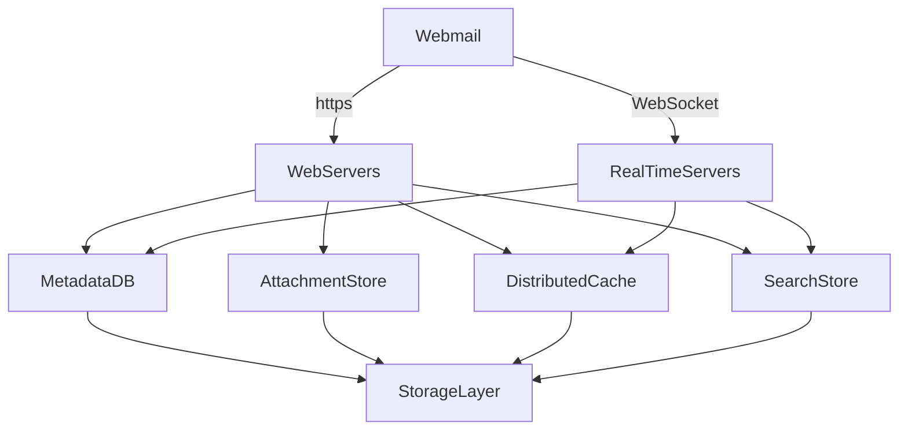
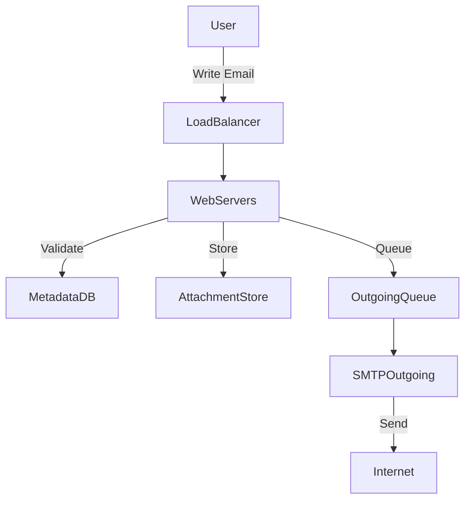
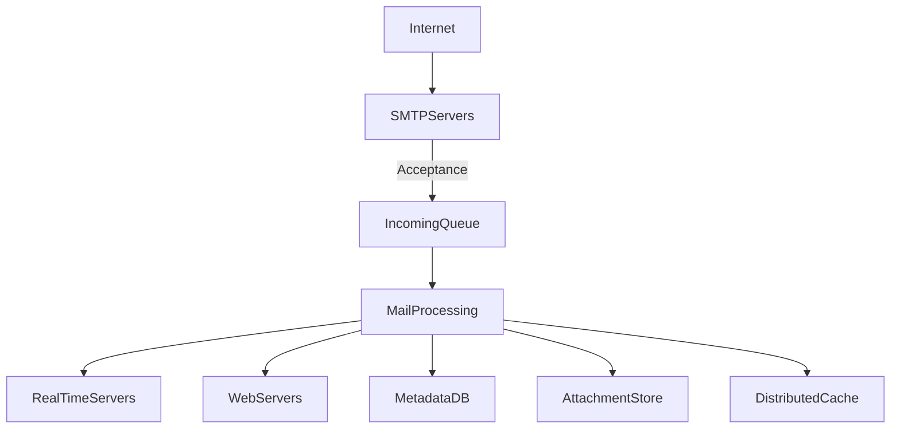

# Distributed Email Service

Similar to:
- Design Gmail, Outlook, Yahoo Mail
- Design a large-scale notification system

---

## Step 1 - Understand the Problem and Establish Design Scope

**Scale:**
- 1 billion users (Gmail scale)
- Email is a storage-heavy application

**Key Features:**
- Send/receive emails
- Fetch all emails
- Filter by read/unread
- Search by subject, sender, body
- Anti-spam & anti-virus

**Non-functional Requirements:**
- **Reliability:** No data loss
- **Availability:** Replicate data across nodes, tolerate partial failures
- **Scalability:** Handle growing users/emails without performance degradation
- **Flexibility/Extensibility:** Add new features easily

**Back-of-the-envelope Estimation:**
- 1B users × 40 emails/day × 365 days ≈ 14.6T emails/year
- Metadata: ~730 PB/year
- Attachments: ~1,460 PB/year

---

## Step 2 - Propose High-level Design and Get Buy-in

### Email Protocols
- **SMTP:** Sending emails between servers
- **POP/IMAP:** Retrieving emails to clients
- **HTTPS:** Webmail access

### DNS & Attachments
- MX records for mail routing
- Attachments: Size limits (20–25MB), stored in object stores (e.g., S3)

### Traditional Mail Server Architecture

- Clients connect via SMTP/IMAP/POP
- Emails stored in file directories (Maildir)
- Not scalable for billions of emails

### Distributed Mail Server Architecture

---

## Step 3 - Design Deep Dive

### Metadata Database

**Characteristics:**
- Small, frequently accessed headers
- Large, infrequently accessed bodies
- Per-user isolation
- High reliability (no data loss)
- Data recency: 82% of reads <16 days old

**Database Choices:**
- **Relational DB:** Good for queries, not for large blobs
- **Object Store (S3):** Good for backup, not for search
- **NoSQL (Bigtable):** Used by Gmail, supports scale

**Schema Example:**
- Partition by `user_id`
- Tables for folders, emails, attachments, read/unread status

### Email APIs
- RESTful APIs for webmail
- SMTP/POP/IMAP for native clients

### Email Sending Flow

### Email Receiving Flow

### Search
- Use Elasticsearch or custom search engine
- LSM tree for write-heavy indexing
- Trade-offs: scalability, complexity, consistency

### Consistency & Idempotency
- Distributed systems trade off consistency for availability
- Use idempotency keys for email/message creation

### Deliverability
- Dedicated IPs, sender reputation, feedback loops (bounce/complaint handling)
- Email authentication: SPF, DKIM, DMARC

### Scalability & Availability
- Horizontal scaling: per-user data is independent
- Replicate data across data centers for availability

---

## Step 4 - Wrap Up

**Additional Talking Points:**
- Fault tolerance: handle node/network failures
- Compliance: GDPR, PII, legal intercept
- Security: protect sensitive info, encryption, phishing protection
- Optimizations: deduplicate attachments, proactive safety features

---

**Summary:**
Designing a distributed email service requires careful consideration of scale, reliability, and extensibility. The architecture leverages microservices, distributed storage, caching, and search to support billions of users and emails, while ensuring high availability and deliverability.