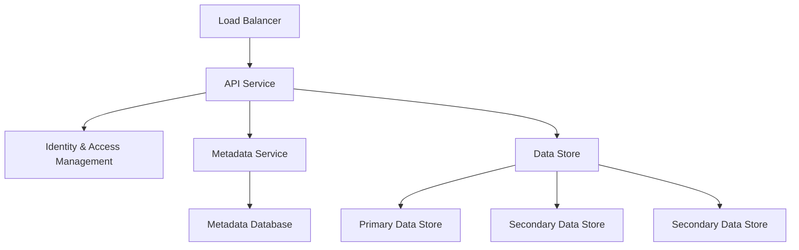
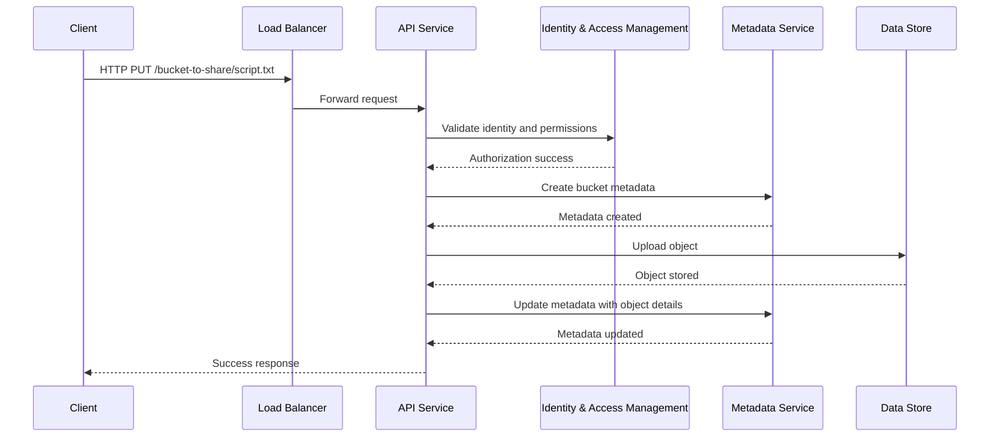
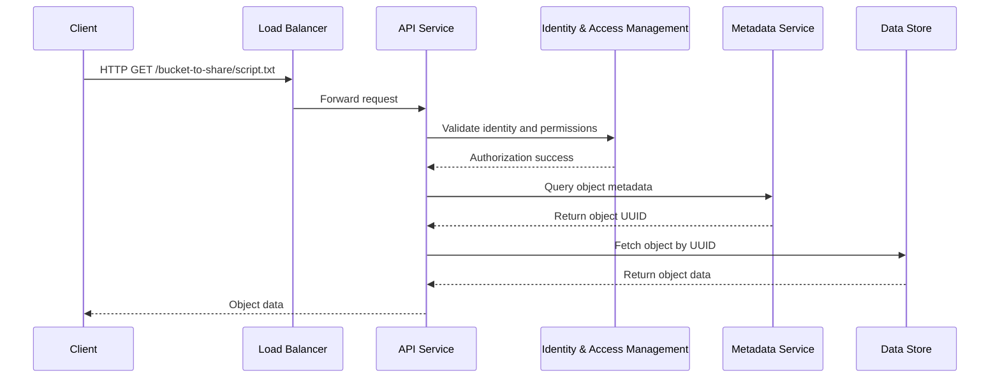
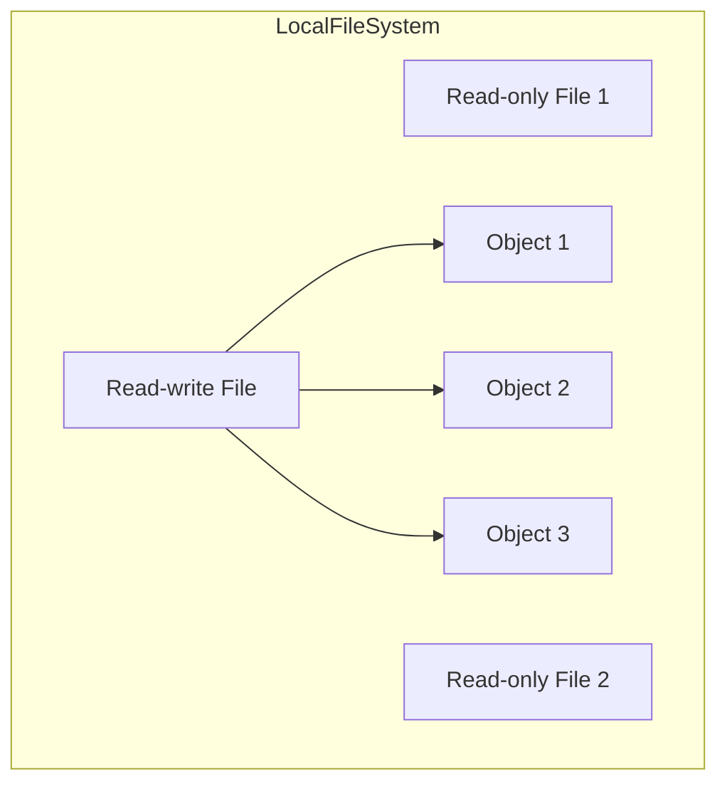
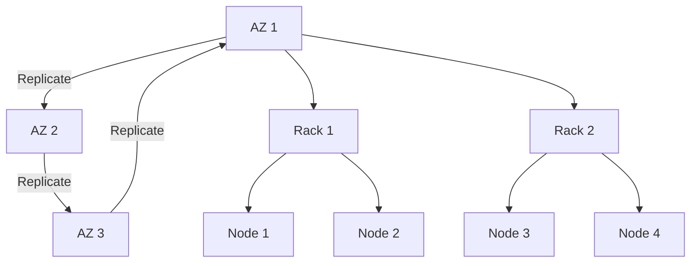
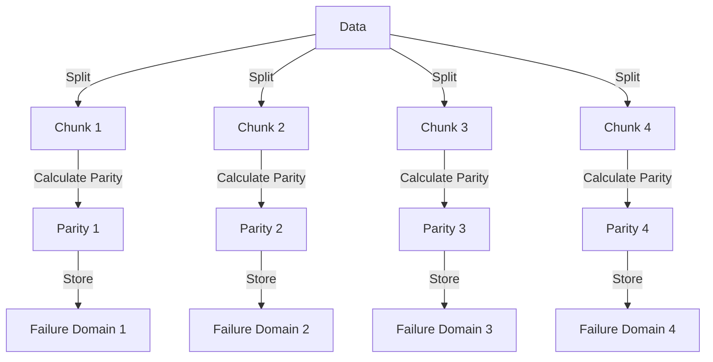

# S3-Like Object Storage System

## Overview

Object storage is a type of storage system designed for high durability, scalability, and cost efficiency. It is ideal for storing large amounts of unstructured data, such as images, videos, and backups. Unlike traditional file storage, object storage organizes data in a flat structure and provides access via RESTful APIs.

## Features

- **Bucket creation**: Logical containers for objects.
- **Object uploading and downloading**: Store and retrieve objects using unique identifiers.
- **Object versioning**: Maintain multiple versions of an object to enable recovery from accidental deletions or overwrites.
- **Listing objects in a bucket**: Retrieve a list of objects stored in a bucket, optionally filtered by prefix.

## High-Level Architecture

The high-level architecture of an S3-like object storage system consists of the following components:



### Components

1. **Load Balancer**: Distributes RESTful API requests across multiple API servers.
2. **API Service**: Handles requests and orchestrates calls to other services.
3. **Identity and Access Management (IAM)**: Manages authentication, authorization, and access control.
4. **Metadata Service**: Stores and retrieves metadata about objects.
5. **Data Store**: Stores the actual object data and ensures durability and replication.

## Key Features and Workflows

### Uploading an Object

The process of uploading an object involves the following steps:



### Downloading an Object

The process of downloading an object involves the following steps:



## Data Persistence Flow

The data persistence flow ensures durability and replication of object data:

```mermaid
graph TD
    API[API Service] --> DRS[Data Routing Service]
    DRS --> PS[Placement Service]
    PS --> Primary[Primary Data Node]
    Primary --> Secondary1[Secondary Data Node 1]
    Primary --> Secondary2[Secondary Data Node 2]
    Primary-->>DRS: Acknowledge replication
    DRS-->>API: Return Object UUID
```

### Trade-offs Between Consistency and Latency

1. **Strong Consistency**: Data is saved after all replicas are updated. High latency.
2. **Eventual Consistency**: Data is saved after the primary and one replica are updated. Medium latency.
3. **Weak Consistency**: Data is saved after the primary is updated. Low latency.

## Data Organization

To optimize storage, small objects are merged into larger files, similar to a write-ahead log (WAL). Each object is stored with metadata in an object mapping table.



## Durability and Reliability

### Multi-Datacenter Replication

Data is replicated across multiple availability zones (AZs) to ensure durability and availability.



### Erasure Coding

Erasure coding improves durability and storage efficiency by splitting data into chunks and calculating parity.



## Garbage Collection

Garbage collection reclaims storage space by compacting files and removing unused or deleted objects.

```mermaid
graph TD
    subgraph BeforeCompaction
        FileB["/data/b"]
        FileB --> Object2[Object 2 (Deleted)]
        FileB --> Object3[Object 3]
        FileB --> Object5[Object 5 (Deleted)]
    end

    subgraph AfterCompaction
        FileD["/data/d"]
        FileD --> Object3[Object 3]
    end

    BeforeCompaction -->|Compaction| AfterCompaction
```
