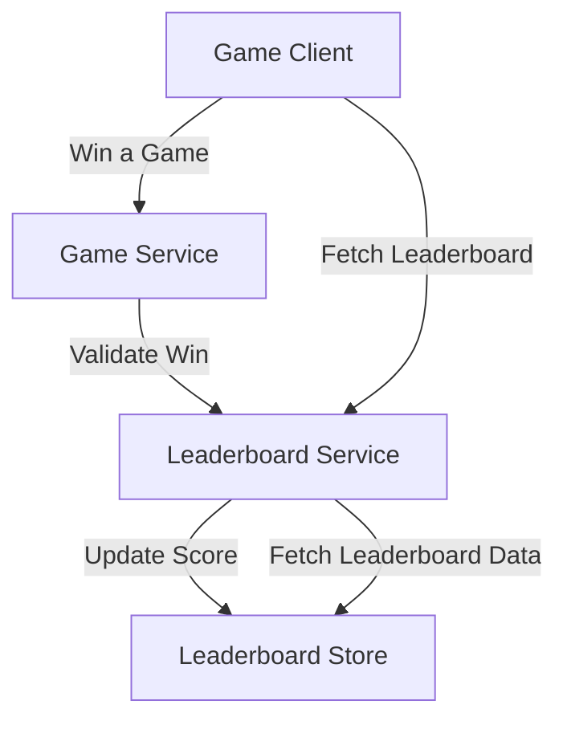
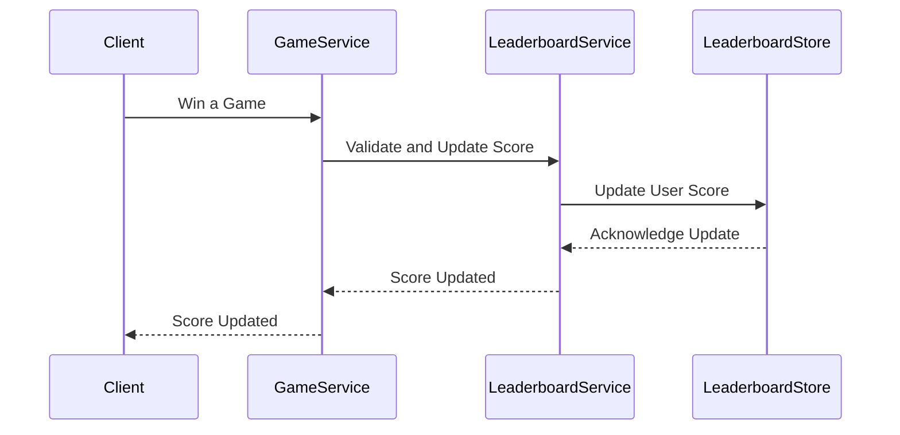
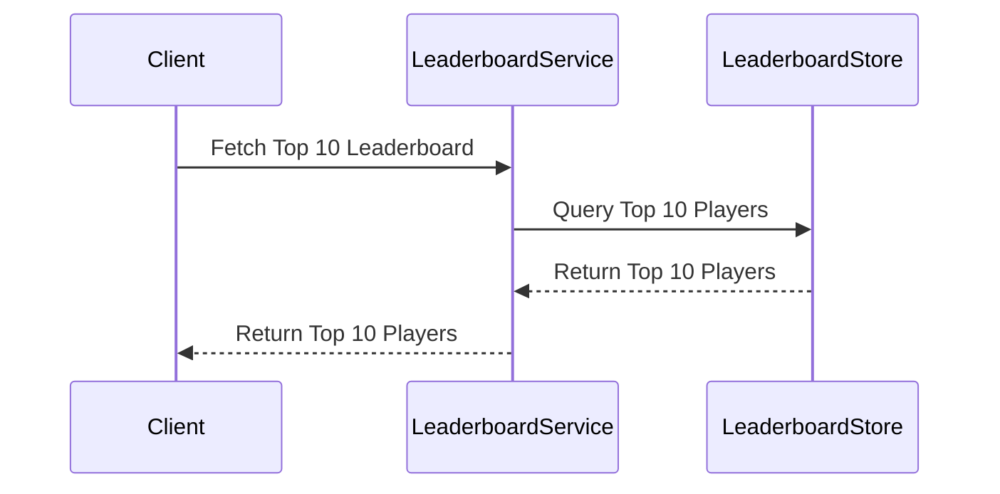
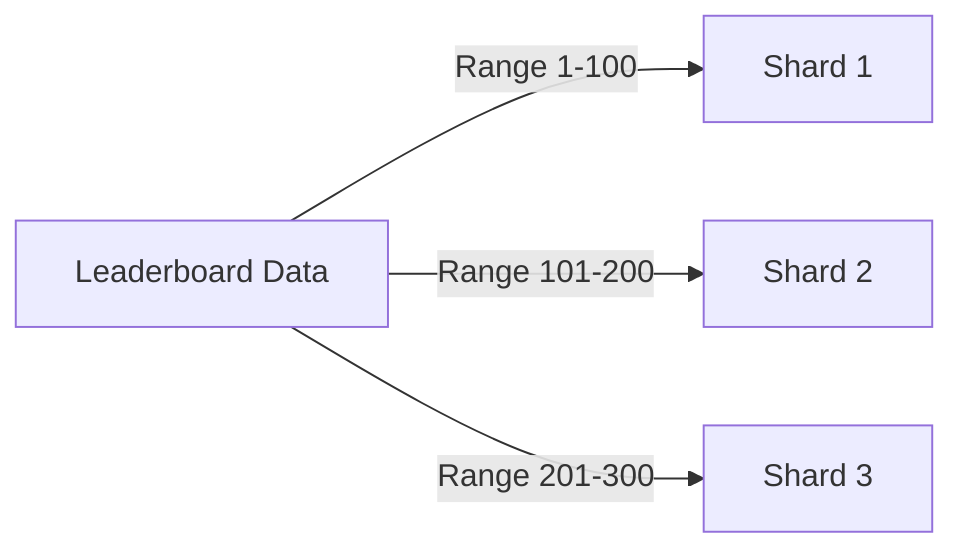
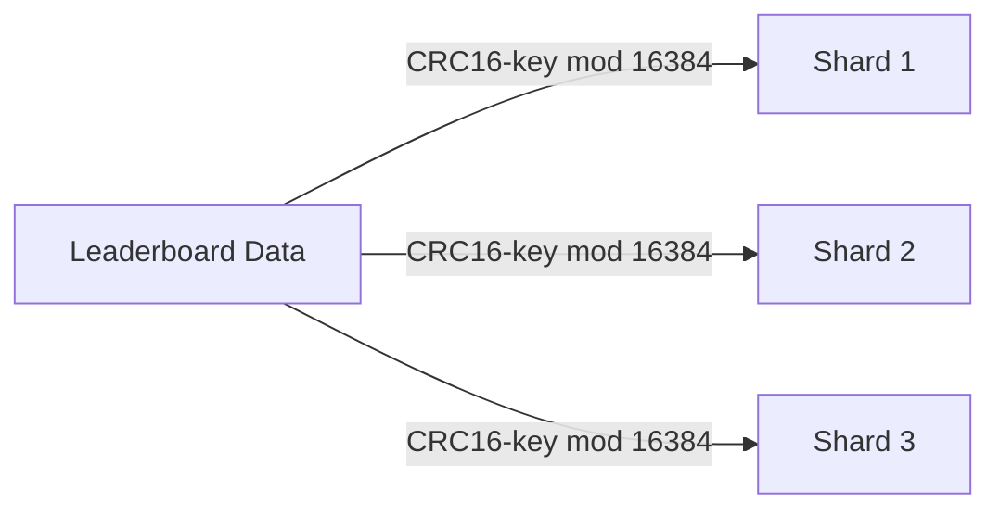
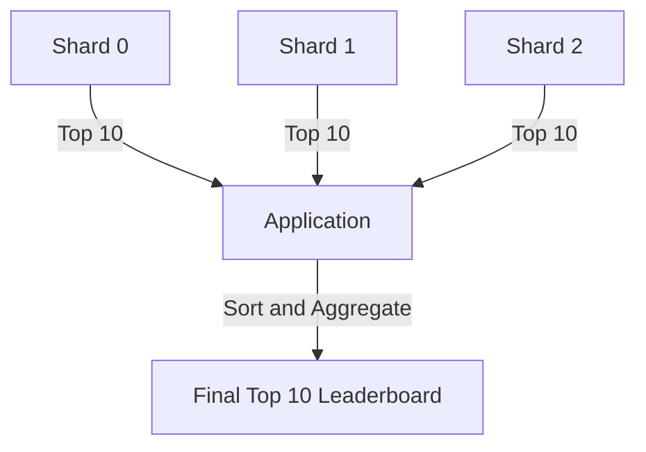

# Real Time Gaming Leaderboard

## Functional Requirements
1. **Display Top 10 Players:**
   - The leaderboard should display the top 10 players based on their scores.
   - The scores should be sorted in descending order.
   - Each entry should include the player’s rank, name, and score.

2. **Show User’s Specific Rank:**
   - The leaderboard should allow users to query their specific rank.
   - The rank should be calculated in real-time based on the user’s score.

3. **Display Nearby Players:**
   - The leaderboard should display players who are four places above and below the queried user.
   - This feature provides context to the user about their position relative to others.

## Non-Functional Requirements
1. **Real-Time Updates:**
   - Scores should be updated in real-time to reflect the latest game results.
   - The leaderboard should provide low-latency responses for all queries.

2. **Scalability:**
   - The system should handle up to 5 million daily active users (DAU) and 25 million monthly active users (MAU).
   - The system should scale to accommodate peak loads of 250 users scoring points per second.

3. **Reliability:**
   - The system should ensure high availability and fault tolerance.
   - Data consistency should be maintained even in the event of failures.

## Back-of-the-Envelope Estimation
1. **User Activity:**
   - Average of 50 users scoring points per second.
   - Peak load of 250 users scoring points per second.

2. **QPS (Queries Per Second):**
   - Scoring a point: 2,500 QPS (peak).
   - Fetching the top 10 leaderboard: 50 QPS.

3. **Storage Requirements:**
   - Each leaderboard entry requires 26 bytes (24 bytes for user ID and 2 bytes for score).
   - For 25 million MAU, storage requirement is approximately 650 MB per leaderboard.
   - With redundancy and overhead, a modern Redis server can handle this data volume.

## API Design
1. **POST /v1/scores**
   - **Purpose:** Update a user’s position on the leaderboard when they win a game.
   - **Request Parameters:**
     - `user_id`: The user who wins a game.
     - `points`: The number of points gained by winning a game.
   - **Responses:**
     - `200 OK`: Successfully updated the user’s score.
     - `400 Bad Request`: Failed to update the user’s score.

2. **GET /v1/scores**
   - **Purpose:** Fetch the top 10 players from the leaderboard.
   - **Response:**
     - List of top 10 players with their ranks, names, and scores.

3. **GET /v1/scores/{user_id}**
   - **Purpose:** Fetch the rank of a specific user.
   - **Request Parameters:**
     - `user_id`: The ID of the user whose rank we want to fetch.
   - **Response:**
     - User’s rank and score.

## High-Level Architecture

1. **Game Service:**
   - Validates the win and sends a request to the leaderboard service to update the score.

2. **Leaderboard Service:**
   - Updates the user’s score in the leaderboard store.
   - Provides APIs to fetch leaderboard data.

3. **Leaderboard Store:**
   - Stores leaderboard data using a scalable and efficient data model.

## Data Models
1. **Relational Database Solution:**
   - Use a simple table with `user_id` and `score` columns.
   - Challenges:
     - Poor scalability for large datasets due to table scans for rank calculation.
     - High latency for rank queries with millions of rows.

2. **Redis Solution:**
   - Use Redis sorted sets for predictable performance with millions of users.
   - **Operations:**
     - `ZADD`: Insert or update user score.
     - `ZINCRBY`: Increment user score.
     - `ZRANGE`/`ZREVRANGE`: Fetch a range of users sorted by score.
     - `ZRANK`/`ZREVRANK`: Fetch the rank of a user.
   - **Advantages:**
     - Fast reads and writes with O(log(n)) complexity.
     - Efficient for real-time updates and queries.

3. **NoSQL Solution:**
   - Use DynamoDB with partition key and sort key for scalability.
   - **Challenges:**
     - Requires careful partitioning and write sharding to avoid hot partitions.
     - Scatter-gather approach for fetching top results increases latency.

## Scaling Strategies
1. **Scaling Redis:**
   - Redis can handle up to 500 million DAU with proper sharding and scaling.
   - **Sharding Strategies:**
     1. **Fixed Partition:**
        - Divide the leaderboard into fixed ranges of scores.
        - Challenges: Requires rebalancing when users move between shards.
     2. **Hash Partition:**
        - Use Redis cluster with hash slots for automatic sharding.
        - Challenges: High latency for retrieving top `k` results due to scatter-gather approach.

2. **Data Sharding in NoSQL:**
   - Use write sharding to distribute data across multiple partitions.
   - Partition key: `game_name#year-month#partition_number`.
   - Challenges:
     - Increased complexity for read and write operations.
     - Scatter-gather approach for fetching top results.

## Additional Considerations
1. **Faster Retrieval and Breaking Ties:**
   - Use Redis hashes to store user details for faster retrieval.
   - Store timestamps to break ties for users with the same score.

2. **System Failure Recovery:**
   - Use MySQL to log every score update with a timestamp.
   - Recreate the leaderboard using MySQL logs in case of a Redis failure.

3. **Cloud vs. On-Premise Deployment:**
   - **Cloud Deployment:**
     - Use AWS Lambda and API Gateway for serverless architecture.
     - Leverage Redis for leaderboard storage and MySQL for user details.
   - **On-Premise Deployment:**
     - Manage Redis and MySQL services internally.
     - Use a user profile cache for frequently accessed data.

## Visual Representations

### Data Flow for Scoring a Point

### Data Flow for Fetching Leaderboard

### Data Model Table
| **Field**   | **Type** | **Description**                     |
|-------------|-----------|-------------------------------------|
| user_id     | VARCHAR   | Unique identifier for the user.     |
| score       | INT       | Total score of the user.            |
| timestamp   | DATETIME  | Time of the last score update.      |

### Redis Sorted Set Operations
| **Command**   | **Description**                                                                 |
|---------------|---------------------------------------------------------------------------------|
| `ZADD`        | Insert the user into the set or update their score.                            |
| `ZINCRBY`     | Increment the score of the user by a specified value.                          |
| `ZRANGE`      | Fetch a range of users sorted by score in ascending order.                     |
| `ZREVRANGE`   | Fetch a range of users sorted by score in descending order.                    |
| `ZRANK`       | Fetch the rank of a user in ascending order.                                   |
| `ZREVRANK`    | Fetch the rank of a user in descending order.                                  |

### Sharding Strategies
#### Fixed Partition

#### Hash Partition

### Scatter-Gather for Top 10 Leaderboard

These diagrams and tables provide a clear and visual understanding of the Real-Time Gaming Leaderboard system design, including its architecture, data flow, and sharding strategies.

## Summary
- Explored MySQL, Redis, and DynamoDB solutions for building a real-time gaming leaderboard.
- Chose Redis sorted sets for scalability and performance.
- Discussed scaling strategies, including fixed and hash partitioning.
- Highlighted additional considerations like failure recovery, tie-breaking, and deployment options.
- Provided detailed API design and high-level architecture for implementation.