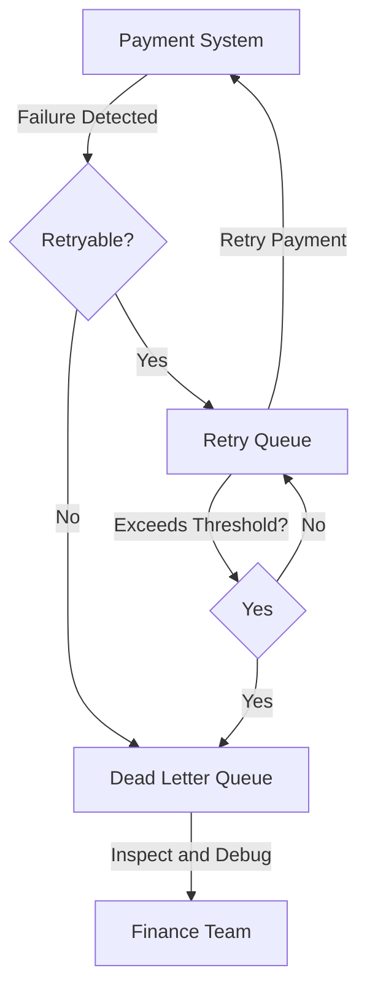
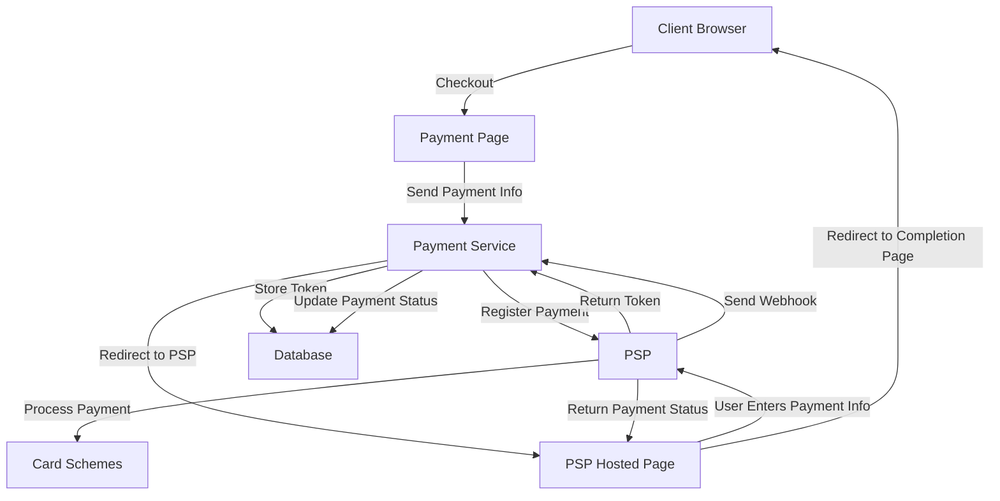

# Payment System

## Functional Requirements
1. **Pay-in Flow:**
   - The payment system should receive money from customers on behalf of sellers.
   - It should handle multiple payment methods such as credit cards, PayPal, and bank transfers.

2. **Pay-out Flow:**
   - The payment system should send money to sellers around the world.
   - It should support international payments and currency conversions.

3. **Risk Check:**
   - The system should perform compliance checks to prevent fraud and ensure adherence to regulations like AML/CFT.

4. **Reconciliation:**
   - The system should reconcile payment data between internal services and external payment service providers (PSPs) to ensure consistency.

## Non-Functional Requirements
1. **Reliability and Fault Tolerance:**
   - The system should handle failed payments gracefully and ensure data consistency.

2. **Scalability:**
   - The system should handle 1 million transactions per day, with a peak throughput of 10 transactions per second (TPS).

3. **Security:**
   - The system should comply with PCI DSS standards and ensure secure handling of sensitive payment data.

## Back-of-the-Envelope Estimation
1. **Transaction Volume:**
   - 1 million transactions per day = ~10 TPS.

2. **Storage Requirements:**
   - Each payment event requires approximately 1 KB of storage.
   - For 1 million transactions per day, the daily storage requirement is ~1 GB.
   - With a retention period of 1 year, the total storage requirement is ~365 GB.

## API Design
1. **POST /v1/payments**
   - **Purpose:** Execute a payment event.
   - **Request Parameters:**
     - `buyer_info`: Information about the buyer (JSON).
     - `checkout_id`: A globally unique ID for the checkout (string).
     - `credit_card_info`: Encrypted credit card information or payment token (JSON).
     - `payment_orders`: List of payment orders (list).
   - **Responses:**
     - `200 OK`: Payment processed successfully.
     - `400 Bad Request`: Invalid payment request.

2. **GET /v1/payments/{id}**
   - **Purpose:** Retrieve the status of a specific payment order.
   - **Request Parameters:**
     - `id`: The unique ID of the payment order (string).
   - **Response:**
     - Payment order status and details.

## High-Level Architecture

```mermaid
graph TD
    A[Client] -->|Initiate Payment| B[Payment Service]
    B -->|Risk Check| C[Risk Service]
    B -->|Process Payment| D[Payment Executor]
    D -->|Communicate| E[Payment Service Provider (PSP)]
    E -->|Card Schemes| F[Bank]
    B -->|Update| G[Ledger]
    B -->|Update| H[Wallet]
    B -->|Reconcile| I[Reconciliation Service]
```

1. **Payment Service:**
   - Orchestrates the payment process, including risk checks, payment execution, and reconciliation.

2. **Risk Service:**
   - Performs compliance checks to prevent fraud and ensure regulatory adherence.

3. **Payment Executor:**
   - Executes payment orders via external PSPs.

4. **PSP and Card Schemes:**
   - Handle the actual transfer of funds between buyer and seller accounts.

5. **Ledger and Wallet Services:**
   - Maintain financial records and account balances.

6. **Reconciliation Service:**
   - Ensures consistency between internal and external systems by comparing transaction records.

## Reconciliation Process

```mermaid
graph TD
    A[Payment Event] -->|Initiate Reconciliation| B[Payment Service]
    B -->|Send Settlement File| C[Payment Executor]
    C -->|Send Settlement File| D[Payment Service Provider (PSP)]
    D -->|Compare Records| E[Reconciliation Service]
    E -->|Detect Discrepancies| F[Finance Team]
    F -->|Manual Adjustments| G[Ledger]
    E -->|Update| G
```

1. **Payment Service:**
   - Initiates the reconciliation process by sending payment events to the reconciliation service.

2. **Reconciliation Service:**
   - Compares internal and external transaction records to detect discrepancies.

3. **Finance Team:**
   - Resolves unclassified mismatches and performs manual adjustments.

4. **Ledger:**
   - Updates the financial records based on reconciliation results.

## Retry and Failure Handling



1. **Retry Queue:**
   - Handles retryable errors with exponential backoff.

2. **Dead Letter Queue:**
   - Stores non-retryable errors for manual inspection and debugging.

3. **Finance Team:**
   - Investigates and resolves issues in the dead letter queue.

## Hosted Payment Flow



1. **Client Browser:**
   - Initiates the payment process by navigating to the payment page.

2. **Payment Service:**
   - Registers the payment with the PSP and stores the token in the database.

3. **PSP Hosted Page:**
   - Collects sensitive payment information and processes the payment.

4. **Database:**
   - Stores payment tokens and updates payment statuses.

5. **Card Schemes:**
   - Handle the actual transfer of funds between buyer and seller accounts.

## Data Models
1. **Payment Event Table:**
   - `checkout_id` (string, PK): Unique identifier for the payment event.
   - `buyer_info` (string): Information about the buyer.
   - `seller_info` (string): Information about the seller.
   - `credit_card_info` (encrypted): Credit card or payment token details.
   - `is_payment_done` (boolean): Indicates if the payment is completed.

2. **Payment Order Table:**
   - `payment_order_id` (string, PK): Unique identifier for the payment order.
   - `buyer_account` (string): Buyers account details.
   - `amount` (string): Transaction amount.
   - `currency` (string): Currency type (ISO 4217).
   - `checkout_id` (string, FK): Foreign key linking to the payment event.
   - `payment_order_status` (enum): Status of the payment order (NOT_STARTED, EXECUTING, SUCCESS, FAILED).
   - `ledger_updated` (boolean): Indicates if the ledger is updated.
   - `wallet_updated` (boolean): Indicates if the wallet is updated.

## Key Design Considerations
1. **Retry Mechanism:**
   - Implement retry queues for transient errors and dead letter queues for non-retryable errors.
   - Use exponential backoff for retries to avoid overwhelming the system.

2. **Idempotency:**
   - Use a unique idempotency key to ensure at-most-once execution of payment requests.
   - Store the idempotency key in the database to detect and prevent duplicate payments.

3. **Reconciliation:**
   - Periodically compare internal and external transaction records to detect and resolve inconsistencies.

4. **Security Measures:**
   - Use HTTPS to prevent eavesdropping.
   - Encrypt sensitive data and use tokenization for credit card information.
   - Implement rate limiting and firewalls to prevent DDoS attacks.

## Enhanced Insights

### Stripe API
Stripe provides a comprehensive API for payment processing, enabling developers to integrate payment functionalities seamlessly. Key features include:
- **Idempotency**: Ensures at-most-once execution of requests.
- **Webhooks**: Facilitates real-time updates on payment events.
- **3D Secure**: Adds an additional layer of security for online card payments.

### Double-Entry Bookkeeping
Double-entry bookkeeping is a foundational accounting principle ensuring that every financial transaction is recorded in at least two accounts. This system:
- Enhances accuracy by maintaining a balance between debits and credits.
- Provides a clear audit trail, crucial for financial reconciliation.
- Is implemented in modern payment systems to ensure data integrity.

### PCI DSS Compliance
The Payment Card Industry Data Security Standard (PCI DSS) is a set of security standards designed to ensure secure handling of credit card information. Key requirements include:
- Encrypting sensitive data during transmission.
- Regularly testing security systems and processes.
- Implementing strong access control measures.

### Tipalti
Tipalti is a finance automation platform that streamlines global payment processes. It offers:
- Automated tax compliance and reporting.
- Support for multiple payment methods and currencies.
- Fraud detection and prevention mechanisms.

### Cryptographic Nonces
A nonce is a unique number used once in cryptographic communication to prevent replay attacks. In payment systems:
- Nonces ensure the uniqueness of each transaction request.
- They play a critical role in securing API communications and preventing duplicate transactions.

These insights further strengthen the design considerations and security measures of the payment system, ensuring robustness and reliability.