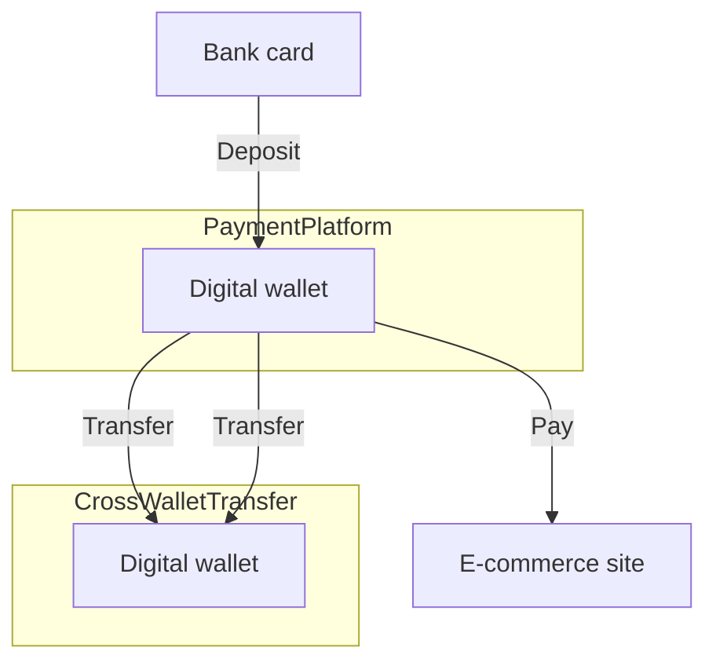
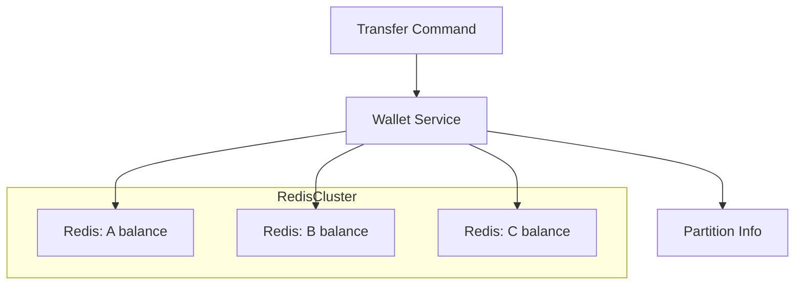
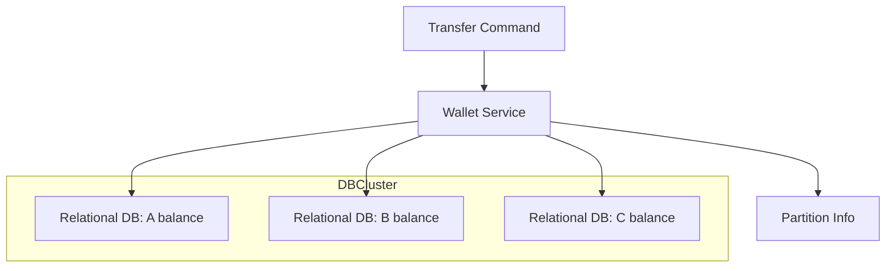
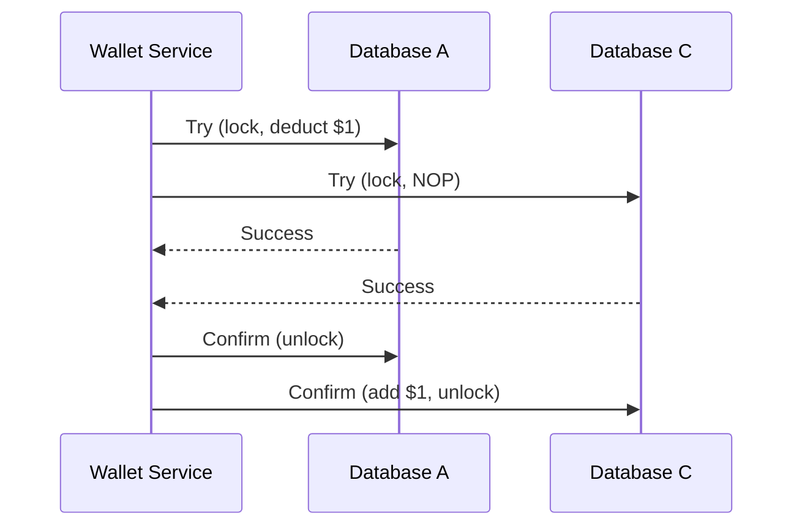
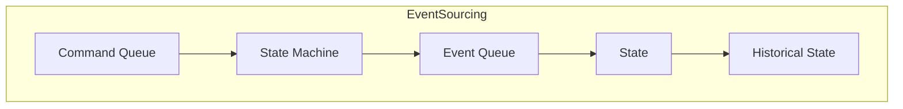
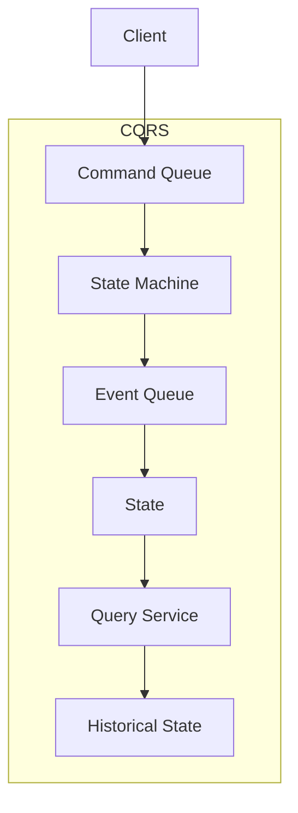
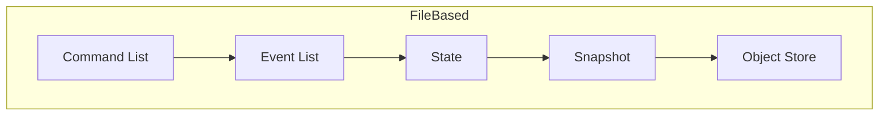
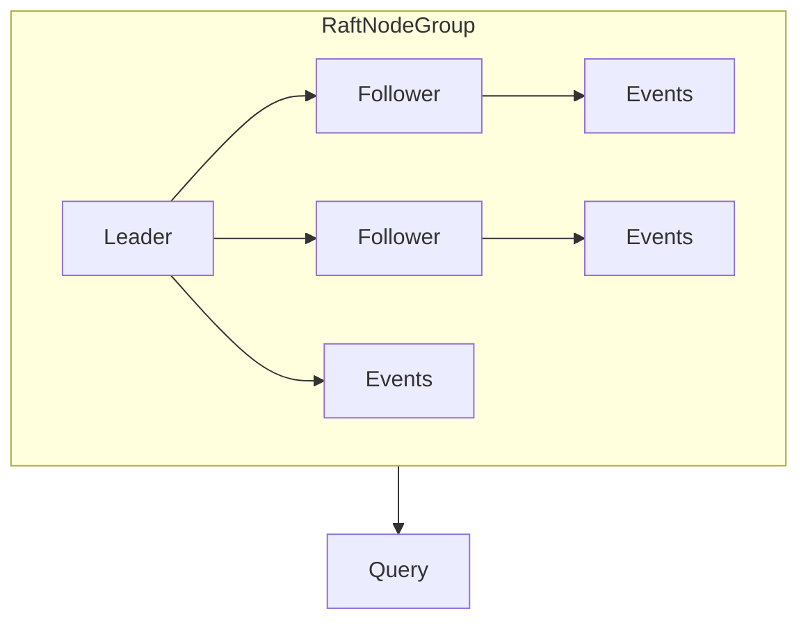
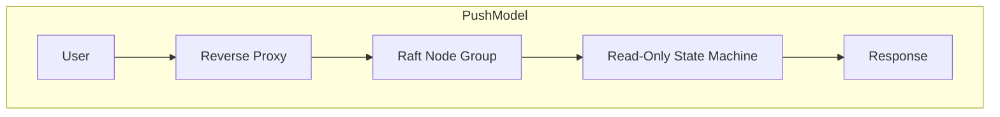

# Digital Wallet

### 1. Problem Statement & Scope
- Design a backend for a digital wallet supporting cross-wallet balance transfers.
- Focus: balance transfer operations (not foreign exchange, not other features).
- Requirements:
  - Support balance transfer between wallets
  - 1,000,000 transactions per second (TPS)
  - Reliability ≥ 99.99%
  - Support transactions & reproducibility

### 2. High-Level Architecture

#### Deposit & Transfer Flow

#### In-Memory Sharding Solution

#### Relational Database Sharding Solution

#### TC/C Distributed Transaction Flow

### 3. Event Sourcing & Reproducibility

#### CQRS Architecture

### 4. High-Performance & Reliable Event Sourcing
#### File-Based Event Sourcing & Snapshot

#### Raft Consensus Node Group

#### Push-Based Real-Time Response Model

---

### 5. Summary & Key Takeaways
- In-memory solution: fast, but not durable
- DB-based distributed transactions: correctness, atomicity, but complex
- Event sourcing: reproducibility, auditability, high performance
- CQRS: separation of write/read, scalable
- Reliability: Raft consensus, replication
- Scalability: sharding, partitioning, push/pull for client updates

---
#### Reference Links Used
- [Transactional guarantees](https://docs.oracle.com/cd/E17275_01/html/programmer_reference/rep_trans.html)
- [TPC-E Top Price/Performance Results](http://tpc.org/tpce/results/tpce_price_perf_results.asp?resulttype=all)
- [ISO 4217 CURRENCY CODES](https://en.wikipedia.org/wiki/ISO_4217)
- [Apache ZooKeeper](https://zookeeper.apache.org/)
- [Designing Data-Intensive Applications](https://www.oreilly.com/library/view/designing-data-intensive-applications/9781491903063/)
- [X/Open XA](https://en.wikipedia.org/wiki/X/Open_XA)
- [Compensating transaction](https://en.wikipedia.org/wiki/Compensating_transaction)
- [SAGAS](https://www.cs.cornell.edu/andru/cs711/2002fa/reading/sagas.pdf)
- [Domain-Driven Design](https://www.amazon.com/Domain-Driven-Design-Tackling-Complexity-Software/dp/0321125215)
- [Apache Kafka](https://kafka.apache.org/)
- [CQRS](https://martinfowler.com/bliki/CQRS.html)
- [Disk access comparison](https://deliveryimages.acm.org/10.1145/1570000/1563874/jacobs3.jpg)
- [mmap](https://man7.org/linux/man-pages/man2/mmap.2.html)
- [SQLite](https://www.sqlite.org/index.html)
- [RocksDB](https://rocksdb.org/)
- [Apache Hadoop](https://hadoop.apache.org/)
- [Raft](https://raft.github.io/)
- [Reverse proxy](https://en.wikipedia.org/wiki/Reverse_proxy)

---