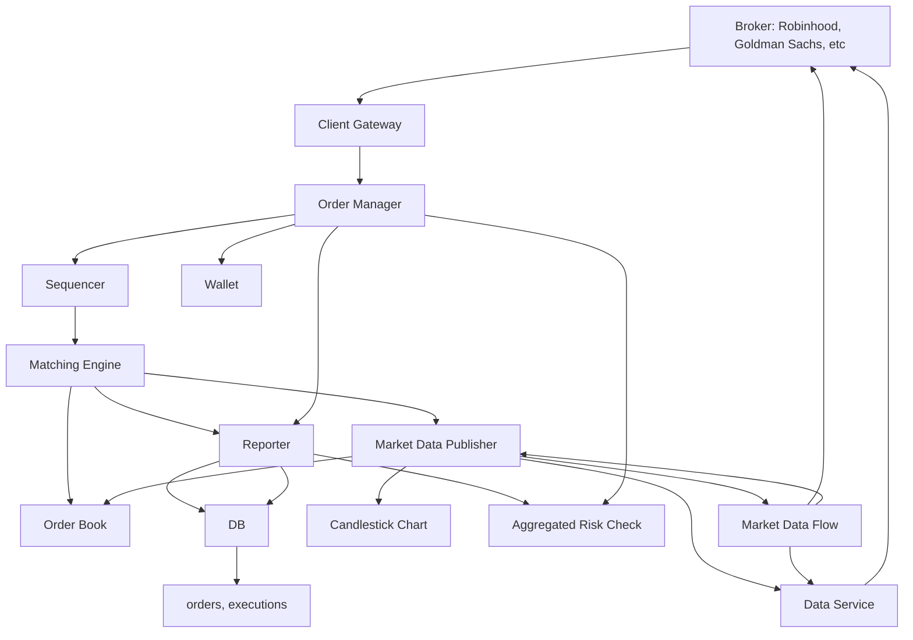
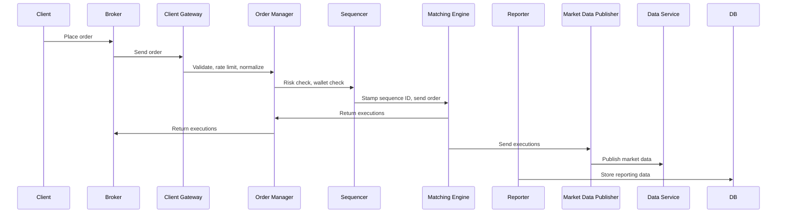
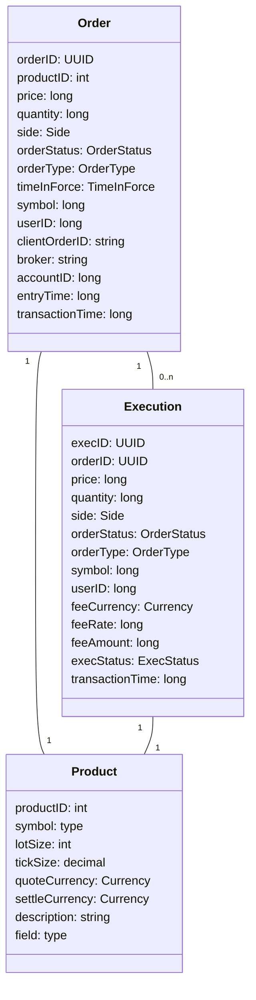
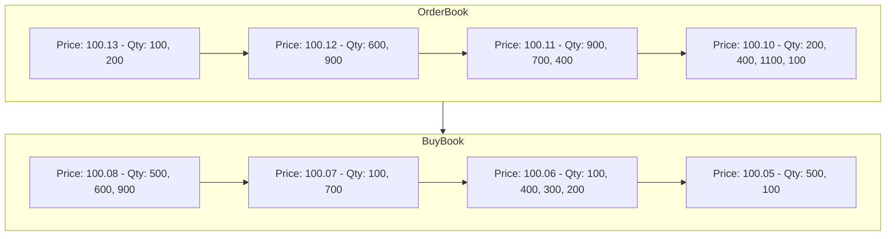
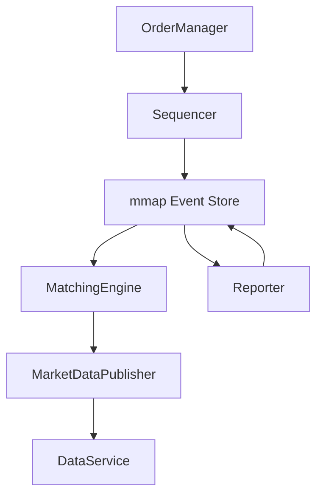

## Stock Exchange

### 1. Problem Scope & Requirements
- **Trade only stocks** (not options/futures)
- Support placing/canceling orders, limit orders
- No after-hours trading
- Scale: billions of orders/day, 100+ symbols, 100K+ users
- Simple risk checks (e.g., max shares per user/day)
- Wallet management: ensure sufficient funds

#### Non-functional Requirements
- Availability: 99.99%+
- Fault tolerance & fast recovery
- Millisecond latency (focus on 99th percentile)
- Security: KYC, DDoS protection

#### Back-of-the-envelope Estimation
- 100 symbols, 1B orders/day, QPS ≈ 43,000 (peak ≈ 215,000)

---

### 2. High-Level Architecture

#### Mermaid Diagram: Stock Exchange High-Level Design

---

### 3. Trading Flow (Sequence)

---

### 4. Data Models

---

### 5. Order Book Structure & Operations

Efficient order book must support:
- Constant lookup time
- O(1) add/cancel/match operations
- Fast update/query best bid/ask
- Iterate price levels

---

### 6. Performance, Event Sourcing, High Availability

- Latency: minimize tasks on critical path, reduce network/disk access
- Use mmap for event store, single-threaded application loops pinned to CPU
- Event sourcing: store immutable log of state changes
- High availability: hot-warm replicas, Raft for leader election, fast failover

---

### 7. Security & Fairness
- Isolate public/private services
- Use caching, harden URLs, safelist/blocklist, rate limiting
- Colocation for VIP clients, multicast for market data fairness