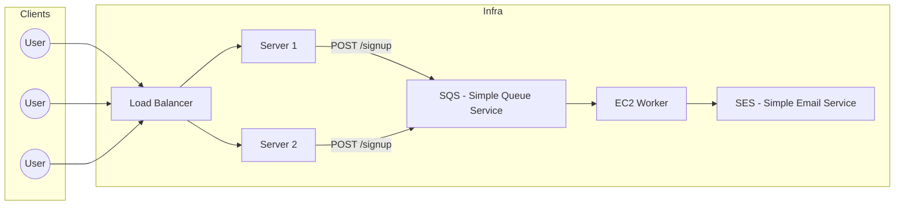
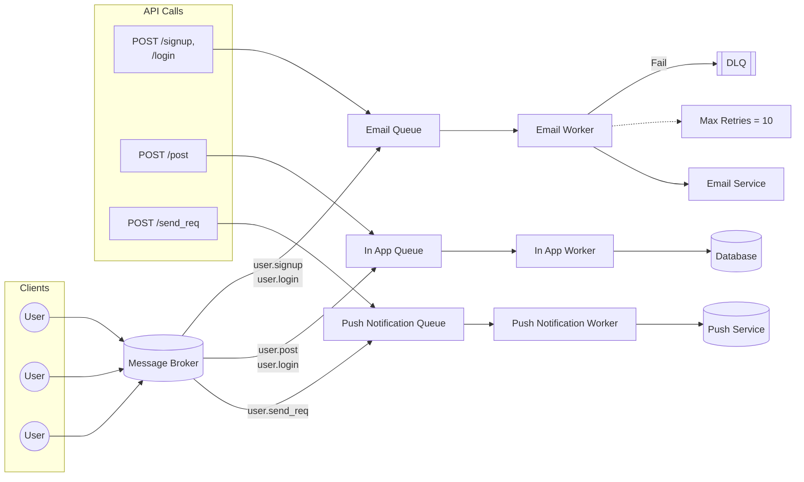
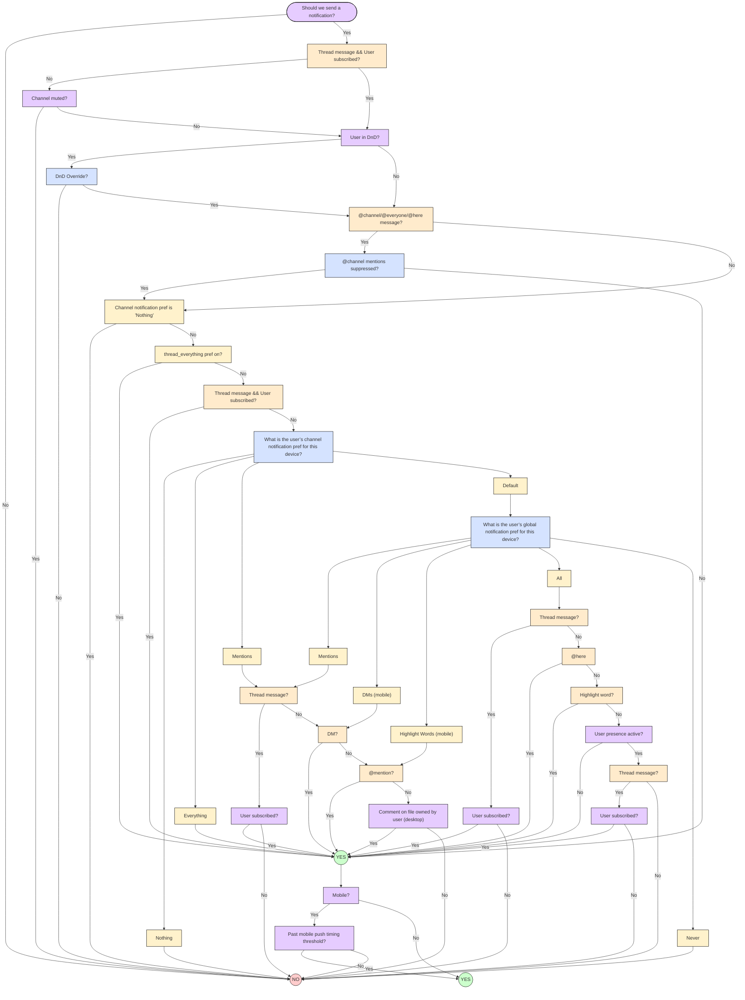

# Notification System

when you do something on app you get in-app Notification or email

Notification scenario

let say someone signups they get a mail for welcome

POST /signup
{email,password} gets logged into db
call a function sendEmail{calls a gmail api}
return response

problems:

- scaling{cause synchronous call}-> 3-5 sec respnse, hence latency
- external dependency{what if it gets down}
- service availabilty, what if it gets rate limited

Rate Limit - how many request you can send in a time frame

what if 100 users send post request on /sginup, but rate limting of 30 per second
then other 70 gets dropped, now what for few seconds

frequent crashes

one ways to solve is put 30 user signup at time, but problem

let's make it Async

so users signup, push to db, now put a internal server
this internal server handles with mail provider
response always gets logged, even if gmail is down
problem: before signup was failing, but now email never gets logged due to rate limiting

instead of directly sending to gmail api, put a queue
put users enqueue, we do not wait for queue

signup route is all good

before it was a server, now it has become a worker
this worker now supervises the queue, put 1 of email into this worker
put another, l=it's goes like that

but now if api id down, so either we can discard the mail
or we can put it back to queue

O(1) time complexity
latency drops, we can retry now

say there are so many msg in queue, now send 30 to worker
sleep for 2-3 sec else we will be rate limited
once 2 sec gets over, take 30 more from queue

in real life if given 30 we take only 25 to be on safe side

```mermaid

flowchart LR
    subgraph Users
        U1((User))
        U2((User))
        U3((User))
    end

    U1 --> S[POST /signup (fname, lname, email)]
    U2 --> S
    U3 --> S

    S --> DB[(Database)]
    S -->|Enqueue: sendReqToQueue| Q[Queue]

    S --> R[Response]

    Q -->|1000| RL[Rate Limiting]
    RL --> W1[Email Worker\n2 seconds]
    RL --> W2[Email Worker\n2 seconds]

    W1 --> M[M Service\n30m/s\n25m/s]
    W2 --> M
```

## professional

multiple users don't talk directly to server, they talk to load balancer
now this load balancer distributes load evenly b/w server

now upon a signup, so put a queue {SQS - Simple Queue System}
this queue gets consumed by workers

a ec2 server watches over the queue
use ses{simple email service} to interact with it



problem in this architecture
what if down for whole day, gets into a infinite loop
unnecessarily computes gets wasted

solution:

1. exponential backoff strategy
   retry at 0 sec
   then retry after 1 sec
   then retry after 2 sec
   then retry after 4
   then 8 like that

to avoid infinite loop, put like max_retry = 10

but again a bad thing to do

now make a DLQ{Dead Letter Queue}
put mail into this queue if max_retry gets hit

then developers can access this queue, can be put into the main queue by developer
manually

it is scalable

let's increase requirements

say email at now signup, signin, post, friend request email
multiple events

```
POST /login
sendToEmailQueue

POST /post
sendToEmailQueue

POST /friend-req
sendToEmailQueue
```

new requirements
at friend-req, give in-app notification
at new post, give in-app notification

since code is binded, we create a new queue- `inAppQueue`
hence it will have it's own dlq, and a worker
so now the request gets changed

```
POST /friend-req
sendToInAppQueue
```

so now new scene, on post - in-app
but on friend-req - push

make another queue, `pushNotificationQueue`

use firebase, so everywhere we were related to friend-req we connect it to this queue
so new:

```
POST /post
sendToInAppQueue

POST /friend-req
sendToPushQueue
```

this system is still scalable, but the coupling has increased
not a good approach

```mermaid
flowchart LR
    %% Clients
    subgraph Clients
        U1((User))
        U2((User))
        U3((User))
    end

    %% Entry Point (like Kafka / Broker)
    Broker[(Message Broker)]

    U1 --> Broker
    U2 --> Broker
    U3 --> Broker

    %% Queues
    EQ[Email Queue]
    IAQ[In App Queue]
    PNQ[Push Notification Queue]

    %% Workers
    EW[Email Worker]
    IAW[In App Worker]
    PNW[Push Notification Worker]

    %% DLQ
    DLQ[DLQ<br/>(Max Retry = 10)]

    %% Flows
    Broker --> EQ
    Broker --> IAQ
    Broker --> PNQ

    EQ --> EW
    EW -->|Fail| DLQ
    EQ -->|Retry 1 Day| EW

    IAQ --> IAW
    PNQ --> PNW

    %% Services
    SES[Email Service]
    DB[(Database)]
    Push[(Push Service)]

    EW --> SES
    IAW --> DB
    PNW --> Push

    %% API mapping
    subgraph API Calls
        A1[POST /login<br/>sendToEmailQueue]
        A2[POST /post<br/>sendToInAppQueue]
        A3[POST /friend-req<br/>sendToPushQueue]
    end

    A1 --> EQ
    A2 --> IAQ
    A3 --> PNQ
```

---

we move to event driven architecture

we decouple the servers

we raise events, and then workers listen to it

make an announcement, anyone who is relevant to it, will listen to it
rather than telling everyone individually

pub-sub/fan-out architecture

we decouple the system,
now whatever actions/events happens we trigger a sms

bind this sms to queue

now it changes to

```
POST /post
sendEventToSNS

POST /friend-req
sendEventToSNS
```



you can use some service -  ,

a use case of slack:


