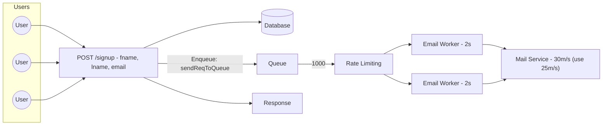
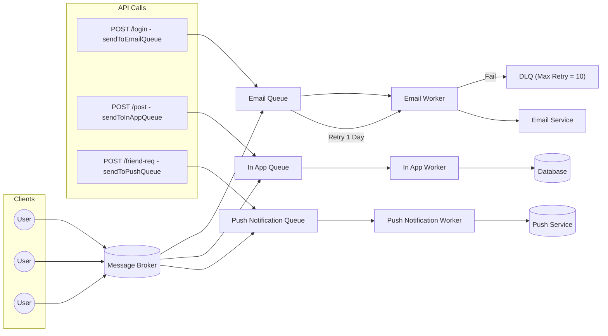
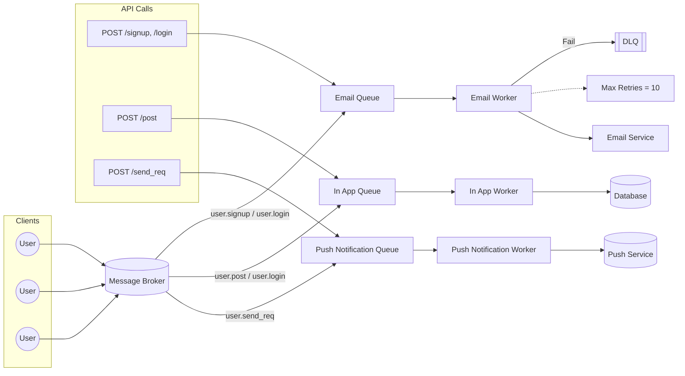
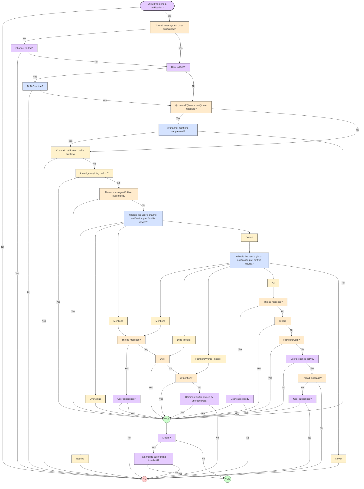

# Notification System

Users receive notifications either in-app or via email when events happen in the application.

Example scenario (synchronous flow):

1. Client: POST /signup with payload `{email, password}`
2. Server: creates user record in the database
3. Server: calls `sendEmail()` which invokes an external provider (e.g., Gmail API)
4. Server: returns response to client

Problems with the synchronous approach:

- High latency: external provider calls can add several seconds to request latency.
- Poor availability: if the provider is down or rate-limited the request can fail.
- Scalability: bursts of requests can exceed provider rate limits.

Example: if 100 users hit `/signup` and the provider allows 30 req/s, 70 requests may be dropped or delayed.

Make it asynchronous:

- On signup, persist the user and enqueue an email task instead of calling the provider synchronously.
- A background worker consumes the queue and sends emails to the provider.
- The signup route returns quickly; email delivery is retried by the worker if it fails.

Benefits:

- Fast responses for users.
- Resilience to provider throttling via rate limiting and retries.
- Better scalability and observability.



- Fast response to user.

- Provider throttling handled via queue + rate limiter.


## Production architecture

In production, clients communicate with a load balancer which distributes traffic to application servers. Signup and other user events enqueue messages to a broker (e.g., SQS, Kafka) that are consumed by workers.

Common components:

- Load Balancer
- Application servers
- Message Broker / Queue (SQS, Kafka)
- Worker instances (EC2, containers)
- External providers (SES, Firebase, Push services)

Example flow:

- Clients -> Load Balancer -> Application Server
- Application Server enqueues an event to the broker
- Worker consumes the event and calls the external provider (SES)

Retry strategy and failure handling:

1. Use retries with exponential backoff (e.g., 0s, 1s, 2s, 4s, 8s) up to a configurable `max_retry`.
2. If `max_retry` is exceeded, move the message to a Dead Letter Queue (DLQ) for manual inspection and reprocessing.

This avoids infinite retry loops and preserves failed events for developers to investigate.

As the system grows, separate queues may be introduced for different event types (email, in-app, push). Each queue gets its own workers and DLQ.

Example API mapping changes:

```
POST /login        -> sendToEmailQueue
POST /post         -> sendToInAppQueue
POST /friend-req   -> sendToPushQueue
```

Keep queues decoupled to reduce coupling between services. However, more queues increases operational surface area.



---

we move to event driven architecture

we decouple the servers

we raise events, and then workers listen to it

make an announcement, anyone who is relevant to it, will listen to it
rather than telling everyone individually

pub-sub/fan-out architecture

we decouple the system,
now whatever actions/events happens we trigger a sms

bind this sms to queue

now it changes to

```
POST /post
sendEventToSNS

POST /friend-req
sendEventToSNS
```



you can use some service - [Novu- open souce](https://novu.co/) ,

a use case of slack:



[next-js-simulator](https://github.com/NalinDalal/notification-system-smulator)

[bun](https://github.com/NalinDalal/notification-system-bun)

---

# Reliability & Features

- Caching: contact info & templates.
- Rate limiting: avoid spam + respect provider caps.
- Preferences: per-user DND/mute.
- Templates: reusable messages with placeholders.
- Fallback providers: if Twilio fails, use backup.
- Monitoring: queue depth, latency, error rate.

---

[1] [Twilio SMS](https://www.twilio.com/sms)

[2] [Nexmo SMS](https://www.nexmo.com/products/sms)

[3] [Sendgrid](https://sendgrid.com/)

[4] [Mailchimp](https://mailchimp.com/)

[5] [You Cannot Have Exactly-Once Delivery](https://bravenewgeek.com/you-cannot-have-exactly-once-delivery/)

[6] [Security in Push Notifications](https://cloud.ibm.com/docs/services/mobilepush?topic=mobile-pushnotification-security-in-push-notifications)

[7] [RadditMQ](https://bit.ly/2sotIa6)