# Consistent Hashing

To achieve horizontal scaling, it is important to distribute requests/data efficiently and evenly
across servers. Consistent hashing is a commonly used technique to achieve this goal. But
first, let us take an in-depth look at the problem.

To achieve horizontal scaling, it is important to distribute requests/data efficiently and evenly
across servers. Consistent hashing is a commonly used technique to achieve this goal. But
first, let us take an in-depth look at the problem.


## The Rehashing problem

A common way to partition keys across N servers is:

```
serverIndex = hash(key) % N
```

This works when N is fixed. However, if a server is added or removed the value of N
changes and almost every key can map to a different server — causing massive reshuffling
and cache misses.

Example (N = 4):

| Key  | Hash     | hash % 4 |
| ---- | -------- | -------- |
| key0 | 18358617 | 1        |
| key1 | 26143584 | 0        |

If we remove a server so N = 3, the same hashes modulo 3 produce very different
assignments and most keys move to different servers.

This instability motivates consistent hashing, which limits the number of remapped keys
when N changes.

n cache servers
common way to balance load is to use hash method:
`serverIndex=hash(key)%N` {N is size of server pool}

there is a key, key has a hash, hash%4

## key | hash | hash % 4
key1 | 26143584 | 0
To fetch the server where a key is stored, we perform the modular operation `f(key) % 4`
`hash(key0) % 4 = 1` means a client must contact `server 1` to fetch the cached data.
### serverIndex = hash % 4

| ------------ | ---------- | ---------- | ---------- | ---------- |
| **Servers**  | server 0   | server 1   | server 2   | server 3   |
| **Keys**     | key1, key3 | key0, key4 | key2, key6 | key5, key7 |


ex:
if server 1 goes offline, the size of the server pool becomes 3. Using
operation gives us different server indexes because the number of servers is reduced by 1.

| ---- | -------- | -------- |
| key0 | 18358617 | 0        |
| key1 | 26143584 | 0        |
| key4 | 34085809 | 1        |
| key5 | 27581703 | 0        |
| key7 | 22530351 | 0        |

### serverIndex = hash % 3
### Server Index Distribution (after `hash % 3`)

| ------------ | ---------------------------------- | -------------------- | -------- | -------- |
| **Servers**  | server 0                           | server 1             | server 2 | server 3 |
| **Keys**     | **key0**, key1, **key5**, **key7** | key2, **key4**, key6 | **key3** |
means if server1 goes down, client connect to wrong server to fetch data -> cache misses

solution: **Consistent
hashing is an effective technique to mitigate this problem.**

## Consistent Hashing (high level)
Consistent hashing is a special kind of hashing such that when a
hash table is re-sized and consistent hashing is used, only k/n keys need to be remapped on
average, where k is the number of keys, and n is the number of slots. In contrast, in most

With consistent hashing, when the set of servers changes only about K / N keys (on average)
contrast, simple modulo-based sharding remaps nearly all keys when N changes.


Basic idea: hash both servers and objects (BLOBs/keys) onto the same circular hash space
the object's position.

- Calculate an object hash $\beta$ (example: map to $0..359$ degrees). Let $\zeta = \beta \bmod 360$
    be the object's ring coordinate. The object is stored on the server whose ring coordinate
    lookup in $O(\log N)$ (binary search) or $O(N)$ (linear scan) depending on the

interval on the ring must move. Adding an $n^{\text{th}}$ server moves approximately $1/n$
of the objects on average.

- Use two hash functions or clear namespaces: $h_b(x)$ for objects (BLOBs), $h_s(x)$ for
    servers (IP, hostname, UUID). Map outputs to the ring (e.g. $0..359$ or $0..2^{160}-1$).
- Maintain server coordinates in a sorted structure (array, BST, or skip list) to find
    successors efficiently.

Operations
- Insert object $x$: compute $\beta = h_b(x)$, set $\zeta = \beta \bmod 360$, find the
    successor server of $\zeta$ and place $x$ there (or return that server id).
- Delete object $x$: locate the successor of $\zeta$ and remove the object from that
    server's store.
- Add server: compute $\theta = h_s(server)$, insert $\theta$ into the server set; move
    objects with coordinates in $(\mathrm{prev}(\theta),\theta]$ to the new server (or
    let them be lazily fetched on miss).
- Remove server: find the successor of $\theta$ and move objects to that successor (or
    let requests miss and repopulate lazily).

Variance reduction (vnodes)
- To avoid partition-size skew and hot spots, give each physical server multiple virtual
    nodes (vnodes) spread around the ring. Each vnode is an independent coordinate hashed
    from the server id + index. Increasing vnodes reduces load variance (typical ranges
    100–200 vnodes per physical server in practice).

Practical extensions
- Replication / contiguous placement: hot objects can be placed on multiple successive
    servers (walk clockwise and pick $k$ successors) for availability and read scaling.
- Use different hash seeds per object class to avoid accidental alignment of hot items.
- Consider rendezvous hashing when you need a simpler, fully-distributed choice of $k$
    targets — rendezvous hashing generalizes consistent hashing and is often simpler
    to implement.

Complexity (summary)
- Add/remove node: average cost $O(K/N + \log N)$ to relocate affected objects and
    update server set.
- Lookup: $O(\log N)$ with binary search on server coordinates.

Basic idea: hash both servers and objects (BLOBs/keys) onto the same circular hash space
(the ring). Each object is assigned to the first server encountered moving clockwise from
the object's position.

- Calculate an object hash $eta$ (example: map to $0..359$ degrees). Let $\zeta = eta \% 360$
    be the object's ring coordinate. The object is stored on the server whose ring coordinate
    is the successor of $\zeta$ (wrap to the smallest server id when needed).
- Using a balanced-search structure (sorted array or BST) of server coordinates allows
    lookup in $O(\log N)$ (binary search) or $O(N)$ (linear scan) depending on the
    implementation.

Why this helps: when a server is added or removed, only the objects that map to its
interval on the ring must move. Adding an $n^{th}$ server moves ~1/n of the objects on
average.

Implementation notes
- Use two hash functions or clear namespaces: $h_b(x)$ for objects (BLOBs), $h_s(x)$ for
    servers (IP, hostname, UUID). Map outputs to the ring (e.g. $0..359$ or $0..2^{160}-1$).
- Maintain server coordinates in a sorted structure (array, BST, or skip list) to find
    successors efficiently.

Operations
- Insert object $x$: compute $eta = h_b(x)$, set $\zeta = \beta \% 360$, find successor
    server of $\zeta$ and place $x$ there (or return that server id).
- Delete object $x$: locate the successor of $\zeta$ and remove the object from that
    server's store.
- Add server: compute $	heta = h_s(server)$, insert $	heta$ into server set; move
    objects with coordinates in $(prev(	heta),	heta]$ to the new server (or let them be
    lazily fetched on miss).
- Remove server: find successor of $	heta$ and move objects to that successor (or let
    requests miss and repopulate lazily).

Variance reduction (vnodes)
- To avoid partition-size skew and hot spots, give each physical server multiple virtual
    nodes (vnodes) spread around the ring. Each vnode is an independent coordinate hashed
    from the server id + index. Increasing vnodes reduces load variance (typical ranges
    100–200 vnodes per physical server in practice).

Practical extensions
- Replication / contiguous placement: hot objects can be placed on multiple successive
    servers (walk clockwise and pick $k$ successors) for availability and read scaling.
- Use different hash seeds per object class to avoid accidental alignment of hot items.
- Consider rendezvous hashing when you need a simpler, fully-distributed choice of $k$
    targets — rendezvous hashing generalizes consistent hashing and is often simpler
    to implement.

Complexity (summary)
- Add/remove node: average cost $O(K/N + \log N)$ to relocate affected objects and
    update server set.
- Lookup: $O(\log N)$ with binary search on server coordinates.


## Hash Space and the Ring

there is a hash function f, output range is: x0,x1,x2,x3....xn
SHA-1 : 0 to 2^160-1
x0=0 .... xn=2^160-1

by collection both ends we get a ring


## Mapping servers onto the ring

We hash each server (for example its IP or hostname) to place it on the ring. 
Using the same hash function f, we map servers based on server IP or name onto the ring.
The diagram below shows servers placed around the ring:

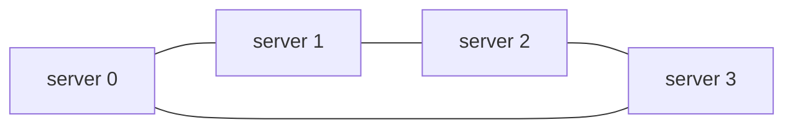


## Mapping keys onto the ring

Each Cache key is hashed and placed on the same Hash Ring. To find the server for a key, walk
clockwise from the key's position until you encounter a server node.


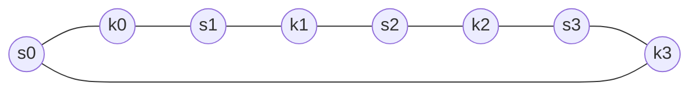


## Server Lookup

To find the server for a given key, move clockwise on the ring from the key's hash until
you hit the first server node. That server (or the server owning that virtual node) stores
the key.

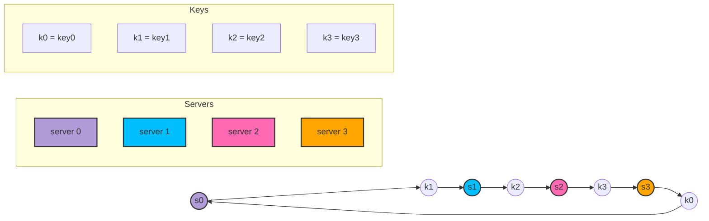


## Adding a Server

Adding a server only requires redistributing keys that fall between the new server's
position and the previous server going clockwise. Only a small fraction of keys move.

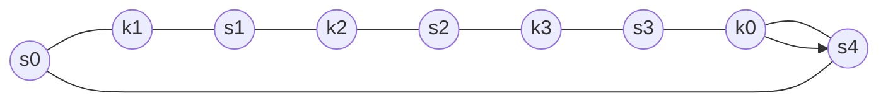

adding a new server will only require redistribution of a
fraction of keys.

after a new server 4 is added, only key0 needs to be redistributed
before it was on s0, but after onto s4

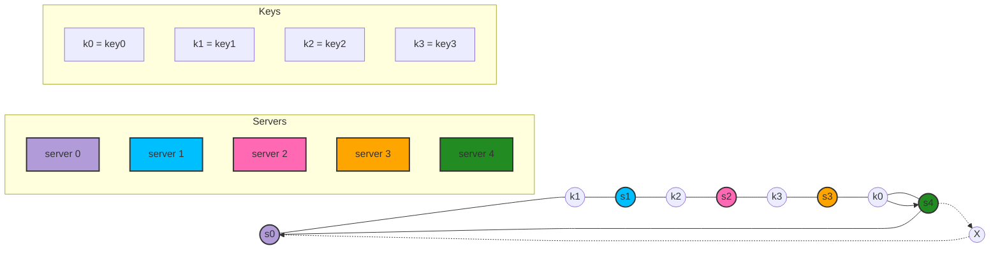


## Removing a server

When a server is removed, keys that were mapped to that server are reassigned to the next
server clockwise. Again, only keys in a small contiguous range are affected.

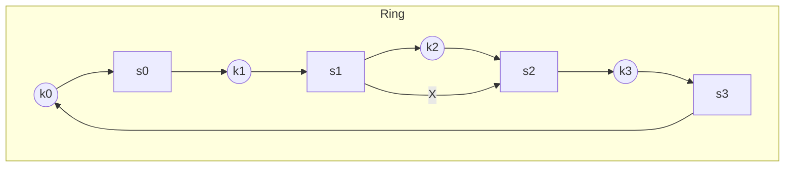

When a server is removed, only a small fraction of keys require redistribution with consistent
hashing.


when server 1 is removed, only key1 must be remapped to server 2.
The rest of the keys are unaffected.


## Issues and mitigations

Basic steps:
- Map servers and keys onto the ring via a uniformly distributed hash.
- To find the server for a key, walk clockwise until you hit a server node.

Two common problems:

1. Uneven partition sizes — Server positions on the ring can create large or small partitions
   (imbalanced key ranges).

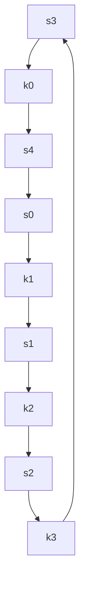

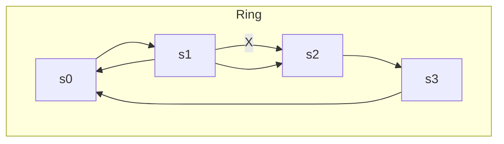

basic steps are:

- Map servers and keys on to the ring using a uniformly distributed hash function.
- To find out which server a key is mapped to, go clockwise from the key position until the
  first server on the ring is found.

2 problems are:

1. Uneven partition sizes – When servers are added or removed, the hash space between adjacent servers (the partition) becomes imbalanced. Some servers may end up with very small partitions, while others get very large ones.

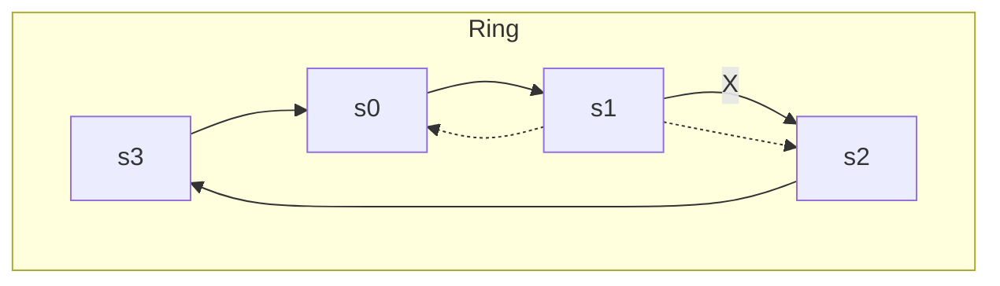

2. Non-uniform key distribution – Depending on how servers are positioned on the ring, keys may cluster on certain servers. This can leave some servers overloaded while others store little or no data.


## Virtual nodes (vnodes)

Each physical server is represented by many virtual nodes distributed around the ring.
This evens out partitions because each server's virtual nodes are scattered across the hash
space.

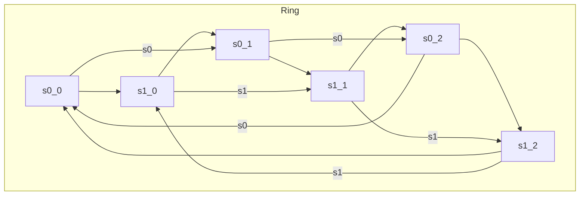

A virtual node refers to the real node, and each server is represented by multiple virtual nodes
on the ring


To find which server a key is stored on, we go clockwise from the key’s location and find the
first virtual node encountered on the ring.

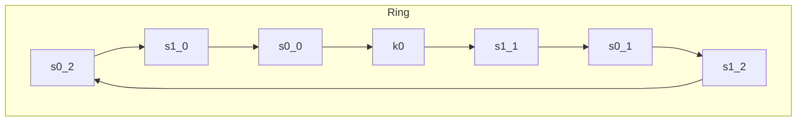

As virtual nodes increase, distribution of keys becomes more balanced and the standard deviation of load decreases.

For 100–200 virtual nodes per server, load deviation is typically in the single-digit
percentages of the mean (e.g., ~5% with 200 vnodes, ~10% with 100 vnodes).


## Finding affected keys

When a node is added at position S4, keys in the interval (previous_server, S4] must move
to the new node. This interval is contiguous on the ring, so redistribution is limited.


The affected keys are those clockwise from the previous server up to the new server.

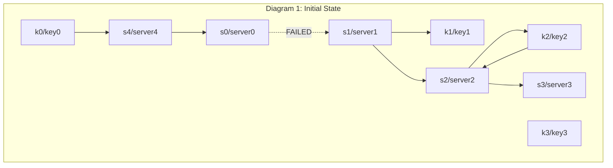

When a server is added or removed, a fraction of data needs to be redistributed
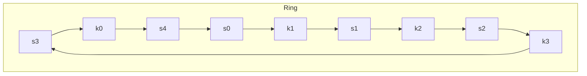

when server 4 is added onto the ring. The affected range starts from s4 (newly
added node) and moves anticlockwise around the ring until a server is found (s3). Thus, keys
located between s3 and s4 need to be redistributed to s4.

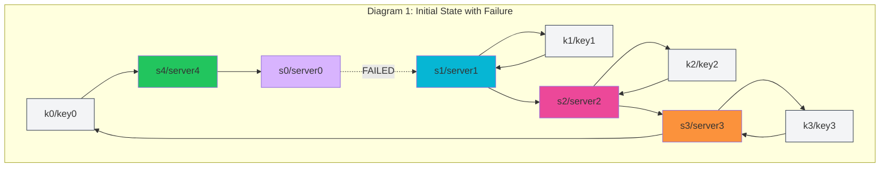

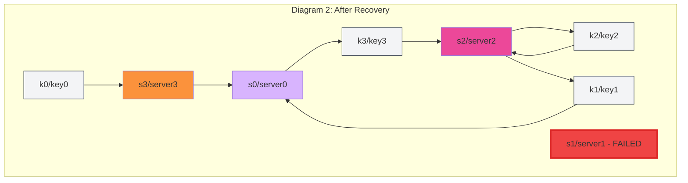

When a server (s1) is removed as shown in Figure 5-15, the affected range starts from s1
(removed node) and moves anticlockwise around the ring until a server is found (s0). Thus,
keys located between s0 and s1 must be redistributed to s2.

## Practical notes — Discord case study

Highlights from Discord's production experience that relate to consistent hashing:

- Message fanout: naive Enum.each sends to every session PID and became a bottleneck
    at large guild sizes. Discord built Manifold to partition PIDs by remote node and then
    further by core-count to fan out messages via worker pools. This reduced per-publish
    CPU cost and inter-node network traffic while preserving ordering semantics.

- Ring lookup performance: the ring was originally managed by a C port and read via ETS,
    which caused expensive copying under load. Discord used a technique (mochiglobal →
    FastGlobal) that compiles a module returning constant data into the VM's shared
    readonly heap so lookups avoid copying (lookup cost dropped from ~7μs to ~0.3μs).
    Tradeoff: rebuilding the module at runtime can take ~1s, acceptable because the ring
    changes infrequently.

- Limited concurrency / Semaphore: hotspots around guild registries caused request
    stampedes and unbounded queue growth. Discord implemented a thin semaphore using
    `:ets.update_counter/4` to limit concurrent outstanding requests to protected services,
    failing early when the semaphore is saturated. This prevents cascading message-queue
    growth and OOMs in session processes.

- Practical takeaways:
    - Optimize the hot read path for ring lookups — reduce copying and prefer read-only
        shared data when possible.
    - Partition and parallelize expensive fanout work across cores/nodes instead of
        doing many individual sends from a single process.
    - Throttle callers to hot services with a low-overhead semaphore to avoid request
        stampedes; prefer graceful failure/backoff over unbounded retries.

These operational patterns complement consistent hashing: the ring maps entities to
nodes, while the above techniques keep lookups, fanout, and high-concurrency access
scalable and resilient in production.

## Practical notes — Cassandra case study

Key highlights from Cassandra that relate to consistent-hashing deployments:

- Partitioning: Cassandra uses consistent hashing but with an order-preserving hash
    variant and a token-based placement model. Rather than relying solely on many
    virtual nodes, early Cassandra chose to adapt node positions based on observed
    load; this design emphasizes operational tractability and deterministic load
    balancing.

- Replication & placement: Cassandra exposes replication policies (Rack-Unaware,
    Rack-Aware, Datacenter-Aware) so replicas can be placed to satisfy locality and
    durability goals across racks and data centers.

- Membership & failure detection: Cassandra uses gossip (Scuttlebutt) for efficient
    dissemination of membership/state and a Φ-accrual failure detector to provide
    adaptive suspicion levels rather than a hard up/down signal — useful for large
    geo-distributed clusters.

- Storage engine & local persistence: Cassandra’s commit-log + memtable + SSTable
    design (append-only files with periodic compaction) plus per-file Bloom filters
    keeps reads fast while enabling very high write throughput. Compaction, indexing
    and bloom filters are operational levers to control tail latencies.

- Bootstrapping & scaling: token assignment during bootstrap and streaming of
    ranges (kernel-copy) enable incremental scale-out; careful bootstrapping reduces
    the operational cost of reassigning ranges and rebuilding Merkle trees.

- Operational lessons: integrate monitoring (Ganglia), use light coordination
    primitives (Zookeeper) where needed, and tune failure-detector parameters for
    cluster size to keep detection times practical.

Practical takeaways:
- Consider datacenter- and rack-aware replica placement to improve availability
    and reduce cross-rack/cross-datacenter latency.
- Use append-only local storage with Bloom filters and compaction to optimize
    write-heavy workloads.
- Choose a failure detector and gossip parameters appropriate for your cluster size
    and network characteristics.

These Cassandra operational patterns pair naturally with consistent hashing: the
ring maps keys to nodes while replication policies, failure detectors, and a tuned
storage engine make the system resilient and performant at large scale.

Let f be a hash function whose output is a large integer (for example SHA-1 in the range
0..2^160-1). We interpret this range as a circular space (a ring) so the highest value wraps
around to zero.

Source: Lakshman & Malik — "Cassandra: A Decentralized Structured Storage System".
Full paper: https://theory.stanford.edu/~tim/s16/l/l1.pdf

Summary (concise, operational):

- Goal: provide a highly-available, scalable, structured storage system for very
    large datasets with high write throughput and no single point of failure.

- Data model: a distributed, multidimensional map keyed by a row key. Column
    families (simple/super) let applications control layout; rows are the atomic
    unit per-replica.

- Partitioning: consistent hashing (ring) with tokens. Cassandra uses an order-
    preserving/token-based placement model and supports moving node tokens based
    on observed load (operationally tractable alternative to only using many vnodes).

- Replication & placement: replication factor N; policies include Rack-Unaware,
    Rack-Aware and Datacenter-Aware so replicas can be laid out for locality and
    durability. Preference lists are derived by walking the ring clockwise from a
    token/partition end.

- Consistency model: tunable quorum-like semantics — clients/config expose
    read/write choices to trade latency vs. consistency. Typical quorum-style
    behavior is achieved by choosing R and W such that R + W > N when stronger
    consistency is desired.

- Membership & failure detection: lightweight gossip (Scuttlebutt) for
    disseminating membership and state; Φ-accrual failure detector (adaptive
    suspicion value Φ) provides an expressive, tunable failure signal that scales
    better than fixed-timeouts in large clusters.

- Handoff & repair: hinted handoff allows writes to succeed when preferred
    replicas are temporarily unavailable; anti-entropy using Merkle trees syncs
    replicas in the background to repair divergence.

- Storage engine: commit log + in-memory memtable + immutable SSTables (on-
    disk files). Bloom filters per-SSTable reduce unnecessary disk reads; periodic
    compaction merges files to control read amplification and reclaim space.

- Bootstrapping & scaling: token assignment and streaming of ranges (kernel-copy)
    enable incremental node addition; careful bootstrapping avoids full rebalancing
    and reduces Merkle tree recalculation costs.

- Operational lessons:
    - Expose monitoring (Ganglia) and tune failure detector/gossip parameters for
        cluster size and network characteristics.
    - Some coordination (e.g., Zookeeper) is pragmatic for administrative tasks
        such as token or membership bootstrapping, even in an otherwise
        decentralized design.
    - Tune commit-log rollover, memtable thresholds and compaction to balance
        write throughput and read tail latency.

- Example deployment: Facebook Inbox Search used Cassandra for high-write
    workloads (billions of writes/day), leveraging time-ordered columns and
    caching/priming to reduce query latency. Production clusters stored tens of
    terabytes across 100+ nodes.

Key takeaways for consistent-hashing systems:
- Use token/vnode strategies appropriate to operational constraints (bootstrapping,
    archival, and Merkle-tree maintenance).
- Choose replication placement policies that respect datacenter and rack
    topology to improve availability and reduce cross-domain latency.
- Provide tunable consistency parameters (R/W/N) so different apps can trade
    latency for stronger consistency when necessary.
- Combine lightweight gossip with an adaptive failure detector for scalable
    membership/health management.

Reference: Lakshman & Malik, "Cassandra" (see link above) — use that paper for
deeper implementation details and measurements.

## Practical notes — Dynamo case study

Key lessons from Dynamo that apply to consistent-hashing deployments:

- Partitioning & replication: Dynamo uses consistent hashing with virtual nodes (tokens)
    to decouple partitioning and placement. Virtual nodes smooth load, and preference
    lists (first N distinct successors) provide replication and placement control.

- Availability vs. consistency: Dynamo intentionally sacrifices strong consistency
    for high availability. It exposes tunable parameters (N, R, W) so services can
    pick tradeoffs appropriate for their SLA (common configuration: (N,R,W) = (3,2,2)).

- Versioning & conflict resolution: concurrent updates are handled with vector clocks
    and application-assisted reconciliation (reads may return multiple versions for
    semantic reconciliation). This design keeps writes always-available.

- Handling temporary failures: sloppy quorum + hinted handoff lets writes succeed
    even when some replicas are unreachable; background anti-entropy (Merkle trees)
    repairs divergence later.

- Bootstrap & load distribution: Dynamo evolved token/partition strategies to make
    bootstrapping, archival, and Merkle-tree maintenance practical at scale (equal-sized
    partitions + token assignment improved operational efficiency).

- Operational controls: client-driven coordination and admission-control for
    background tasks reduce tail latency and limit interference between foreground
    requests and heavy background work (rebalancing/replication).

Practical takeaways:
- Use vnodes/tokens to smooth partition size and enable per-node capacity weighting.
- Expose N/R/W so applications can choose availability/consistency tradeoffs.
- Prefer lazy repair (hinted handoff + anti-entropy) for availability, but monitor
    divergence and reconciliation costs.
- Protect hot paths (ring lookup, fanout) with read-optimized structures and
    admission/semantics controls to prevent stampedes.

These patterns complement consistent hashing: the ring gives simple mapping, while
replication, versioning, and operational controls make the system robust in real
production environments.