# Consistent Hashing

To achieve horizontal scaling, it is important to distribute requests/data efficiently and evenly
across servers. Consistent hashing is a commonly used technique to achieve this goal. But
first, let us take an in-depth look at the problem.

To achieve horizontal scaling, it is important to distribute requests/data efficiently and evenly
across servers. Consistent hashing is a commonly used technique to achieve this goal. But
first, let us take an in-depth look at the problem.


## The Rehashing problem

A common way to partition keys across N servers is:

```
serverIndex = hash(key) % N
```

This works when N is fixed. However, if a server is added or removed the value of N
changes and almost every key can map to a different server — causing massive reshuffling
and cache misses.

Example (N = 4):

| Key  | Hash     | hash % 4 |
| ---- | -------- | -------- |
| key0 | 18358617 | 1        |
| key1 | 26143584 | 0        |

If we remove a server so N = 3, the same hashes modulo 3 produce very different
assignments and most keys move to different servers.

This instability motivates consistent hashing, which limits the number of remapped keys
when N changes.

n cache servers
common way to balance load is to use hash method:
`serverIndex=hash(key)%N` {N is size of server pool}

there is a key, key has a hash, hash%4

## key | hash | hash % 4

key0 | 18358617 | 1
key1 | 26143584 | 0

To fetch the server where a key is stored, we perform the modular operation `f(key) % 4`
`hash(key0) % 4 = 1` means a client must contact `server 1` to fetch the cached data.

### serverIndex = hash % 4

| Server Index | 0          | 1          | 2          | 3          |
| ------------ | ---------- | ---------- | ---------- | ---------- |
| **Servers**  | server 0   | server 1   | server 2   | server 3   |
| **Keys**     | key1, key3 | key0, key4 | key2, key6 | key5, key7 |

works when size of server pool is fixed, data distribution is fixed.

but problems arrives on scaling.

ex:
if server 1 goes offline, the size of the server pool becomes 3. Using
the same hash function, we get the same hash value for a key. But applying modular
operation gives us different server indexes because the number of servers is reduced by 1.

| key  | Hash     | hash % 3 |
| ---- | -------- | -------- |
| key0 | 18358617 | 0        |
| key1 | 26143584 | 0        |
| key2 | 18131146 | 1        |
| key3 | 35863496 | 2        |
| key4 | 34085809 | 1        |
| key5 | 27581703 | 0        |
| key6 | 38164978 | 1        |
| key7 | 22530351 | 0        |

### serverIndex = hash % 3

### Server Index Distribution (after `hash % 3`)

| Server Index | 0                                  | 1                    | 2        |
| ------------ | ---------------------------------- | -------------------- | -------- | -------- |
| **Servers**  | server 0                           | server 1             | server 2 | server 3 |
| **Keys**     | **key0**, key1, **key5**, **key7** | key2, **key4**, key6 | **key3** |

most keys are redistributed, not just the ones originally stored in the
offline server (server 1).
means if server1 goes down, client connect to wrong server to fetch data -> cache misses

solution: **Consistent
hashing is an effective technique to mitigate this problem.**


## Consistent Hashing (high level)

Consistent hashing is a special kind of hashing such that when a
hash table is re-sized and consistent hashing is used, only k/n keys need to be remapped on
average, where k is the number of keys, and n is the number of slots. In contrast, in most
traditional hash tables, a change in the number of array slots causes nearly all keys to be
remapped

With consistent hashing, when the set of servers changes only about K / N keys (on average)
need to be remapped, where K is the number of keys and N the number of servers. In
contrast, simple modulo-based sharding remaps nearly all keys when N changes.

## Basic technique & implementation

Basic idea: hash both servers and objects (BLOBs/keys) onto the same circular hash space
(the ring). Each object is assigned to the first server encountered moving clockwise from
the object's position.

- Calculate an object hash $eta$ (example: map to $0..359$ degrees). Let $\zeta = eta \% 360$
    be the object's ring coordinate. The object is stored on the server whose ring coordinate
    is the successor of $\zeta$ (wrap to the smallest server id when needed).
- Using a balanced-search structure (sorted array or BST) of server coordinates allows
    lookup in $O(\log N)$ (binary search) or $O(N)$ (linear scan) depending on the
    implementation.

Why this helps: when a server is added or removed, only the objects that map to its
interval on the ring must move. Adding an $n^{th}$ server moves ~1/n of the objects on
average.

Implementation notes
- Use two hash functions or clear namespaces: $h_b(x)$ for objects (BLOBs), $h_s(x)$ for
    servers (IP, hostname, UUID). Map outputs to the ring (e.g. $0..359$ or $0..2^{160}-1$).
- Maintain server coordinates in a sorted structure (array, BST, or skip list) to find
    successors efficiently.

Operations
- Insert object $x$: compute $eta = h_b(x)$, set $\zeta = \beta \% 360$, find successor
    server of $\zeta$ and place $x$ there (or return that server id).
- Delete object $x$: locate the successor of $\zeta$ and remove the object from that
    server's store.
- Add server: compute $	heta = h_s(server)$, insert $	heta$ into server set; move
    objects with coordinates in $(prev(	heta),	heta]$ to the new server (or let them be
    lazily fetched on miss).
- Remove server: find successor of $	heta$ and move objects to that successor (or let
    requests miss and repopulate lazily).

Variance reduction (vnodes)
- To avoid partition-size skew and hot spots, give each physical server multiple virtual
    nodes (vnodes) spread around the ring. Each vnode is an independent coordinate hashed
    from the server id + index. Increasing vnodes reduces load variance (typical ranges
    100–200 vnodes per physical server in practice).

Practical extensions
- Replication / contiguous placement: hot objects can be placed on multiple successive
    servers (walk clockwise and pick $k$ successors) for availability and read scaling.
- Use different hash seeds per object class to avoid accidental alignment of hot items.
- Consider rendezvous hashing when you need a simpler, fully-distributed choice of $k$
    targets — rendezvous hashing generalizes consistent hashing and is often simpler
    to implement.

Complexity (summary)
- Add/remove node: average cost $O(K/N + \log N)$ to relocate affected objects and
    update server set.
- Lookup: $O(\log N)$ with binary search on server coordinates.


## Hash Space and the Ring

Let f be a hash function whose output is a large integer (for example SHA-1 in the range
0..2^160-1). We interpret this range as a circular space (a ring) so the highest value wraps
around to zero.

there is a hash function f, output range is: x0,x1,x2,x3....xn
SHA-1 : 0 to 2^160-1
x0=0 .... xn=2^160-1

by collection both ends we get a ring


## Mapping servers onto the ring

We hash each server (for example its IP or hostname) to place it on the ring. 
Using the same hash function f, we map servers based on server IP or name onto the ring.
The diagram below shows servers placed around the ring:

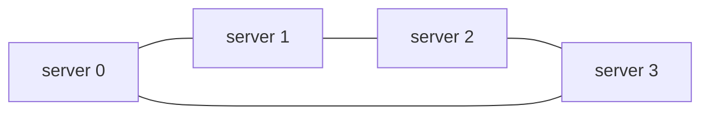


## Mapping keys onto the ring

Each Cache key is hashed and placed on the same Hash Ring. To find the server for a key, walk
clockwise from the key's position until you encounter a server node.


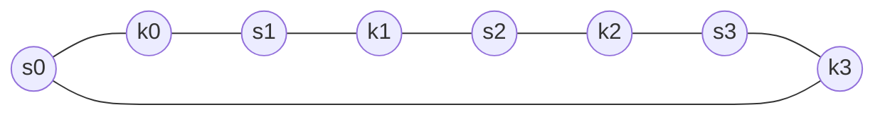


## Server Lookup

To find the server for a given key, move clockwise on the ring from the key's hash until
you hit the first server node. That server (or the server owning that virtual node) stores
the key.

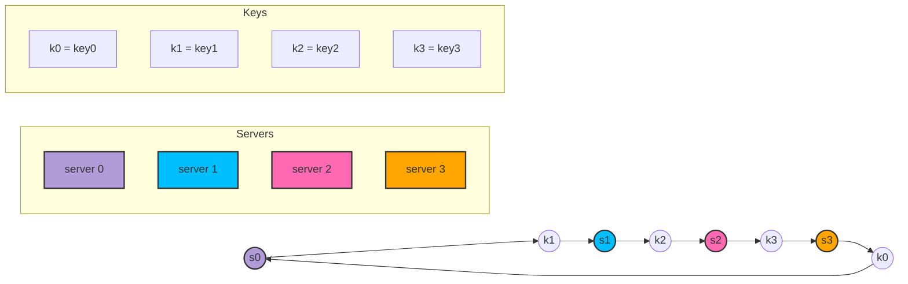


## Adding a Server

Adding a server only requires redistributing keys that fall between the new server's
position and the previous server going clockwise. Only a small fraction of keys move.

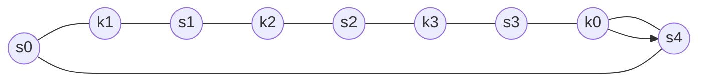

adding a new server will only require redistribution of a
fraction of keys.

after a new server 4 is added, only key0 needs to be redistributed
before it was on s0, but after onto s4

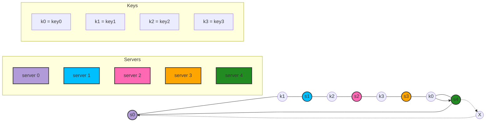


## Removing a server

When a server is removed, keys that were mapped to that server are reassigned to the next
server clockwise. Again, only keys in a small contiguous range are affected.

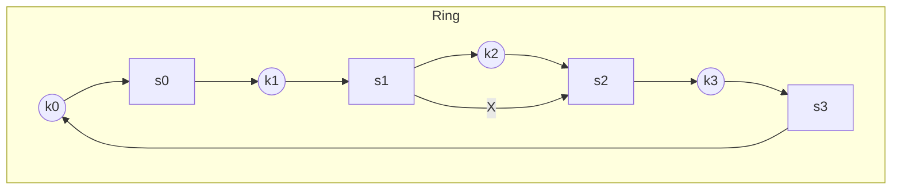

When a server is removed, only a small fraction of keys require redistribution with consistent
hashing.


when server 1 is removed, only key1 must be remapped to server 2.
The rest of the keys are unaffected.


## Issues and mitigations

Basic steps:
- Map servers and keys onto the ring via a uniformly distributed hash.
- To find the server for a key, walk clockwise until you hit a server node.

Two common problems:

1. Uneven partition sizes — Server positions on the ring can create large or small partitions
   (imbalanced key ranges).

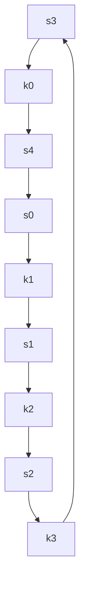

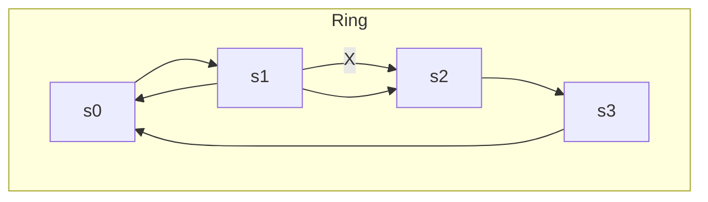

basic steps are:

- Map servers and keys on to the ring using a uniformly distributed hash function.
- To find out which server a key is mapped to, go clockwise from the key position until the
  first server on the ring is found.

2 problems are:

1. Uneven partition sizes – When servers are added or removed, the hash space between adjacent servers (the partition) becomes imbalanced. Some servers may end up with very small partitions, while others get very large ones.

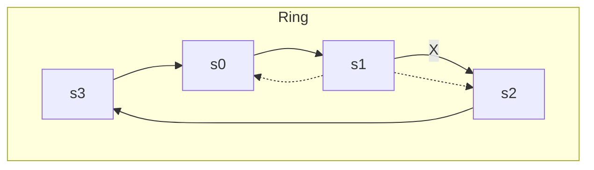

2. Non-uniform key distribution – Depending on how servers are positioned on the ring, keys may cluster on certain servers. This can leave some servers overloaded while others store little or no data.


## Virtual nodes (vnodes)

Each physical server is represented by many virtual nodes distributed around the ring.
This evens out partitions because each server's virtual nodes are scattered across the hash
space.

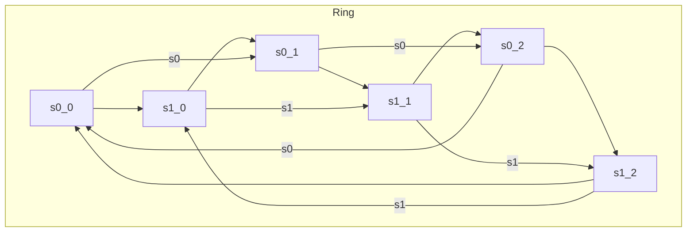

A virtual node refers to the real node, and each server is represented by multiple virtual nodes
on the ring


To find which server a key is stored on, we go clockwise from the key’s location and find the
first virtual node encountered on the ring.

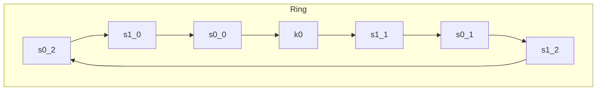

As virtual nodes increase, distribution of keys becomes more balanced and the standard deviation of load decreases.

For 100–200 virtual nodes per server, load deviation is typically in the single-digit
percentages of the mean (e.g., ~5% with 200 vnodes, ~10% with 100 vnodes).


## Finding affected keys

When a node is added at position S4, keys in the interval (previous_server, S4] must move
to the new node. This interval is contiguous on the ring, so redistribution is limited.


The affected keys are those clockwise from the previous server up to the new server.

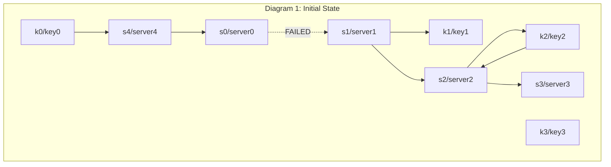

When a server is added or removed, a fraction of data needs to be redistributed
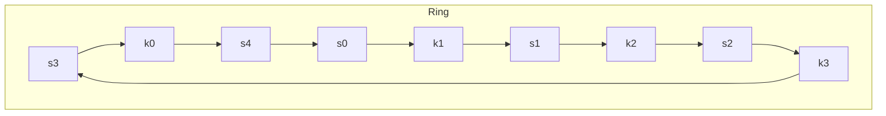

when server 4 is added onto the ring. The affected range starts from s4 (newly
added node) and moves anticlockwise around the ring until a server is found (s3). Thus, keys
located between s3 and s4 need to be redistributed to s4.

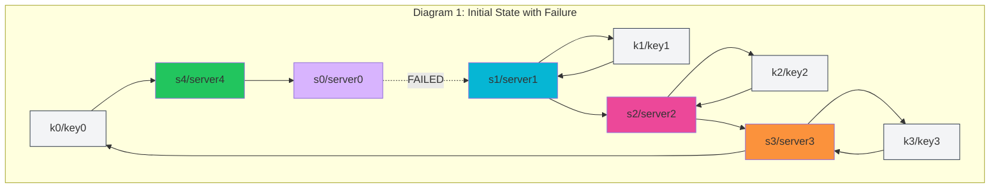

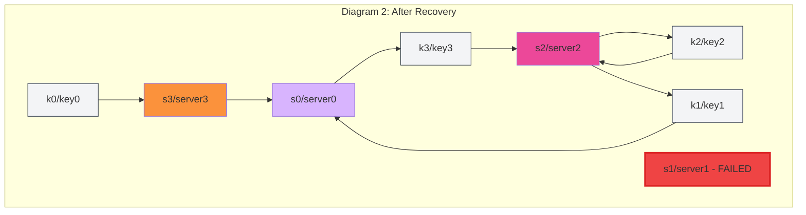

When a server (s1) is removed as shown in Figure 5-15, the affected range starts from s1
(removed node) and moves anticlockwise around the ring until a server is found (s0). Thus,
keys located between s0 and s1 must be redistributed to s2.

# Reference material

[Consistent hashing](https://en.wikipedia.org/wiki/Consistent_hashing)

[Consistent Hashing](https://tom-e-white.com/2007/11/consistent-hashing.html)

[Dynamo: Amazon's Highly Available Key-value Store](https://www.allthingsdistributed.com/files/amazon-dynamo-sosp2007.pdf)

[Cassandra - A Decentralized Structured Storage System](http://www.cs.cornell.edu/Projects/ladis2009/papers/Lakshman-ladis2009.PDF)

[How Discord Scaled Elixir to 5,000,000 Concurrent Users](https://blog.discord.com/scaling-elixir-f9b8e1e7c29b)

[CS168: The Modern Algorithmic Toolbox Lecture #1: Introduction and Consistent Hashing](http://theory.stanford.edu/~tim/s16/l/l1.pdf)

[Maglev: A Fast and Reliable Software Network Load Balancer](https://static.googleusercontent.com/media/research.google.com/en//pubs/archive/44824.pdf)
