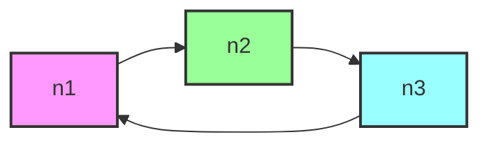
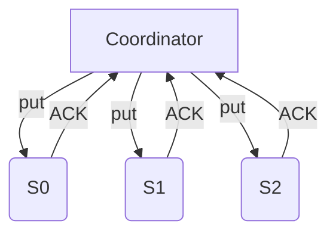
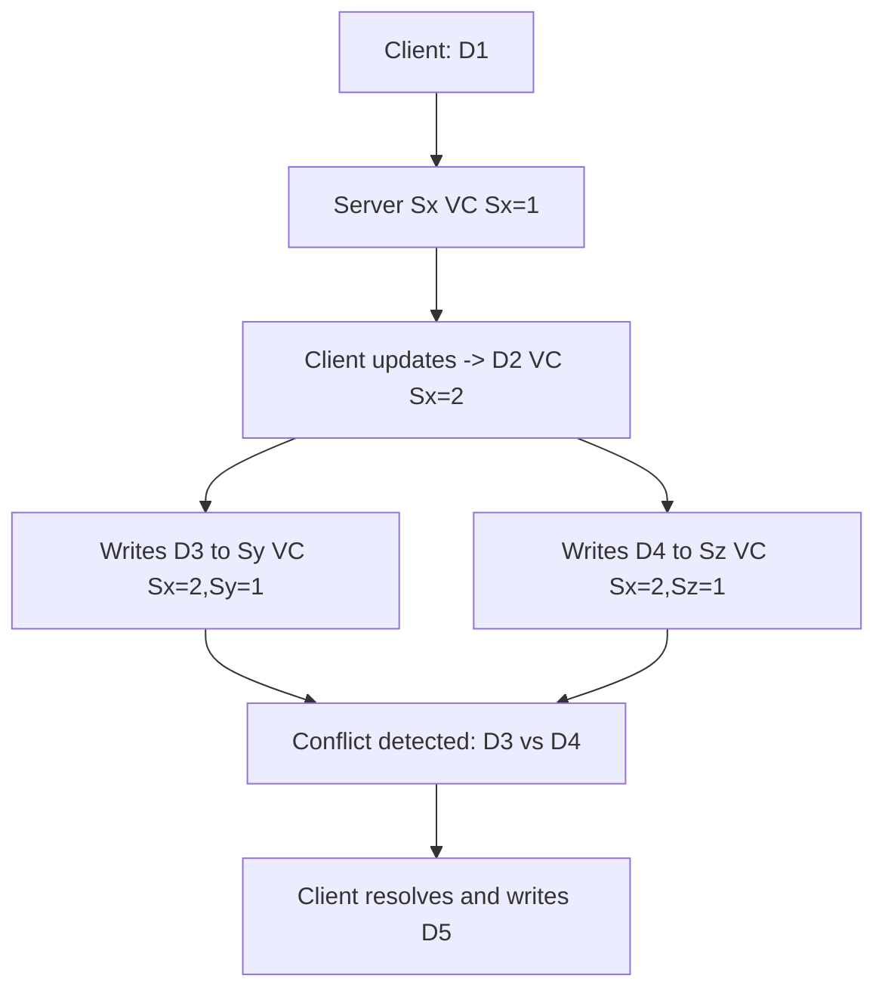
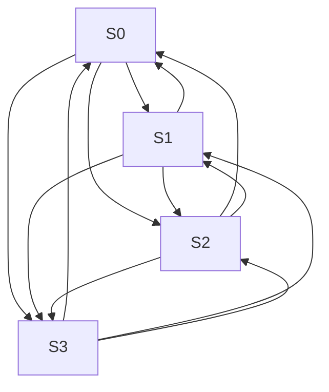
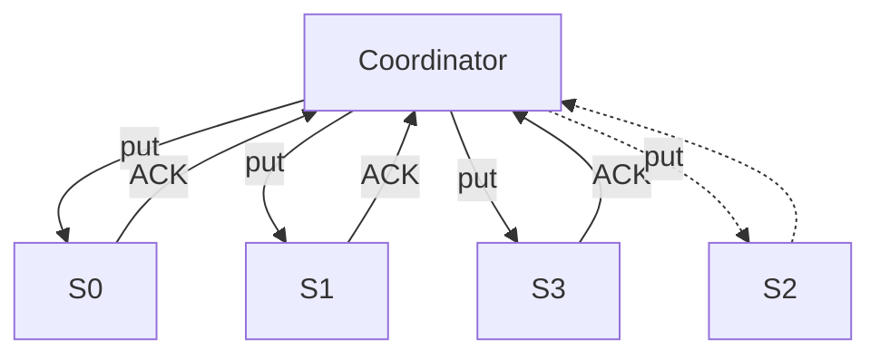
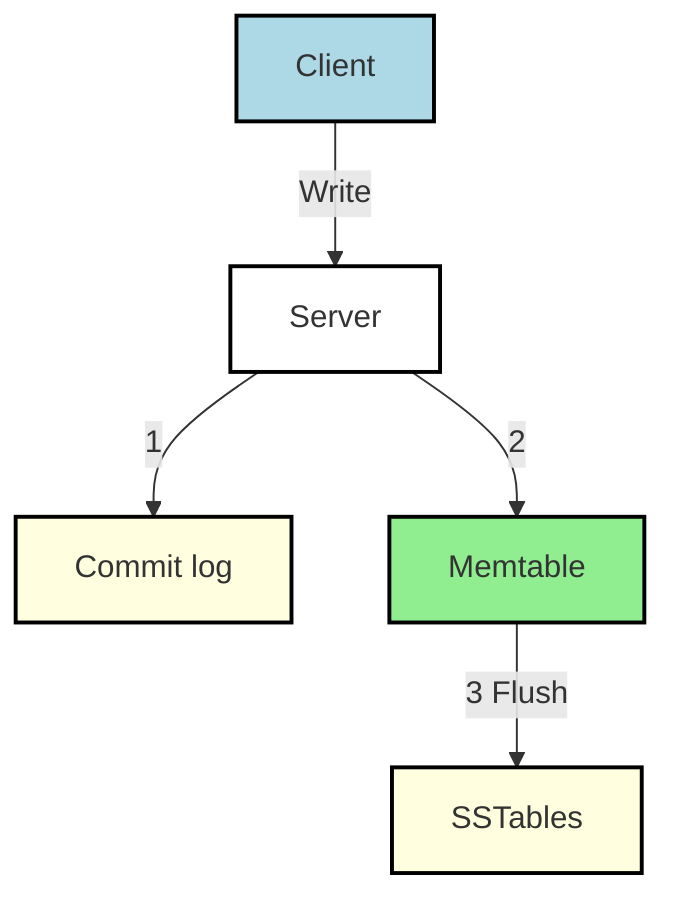
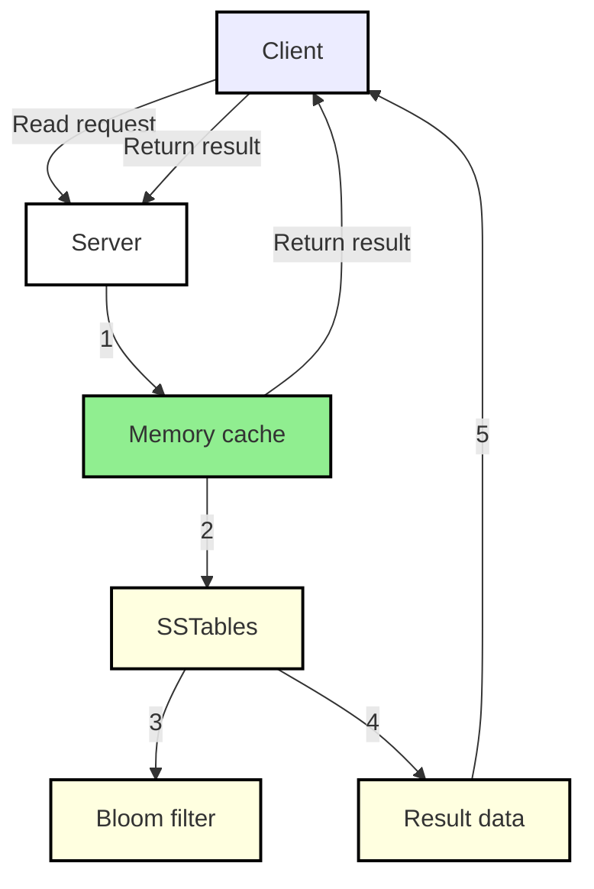

# Design a Key-Value Store

A key-value store (also called a key-value database) is a non-relational database that stores each unique identifier as a key with an associated value. This pairing is known as a "key-value" pair.

Example keys:

- Plain text key: `last_logged_in_at`
- Hashed key: `253DDEC4`

Example key-value table:

| Key | Value |
|-----|-------|
| 145 | John  |
| 147 | Bob   |
| 160 | Julia |

You are asked to design a key-value store that supports the following simple operations:

- `put(key, value)` — insert the `value` associated with `key`
- `get(key)` — retrieve the `value` associated with `key`

## Scope

- Typical key-value size: small (usually < 10 KB).
- Support very large datasets (scale horizontally).
- High availability and low latency.
- Tunable consistency levels.
- Automatic scaling: add/remove servers based on load.

---

## Single-server key-value store

An in-memory hash table is the simplest design. Memory access is fast, but a single server cannot hold very large datasets.

Common optimizations:

- Data compression.
- Keep hot data in memory and cold data on disk.

For large-scale workloads, a distributed design is required.

## Distributed key-value store (DHT)

Distribute key-value pairs across many servers using partitioning and replication.

### CAP theorem

CAP = Consistency, Availability, Partition tolerance. In practice a distributed system must tolerate partitions, so designs trade between consistency and availability.
No System can have all 3, only 2 are possible.

- **Consistency**: all clients see the same data at the same time.
- **Availability**: every request receives a response.
- **Partition Tolerance**: system continues to operate despite network partitions.

Systems typically favor either CP or AP depending on requirements.

### Ideal vs. real world

In an ideal world partitions never occur and both consistency and availability are possible. In reality partitions happen and systems must choose trade-offs (block operations to preserve consistency, or remain available and reconcile later).

Data written to n1 is replicated to n2, n3.

## System components and techniques

- Data partitioning (consistent hashing)
- Data replication
- Consistency and quorum configuration
- Versioning & conflict resolution
- Failure detection and recovery
- Anti-entropy (Merkle trees)
- Read/write paths (memtable, commit log, SSTables, bloom filters)

## Data partitioning

don't put all data on single server;
split in smaller partition, store in multiple servers
Use consistent hashing to assign key ranges to servers. Benefits:

- Distribute data across multiple servers evenly.
- Minimal data movement when nodes join/leave.
- Easy horizontal scaling.
- Support for heterogeneous node capacities via virtual nodes.

## Data replication

Replicate each key to `N` nodes for durability and availability. After mapping a key to the ring, walk clockwise and pick the first `N` unique physical nodes as replicas. Prefer cross-DC placement for resilience.

## Consistency and quorums

Notation:

- `N` — number of replicas
- `W` — write quorum (ACKs required)
- `R` — read quorum (responses required)

If `W + R > N` then reads and writes overlap and strong consistency is normally achieved (e.g., `N=3, W=2, R=2`). Smaller `W`/`R` trade consistency for lower latency and higher availability.

`W=1` means coordinator must receive at least one acknowledgment before the write operation is considered as successful. if we get an acknowledgment from s1, we no longer need to wait for acknowledgements from s0 and s2.
A coordinator acts as a proxy between the client and the nodes.

if W=1 || R=1 opr returned quickly, cause need to wait only for response
if W>1 || R>1 better consistency but slow query because coordinator must wait for the response from the slowest replica.
if W+R>N strong consistency

If R = 1 and W = N, the system is optimized for a fast read.
If W = 1 and R = N, the system is optimized for fast write.
If W + R > N, strong consistency is guaranteed (Usually N = 3, W = R = 2).
If W + R <= N, strong consistency is not guaranteed.

## Consistency models

- Strong consistency: reads always see the latest write.
- Weak consistency: reads may be stale.
- Eventual consistency: replicas converge eventually (common in Dynamo/Cassandra designs).

Eventual consistency accepts temporary divergence and relies on reconciliation mechanisms.

## Inconsistency resolution: versioning and vector clocks

Treat updates as immutable versions and use vector clocks to capture causal history. When concurrent versions are detected, clients or application-level logic can reconcile conflicts.

Prune vector clocks (threshold management) when metadata grows too large; this trades some causal precision for practical metadata size.

## Failure detection

Use a gossip protocol: nodes exchange heartbeat counters and membership lists. A node suspected of failure is propagated through gossip once multiple peers observe missing heartbeats.

use `Gossip Protocol`

- Each node maintains a node membership list, which contains member IDs and heartbeat counters.
- Each node periodically increments its heartbeat counter.
- Each node periodically sends heartbeats to a set of random nodes, which in turn propagate to another set of nodes.
- Once nodes receive heartbeats, membership list is updated to the latest info.
- If the heartbeat has not increased for more than predefined periods, the member is considered as offline.

- Node s0 maintains a node membership list shown on the left side.
- Node s0 notices that node s2’s (member ID = 2) heartbeat counter has not increased for a long time.
- Node s0 sends heartbeats that include s2’s info to a set of random nodes. Once other nodes confirm that s2’s heartbeat counter has not been updated for a long time, node s2 is marked down, and this information is propagated to other nodes.

## Handling Temporary Failures

- **Sloppy Quorum**: Improves availability by using the first W healthy servers for writes and R healthy servers for reads on the hash ring, ignoring offline servers.
- **Handling Failures**: If a server (e.g., s2) is down due to network or server issues, another server (e.g., s3) temporarily processes reads and writes.
- **Hinted Handoff**: When the failed server (e.g., s2) comes back online, the temporary server (e.g., s3) sends the changes back to restore data consistency.
- **Avoiding Blockage**: Unlike strict quorum, this method prevents blocking read and write operations during failures.

## Anti-entropy and Merkle trees

Use anti-entropy to reconcile persistent inconsistencies between replicas. Merkle trees (hash trees) let replicas compare compact digests and only exchange differing subtrees, minimizing bandwidth.

### Building a Merkle tree (example)

1. Divide key space into buckets.
2. Hash keys in each bucket and compute a bucket hash.
3. Recursively combine child hashes up to the root.

Comparing roots quickly detects differences; traversing child hashes locates divergent buckets. Synchronization cost is proportional to differences, not total data size.

## Handling data center outages

Replicate across multiple data centers and prefer geographically separated replica placement to tolerate DC-level failures.

## Write path (per-node)

1. Persist write to a commit log.
2. Apply to in-memory memtable (fast writes).
3. Flush memtable to immutable SSTables when thresholds are reached.

1. The write request is persisted on a commit log file.
2. Data is saved in memory cache.
3. When cache is full or reaches predefined threshold, data is flushed to SSTable [9] on disk.

## Read path (per-node)

1. Check memtable (in-memory).
2. If not present, consult Bloom filter to find candidate SSTables.
3. Read from SSTables and merge results.

## Read/write trade-offs and configuration

- Choose `N`, `W`, `R` to balance latency, availability, and consistency.
- Use cross-DC replication for durability but be mindful of higher latencies.
- Tune memtable, SSTable compaction, and Bloom filter false-positive rate for performance.

---

## References

- [Amazon DynamoDB](https://aws.amazon.com/dynamodb/)
- [memcached](https://memcached.org/)
- [Redis](https://redis.io/)
- [Dynamo: Amazon’s Highly Available Key-value Store](https://www.allthingsdistributed.com/files/amazon-dynamo-sosp2007.pdf)
- [Cassandra](https://cassandra.apache.org/)
- [Bigtable: A Distributed Storage System for Structured Data](https://static.googleusercontent.com/media/research.google.com/en//archive/bigtable-osdi06.pdf)
- [Merkle tree](https://en.wikipedia.org/wiki/Merkle_tree)
- [Bloom filter](https://en.wikipedia.org/wiki/Bloom_filter)