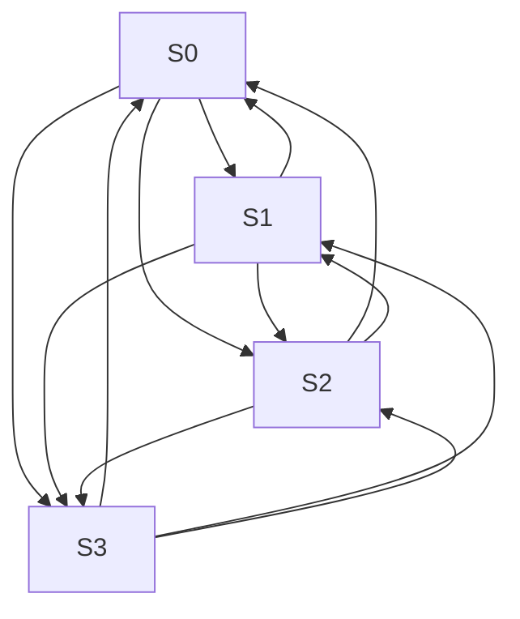
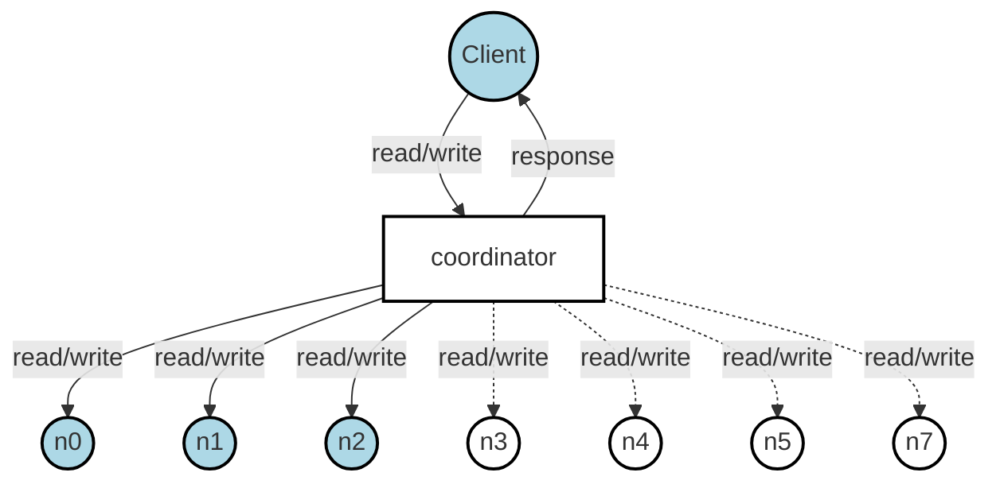
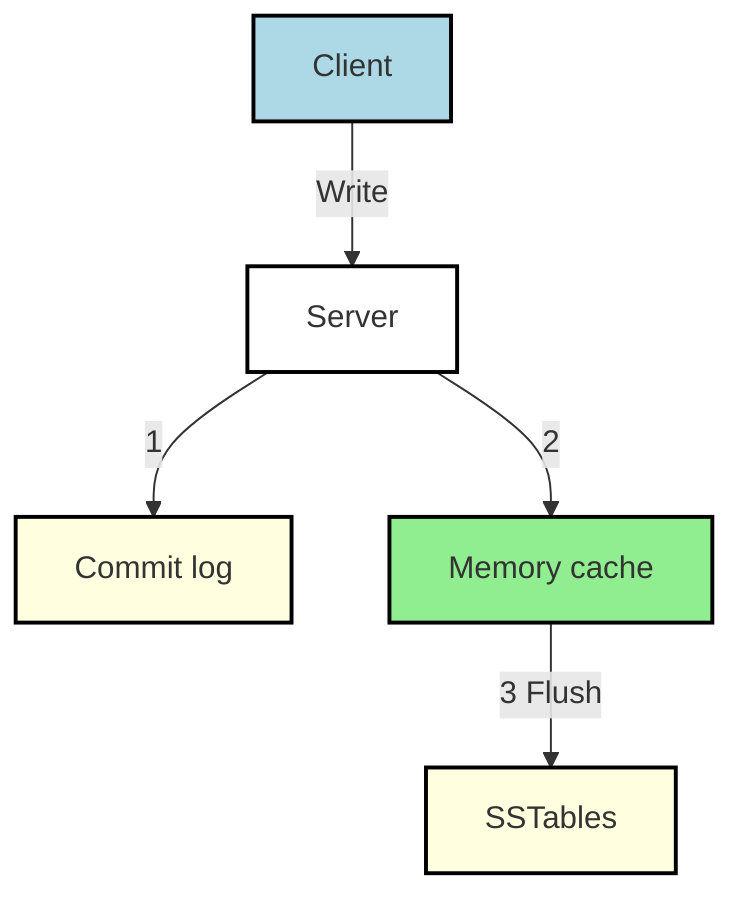
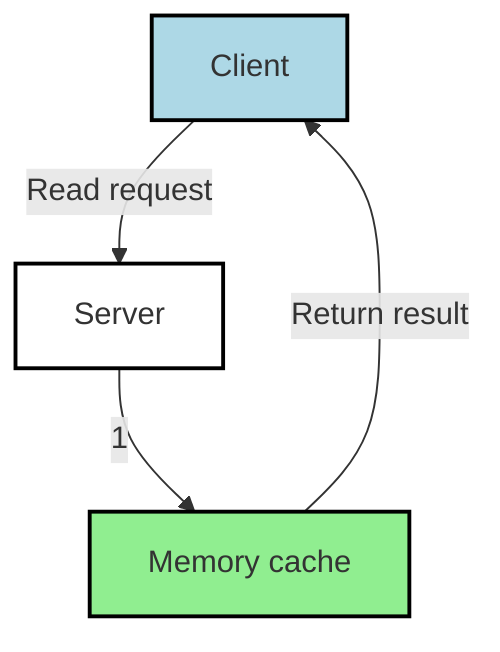
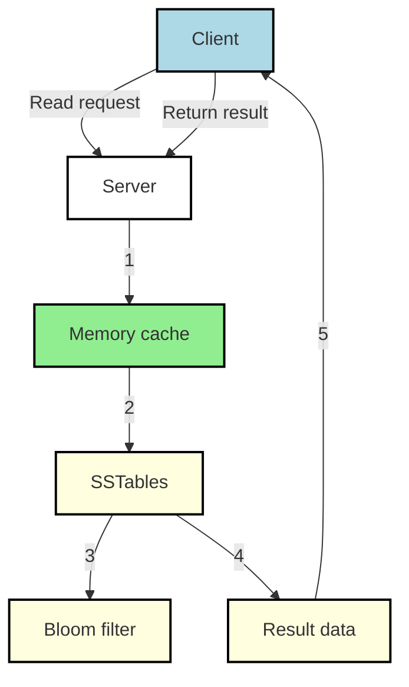

# Design a Key-Value Store

also referred to as a key-value database, is a non-relational database.
Each unique identifier is stored as a key with its associated value. This data pairing is known as a “key-value” pair.

ex:

- Plain text key: “last_logged_in_at”
- Hashed key: 253DDEC4

ex:

## | Key | Value |

| 145 | john |
| 147 | bob |
| 160 | Julia |

you are asked to design a key-value store that supports the following operations:

- `put(key, value)` // insert “value” associated with “key”
- `get(key)` // get “value” associated with “key”

# Scope

- The size of a key-value pair is small: less than 10 KB.
- Ability to store big data.
- High availability: The system responds quickly, even during failures.
- High scalability: The system can be scaled to support large data set.
- Automatic scaling: The addition/deletion of servers should be automatic based on traffic.
- Tunable consistency.
- Low latency.

## Single server key-value store

intuitive approach is to store key-value pairs in a hash table, which keeps everything in memory.
Even though memory access is fast, fitting everything in memory may be impossible due to the space constraint.

2 optimizations:

- Data compression
- Store only frequently used data in memory and the rest on disk

still capacity will be hit very quickly
A distributed key-value store is required to support big data.

# Distributed key-value store(distributed hash table)

distributes Key-Value pairs across many servers.

## CAP Thoerem

CAP - consistency, availability, partition
no system can have all 3, only 2 are possible

- **Consistency** : all clients see the same data at the same time no matter which node they connect to.
- **Availability** : any client which requests data gets a response even if some of the nodes are down.
- **Partition Tolerance** : a partition indicates a communication break between two nodes; system continues to operate despite network partitions.

key-value stores are classified based on the two CAP characteristics they support:

- **CP (consistency and partition tolerance) systems**: a CP key-value store supports
  consistency and partition tolerance while sacrificing availability.
- **AP (availability and partition tolerance) systems**: an AP key-value store supports
  availability and partition tolerance while sacrificing consistency.
- **CA (consistency and availability) systems**: a CA key-value store supports consistency and availability while sacrificing partition tolerance. Since network failure is unavoidable, a
  distributed system must tolerate network partition. Thus, a CA system cannot exist in real-world applications.

## ideal Situations

In the ideal world, network partition never occurs.
Data written to n1 is automatically replicated to n2 and n3.
Both consistency and availability are achieved.

```mermaid
graph LR
    style n1 fill:#f9f,stroke:#333,stroke-width:2px
    style n2 fill:#9f9,stroke:#333,stroke-width:2px
    style n3 fill:#9ff,stroke:#333,stroke-width:2px

    n1 -- n2
    n2 -- n3
    n3 -- n1
```

## Real World distributed system

partition can't be avoided, so choose b/w consistency and availability

```mermaid

graph LR
    style n1 fill:#f9f,stroke:#333,stroke-width:2px
    style n2 fill:#9f9,stroke:#333,stroke-width:2px
    style n3 fill:#9ff,stroke:#333,stroke-width:2px

    n1 -- n2
    n2 -- n3 X
    n3 X -- n1
```

n3 goes down and cannot communicate with n1 and n2.
If clients write data to n1 or n2, data cannot be propagated to n3.
If data is written to n3 but not propagated to n1 and n2 yet, n1 and n2 would have stale data.

if we choose consistency and partition
block all write operations to n1 and n2 to avoid data inconsistency among these three servers

if we choose availability and partition
the system keeps accepting reads, even though it might return stale data.
For writes, n1 and n2 will keep accepting writes, and data will be synced to n3 when the network partition is resolved.

# System Components

diff techniques used:

- Data partition
- Data replication
- Consistency
- Inconsistency resolution
- Handling failures
- System architecture diagram
- Write path
- Read path

## Data Partition

do not put all data into single server, not feasible
split the data into smaller partitions and store them in multiple servers

2 challenges while partitioning data:

- Distribute data across multiple servers evenly.
- Minimize data movement when nodes are added or removed.

Using consistent hashing to partition data has the following advantages:
**Automatic scaling**: servers could be added and removed automatically depending on the load.
**Heterogeneity**: the number of virtual nodes for a server is proportional to the server capacity. For example, servers with higher capacity are assigned with more virtual nodes.

## Data Replication

data must be replicated asynchronously over N servers, where N is a configurable parameter for high availability and reliability.

logic to choose N servers:
after a key is mapped to a position on the hash ring, walk clockwise from that position and choose the first N servers on the ring to store data copies.

With virtual nodes, the first N nodes on the ring may be owned by fewer than N physical servers.
To avoid this issue, we only choose unique servers while performing the clockwise walk logic.

nodes may fail at same time
For better reliability, replicas are placed in distinct data centers, and data centers are connected through high-speed networks.

## Consistency

N - no of replicas
W - A write quorum of size W. For a write operation to be considered as successful, write operation must be acknowledged from W replicas.
R - read quorum of size R. to be success read operation must wait for responses from at least R replicas.

```mermaid
graph TD
    A[Coordinator] -->|put(key1, val1)| B(S0)
    A -->|put(key1, val1)| C(S1)
    A -->|put(key1, val1)| D(S2)
    B -->|ACK| A
    C -->|ACK| A
    D -->|ACK| A
```

`W=1` means coordinator must receive at least one acknowledgment before the write operation is considered as successful.
if we get an acknowledgment from s1, we no longer need to wait for acknowledgements from s0 and s2.
A coordinator acts as a proxy between the client and the nodes.

if W=1 || R=1 opr returned quickly,cause need to wait only for response
if W>1 || R>1 better consistency but slow query because coordinator must wait for the response from the slowest replica.
if W+R>N strong consistency

If R = 1 and W = N, the system is optimized for a fast read.
If W = 1 and R = N, the system is optimized for fast write.
If W + R > N, strong consistency is guaranteed (Usually N = 3, W = R = 2).
If W + R <= N, strong consistency is not guaranteed.

## Consistency Models

defines the degree of data consistency

- **Strong consistency**: any read operation returns a value corresponding to the result of the most updated write data item. A client never sees out-of-date data.
- **Weak consistency**: subsequent read operations may not see the most updated value.
- **Eventual consistency**: this is a specific form of weak consistency. Given enough time, all updates are propagated, and all replicas are consistent.

Strong consistency is usually achieved by forcing a replica not to accept new reads/writes until every replica has agreed on current write. This approach is not ideal for highly available systems because it could block new operations.

Dynamo and Cassandra adopt eventual consistency, which is our recommended consistency model for our key-value store.

From concurrent writes, eventual consistency allows inconsistent values to enter the system and force the client to read the values to reconcile

## Inconsistency resolution: versioning

Replication gives high availability but causes inconsistencies among replicas
use Versioning and vector locks to solve.

- **Versioning**: treating each data modification as a new immutable version of data, use Vector Clock
  A vector clock is a `[server, version]` pair associated with a data item. It can be used to check if one version precedes, succeeds, or in conflict with others. - Increment vi if `[Si, vi]` exists. - Otherwise, create a new entry `[Si, 1]`.

```mermaid
graph TD
    A[Client Writes D1] --> B[Server Sx handles<br>Vector Clock: D1[(Sx, 1)]]
    B --> C[Client Reads D1, Updates to D2<br>Writes back to Sx<br>Vector Clock: D2[(Sx, 2)]]
    C --> D[Client Reads D2, Updates to D3<br>Writes to Sy<br>Vector Clock: D3[(Sx, 2), (Sy, 1)]]
    C --> E[Client Reads D2, Updates to D4<br>Writes to Sz<br>Vector Clock: D4[(Sx, 2), (Sz, 1)]]
    D --> F[Client Reads D3 and D4<br>Detects Conflict (D2 modified by Sy and Sz)]
    E --> F
    F --> G[Client Resolves Conflict<br>Writes D5 to Sx<br>Vector Clock: D5[(Sx, 3), (Sy, 1), (Sz, 1)]]
```

- **Threshold Management**: Set a threshold for Vector Clock length; remove oldest pairs if exceeded.May cause inefficiencies in reconciliation due to inaccurate descendant relationships.
  Acceptable solution for most companies, as per Amazon's Dynamo paper [4], with no reported production issues.

# Handling Failures

failuers are inevitable and common

## Failure detection

hard to believe server is down in a distributed one
it requires at least two independent sources of information to mark a
server down.



use `Gossip Protocol`

- Each node maintains a node membership list, which contains member IDs and heartbeat counters.
- Each node periodically increments its heartbeat counter.
- Each node periodically sends heartbeats to a set of random nodes, which in turn propagate to another set of nodes.
- Once nodes receive heartbeats, membership list is updated to the latest info.
- If the heartbeat has not increased for more than predefined periods, the member is considered as offline.

- Node s0 maintains a node membership list shown on the left side.
- Node s0 notices that node s2’s (member ID = 2) heartbeat counter has not increased for a long time.
- Node s0 sends heartbeats that include s2’s info to a set of random nodes. Once other
  nodes confirm that s2’s heartbeat counter has not been updated for a long time, node s2 is
  marked down, and this information is propagated to other nodes.

## Handling Temporary Failures

- **Sloppy Quorum**: Improves availability by using the first W healthy servers for writes and R healthy servers for reads on the hash ring, ignoring offline servers.
- **Handling Failures**: If a server (e.g., s2) is down due to network or server issues, another server (e.g., s3) temporarily processes reads and writes.
- **Hinted Handoff**: When the failed server (e.g., s2) comes back online, the temporary server (e.g., s3) sends the changes back to restore data consistency.
- **Avoiding Blockage**: Unlike strict quorum, this method prevents blocking read and write operations during failures.

```mermiad
graph TD
    Coordinator -->|put(key1, val1)| S0
    Coordinator -->|put(key1, val1)| S1
    Coordinator -->|put(key1, val1)| S3
    S0 -->|ACK| Coordinator
    S1 -->|ACK| Coordinator
    S3 -->|ACK| Coordinator
    Coordinator -.->|put(key1, val1)| S2
    S2 -.->|X| Coordinator
```

# Handling Permanent Replica Failures with Anti-Entropy Protocol

- **Permanent Unavailability**: If a replica is permanently unavailable, the anti-entropy protocol ensures replicas stay synchronized.
- **Anti-Entropy Process**: Compares data across replicas and updates each to the newest version.
- **Merkle Tree Usage**:
  - A Merkle tree (hash tree) uses hashes of child nodes to efficiently detect inconsistencies and minimize data transfer.
  - Quoted from Wikipedia [7]: "A hash tree or Merkle tree is a tree in which every non-leaf node is labeled with the hash of the labels or values of its child nodes. Hash trees allow efficient and secure verification of the contents of large data structures."

## Building a Merkle Tree (Key Space 1-12)

- **Step 1**: Divide key space into 4 buckets (root level nodes to limit tree depth).
- **Step 2**: Hash each key in a bucket using a uniform hashing method.
- **Step 3**: Create a single hash node per bucket.
- **Step 4**: Build the tree upward to the root by calculating hashes of child nodes.

## Comparing Merkle Trees

- Compare root hashes:
  - Matching roots indicate identical data.
  - Mismatched roots lead to comparing child hashes, traversing to identify and sync unsynchronized buckets.
- **Efficiency**: Synchronization data is proportional to differences, not total data size. Example: 1 million buckets for 1 billion keys (1000 keys per bucket).

## Benefits

- Minimizes data transfer and optimizes synchronization in real-world systems.

## Handling data center outage

Data center outage could happen; replicate across multiple data center location

# System Architecture Diagram



• Clients communicate with the key-value store through simple APIs: get(key) and put(key, value).
• A coordinator is a node that acts as a proxy between the client and the key-value store.
• Nodes are distributed on a ring using consistent hashing.
• The system is completely decentralized so adding and moving nodes can be automatic.
• Data is replicated at multiple nodes.
• There is no single point of failure as every node has the same set of responsibilities

## Write Path



1. The write request is persisted on a commit log file.
2. Data is saved in the memory cache.
3. When the memory cache is full or reaches a predefined threshold, data is flushed to
   SSTable [9] on disk.

## Read Path

1. The system first checks if data is in memory. If not, go to step 2.
2. If data is not in memory, the system checks the bloom filter.
3. The bloom filter is used to figure out which SSTables might contain the key.
4. SSTables return the result of the data set.
5. The result of the data set is returned to the client.





---

# Reference materials

- [Amazon DynamoDB](https://aws.amazon.com/dynamodb/)
- [memcached](https://memcached.org/)
- [Redis](https://redis.io/)
- [Dynamo: Amazon’s Highly Available Key-value Store](https://www.allthingsdistributed.com/files/amazon-dynamo-sosp2007.pdf)
- [Cassandra](https://cassandra.apache.org/)
- [Bigtable: A Distributed Storage System for Structured Data](https://static.googleusercontent.com/media/research.google.com/en//archive/bigtable-osdi06.pdf)
- [Merkle tree](https://en.wikipedia.org/wiki/Merkle_tree)
- [Cassandra architecture](https://cassandra.apache.org/doc/latest/architecture/)
- [SStable](https://www.igvita.com/2012/02/06/sstable-and-log-structured-storage-leveldb/)
- [Bloom filter](https://en.wikipedia.org/wiki/Bloom_filter)

87-108
