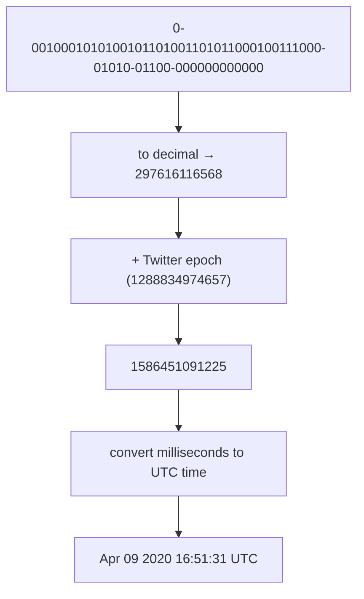

# UNIQUE ID GENERATOR IN DISTRIBUTED SYSTEMS

you can use primary key with the `auto_increment` attribute in a traditional database.
but doesn't works in distributed environment cause single database server is not large enough and generating unique IDs across multiple databases with minimal delay is challenging.

---

## Challenges

- Unique, Sortable IDs
- ID increment by time, not by 1
- only numerical values
- id length : 64-bit
- scale : 10000/sec

---

# High Level Design

multiple options are present:

### Multi-master replication

use databases' `auto_increment` feature, instead of 1 use k{k is no of db}

**Problem:**

- Hard to scale with multiple data centers
- IDs do not go up with time across multiple servers
- It does not scale well when a server is added or removed

---

### Universally unique identifier (UUID)

A UUID is a 128-bit label uniquely identifying objects in computer systems. GUID is a term often used interchangeably with UUID, particularly in Microsoft environments.

- Standardized under **ISO/IEC 11578:1996**, ITU-T Rec. X.667, and RFC 4122 → later updated in **RFC 9562**.
- Can be generated independently without coordination between servers.
- Versions:
  - **V1/V6** – timestamp + MAC address (V6 is sortable)
  - **V2** – DCE Security
  - Others (V3, V4, V5, V7, V8) cover hash/random/time-based needs.

**Problems for our case:**

- 128-bit → twice the size of 64-bit requirement.
- Can be non-numeric.
- Do not go up with time naturally (except V6/V7).

> Note: after generating 1 billion UUIDs every second for \~100 years, probability of a duplicate reaches 50%.

---

### Ticket server

pioneered at Flickr to solve globally unique IDs with MySQL.

- Idea: run a dedicated DB with a simple `auto_increment` table, use `REPLACE INTO` to atomically bump counters.
- Easy to implement, numeric IDs, and naturally sequential.
- Used successfully for years at Flickr (with multiple sequences like `Photos`, `Accounts`, `OfflineTasks`).

**Problems:**

- SPOF risk → mitigated with two ticket servers (odd/even split).
- Scaling to multiple DCs is hard.
- IDs do not guarantee time ordering across shards.

---

### NTP and Clock Synchronization

Timestamp-based IDs depend on consistent clocks.
The **Network Time Protocol (NTP)** is critical to keep servers synchronized to within milliseconds.

- NTP uses hierarchical strata (Stratum 0: atomic clocks/GPS → Stratum 1: time servers → Stratum 2: clients).
- Ensures that a timestamp on one machine matches another within an acceptable drift.
- Without reliable synchronization, timestamp bits in ID layouts could overlap or regress, creating duplicate/conflicting IDs.

---

### Twitter snowflake approach

Twitter needed IDs that were:

- 64-bit (for DB/storage efficiency)
- Roughly time-sortable
- Decentralized (no SPOF)
- High throughput (\~10k/sec)

**Solution:**
Divide and conquer. Instead of generating an ID directly, divide the 64-bit integer into sections:

| 1 bit | 41 bits   | 5 bits        | 5 bits     | 12 bits         |
| ----- | --------- | ------------- | ---------- | --------------- |
| sign  | timestamp | datacenter ID | machine ID | sequence number |

- **Sign bit:** always 0 (reserved for future)
- **Timestamp (41 bits):** ms since custom epoch → Twitter epoch `1288834974657` (Nov 04, 2010 01:42:54 UTC)
- **Datacenter ID (5 bits):** up to 32 DCs
- **Machine ID (5 bits):** up to 32 machines per DC
- **Sequence (12 bits):** per-ms counter, up to 4096 IDs/ms per machine

---

# Design Deep Dive

### Datacenter + Machine IDs

Chosen at startup time, fixed while running.
Changing them requires caution to avoid ID collisions.

### Timestamp

most important 41 bits make up timestamp,
as they grow, can be sorted easily.

max timestamp = 2^41 - 1 = 2199023255551 ms
≈ 69 years from the chosen epoch.

---

### Sequence Number

- 12 bits → 4096 values per ms.
- Reset every new millisecond.
- Supports **4096 IDs/ms/machine**, which is **4.096M IDs/sec per datacenter**.

---

# Additional Points

- **Clock Synchronization:** critical to avoid duplicate IDs when clocks drift (role of NTP).
- **Section tuning:** adjust bit allocation for specific needs (e.g., more timestamp bits for longevity).
- **High Availability:** decentralization + multiple generators avoids SPOF.

---

[rust-implementation](git@github.com:NalinDalal/id-gnrt-rust-impl.git)
