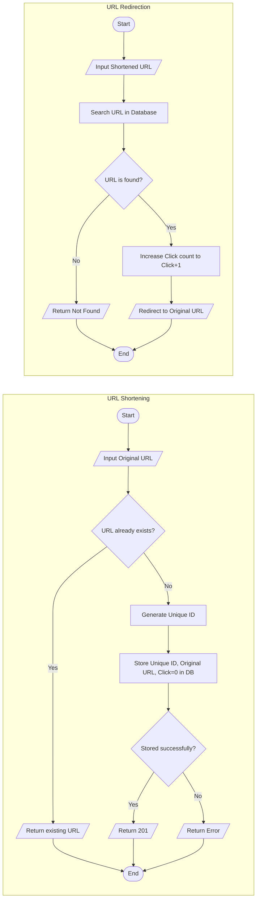
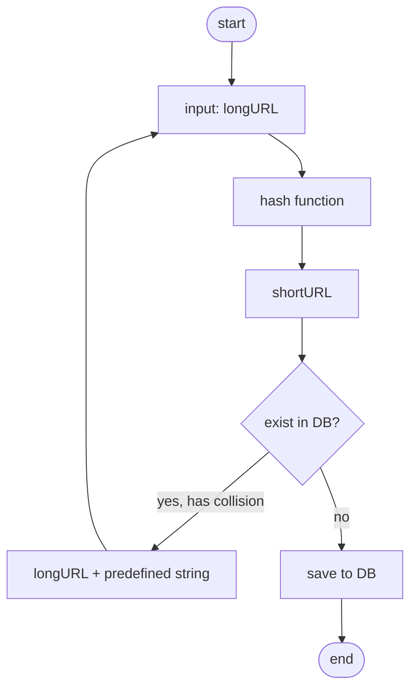
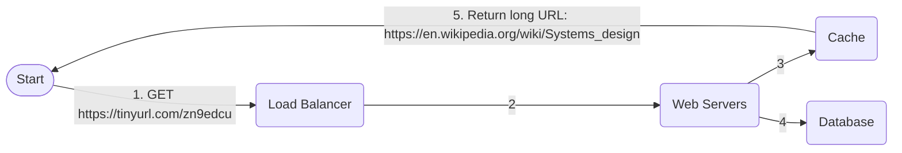

# URL Shortner

The main goal is to build a url-shortneing service similar to [bit.ly](https://bitly.com/) or [tiny-url](https://tinyurl.com/).

URL shortening is a service that produces short aliases for long URLs, commonly referred to as short links.
Upon clicking, these short links direct to the original URLs. The following illustration depicts how the process works:




# Requirement Designing

## Functional requirements

- _Short URL generation_: Our service should be able to generate a unique shorter alias of the given URL.
- _Redirection_: Given a short link, our system should be able to redirect the user to the original URL.
- _Custom short links_: Users should be able to generate custom short links for their URLs using our system.
- _Deletion_: Users should be able to delete a short link generated by our system, given the rights.
- _Update_: Users should be able to update the long URL associated with the short link, given the proper rights.
- _Expiry time_: There must be a default expiration time for the short links, but users should be able to set the expiration time based on their requirements.

Keep the limitation to 2 months so that the db can be indexed to previous url
else it will grow wxponentilly with time.

## Non-functional requirements

- _Availability_: Our system should be highly available, because even a fraction of the second downtime would result in URL redirection failures. Since our system’s domain is in URLs, we don’t have the leverage of downtime, and our design must have fault-tolerance conditions instilled in it.
- _Scalability_: Our system should be horizontally scalable with increasing demand.
- _Readability_: The short links generated by our system should be easily readable, distinguishable, and typeable.
- _Latency_: The system should perform at low latency to provide the user with a smooth experience.
- _Unpredictability_: From a security standpoint, the short links generated by our system should be highly unpredictable. This ensures that the next-in-line short URL is not serially produced, eliminating the possibility of someone guessing all the short URLs that our system has ever produced or will produce.

# Resource Estimation

let's say for instance:

- shortening:redirection request ratio is 1:100.
- 200 million req
- 1 req-> 500 byte of db storage
- 5 yr expiry time here
- 100 million users

# Storage

5 yr of time
200 million entries per month
total entries=200 million/month _ 12 month _ 5 = 12 billion
1 entry-> 500 byte: total= 12 billion \* 500 byte=6 TB

# Query Estimation

200 million _ 100 = 20 billion redirection
no od seconds in month-> 30.42 days _ 24 hours _ 60 minutes _ 60 seconds=2628288 seconds

so in total-> 200 million/ 2628288 = 76 url/sec
with 1:100-> 7.6 k url/sec

# Bandwidth Estimation

total 76 url/sec-> data=304kbps
total shortening= 76*500 bytes * 8 bits= 304 Kbps
redirection: 7.6K URLs redirections/ second, the total outgoing data ->30.4Mbps per second: 7.6 K×500 Bytes×8 bits=30.4 Mbps

# Memory estimation

say 20 percent of redirection requests generate 80 percent of the traffic.
redirection req are 7.6k-> 0.66 billion/day
7.6k*3600*24, but only 20% are cached-> 7.6k*3600*24*0.2*500 bytes=66GB

# Server Estimation

Servers needed at peak load=( Number of requests/second )/ RPS of server
=100 million / 64,000
= 1562.5
≈ 1.6K

# Estimation Summary

| Type of operation   | Time estimates |
| ------------------- | -------------- |
| New URLs            | 76/s           |
| URL redirections    | 7.6 K/s        |
| Incoming data       | 304 Kbps       |
| Outgoing data       | 30.4 Mbps      |
| Storage for 5 years | 6 TB           |
| Memory for cache    | 66 GB          |
| Servers             | 1600           |

## Building Blocks for High-Level Design

- **Databases**: Store mappings between long URLs and their corresponding short URLs.
- **Sequencer**: Generate unique IDs to start the short URL creation process.
- **Load Balancers**: Distribute incoming requests smoothly across servers.
- **Caches**: Store frequently accessed short URLs for faster access.
- **Rate Limiters**: Prevent abuse and overuse of the system.

### Additional Components

- **Servers**: Handle service requests and run application logic.
- **Base-58 Encoder**: Convert numeric IDs from the sequencer into readable alphanumeric short URLs.

# Design and Deployment of TinyURL

3 system api:

#### 1. Shorten a URL

**Endpoint:** `POST /api/v1/data/shorten`
**Request Body:**

```json
{
  "longUrl": "https://example.com/very/long/url"
}
```

**Response:**

```json
{
  "shortUrl": "https://short.ly/abc123"
}
```

---

#### 2. Redirect a Short URL

**Endpoint:** `GET /api/v1/{shortUrl}`
**Behavior:**

- Looks up the corresponding `longUrl`.
- Returns an **HTTP 302 Redirect** to the original URL.

---

#### 3. Delete a Short URL

**Endpoint:** `DELETE /api/v1/{shortUrl}`
**Response:**

```json
{
  "message": "Short URL deleted successfully."
}
```

---

## Shortening the URL

```txt
shortURL(api_dev_key, original_url, custom_alias=None, expiry_date=None)
```

parameters:
| Parameter | Description |
|---------------|-------------|
| `api_dev_key` | A registered user account’s unique identifier. Helps track user activity and control services accordingly. |
| `original_url` | The original long URL that needs to be shortened. |
| `custom_alias` | (Optional) A custom short URL key defined by the user. |
| `expiry_date` | (Optional) The expiration date for the shortened URL. |

say short url looks like: www.tinyurl.com/{hashValue}
find a hash function that maps longURL to hashValue.

- Each longURL must be hashed to one hashValue.
- Each hashValue can be mapped back to the longURL.

## Redirecting a short URL

To redirect a short URL, the REST API’s definition will be:

```API
redirectURL(api_dev_key, url_key)
```

status code: `301: permanent redirect`. requests are redirected to the long URL server directly.
`302: temporary redirect`. subsequent requests for the same URL will be sent to the URL shortening service first. Then, they are redirected to the long URL server.
parameters:
| Parameter | Description |
|-----------|-------------|
|api_dev_key | The registered user account’s unique identifier. |
|url_key| The shortened URL against which we need to fetch the long URL from the database.|

## Deleting a short URL

```api
deleteURL(api_dev_key, url_key)
```

and the associated parameters will be:

| Parameter   | Description                                                                      |
| ----------- | -------------------------------------------------------------------------------- |
| api_dev_key | The registered user account’s unique identifier.                                 |
| url_key     | The shortened URL against which we need to fetch the long URL from the database. |

A successful deletion returns a system message, `URL Removed`, conveying the successful URL removal from the system.

# Components

1. Databases: we will use NoSQL cause not really need to put lot of data: user details, mapped urls
   store <shortURL, longURL> mapping in a relational database.
   # URL Table

| PK  | **id (auto increment)** |
| --- | ----------------------- |
|     | shortURL                |
|     | longURL                 |

2. Short-URL generator: sequencer for unique id, base58-encoder to enhance
   Readability of url
3. Load Balancer
4. Cache
5. Rate Limiter

# Workflow

1. Shortening: shorten the url provided; sends one copy back to the user and stores the record in the database for future use.
2. Redirection: check the storage units (caching system and database) for the required record. If found, the application server redirects the user to the associated long URL.
3. Deletion: either by the user or the expired links can also be redirected
4. Custom Shorten Link: maximum length= 11 alphanumeric digits.

# Encoder

Our sequencer generates a 64-bit ID in base-10, which can be converted to a base-64 short URL.
but the problem is that since it generates random, so the char like `0` and `O`
or `I` and `l` can be confused with each other.
hence use `base-58` instead of `base-64` a/f slashing out 6 chars->
`0`,`O`,`I`,`l`,

## Converting base-10 to base-58

Process: We keep dividing the base-10 number by 58, making note of the remainder at each step. We stop where there is no remainder left.
Then we assign the character indexes to the remainders, starting from assigning the recent-most remainder to the left-most place and the oldest remainder to the right-most place.

## Converting base-58 to base-10

multiply each character index (value column from the table above) by the number of 58s that position holds, and add all the individual multiplication results.

# Hash Function

Hash function is used to hash a long URL to a short URL, also known as `hashValue`.
the length of hash value, since we are using `base-58` so find smallest n such
that 58^n >=365 billion -> n=7
length of hash value=7

to eliminate collision b/w url:

# URL Shortening Flowchart





# Scope of the Short URL Generator

- The generated short URL should contain **alphanumeric characters**.
- Characters that **look alike** should be **avoided**.
- The **default minimum length** of a generated short URL should be **six characters**.

### Number Range

- **Starting Range**: 1 to (2⁶⁴ - 1)
- **Ending Point**: Depends on the maximum utilization of 64 bits.
- **Number of digits** = (Total bits available) / (Bits needed to represent one digit)

### Example Calculations

- **Base 10**: log₂(10) → 64 / log₂(10) ≈ **20 digits**
- **Base 58**: log₂(58) → 64 / log₂(58) ≈ **11 digits**

## Sequencer Lifetime

- **Total numbers available**: 2⁶⁴ − 10⁹ (starting after 1 billion).
- **Number of requests per year**:  
  200 Million requests/month × 12 months = **2.4 Billion** requests/year.
- **Lifetime of the sequencer**:  
  (2⁶⁴ − 10⁹) ÷ 2.4 Billion ≈ **7,686,143,363.63 years**.

# Architecture

1. **API Server:** Handles requests for shortening and retrieving URLs.
   create a REST API that will allow a client to add a URL to the list of URLs that are currently shortened.
   already discussed about HasFunction for hashing of long url to small one.
   return a suitable HTTP status code when the request succeeds, along with the shortened URL, return it as JSON using the structure:

```json
{
  "key": "wsf5f",
  "long_url": "https://www.google.com",
  "short_url": "http://localhost/wsf5f"
}
```

2. **Redis Caching Layer & Docker:** Uses multiple Redis instances inside docker for distributed caching.

3. **Implementation:** redirect a client request for the shortened URL. To do that you will need to return the relevant HTTP status code (I’d suggest 302 Found) and the Location header.
   extend your REST API to accept a Delete request, which should delete the shortened URL if it exists and take no action if it does not.
   example code:

```js
require("dotenv").config();
const express = require("express");
const redis = require("redis");
const shortid = require("shortid");

const app = express();
app.use(express.json());

const redisClients = [
  redis.createClient({
    host: process.env.REDIS_HOST_1,
    port: process.env.REDIS_PORT_1,
  }),
  redis.createClient({
    host: process.env.REDIS_HOST_2,
    port: process.env.REDIS_PORT_2,
  }),
  redis.createClient({
    host: process.env.REDIS_HOST_3,
    port: process.env.REDIS_PORT_3,
  }),
];

// Hash function to distribute keys among Redis clients
function getRedisClient(key) {
  const hash = key.split("").reduce((acc, char) => acc + char.charCodeAt(0), 0);
  return redisClients[hash % redisClients.length];
}

// Endpoint to shorten a URL
app.post("/shorten", async (req, res) => {
  const { url } = req.body;
  if (!url) return res.status(400).send("URL is required");

  const shortId = shortid.generate();
  const redisClient = getRedisClient(shortId);

  await redisClient.set(shortId, url);
  res.json({ shortUrl: `http://localhost:${process.env.PORT}/${shortId}` });
});

// Endpoint to retrieve the original URL
app.get("/:shortId", async (req, res) => {
  const { shortId } = req.params;
  const redisClient = getRedisClient(shortId);

  redisClient.get(shortId, (err, url) => {
    if (err || !url) {
      return res.status(404).send("URL not found");
    }
    res.redirect(url);
  });
});

app.listen(process.env.PORT, () => {
  console.log(`Server running on port ${process.env.PORT}`);
});
```

Caching Invalidation:
add a expiration time:

```js
// Endpoint to shorten a URL with expiration
app.post("/shorten", async (req, res) => {
  const { url, ttl } = req.body; // ttl (time-to-live) is optional
  if (!url) return res.status(400).send("URL is required");

  const shortId = shortid.generate();
  const redisClient = getRedisClient(shortId);

  await redisClient.set(shortId, url, "EX", ttl || 3600); // Default TTL of 1 hour
  res.json({ shortUrl: `http://localhost:${process.env.PORT}/${shortId}` });
});
```

monitoring cache misses:

```js
app.get("/:shortId", async (req, res) => {
  const { shortId } = req.params;
  const redisClient = getRedisClient(shortId);

  redisClient.get(shortId, (err, url) => {
    if (err || !url) {
      console.log(`Cache miss for key: ${shortId}`);
      return res.status(404).send("URL not found");
    }
    console.log(`Cache hit for key: ${shortId}`);
    res.redirect(url);
  });
});
```

```sh
% curl http://localhost/jlrtPU -i
HTTP/1.1 302 Found
content-length: 0
location: https://www.example.com

% curl http://localhost/rtfdPU -i
HTTP/1.1 404 Not Found
content-length: 15
URL not found

% curl -X DELETE http://localhost/DmrFqF -i
HTTP/1.1 200 OK
content-length: 0

% curl http://localhost/DmrFqF -i
HTTP/1.1 404 Not Found
content-length: 15
URL not found
```

[next.js client](https://github.com/NalinDalal/url-short-next/tree/main)
[ts-server](https://github.com/NalinDalal/url-short-ts)
[ts-client](https://github.com/NalinDalal/url-short-fe)
