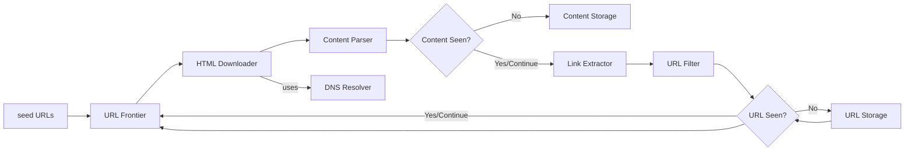
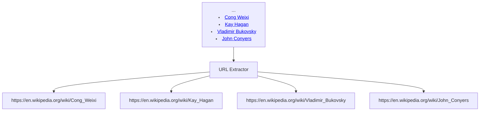
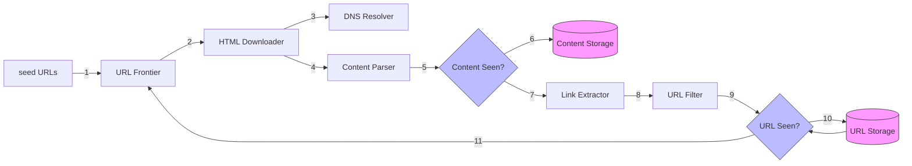
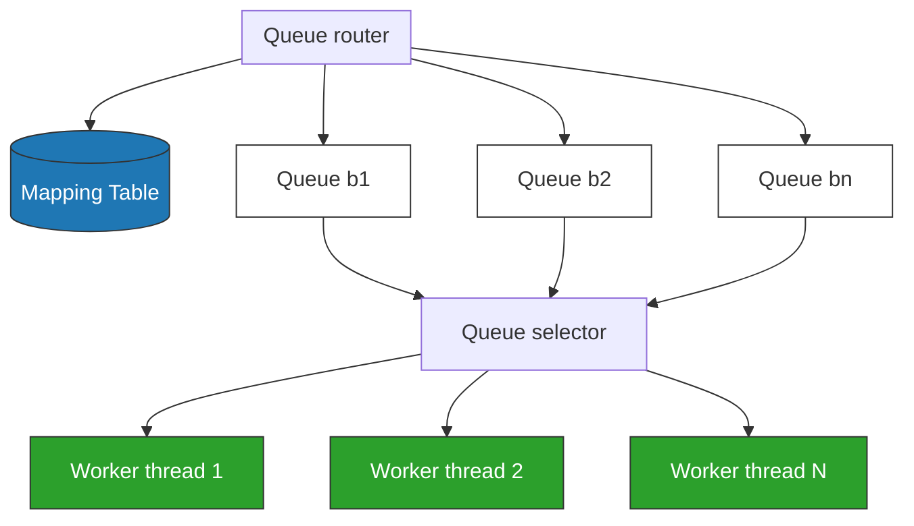
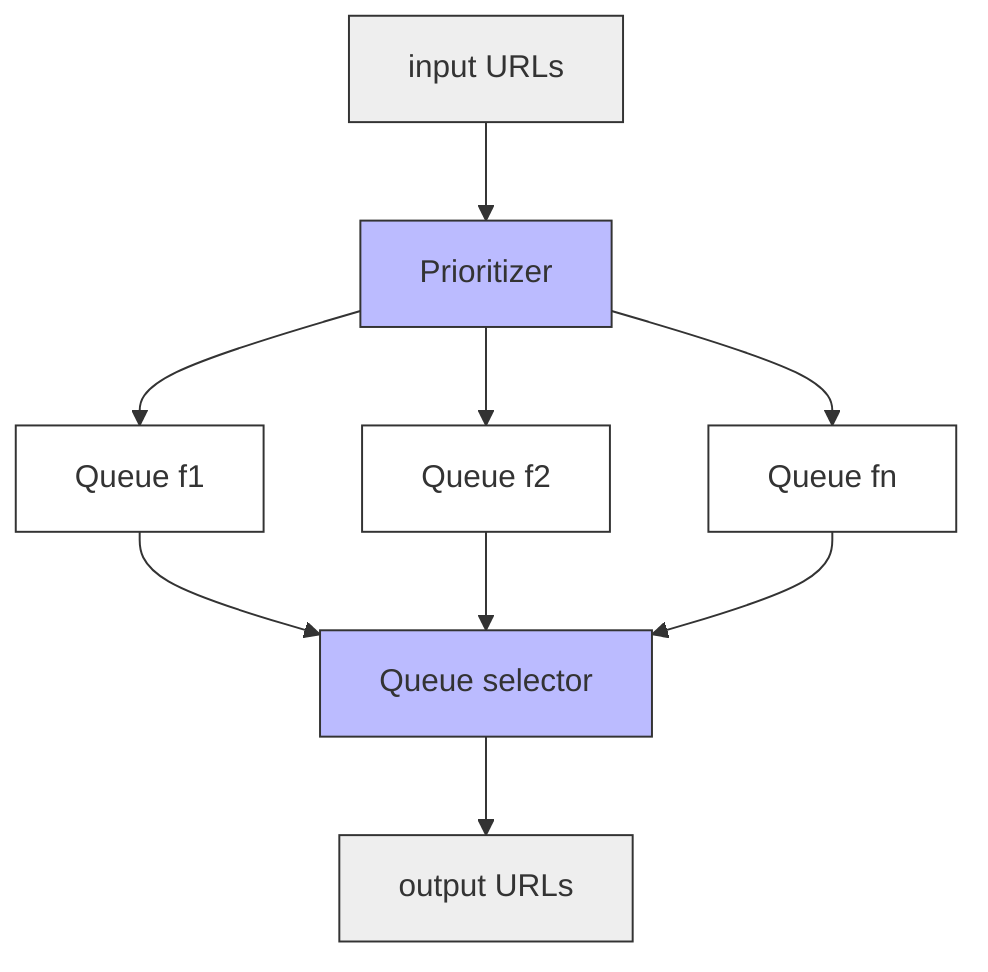
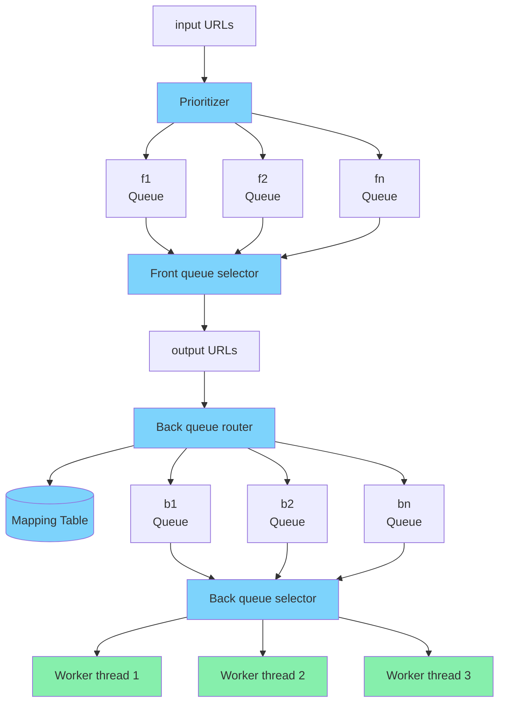
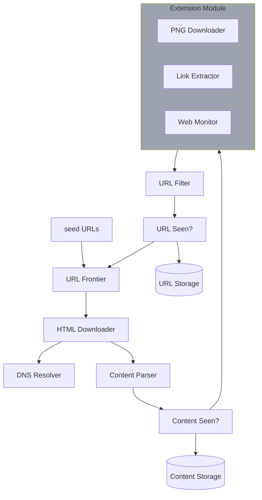

# Web Crawler

A web crawler is known as a robot or spider.
It is widely used by search engines to discover new or updated content on the web - pages, images, videos, PDFs, and more.
Crawlers are used for search indexing, archiving, monitoring, and data collection.

## Purposes

- **Search engine indexing**: A crawler collects web pages to create a local index for search engines.
  For example, Googlebot is the web crawler behind the Google search engine.

- **Web archiving**: This is the process of collecting information from the web to preserve data for future uses. 
  For instance, many national libraries run crawlers to archive web sites. Notable examples are the US Library of Congress and the EU web archive.

- **Web mining**: The explosive growth of the web presents an unprecedented opportunity for data mining. 
  Web mining helps to discover useful knowledge from the internet. 
  For example, top financial firms use crawlers to download shareholder meetings and annual reports to learn key company initiatives.

- **Web monitoring**: The crawlers help to monitor copyright and trademark infringements over the Internet. 
  For example, Digimarc [3] utilizes crawlers to discover pirated works and reports.

## Design scope

Basic crawler loop:

1. Given a set of seed URLs, download the pages.
2. Extract URLs from downloaded pages.
3. Add unseen URLs to the frontier and repeat.

Requirements example:

- Target: search engine indexing
- Scale: ~1 billion pages/month
- Content: HTML (for this design)
- Retention: store content for up to 5 years
- Scalability: support parallel downloaders
- Robustness: handle timeouts, server errors, crashes
- Extensibility: support new content types with minimal changes

## Back-of-Envelope estimation

- 1 billion pages / month
- QPS = 1,000,000,000 / 30 / 24 / 3600 ≈ 400 pages/sec
- Peak QPS ≈ 2 × QPS ≈ 800 pages/sec
- Avg page size ≈ 500 KB → monthly storage ≈ 500 TB
- For 5 years: 500 TB × 12 × 5 ≈ 30 PB

## High-level design

```mermaid
flowchart LR
  A[seed URLs] --> B[URL Frontier]
  B --> C[HTML Downloader]
  C --> D[Content Parser]
  C -->|uses| E[DNS Resolver]
  D --> F{Content Seen?}
  F -->|No| G[Content Storage]
  F -->|Yes/Continue| H[Link Extractor]
  H --> I[URL Filter]
  I --> J{URL Seen?}
  J -->|No| K[URL Storage]
  J -->|Yes/Continue| B
  K --> J
  J --> B
```

### Seed URLs

Seed URLs bootstrap the crawl and should provide broad coverage (by topic, domain, locality, etc.).

### URL Frontier

Frontier states: `to-be-downloaded` and `downloaded`. The frontier enforces politeness, prioritization, and freshness.

### HTML downloader

Responsible for fetching pages over HTTP(S). Works with a DNS resolver and respects `robots.txt`.

### DNS resolver

Resolves hostnames to IPs. Use a cache to reduce latency.

### Content parser

Validates and normalizes content to avoid storing malformed pages.

### Content seen

Detect duplicate content using hashes/fingerprints (e.g., Rabin fingerprints, Bloom filters). Hash comparison is efficient at scale.

### Content storage

Store HTML on disk; keep popular content cached in memory for low-latency access.

### URL extractor

Parses links from HTML and normalizes relative URLs to absolute (e.g., add https://en.wikipedia.org as needed).

```mermaid
flowchart TD
  A["<html> ... <body>  <li><a href='/wiki/Cong_Weixi'>Cong Weixi</a></li>  <li><a href='/wiki/Kay_Hagan'>Kay Hagan</a></li>  <li><a href='/wiki/Vladimir_Bukovsky'>Vladimir Bukovsky</a></li>  <li><a href='/wiki/John_Conyers'>John Conyers</a></li></body></html>"]
  --> B[URL Extractor]

  B --> C["https://en.wikipedia.org/wiki/Cong_Weixi"]
  B --> D["https://en.wikipedia.org/wiki/Kay_Hagan"]
  B --> E["https://en.wikipedia.org/wiki/Vladimir_Bukovsky"]
  B --> F["https://en.wikipedia.org/wiki/John_Conyers"]
```

### URL Filter

Exclude undesired content types, known bad extensions, error pages, and blacklisted sites.

### URL seen?

Maintain a disk-backed + in-memory index to prevent re-adding already-seen URLs.

### URL storage

Persist visited URLs for analytics and to support restarts.

## Workflow

```mermaid
flowchart LR
  A[seed URLs] -->|1| B[URL Frontier]
  B -->|2| C[HTML Downloader]
  C -->|3| D[DNS Resolver]
  C -->|4| E[Content Parser]
  E -->|5| F{Content Seen?}
  F -->|6| G[(Content Storage)]
  F -->|7| H[Link Extractor]
  H -->|8| I[URL Filter]
  I -->|9| J{URL Seen?}
  J -->|10| K[(URL Storage)]
  K --> J
  J -->|11| B

  classDef storage fill:#f9f,stroke:#333,stroke-width:1px;
  classDef decision fill:#bbf,stroke:#333,stroke-width:1px;
  class G,K storage;
  class F,J decision;
```

## Deep dive

- DFS vs BFS: the web is a directed graph. BFS (queue-based) is commonly used but naive BFS can over-request single hosts and ignores URL priority. Prioritization should bias the frontier.
- URL frontier: design for politeness, prioritization, and freshness.
- HTML downloader: parallel, host-aware workers with per-host queues and delays.
- Robustness: checkpoint state, retry/backoff, and exception handling.
- Extensibility: support plug-in modules for new content types.

### Politeness

Avoid overloading a single host by routing URLs into per-host queues. Each worker consumes from a queue dedicated to a single host; enforce delays between requests to the same host.

```mermaid
flowchart TD
  subgraph Router["Queue router"]
  end

  Router --> M[(Mapping Table)]
  Router --> Q1["Queue b1"]
  Router --> Q2["Queue b2"]
  Router --> Qn["Queue bn"]

  Q1 --> Selector["Queue selector"]
  Q2 --> Selector
  Qn --> Selector

  Selector --> W1["Worker thread 1"]
  Selector --> W2["Worker thread 2"]
  Selector --> Wn["Worker thread N"]

  classDef db fill:#1f77b4,color:#fff,stroke:#333,stroke-width:1px;
  classDef worker fill:#2ca02c,color:#fff,stroke:#333,stroke-width:1px;
  classDef queue fill:#fff,stroke:#333,stroke-width:1px;

  class M db;
  class W1,W2,Wn worker;
  class Q1,Q2,Qn queue;
```

- Queue router: It ensures that each queue (b1, b2, … bn) only contains URLs from the same host.
- Mapping table: It maps each host to a queue.
- FIFO queues b1, b2 to bn: Each queue contains URLs from the same host.
- Queue selector: Each worker thread is mapped to a FIFO queue, and it only downloads URLs from that queue. The queue selection logic is done by the Queue selector.
- Worker thread 1 to N. A worker thread downloads web pages one by one from the same host. A delay can be added between two download tasks.

### Prioritization

Use a `Prioritizer` to score URLs (PageRank, traffic, update frequency, domain importance) and assign them to priority queues. The front queue selector biases selection toward higher-priority queues.

say search for apple, how does it keeps apple.com on priority?
We prioritize URLs based on usefulness, which can be measured by PageRank [10], website traffic, update frequency, etc.
`Prioritizer` is the component that handles URL prioritization.

```mermaid
flowchart TD
    Input["input URLs"] --> P[Prioritizer]

    %% Queues
    P --> F1["Queue f1"]
    P --> F2["Queue f2"]
    P --> Fn["Queue fn"]

    %% Queue selector
    F1 --> QS[Queue selector]
    F2 --> QS
    Fn --> QS

    QS --> Output["output URLs"]

    %% Styling
    classDef queue fill:#fff,stroke:#333,stroke-width:1px;
    classDef process fill:#bbf,stroke:#333,stroke-width:1px;
    classDef io fill:#eee,stroke:#333,stroke-width:1px;

    class F1,F2,Fn queue;
    class P,QS process;
    class Input,Output io;
```

- Prioritizer: It takes URLs as input and computes the priorities.
- Queue f1 to fn: Each queue has an assigned priority. Queues with high priority are selected with higher probability.
- Queue selector: Randomly choose a queue with a bias towards queues with higher priority.

frontier design

```mermaid
flowchart TD
    Input[input URLs] --> Prioritizer

    Prioritizer --> f1[f1<br/>Queue]
    Prioritizer --> f2[f2<br/>Queue]
    Prioritizer --> fn[fn<br/>Queue]

    f1 --> FrontQueueSelector[Front queue selector]
    f2 --> FrontQueueSelector
    fn --> FrontQueueSelector

    FrontQueueSelector --> Output[output URLs]
    Output --> BackQueueRouter[Back queue router]

    BackQueueRouter --> MappingTable[(Mapping Table)]

    BackQueueRouter --> b1[b1<br/>Queue]
    BackQueueRouter --> b2[b2<br/>Queue]
    BackQueueRouter --> bn[bn<br/>Queue]

    b1 --> BackQueueSelector[Back queue selector]
    b2 --> BackQueueSelector
    bn --> BackQueueSelector

    BackQueueSelector --> Worker1[Worker thread 1]
    BackQueueSelector --> Worker2[Worker thread 2]
    BackQueueSelector --> Worker3[Worker thread 3]

    style Prioritizer fill:#7dd3fc
    style FrontQueueSelector fill:#7dd3fc
    style BackQueueRouter fill:#7dd3fc
    style BackQueueSelector fill:#7dd3fc
    style MappingTable fill:#7dd3fc
    style Worker1 fill:#86efac
    style Worker2 fill:#86efac
    style Worker3 fill:#86efac
```

- Front queues: manage prioritization
- Back queues: manage politeness

### Freshness

Recrawl based on observed update frequency; prioritize important pages for more frequent recrawls.

### Storage for the URL frontier

Frontier size may be hundreds of millions of URLs. Use a hybrid approach: disk-backed storage with in-memory buffers for enqueue/dequeue operations to avoid disk bottlenecks.

## HTML Downloader
It downloads web pages from internet via HTTP protocol.

## Robots.txt

Respect `robots.txt` (Robots Exclusion Protocol- standard to communicate with crawlers) and cache parsed rules to avoid repeated fetches. Example: [Amazon robots.txt](https://www.amazon.com/robots.txt)

## Performance optimizations

1. Distributed crawling: partition URL space across downloaders.
2. DNS cache: avoid repeated DNS lookups (can be ~200 ms).
3. Locality: prefer geographically close servers when possible.
4. Short timeouts and aggressive retries to avoid long blocking.

## Robustness

- Consistent hashing: distribute URL buckets among downloaders and reduce rebalancing.
- Persistent checkpoints: save crawl state to allow restart after crashes.
- Strong exception handling and data validation.

## Extensibility

Design extension points (modules) for format-specific downloaders/parsers (PNG downloader, link extractor, monitors, etc.).

```mermaid
flowchart TD
  SeedURLs[seed URLs] --> URLFrontier[URL Frontier]
  URLFrontier --> HTMLDownloader[HTML Downloader]
  HTMLDownloader --> DNSResolver[DNS Resolver]
  HTMLDownloader --> ContentParser[Content Parser]
  ContentParser --> ContentSeen[Content Seen?]
  ContentSeen --> ContentStorage[(Content Storage)]
  ContentSeen --> ExtensionModule

  subgraph ExtensionModule[Extension Module]
    PNGDownloader[PNG Downloader]
    LinkExtractor[Link Extractor]
    WebMonitor[Web Monitor]
  end

  ExtensionModule --> URLFilter[URL Filter]
  URLFilter --> URLSeen[URL Seen?]
  URLSeen --> URLFrontier
  URLSeen --> URLStorage[(URL Storage)]

  style ExtensionModule fill:#9ca3af
```

## Detect and avoid problematic content

1. Redundant content: ~30% duplicates — use content fingerprints and bloom filters.
2. Spider traps: limit URL depth/length and use heuristics and manual blacklists.
3. Data noise: filter out ads and low-value content with anti-spam heuristics.

## Extra notes

- Server-side (dynamic) rendering can be required to extract JavaScript-generated links; use headless rendering selectively.
- Use anti-spam filters to avoid low-quality pages.
- Database replication and sharding improve availability and scalability.
- Keep crawler servers stateless to simplify horizontal scaling.
- Instrumentation and analytics are essential for tuning crawl policies.

## References

[1] https://www.loc.gov/websites/
[2] http://data.europa.eu/webarchive
[3] https://www.digimarc.com/products/digimarc-services/piracy-intelligence
[4] Heydon A., Najork M., Mercator: A scalable, extensible web crawler (1999)
[5] Christopher Olston, Marc Najork: Web Crawling (survey)
[6] https://tinyurl.com/y6tmh55y
[7] M.O. Rabin — fingerprinting
[8] B. H. Bloom — Bloom filters (1970)
[9] Donald J. Patterson, Web Crawling
[10] Page et al., PageRank (1998)

---

[bun implementation](https://github.com/NalinDalal/crawler-bun.git)
    BackQueueRouter --> MappingTable[(Mapping Table)]
