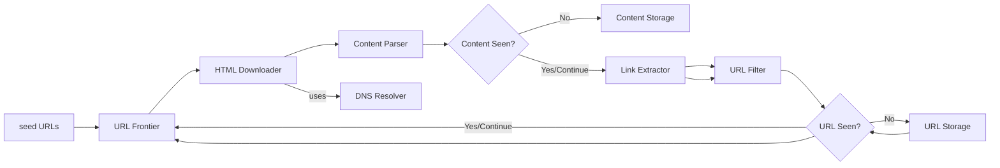
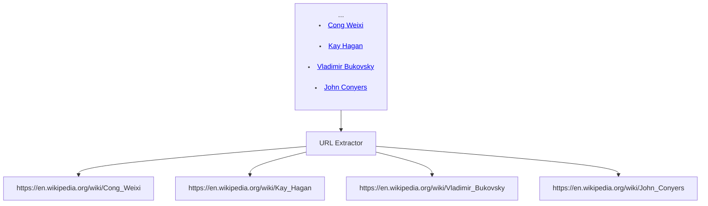
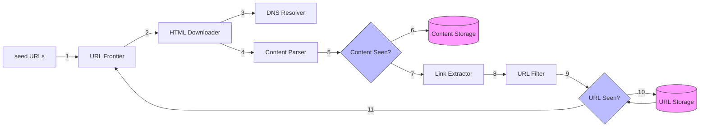
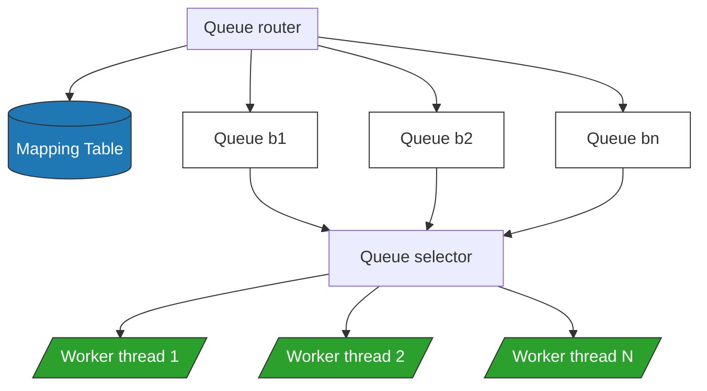
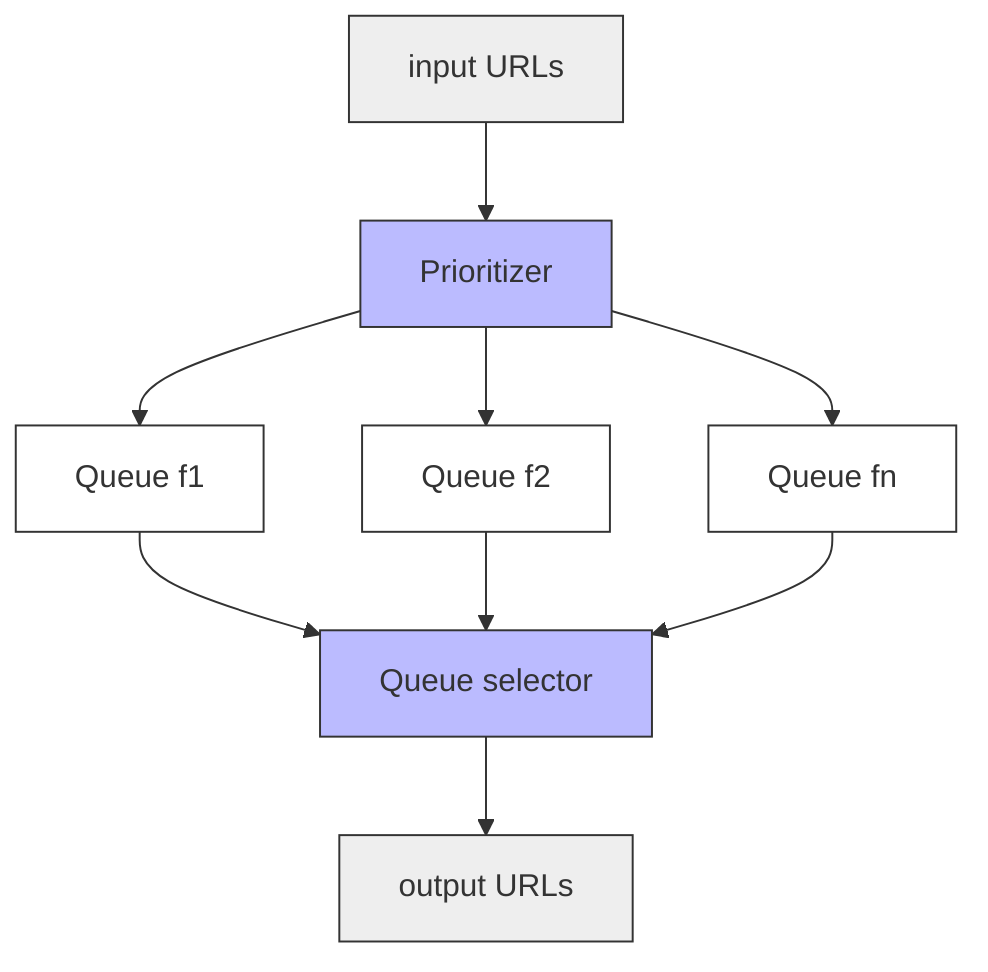
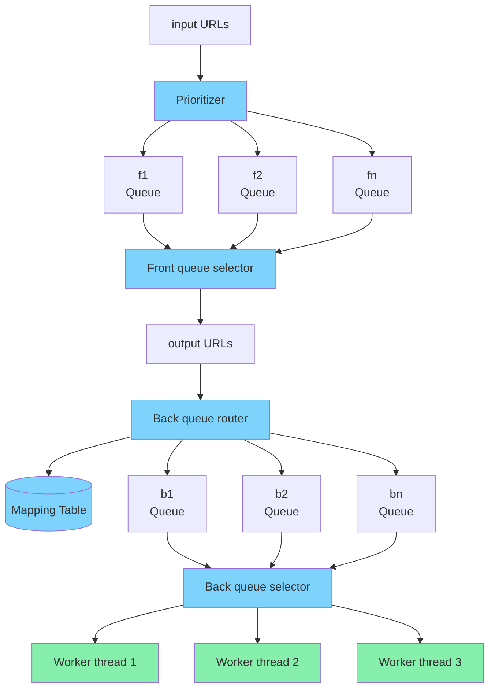
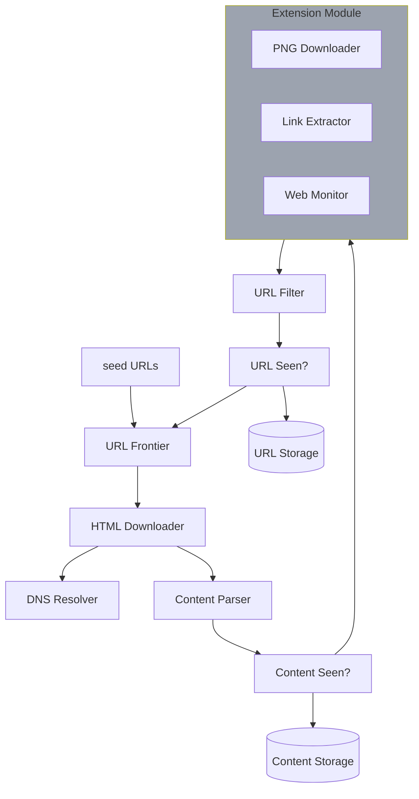

# Web Crawler

A web crawler is known as a robot or spider.
It is widely used by search engines to discover new or updated content on the web.
Content can be a web page, an image, a video, a PDF file, etc.

purposes:

- Search engine indexing: A crawler collects web pages to create a local index for search engines.
  For example, Googlebot is the web crawler behind the Google search engine.

- Web archiving: This is the process of collecting information from the web to preserve
  data for future uses. For instance, many national libraries run crawlers to archive web
  sites. Notable examples are the US Library of Congress [1] and the EU web archive [2].

- Web mining: The explosive growth of the web presents an unprecedented opportunity for
  data mining. Web mining helps to discover useful knowledge from the internet. For
  example, top financial firms use crawlers to download shareholder meetings and annual
  reports to learn key company initiatives.

- Web monitoring. The crawlers help to monitor copyright and trademark infringements
  over the Internet. For example, Digimarc [3] utilizes crawlers to discover pirated works
  and reports.

# Design Scope

basic algorithm of web crawler

1. Given a set of URLs, download all the web pages addressed by the URLs.
2. Extract URLs from these web pages
3. Add new URLs to the list of URLs to be downloaded. Repeat these 3 steps.

requirements:

- search engine indexing
- 1 billion pages
- html only
- store upto 5 years
- scalable: efficient using parallelization
- robustness: handle edge cases like unresponsive server, crashes etc
- extensibility: minimal changes are needed for new content types.

# back of Envelope Estimation

- 1 billion pages downloaded every month
- QPS: 1,000,000,000 / 30 days / 24 hours / 3600 seconds = ~400 pages per second.
- Peak QPS = 2 \* QPS = 800
- avg web page=500kb
- total storage= 1billion \* 500kb= 500tb
- for 5 yrs=> 500 TB _ 12 months _ 5 years = 30 PB

# High Level Design

## Seed URL

A web crawler uses seed URLs as a starting point for the crawl process.
A good seed URL serves as a good starting point that a crawler can utilize to traverse as many links as possible.

many ways to select url: locality, topics, etc

## URL Frontier

2 crawl state:

- to be downloaded
- already downloaded

## HTML Downloader

download web pages from internet.

## DNS Resolver

to resilve url into ip address so that can be easily downloaded

## Content Parser

parse and validate data to avoid waste storage due to malformed web pages

## Content Seen

to avoid duplicacy of data; 2 ways: char by char, compare hash values
hash value comparison is more efficient

## Content Storage

to store HTML content, generally store on disk
Popular content is kept in memory to reduce latency.

## URL Extractor

parses and extracts links from HTML pages
Relative paths are converted to absolute URLs by adding the `https://en.wikipedia.org` prefix.

## URL Filter

excludes certain content types, file extensions, error links and URLs in “blacklisted” sites.

## URL Seen?

data structure that keeps track of URLs that are visited before or already in the Frontier.
helps to avoid adding the same URL multiple times

## URL Storage

stores already visited URLs.

## Workflow

# Deep Dive

• Depth-first search (DFS) vs Breadth-first search (BFS)
• URL frontier
• HTML Downloader
• Robustness
• Extensibility
• Detect and avoid problematic content

## DFS vs BFS

web is a directed graph where nodes are web-pages and hyperlinks are edges.
2 algorithms: DFS(bad choice cause can be very deep), BFS

implemented by a FIFO queue
URLs are dequeued in the order they are enqueued, but 2 problems: - most links link back to same host, considered unpolite{most probably dos attack} - Standard BFS does not take the priority of a URL into consideration. prioritize URLs according to their page ranks, web traffic, update frequency, etc.

## URL frontier

data structure that stores URLs to be downloaded.
ensure politeness, URL prioritization, and freshness

### Politeness

so much request leads to dos attack.

download one page at a time from the same host.
implemented by maintain a mapping from website hostnames to download (worker) threads.
Each downloader thread has a separate FIFO queue and only downloads URLs obtained from that queue.

- Queue router: It ensures that each queue (b1, b2, … bn) only contains URLs from the same host.
- Mapping table: It maps each host to a queue.
- FIFO queues b1, b2 to bn: Each queue contains URLs from the same host.
- Queue selector: Each worker thread is mapped to a FIFO queue, and it only downloads URLs from that queue. The queue selection logic is done by the Queue selector.
- Worker thread 1 to N. A worker thread downloads web pages one by one from the same host. A delay can be added between two download tasks.

### Prioriy

say i search for apple, how does it keeps apple.com on priority?
We prioritize URLs based on usefulness, which can be measured by PageRank [10], website traffic, update frequency, etc.
`Prioritizer` is the component that handles URL prioritization.

- Prioritizer: It takes URLs as input and computes the priorities.
- Queue f1 to fn: Each queue has an assigned priority. Queues with high priority are selected with higher probability.
- Queue selector: Randomly choose a queue with a bias towards queues with higher priority.

frontier design

- Front queues: manage prioritization
- Back queues: manage politeness

### Freshness

crawler must periodically
recrawl downloaded pages to keep our data set fresh
time-consuming and resource intensive

- Recrawl based on web pages’ update history.
- Prioritize URLs and recrawl important pages first and more frequently.

### Storage for URL Frontier

number of URLs in the frontier could be hundreds of millions
Putting everything in memory is neither durable nor scalable.
everything in the disk is undesirable neither because the disk is slow; and it can easily become a bottleneck for the crawl.

adapt hyrid approach
majority of url on disk
To reduce the cost of reading from the disk and writing to the disk, we maintain buffers in memory for enqueue/dequeue operations.
Data in the buffer is periodically written to the disk.

## HTML Downloader

downloads web pages from the internet using the HTTP protocol.
let's discuss `Robots.txt`

### Robots.txt

Robots.txt, called Robots Exclusion Protocol, is a standard used by websites to communicate with crawlers.
rulebook to tell what to download and what not
hence crawler must check robot.txt and follow the rules

cache the result of file.

example from [Amazon](https://www.amazon.com/robots.txt)

User-agent: Googlebot
Disallow: /creatorhub/_
Disallow: /rss/people/_/reviews
Disallow: /gp/pdp/rss/\*/reviews
Disallow: /gp/cdp/member-reviews/
Disallow: /gp/aw/cr/

## Performance Optimization

1. Distributed crawl
   crawl jobs distributed to multiple servers
   each server runs multiple threads
   URL space is partitioned into smaller pieces; so, each downloader is responsible for a subset of the URLs.

2. Cache DNS Resolver
   calling a dns may take upto 200ms, so it will block other at that time
   Maintaining our DNS cache to avoid calling DNS frequently is an effective technique for speed optimization
   keeps domain name to ip address mapping, updated periodically

3. Locality
   near geographical server are crawled easily

4. Short Timeout
   specify a timeout period to avoid long wait, cause server may take long time or may not respond at all.

# Robustness

approaches:

- Consistent hashing: This helps to distribute loads among downloaders. A new downloader server can be added or removed using consistent hashing
- Save crawl states and data: To guard against failures, crawl states and data are written to a storage system. A disrupted crawl can be restarted easily by loading saved states and data.
- Exception Handling
- Data Validation

# Extensibility

must be extensible

# Detect and avoid problematic content

1. Redundant content
   30% of web pages are duplicates, use hashes or checksum to detect duplication

2. Spider traps
   it is a web page that causes a crawler in an infinite loop
   Such spider traps can be avoided by setting a maximal length for URLs
   hard to develop automatic algorithms to avoid spider traps;
   however, a user can manually verify and identify a spider trap, and either exclude those websites from the crawler or apply some customized URL filters.

3. Data Noise
   exclude data which is not useful like advertisments etc.

# Extra points

- Server-side rendering: Numerous websites use scripts like JavaScript, AJAX, etc to generate links on the fly. If we download and parse web pages directly, we will not be able to retrieve dynamically generated links.
  To solve this problem, we perform server-side rendering (also called dynamic rendering) first before parsing a page [12].
- Filter out unwanted pages: With finite storage capacity and crawl resources, an anti-spam component is beneficial in filtering out low quality and spam pages [13] [14].
- Database replication and sharding: Techniques like replication and sharding are used to improve the data layer availability, scalability, and reliability.
- Horizontal scaling: For large scale crawl, hundreds or even thousands of servers are needed to perform download tasks. The key is to keep servers stateless.
- Availability, consistency, and reliability: These concepts are at the core of any large system’s success. We discussed these concepts in detail in Chapter 1. Refresh your memory on these topics.
- Analytics: Collecting and analyzing data are important parts of any system because data is key ingredient for fine-tuning.

# Reference material

[1] [US Library of Congress](https://www.loc.gov/websites/)
[2] [EU Web Archive](http://data.europa.eu/webarchive)
[3] [Digimarc](https://www.digimarc.com/products/digimarc-services/piracy-intelligence)
[4] Heydon A., Najork M. Mercator: A scalable, extensible web crawler World Wide Web, 2 (4) (1999), pp. 219-229
[5] [By Christopher Olston, Marc Najork: Web Crawling.](http://infolab.stanford.edu/~olston/publications/crawling_survey.pdf)
[6] [29% Of Sites Face Duplicate Content Issues](https://tinyurl.com/y6tmh55y)
[7] Rabin M.O., et al. Fingerprinting by random polynomials Center for Research in Computing Techn., Aiken Computation Laboratory, Univ. (1981)
[8] B. H. Bloom, “Space/time trade-offs in hash coding with allowable errors”, Communications of the ACM, vol. 13, no. 7, pp. 422–426, 1970.
[9] [Donald J. Patterson, Web Crawling](https://www.ics.uci.edu/~lopes/teaching/cs221W12/slides/Lecture05.pdf)
[10] L. Page, S. Brin, R. Motwani, and T. Winograd,“The PageRank citation ranking: Bringing order to the web,” Technical Report, Stanford University, 1998.
[11] Burton Bloom. Space/time trade-offs in hash coding with allowable errors. Communications of the ACM, 13(7), pages 422--426, July 1970.
[12] [Google Dynamic Rendering](https://developers.google.com/search/docs/guides/dynamic-rendering)
[13] T. Urvoy, T. Lavergne, and P. Filoche, “Tracking web spam with hidden style similarity” in Proceedings of the 2nd International Workshop on Adversarial Information Retrieval on the Web, 2006.
[14] H.-T. Lee, D. Leonard, X. Wang, and D. Loguinov,“IRLbot: Scaling to 6 billion pages and beyond,” in Proceedings of the 17th International World Wide Web Conference, 2008.

---

[bun implementation](github.com/NalinDalal/crawler-bun.git)
